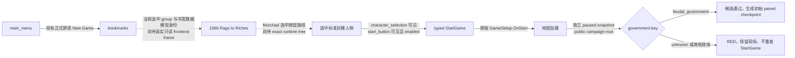

# 1066 标准封建书签开局：exact-build 原生路径

状态：static-ready / live=false；本页只对应独立 1066 campaign seed 的前端起点，不证明 100 年或整局。

冻结 CK3 1.19.0.6，binaries/ck3.exe SHA-256
2D00FF3101EF70B566F2FCBAE292F09263199C80E9DC8F139B82D7D96F83DB86。
本机原版 game/gui/frontend_bookmarks.gui SHA-256
C853B48F42A5A3B84208B2FC570C02F5FCB5DA217133553C6A5B70B7F8F0F267；
game/common/bookmarks/bookmarks/00_bookmarks.txt SHA-256
820C8F3F5A99CF1141A21A34F0661A7300E5D12938BB3EA7EA07A84A0D3BEB14。
这些本体文件只作 exact-build 只读依据，不进入智能体制品。

原版 bm_1066_rags_to_riches 定义 start_date = 1066.9.15、
group = bm_group_1066；其第一名 Murchad ua Briain 条目明确为
name = bookmark_rags_to_riches_petty_king_murchad、title = d_munster、
government = feudal_government、difficulty = easy。
history_id = 83355 只用于追溯原版定义，正式动作不接受或固定 CharacterID。
GUI 中人物卡的 bookmark_character_selection_button 在第 240 行调用
GameSetup.SetSelectedCharacter(BookmarkCharacter.Self)；character_selection
仅在 GameSetup.HasSelectedCharacter 时可见；第 2023–2029 行的原版
start_button 在 GameSetup.CanStart 时启用并调用 GameSetup.StartGame。
第 70–73 行 selected-character 动画延迟 1.45 秒后调用 GameSetup.OnStart；
第 75–79 行 any-character 动画则调用 GameSetup.OnCustomStart。
pick_any_character_button
则调用 GameSetup.OnCustomStart 进入自由选角 lobby，两条入口不能串联。
原版第 581–590 行的 bookmark_groups 从 GameSetup.AccessBookmarkGroups
动态生成 bookmark_group_tab，按钮第 2865 行调用
GameSetup.SelectBookmarkGroup(BookmarkGroup.Self)；第 704–718 行的书签列表
又由 GameSetup.GetBookmarksInGroup(GameSetup.GetSelectedBookmarkGroup)
动态生成，书签按钮第 3214 行调用 GameSetup.SetSelectedBookmark(Bookmark.Self)；
第 190–240 行的 map_characters 再由
GameSetup.GetSelectedBookmarkCharacters 生成选角按钮。三层重复按钮的
运行时 name 与顺序均不是 group/bookmark/character 身份凭据。

当前新增的 typed activate-frontend-start-selected-bookmark-v1 只解析原版固定
frontend_bookmarks root、character_selection 与 start_button，不让调用方
传控件名、指针、路径或 CharacterID。它在 CK3 application-main mailbox
中检查 selected projection 与按钮实际可见/启用，然后只提交一次 GUI semantic
activation。ACK 为待验证；Python driver 必须独立等待有玩家的 paused map，
再用正式 campaign-root 查询确认 government.key = feudal_government、
同一玩家、同一 native revision 与日期，才返回 verified。观察失败时
动作状态标为已提交但未确认，禁止盲重发。

这一 typed 动作尚未解决如何在当前书签页只读识别 bm_group_1066、
bm_1066_rags_to_riches 与 Murchad 的运行时 data context。Python 驱动现要求
先调用零参数、版本化的 query-frontend-selected-1066-feudal-candidate-v1，
收到 native model 的 selected_bookmark_group_key、selected_bookmark_key、
selected_character_name_key、selected_character_government_key、
selected_bookmark_start_date_raw 与 query_sequence，且身份分别匹配上述
原版定义，才允许提交 StartGame。地图 date_raw 还必须等于书签 start_date_raw。
当前通用 ck3_inspect_frontend_gui_tree_v1 仅发布 widget name/path/visibility/
enabled/vtable；它能采集 exact frontend tree，但不能把重复的动态 widget
和 BookmarkGroup.Self、Bookmark.Self、BookmarkCharacter.Self 关联。
该查询的 native producer/adapter capability 尚待真实 frontend frame 与
exact-build ABI 绑定，因此现阶段查询在生产驱动中明确拒绝，StartGame
会在点击前停止；schema/单测不代表查询 live 或可用种子。未闭合前，
不能把任何默认人物、随机 playable、静态 history_id 或已选中按钮
冒充为 Murchad 的合法候选。控制候选编译选项
XAR_CK3_ENABLE_FEUDAL_1066_SELECTED_BOOKMARK_START_PRIVATE_V1=ON
默认关闭；普通 DLL 不广告该 capability，正式 MCP 暂不注册动作或上述查询。
下一次单实例受控前端 scene 首先采集原版 Bookmarks 的只读 native tree
并核对动态 group/character 与 source，再绑定最窄的 native model identity
query 与零参数 MCP 查询接口；若身份不能证明则在点击前停下。
现有 official-MCP frontend 验收 runner 的 --bookmarks-read-only 模式只执行
已验证的 main_menu → typed New Game → Bookmarks，保存该页通用 native tree 后
立即回收其受管实例；这个受控采集入口不选择角色、不提交 StartGame，
输出仅是 ABI 施工输入而非普通 1066 seed 证据。
确认目标后再接通 typed selection → StartGame → paused public root →
初始存档/driver checkpoint → 正式 native_auto_run；任何一步失败保留 RED。
