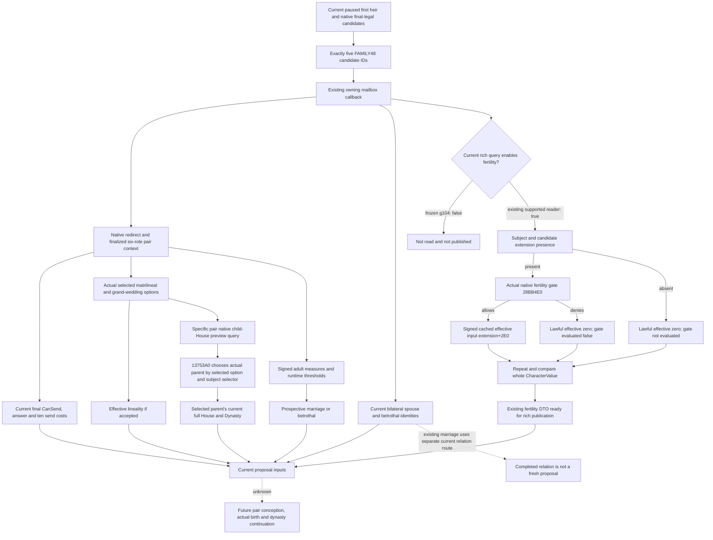

# Adult-pair marriage inputs: cached exact-build closure

Recorded 2026-10-06, Asia/Shanghai. Research only. Source tree precedes the implementation recommendation in ROOT-DELIVERY.md.

Target is CK3 1.20.0.3, SHA-256 `94B55397ABB687A3DCD436805A5D885E6BE90FA6C693FEB44A9E3BBEEADE02A6`. Current code observation is frozen `C:/codex-ck3-background/joint-source-cap64-batch/g104`, supplied commit `71b729f0cc4894331f1dadb89155920fccd42a00`. Background reference tree is `Z:/gb0`. Neither tree was modified. No EXE was opened, no verification rerun, and no runtime was contacted.

The reviewed .3 ABI-reuse manifest, rather than the historical .2 filename, is the build authority: `Z:/gb0/ck3_autonomous_player/native_bridge/research/ck3_1_20_0_3_abi_reuse.json`. Its target identity is the .3 SHA above. It classifies family query, fertility, value, and child-House lineage manifests as PASS. Crozier binding uses `ReviewedCrozierAbiSha256`; published identity remains .3. Historical .2 documentation and frozen operands are reused only through that review, with no claim of a newly performed live validation.

## Demand and native sources

| Input | Demanded source and existing publication | Meaning and boundary |
|---|---|---|
| Pair identity and legal proposal | FAMILY38 final-legal candidates; rich FAMILY48 selects five distinct IDs from the current observed first heir and same paused revision. `bridge.cpp:18388–18470` in g104. Owning callback `ExecuteMarriageCandidateAllianceMailboxQueryV1`, lines9853–9869. | Actual current candidate/recipient/intermediary identity and complete CanSend. This describes a prospective proposal; a historical marriage is not a fresh legal candidate. |
| Current marriage/betrothal | `ck3_12002_family.cpp:45–75`, `ReadRaw`: Character QWORD+1A8 -> Family betrothedID+10, primarySpouseID+14, spouse CArray+20 (capacity+28/count+2C). Full IDs resolve exact character generations. Deceased former spouses are excluded from the published living relationship. | Published separately for subject and candidate at `ck3_12002_family_wire.cpp:247–303`. Existing marriage, an existing betrothal to fulfill, and a new proposal are different current states. Neither CanSend nor the predicted outcome creates a relationship. |
| Actual selected option | Native finalized six-role pair context; option reader `bool(context,uint32 optionID)` RVA3078880, matrilineal ID slot5D4BDBC. Optional native selection followed by refresh/finalize. Rich reader lines403–439. | `matrilineal_option_selected` is the actual current proposal option. It is not overwritten with effective lineality. |
| Effective lineality if accepted | Outcome dispatcher2503C60: pair IDs context+2E0/+2E4; selectors Character+1A1; native option call2503D22 and same-selector branch. Existing `ReadOutcome`, lines153–166. | If selectors differ, effective lineality equals selected option. If selectors match, effective lineality equals bool(subject selector). This is prospective effective marriage behavior, not a stored property of an already completed marriage. |
| Adult marriage/betrothal result | Native signed int16 measure Character+68, selector1A1; runtime signed int32 thresholds at5C6A15C/5C69D10, measure>=threshold. Grand-wedding option slot5D4C0B4. Dispatcher2503D9D calls2910B30 for both adult and no grand wedding; otherwise2503ED7 calls2910F80. | `predicted_outcome_if_accepted` is marriage/betrothal under current actual inputs. It is not conception, acceptance, or birth. Avoid hardcoded adulthood age. |
| Current single-character native fertility | `family_value::ReadCharacterValue(..., read_fertility)` at `ck3_12002_family_value.cpp:103–115`. Actual gate `bool(Character*)` RVA28BB4E0. Effective getter RVA28C6360 follows extension QWORD+1B0 -> gate -> signed QWORD extension+2E0. | Extension absent or gate false is lawful effective zero. Gate unevaluated remains distinct from false. Signed raw value is preserved. This is a current native fertility/childbearing input, not a pair conception probability. |
| Pair fertility as two observations | Rich reader already supports subject and candidate ReadCharacterValue calls with the same read_fertility argument, lines384–385; copies to heir_fertility/candidate_fertility397–402; repeats both452–454 and compares whole CharacterValue. | These are two actual current inputs. No multiplication, future-age projection, guaranteed-child claim, or new fertility threshold follows from the source. |
| Adjusted childbearing input | Cached fertility ABI spans: gate28BB4E0 length324, getter28C6360 length87, adjusted input2B951F0 length525; source checks2B95210 and fixed-point2B9533F/2B95388. | Adjusted calculation reuses the gated signed QWORD with signed fixed-point denominator100000. It is not a closed pair-specific future conception forecast. The existing reader deliberately publishes the current native input. |
| Native prospective child House parent | `MatchOffer.GetChildrensHouse`: registration1DB770 -> callback137A820 -> formatter13746C0 -> offer vtable454E460 entry+10 -> native parent getter13753A0. Offer IDs+28/+2C; cached selected option+80; detached offer+8=null selects cached branch1375418. `ck3_12002_family_obligations_lineage.cpp:64–93`. | Getter compares actual selected option with subject selector1A1. Equal selects subject pointer; unequal selects candidate pointer. It is a prospective UI parent selection under that proposal option. It is not a child object. |
| Selected parent's actual current House/Dynasty | Selected real character pointer -> Character full HouseID+158 -> exact House storage resolution -> House full DynastyID+2C. House slots5D1DAF0/5D1DAE8; Dynasty slots5D1DE78/5D1DE28. Component table+20/capacity+2C, stride16 pointer+8, object fullID+10. `family_value::ReadCharacterLineage`. | `native_preview_lineage` contains the selected parent's actual current House/Dynasty as the prospective child-House preview. Lawful missing ID -1 is distinct from valid ID0. Do not infer actual offspring from parent lineage. |
| Actual offspring/pregnancy/future continuity | No actual unborn/born child is read by these pair readers, and no pregnancy or pair conception forecast is emitted by these query contracts. | Unknown here. Source-closed inputs allow a bounded current proposal comparison, but actual offspring and dynasty continuity remain later observations. This boundary does not block publishing the already implemented fertility input. |

## Exact selected/effective distinction

| Subject selector | Candidate selector | Selected option | Effective if accepted | Preview-selected parent |
|---|---|---|---|---|
| 0 | 0 | false | false | subject |
| 0 | 0 | true | false | candidate |
| 1 | 1 | false | true | candidate |
| 1 | 1 | true | true | subject |
| different | different | selected boolean | selected boolean | subject iff selected==bool(subject selector), else candidate |

The native getter selects by the actual option. A consumer must retain and join both booleans, rather than substitute effective lineality into the child-House getter.

## Concrete publication gap in frozen g104

1. `bridge.cpp:9831–9849` defines the shared rich mailbox query with `read_fertility=false`. The rich five-row branch constructs it at18430 and has no assignment enabling fertility. The only assignment in that file is18154 in the specified player-child single-value branch.
2. `bridge.cpp:9863–9865` passes that flag into `ReadMarriageCandidateAlliancePrivateV1`. Public declaration `ck3_12002_family.hpp:69–73` also defaults it to false. Native reader support and whole-value double sampling already exist.
3. `ck3_12002_family_wire.cpp:218–243` emits `heir_native_fertility` and `candidate_native_fertility` only for `kFamilyChildValueWireStepV1`. Thus even reader data would be omitted by the rich serializer until this condition is extended.
4. `marriage_candidate_alliance_private_transport.py` has no fertility parsing. Its current request (lines91–99) supplies revision, legality sequence, and exactly five candidate IDs, with no fertility parameter. Its row validation therefore cannot expose or use these fields.
5. The specified-player-child reader is not a substitute for the ordinary first-heir pair: `ck3_12002_family_subject.cpp:86–110` invokes the actual is_character_child_of(subject,played) predicate and returns not_actual_child_of_played_character when false. A first heir is not guaranteed to be a player child.

Existing wire shape from the child value serializer is reusable:

    heir_native_fertility / candidate_native_fertility = null when row or fertility unavailable;
    otherwise {source:"native_marriage_fertility_input", extension_present:bool,
      native_gate_evaluated:bool, native_gate_allows:bool|null, effective_raw:signed_int64}.

No new ABI, getter, proposal action, or future-conception model is required to close this specific gap.

## Native source and query tree



## Cached receipts and readiness

Primary cached operands: `research/ck3_12002_family_query_abi.json`, `research/fixtures/ck3_12002_family_fertility_abi.json`, `research/fixtures/ck3_12002_family_value_abi.json`, and `research/ck3_12002_family_obligations_lineage_abi.json` under `Z:/gb0/ck3_autonomous_player/native_bridge/`. Matching .3 PASS entries and selected expected code-region hashes are copied by reference into `CACHED-ABI-RECEIPT.json`; that file does not certify a new EXE verification.

Readiness of this new work is research/source-closed publication plan, not newly static-tested or live-qualified. Parent supplies existing M5 and candidate2 FIRST GREEN; neither was rerun. Historical first-heir38822↔38718 marriage and Guy38988↔37689 betrothal are retained as history, not new opportunities. Robert29829 remains the only authorized ordinary campaign test entry, with natural succession0 at the supplied baseline.

Cost: new EXE bytes0; new EXE body captures0; process/SDK/pipe/game contacts0; builds/tests0; tracked mutations0; Git operations0. New writes are confined to this external adult-pair packet.

## Source candidate: paired fertility publication

After the source tree above was sealed, the own-worktree candidate enables
`read_fertility=true` on the existing FAMILY48 five-row request and admits that
step to the existing fertility serializer. Available rows publish both actual
native inputs; unavailable rows retain nulls. The rich Python transport reuses
the existing child-value fertility validator and retains the objects in its
rows. Formal diagnostic and selected-value tuples now carry those inputs into
the existing plan and pending record. Historical results are not backfilled.
No getter, endpoint, child-of admission, ranking weight or conception model
was introduced. The native reader already performs the paired stable double
sample; its additional gate-call upper bound is20 per five-row query.

One new method,
`MarriageCandidateAlliancePrivateTransportTests.test_paired_native_fertility_is_consumed_by_rich_rows`,
uses the actual production rich transport under explicit exact `.3` provenance.
It retains positive, allowed zero, denied zero, extension-absent zero and signed
raw inputs, as well as unavailable row nulls. Existing test method bodies are
unchanged; their shared reply builder gains the two newly published fields.

**FIRST NOT RUN:** native build/compiled wire and this new Python method have
not been executed. Source candidate readiness remains **research** until the
appropriate first qualifications. The prior transition1/1 and candidate2/2
results are unchanged and were not rerun. Exact new method selector:

```text
Z:/ck3_mod_rewrite/tools/.venv/Scripts/python.exe -B -X utf8 ck3_autonomous_player/tests/unit/test_marriage_candidate_alliance_private_transport.py MarriageCandidateAlliancePrivateTransportTests.test_paired_native_fertility_is_consumed_by_rich_rows -v
```

Run with PYTHONPATH pointing at this candidate package's
`ck3_autonomous_player/src`; no optimization and no old test method selection.
Root owns the joint native qualification, future live observation and main
integration. The native producer's actual loaded fertility threshold at
RVA5C6A1B0 is the next concrete observer entry; this publication does not claim
that a pair passes that unobserved threshold or will produce descendants.
