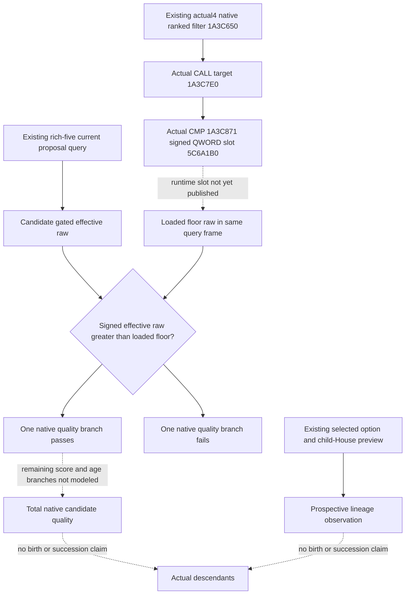

# First-heir loaded fertility floor, native 1.20.0.4

Recorded 2026-10-07 (Asia/Shanghai). This source-first work uses frozen software
`ae003bece794acb7eed977a3a017555bab303394` and the already qualified actual4
family migration. Native target: 1.20.0.4, Steam build `25734779`, EXE SHA-256
`98702F88A547CDE2EAF29A85F93B85F68EE4CF8148336A4F7AFAEB75319DD518`.
The existing [family binder](family-bindings-12004.md) and
[historical fertility branch](first-heir-native-fertility-quality-12003.md)
remain their own evidence; no migration, test, game query or source capture was
repeated for this inventory.

The current rich-five query publishes both gated individual fertility values.
It does not publish the loaded floor used by the native candidate scorer.
This missing current observation prevents checking that particular native
quality branch; recipient acceptance and adult thresholds do not substitute
for it. House preview inputs already exist and are not reopened while this
concrete floor dependency remains.

## Current inputs and qualification

| Input | Frozen actual4 production source | Scope |
| --- | --- | --- |
| Both gated fertility inputs | `bridge.cpp:19455` enables `read_fertility`; `ck3_12002_family.cpp:385` and `:453` sample and compare both values; rich wire `:218` publishes `heir_native_fertility` and `candidate_native_fertility` | Existing publication, signed effective raw; lawful zero remains distinct from unavailable |
| Fertility eligibility getter | `ck3_12004_family_abi.hpp:48`, actual gate `28BB4C0`; `BindFamilyValuesImage` in `ck3_12004_family.cpp:106` | Already migrated source; no new getter capture |
| Loaded scorer fertility floor | Absent from `family_value::Bindings`, `FertilityRead`, actual4 binder, rich DTO/wire and strict transport | Unimplemented observation, rather than a qualified field permanently containing null |
| Adult thresholds | Existing signed-int32 slots | Separate native inputs; cannot replace the fertility signed QWORD |
| Actual selected marriage option and prospective child-House parent | Existing rich family/lineage readers in the [adult-pair topic](first-heir-adult-pair-inputs-12003.md) | Selected and effective lineality remain distinct; neither proves actual offspring |

The finite existing migration index
`managed-full-h9613-title12/ROOT-R63-ALL-EXISTING-MCP-MIGRATION-QUALIFIED.json`
records migration GREEN and accepted `family_allies_heirs`, at source
`89d728782be11d6995e14fb195f19101e90ccab6`. It contains no fertility-floor
assertion. The current provider inspection independently confirms the gap;
the old g104 NOTRUN statement is not being used as current evidence.
The external provider ledger preserves the small receipt paths and their
limited fixture/migration scopes without replaying any raw game response.

## Native source ledger

The historical closed .3 scorer span is `[1A3C800,1A3CA0B)`, 523 bytes.
At `1A3C891`, it compares the gated signed QWORD with loaded signed QWORD
`5C6A1B0`; `1A3C898` continues only for `effective_raw > floor_raw`.
The other path yields score `-1000`, below the native minimum score `1`.
This is a known old-source branch, not an adopted actual4 slot or numeric
floor value. The actual loaded value must come from the paused runtime image.

The cached actual4 score-filter detail provides a genuine scorer entrance:
the normalized-equal filter at `1A3C650` has relative CALLs at `1A3C731` and
`1A3C7AD`, both to `1A3C7E0`. Both target bodies were left unexpanded.
This target is obtained from actual instruction operands, not a uniform
address shift. The already captured scored-row owner LEA at `1A3C986`
proves `4528110`; it does not prove the fertility comparison or loaded slot.

The remaining finite source step is the cached scorer fragment containing
the comparison, selected from retained runtime-function metadata before
Root's central mapper reads actual4 bytes. The known old fragment is
`[1A3C85C,1A3C8A8)`, 76 bytes, unwind `51C4E04`. Retained actual metadata
selects candidate `[1A3C83C,1A3C888)`, 76 bytes, unwind `51C4EF8`, immediately
after the actual source-proven entry fragment `[1A3C7E0,1A3C83C)`.
Internal correspondence and the precise RIP target still require the paired
source result; neither is asserted from an arithmetic shift. Existing filter bytes, getters,
adult thresholds, House/Dynasty and scorer-owner proof are reused.

Root subsequently performed the sole actual4 paired capture at
`2026-10-07T11:34:23.817843+00:00` to `11:34:24.425193+00:00`:
`floor-source-first01/FAMILY-MAP.json` reports complete instruction decode,
normalized equality and equal control topology for all 76 bytes, one new
read, old fragment cache reused, no metadata/PE reread or callee expansion.
The actual instructions now close the operand and branch:

| Actual4 instruction | Meaning |
| --- | --- |
| `1A3C855` CALL `28BB4C0` | Existing native fertility gate, reused |
| `1A3C865` loads living extension `+2E0` | Existing gated signed effective raw; absent/false gate supplies zero |
| `1A3C871`, bytes `48 3B 0D 38 D9 22 04` | QWORD comparison with RIP `+422D938`; instruction end `1A3C878` resolves actual RVA `5C6A1B0` |
| `1A3C878`, `7F 0A` | Signed greater continues at `1A3C884` |
| `1A3C87A`, `BF 18 FC FF FF` | Other path sets score `-1000`, then jumps to `1A3C97E` |

The floor slot happens to retain the old numeric RVA, now proved by the actual
instruction operand. No global-shift inference or old-slot rebinding supplied
that conclusion. Its loaded runtime numeric value remains unobserved in this
source work; no EXE-initialized value or guessed threshold was read.

## Minimum implementation after actual operand closure

Use the existing five-row
`query_first_heir_candidate_alliance_projection_private_v1` Driver path and
`query-first-heir-candidate-alliance-projection-v1-private` wire step. A new
endpoint, pool reconstruction or ranking change is unnecessary.

Add one optional loaded-slot address to `family_value::Bindings`; bind it
only where the exact-build operand is independently proved. The owning rich
callback already has family-value and projection bindings. Reuse the
projection's actual4 `LocalFamilyRead`, `read_memory` and `memory_context`
to capture a signed QWORD once during that query frame and copy its raw
value into the five rich rows. The proposed sibling wire field is
`native_candidate_fertility_floor_raw`; the two existing fertility objects
retain their meaning. Missing/unbound/unreadable old paths leave just this
optional comparison unavailable. Existing frame checks remain in place.

The strict transport then preserves signed-int64 raw and exposes only
`candidate_native_fertility.effective_raw > native_candidate_fertility_floor_raw`
when both are observed. Equality fails; negative values are preserved.
This derived comparison does not certify other native gates, decompose the
total score, rerank candidates, predict conception or guarantee descendants.

Prepare one new production-path compound covering positive, equality,
negative and unavailable raw inputs plus old absent-field compatibility;
execute it only after Root's coherent source freeze and FIRST authorization.
Native and paused qualification likewise require their own new evidence.
Actual4 floor-source closure is research-ready. Root's source cost is 76 new
bytes / one read; this child's new EXE reads are zero. Tests, imports, native
builds, SDK/game/process operations, births, succession, game days and G2
completion credits remain zero pending their separately authorized FIRST.

External source ledger, central manifest and Oct7/W41 handoff:
`Z:/ck3_mod_rewrite_process_assets/g2-parallel-20261007/first-heir-fertility-quality/`.
Root owns shared integration, report updates, every new EXE read and push.

## Observer candidate and FIRST recipe

The implementation appends `family_value::Bindings::candidate_fertility_floor`
and the rich DTO's optional signed-int64
`native_candidate_fertility_floor_raw`. Only the independent actual4 binder
populates `image_base + 5C6A1B0`; older binders remain unbound. The new inline
`ReadCandidateFertilityFloorRawV1` uses the existing projection memory reader.
The owning rich callback captures once before its row loop, copies the same
optional value to the five rows, and retains the existing whole-frame checks.
The wire preserves signed raw or null without changing legacy row status.

The strict rich transport accepts an absent/null floor for compatibility,
validates an observed signed-int64 raw and adds
`candidate_native_fertility_floor_comparison_v1` with explicit derived source,
`ready` and `passes`. Existing paired-fertility validation is unchanged.
The formal Service retains raw and comparison in its diagnostic and selected
value tuple. Ranking, action selection and submission behavior are unchanged.

The new native fixture invokes the loaded-floor helper and five real rich
readers, then the existing serializer, for each of four whole envelopes:
`positive.json`, `negative.json`, `unbound.json`, `deniedread.json`.
It asserts one optional floor read per frame (`1,1,0,1`), signed values,
real full-ID House/Dynasty resolution and preservation of complete legacy
rows when only the floor is unavailable. It does not invoke the native
candidate scorer, proposal sender or an older test main.

One new compound method is reserved for the complete compiled route:
`MarriageCandidateAlliancePrivateTransportTests.test_optional_native_fertility_floor_reaches_real_service_diagnostic`.
It consumes the four untouched native frames through the actual rich
transport and `GameplayBridgeService._plan_private_family_opportunity_v1`.
It verifies 25 Service rows over those four cases plus one compatibility copy
with only the new raw field absent. The legality scaffold copies native row
IDs, ages, lineage, acceptance and answer values. Optional output records the
actual Service diagnostics; a planning result is not a submitted proposal.

Root's target/CTest recipe is
`xar_ck3_12004_first_heir_fertility_floor_test`, with one output-directory
argument. Native execution and the sole Service compound are **NOTRUN** in
this candidate. Root must supply the coherent immutable source, compile and
new native qualification before the prepared compiled consumer runs once.
Runtime floor, paused-game comparison, material marriage, birth, natural
succession and full G2 completion remain unqualified.
