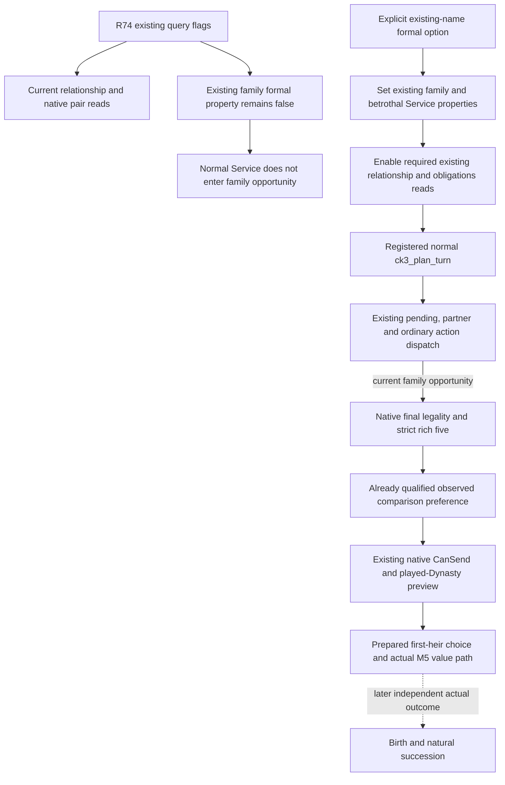

# First-heir family Service configuration in ordinary MCP

Source-first scope recorded 2026-10-08 / ISO 2026-W41, source baseline
`a74a0d1fa4cc33f08fbfeb36de1d55efe2c38792`. No EXE bytes, game query,
SDK connection or new native provider is needed for this configuration seam.

## Actual missing production path

The actual R74 restored SDK argv is retained at
`Z:/ck3_mod_rewrite_process_assets/g2-background-20261007/upstream-build-migration/managed-full-h9638-startup24crestore01/operator/ROOT-SDK-PYTHON-REBIND-FIRST03.json`.
Its `retained_original_private_flags` contains the original 20 flags. The
actual argv additionally includes `--private-prisoner-ransom-action`.
Both `--private-current-first-heir-relationship-query` and
`--private-family-obligations-query` are present. A formal-family option is
absent. The bootstrap receipt corroborates the original 20-flag list.

These existing query flags publish current relationships and native
requested-pair previews. They do not configure
`allow_private_family_marriage_formal_trial`. Ordinary MCP `main` never
sets that property, and its parser has no equivalent option. The Service's
normal planner tests that existing property before keeping its family
snapshot and before invoking the family opportunity path. Therefore an
otherwise qualified marriage/preference consumer can remain unreachable in
ordinary MCP planning. No public rich-five/legality tool provides an
alternative.

This is a concrete source/actual-startup configuration gap, not a native
fertility uncertainty. The already qualified Source28 consumer and existing
current query transports remain unchanged.

## Existing owning API and native decision source

The ordinary CLI's `native-auto-run` parser already accepts
`--allow-private-family-marriage-formal-trial`. It forwards the same-named
boolean to `native_auto_run.native_auto_run`, whose existing bounded
configuration enables:

- `allow_private_family_marriage_formal_trial`;
- `allow_private_current_first_heir_betrothal_fulfillment`;
- `allow_private_current_first_heir_relationship_query`.

The MCP equivalent also enables its existing
`allow_private_family_obligations_query` reader, required by the continuity
loop's native selected-option preview. R74 already separately enables that
reader. The new explicit formal option supplies the required read along with
the existing formal route; it does not reinterpret either old query flag as
permission to submit.

The actual native decision operands and bounded preference source are in
[the observed comparison topic](first-heir-observed-fertility-age-preference-12004.md),
[the actual floor topic](first-heir-loaded-fertility-floor-12004.md) and
[the actual age topic](first-heir-post-floor-quality-inputs-12004.md). Native
CanSend, selected/effective lineality, current heir/partner, same-frame
legality and the ordinary material-result transport remain the existing
production path. Source28's unique Service FIRST is already GREEN and is not
replayed here. A preference or child-House preview is not a birth or natural
succession.

## Minimal implementation

Add the exact existing `--allow-private-family-marriage-formal-trial` option
to `mcp_server` with `store_true`, default false. On explicit opt-in, set the
four existing driver properties before creating the registered Service.
Retain the existing native-headless stdio restriction used by private
queries/actions. No new tool, schema, native flag, action or readiness gate
is introduced. Existing Root Robert 29829, normal campaign, episode, player
scope and transport legality continue to own every real operation.

Without the new option, the old query flags keep their existing meaning and
the formal path remains disabled. Root can append one explicit option to its
existing restored argv for the intended session. This source candidate does
not launch that session, alter user data or operate the game.

## Sole necessary new qualification

One new registered Service compound will exercise the real MCP `main`
parser/configuration with a source fixture driver initially false. Existing
relationship/obligations flags alone must keep the formal property false.
The explicit same-name option must set the existing properties before
genuine registration. A real `ck3_plan_turn` then reaches the preferred
first-heir choice and its existing M5 source/selector, using original Robert
29829 and five source-shaped final-legal rows. Earlier higher-acceptance
failures remain sendable, proving the chosen later pass is caused by the
already delivered preference.

Only the driver endpoint factory and server run transport are source fixture
boundaries. Do not replace the planner, ranking, native arithmetic, Service
registration or action proof. No `ck3_auto_turn` or proposal submission is
needed for this configuration qualification. The sole method remains
`AUTHORED_NOTRUN` until Root executes it once. Native builds, previous tests,
old wires, game, SDK and new EXE reads remain zero for this candidate.

The exact authored method is
`test_mcp_family_formal_cli_service.McpFamilyFormalCliServiceTests.test_explicit_family_cli_opt_in_reaches_registered_service_and_m5`.
Its three configuration scenes are `configdefault`, `queryonly` and
`explicit`. In property order formal / current-betrothal fulfillment /
current-relationship query / family-obligations query, the expected values
are respectively `(false, false, false, false)`,
`(false, false, true, true)` and `(true, true, true, true)`.
Every scene enters the genuine registered `ck3_plan_turn`; only the explicit
scene requires the family route and original M5 source/collector/selector.
Its five final-legal opportunities select candidate `50331654`, whose
observed fertility and age comparisons pass. Earlier floor/age failures
retain valid native CanSend and prospective House previews.

Root's sole launcher is
`Z:/ck3_mod_rewrite_process_assets/g2-parallel-20261008/mcp-family-formal-service-config30/run_mcp_family_formal_cli_first.py`.
It takes `--repo`, `--source-commit` and a fresh `--output-dir`, invokes only
the authored method with the full venv's `-B -X utf8` Python, and captures
`XAR_MCP_FAMILY_FORMAL_CLI_SERVICE_OUTPUT`. The test uses actual MCP `main`,
registration and plan code; it substitutes only `load_driver` and the stdio
server lifetime. It never sends a proposal. This recipe is prepared without
running imports, tests or native code in the candidate lane.
