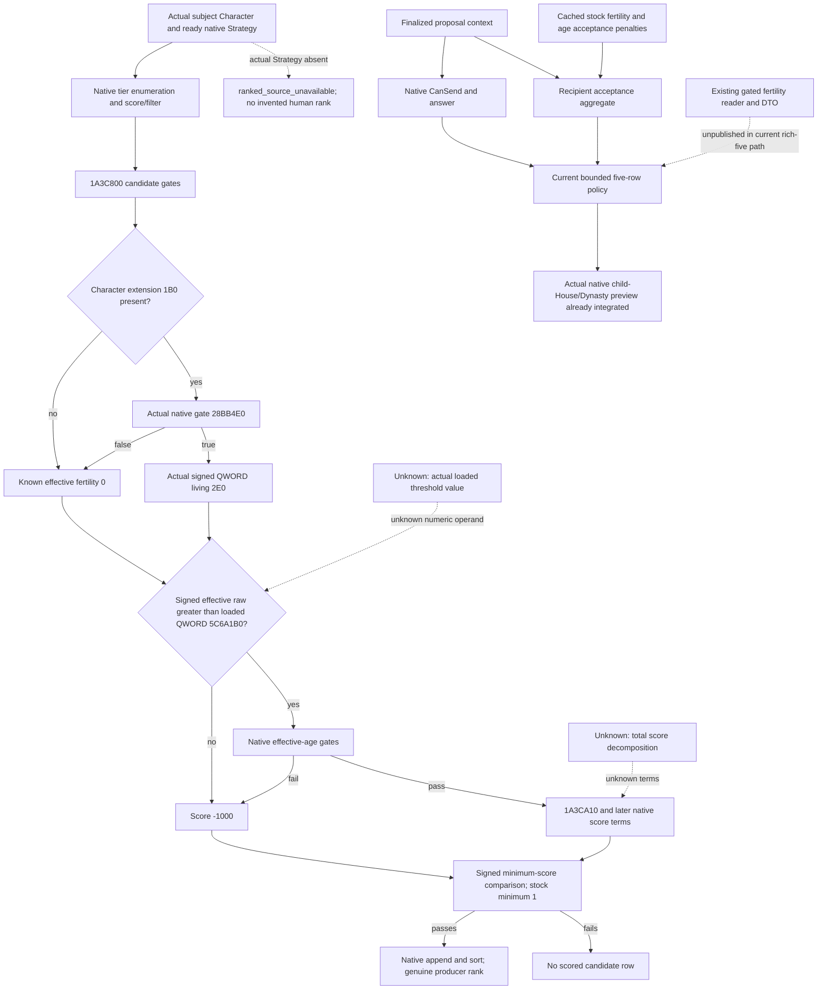

# First-heir marriage candidate quality: actual native fertility branch

Source closure recorded on 2026-10-06, Asia/Shanghai, ISO 2026-W41. Research only. Current consumer baseline is frozen g104, commit 71b729f0cc4894331f1dadb89155920fccd42a00. Native target is CK3 1.20.0.3, EXE SHA 94B55397ABB687A3DCD436805A5D885E6BE90FA6C693FEB44A9E3BBEEADE02A6. Authorized actual player remains ordinary Robert 29829; no game, query, SDK, pipe, process, build, test, Git or M5 rerun occurred here.

## Source and current implementation

The native-AI index, marriage-and-alliance topic, family-ranked producer/migration and family-value/fertility topics were read before this result. Their .2 evidence is qualified for this exact .3 by the already completed migration comparison, not by a newly run verifier:

- Cached fixtures__ck3_12002_family_ranked_producer_abi-comparison.json is PASS. The full 1A3C800..1A3CA0B scorer/gate span is 523 bytes and byte equivalent, SHA 52cabb476e38c58be63a4f41b4251e94d7b0daff57b27c5bad84628374702a1e. It also pins score/filter 1A3C670, scorer 1A3CA10, actual production caller and native sort.
- Cached fixtures__ck3_12002_family_fertility_abi-comparison.json is PASS. Gate 28BB4E0 and effective getter 28C6360, plus UI/script consumers, remain byte equivalent.
- The reviewed ranked call table already records 1A3C875 -> 28BB4E0. Root subsequently authorized exactly the 523-byte body to resolve its following branch. The saved body/disassembly and SCORER-523-READ-RECEIPT.json are the new evidence. No other EXE body, headers, pdata or data slots were read; no EXE hash or scan was performed.
- Cached current .3 stock acceptance file is 00_marriage_scripted_modifiers.txt, 82833 bytes, SHA 329c570ae4fdd9cd8e898ffd32ea9b30c689446eb7874b0ce2cdf12fe842d630, pinned by the existing Oct3 religion-marriage-inputs packet. This is a cached copy, not a new read from an installed game.

Current g104 family_marriage_formal_consumer.py uses actual native final legality, answer and signed recipient acceptance, with a bounded age-gap/external-Dynasty/realm-backed shortlist. Its first_heir_native_lineage_policy.py already uses actual native child-House/Dynasty preview and retains the candidate order. The earlier missing-preview integration gap is closed. This lane identifies no fresh failure of the current five candidates, marriage result, heir continuity or natural succession. Existing M5/newcandidate2 FIRSTGREEN evidence belongs to its original owner and is not repeated or enlarged.

## Native producer ordering

The real producer requires the subject's actual Character+1B0 -> living+278 Strategy, same source Character+18 and ready owner+20. Missing actual Strategy is ranked_source_unavailable; a human Strategy or rank must not be fabricated.

The native chain is tier cap -> 1A3BD40 enumeration -> 1A3C670 score/filter -> per-candidate 1A3C800 -> native 1123AA0 sort. Sorted rows preserve signed score descending, unsigned full CharacterID descending on ties. This producer score is distinct from the recipient's willingness to accept a proposal. The stock caller's parameter block has minimum score 1 at +1C.

## Decisive fertility branch, now exact .3

The 523-byte disassembly establishes these operations without naming opaque earlier helper 28B45F0:

1. Candidate is RCX, retained in RBX. The function first performs sex-selector and earlier native eligibility/relationship/effective-age gates. Those earlier gates can return without scoring.
2. At 1A3C869 it tests candidate Character+1B0. An absent extension supplies signed effective fertility 0 at 1A3C88E.
3. With a present extension, 1A3C875 calls actual eligibility gate 28BB4E0. A false result also supplies 0. A true result reads the actual signed QWORD living+2E0 at 1A3C885.
4. At 1A3C891 it compares that signed QWORD with the actual loaded signed QWORD at RVA **5C6A1B0**. The branch at 1A3C898 continues only when effective_raw > loaded_threshold_raw.
5. On <=, 1A3C89A assigns signed int32 **-1000** and jumps directly to 1A3C99E. With the stock minimum score 1, that result is below minimum and no scored candidate row is appended. It is therefore a producer exclusion through the score floor, not merely an acceptance modifier.
6. Above the fertility threshold, later native sex/effective-age gates can likewise assign -1000. A surviving candidate reaches opaque base/network scorer 1A3CA10 at 1A3C920, helper 2504820 and native age adjustments before the same minimum-score check. The total score decomposition remains outside this packet.

The fertility threshold's numeric value is **unobserved** here. Its actual RIP-resolved location is closed; no guessed zero, 0.1 or static literal substitutes for the loaded operand. Therefore extension absence/gate false is a known effective zero, but a universal threshold-based exclusion cannot be asserted without the actual threshold. The exact rule is the signed comparison above.

## Acceptance is a separate native branch

Cached stock marriage_ai_accept_fertility_modifier at lines 1259 onward contributes to recipient willingness already observed through recipient_ai_accept_raw:

- Same-sex/procreation context can add -200 with native scope conditions.
- Adult-woman age penalties use effective_age with conditional -5 per-year terms.
- Secondary-actor adult low fertility (<0.1), or the female cutoff branch, can add -100/-200 depending on actual secondary-recipient importance, fertility/adulthood and child conditions.
- Adult woman/underage boy fertile-age horizon conditions can add -200.

These penalties are aggregate acceptance terms. Their presence does not make positive acceptance a certificate of passing the candidate producer's loaded fertility threshold, nor is 0.1 proven to be the native producer threshold. This packet neither reimplements their scope conditions nor predicts future births.

## Existing reader and concrete publication gap

The g104 production family_value::ReadCharacterValue already exposes available, extension_present, native_gate_evaluated, native_gate_allows and effective_raw using the exact gate and Character+1B0 -> living+2E0. Missing extension and gate false are available effective zero. The individual Q100000 raw input is not a pair birth probability or future fertility.

ReadMarriageCandidateAlliancePrivateV1 already accepts read_fertility and collects subject/candidate values twice in its unchanged frame. However its header defaults that flag to false. The existing family serializer emits heir_native_fertility and candidate_native_fertility only for the child-value wire step. The coordinator/adult lane owns precise FAMILY48 rich-five caller, DTO/wire and transport integration. This lane does not alter those files.

The highest-value concrete missing current input is thus native gated fertility on the exact existing rich five rows. A subsequent source-faithful candidate comparison additionally needs the actual loaded threshold at 5C6A1B0. The existing child-House/Dynasty preview remains a prospective lineage outcome, not a guarantee of descendants.

## Evidence boundary

Readiness gained: research; exact .3 decisive branch closed; existing fertility observer publication entry identified. No new static-ready implementation, fixture-live, production-live primitive/loop, birth, marriage, game day or succession credit is granted by this packet. The source graph marks loaded threshold value and total score decomposition as unknown. ROOT-DELIVERY.json and REPORT-FIELDS.json carry Oct6/W41 merge fields.

## Native branch graph

## Paired-input source candidate following this tree

The [adult-pair topic](first-heir-adult-pair-inputs-12003.md) now records an
own-worktree implementation candidate publishing the two existing native
inputs through FAMILY48 and retaining them in the formal plan/pending value.
It is **FIRST NOT RUN**, with no native build, new transport-method execution
or live qualification. Candidate ordering is unchanged. Source-exact producer
floor comparison still requires the actual loaded threshold operand; an EXE
initial data value must not be substituted for the runtime observation.
