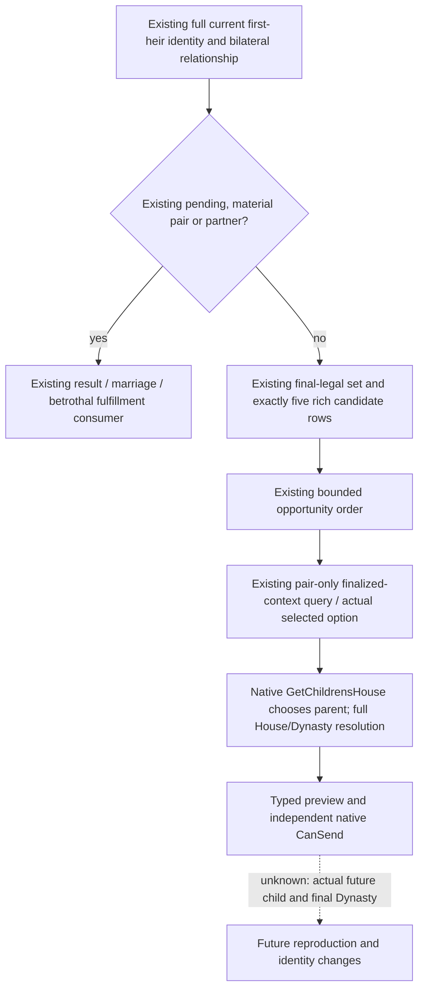
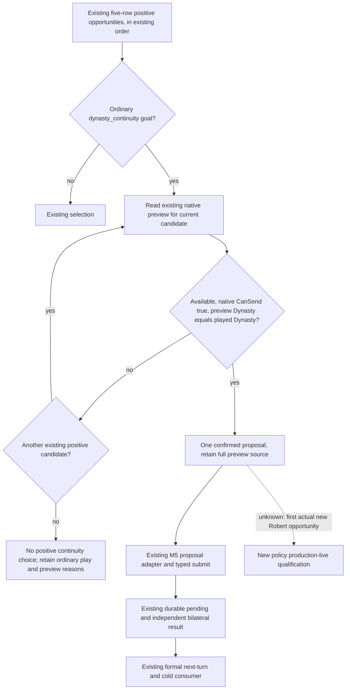

# Existing native child-House preview in first-heir candidate selection

2026-10-06 background counter-policy candidate; first production fixture **NOT
RUN**. No new native getter, raw address, game query, proposal, date advance or
new live qualification belongs to this package.

Target build: CK3 `1.20.0.3`, EXE SHA-256
`94B55397ABB687A3DCD436805A5D885E6BE90FA6C693FEB44A9E3BBEEADE02A6`.
Future actual execution remains the original ordinary Robert `29829` campaign.
The existing M5/NW-FAMILY closed loops and their historical failure artifacts
are reused, not repeated or reclassified.

## Native input ledger sealed before this policy

[Marriage and alliance](marriage-and-alliance.md) freezes the native redirected
context, final CanSend/answer, adult outcome, and lineage/lineality inputs.
[Native child-House preview](ck3-1.20.0.2-marriage-child-house-preview.md) freezes
the actual `MatchOffer.GetChildrensHouse` parent-selection chain and full
House/Dynasty resolution. This package consumes the already admitted typed
query, not the prior `.2` raw RVAs.

The exact `.3` original selected-path read is retained at
`artifacts/g2-maintainer-2026-10-02/resume-12003/m5-family/murchad-v10-material-assessment.json`:
`actual_material.native_selected_path` is available parent `36403`, House
`10443`, Dynasty `2039`. Its post-marriage CanSend is false. This is a readable
negative-send preview, not a new pre-submit positive fixture. The completed
M5 contract separately preserves bilateral marriage, cold recovery and formal
next-turn consumption; no future birth or actual child identity was observed.

The existing formal selector recorded only lineality/current-lineage basis,
with a null predicted child-Dynasty. The native prospective result was already
available through `query_family_obligations_private_v1` and
`ck3_query_family_obligations_private_v1`, so this gap needs a consumer rather
than another provider or artificial human-player Strategy.

## Minimal counter-policy candidate

The existing ordinary `campaign_goal.goal_key=dynasty_continuity` intent
selects this lane. Existing pending,
resolved, current-partner and fixed-pair fulfillment dispatch precedes it.
Other goals retain the existing selector. No new opt-in or native capability
flag is introduced.

For the existing positive opportunities, keep their current deterministic
order. Query the existing native preview for each pair until the first
available, still-sendable prospective result belongs to the played Dynasty.
The sequence is bounded by the existing five rich rows. It requests the exact
selected proposal option and uses the existing API's public revision; the
transport retains its native revision and paused frame binding. An observed
other-Dynasty result is a negative value for this bounded project goal. A
typed unavailable result retains its native reason and allows the next
already evaluated candidate to be read. Transport/frame errors retain their
existing error behavior.

This is prospective main-family continuity value, not CK3's complete AI
score, a birth probability, or a promised descendant. Candidate age,
acceptance raw, cost and alliance values retain their existing semantics and
ordering. It does not price traits/health, future war promises, dissolution,
conception probability or global spouse quality.

`first_heir_native_lineage_policy.py` performs the bounded query/choice. The
formal plan keeps all five rich diagnostic rows and the actually sampled
native preview packets. Its valued-choice list contains only the confirmed
choice, so downstream M5 proposal variants cannot substitute an unobserved
candidate. The normal submit records that full preview under
`selected_value_projection.native_child_house_preview`, marks its provenance
`child_dynasty_prediction_status=native_preview`, and stores the prospective
Dynasty. Historical pending/material records are never backfilled. The
actual child and relationship still require later independent observations.

## First verification handed to ROOT

The new fixture exercises actual `plan_family_marriage_private`, the existing
M5 proposal adapter and actual submit/pending persistence. It uses a typed
unavailable first preview followed by a readable same-Dynasty preview with the
native-consistent parent/House and checks the selected packet survives into
the pending value projection. It also checks existing partnered/material
dispatch makes no preview call. It does not test a fabricated other-Dynasty
parent while the same native rich inputs say opposite-selector heir-aligned
lineality.

First test execution is assigned to ROOT; no tests or builds were run by this
background package. A future positive paused `.3` Robert pre-submit packet
and normal material/post-turn outcome remain necessary for a new live claim.
Current married pair, saved-day count, natural-successions count, existing M5
and NW-FAMILY completion remain unchanged.
