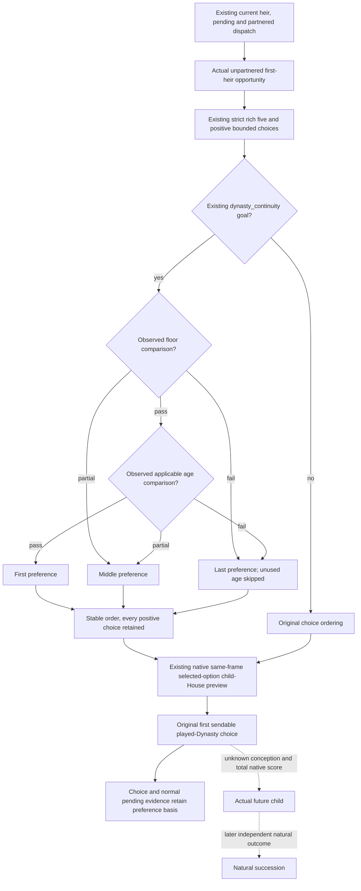

# First-heir continuity: consume observed native fertility and age comparisons

Source-first plan recorded 2026-10-08, Asia/Shanghai, ISO 2026-W41. Source
baseline is `55f9f7d2213bd9a3b10d2c39b2b6eafab1e58a1d`. Target remains frozen
CK3 1.20.0.4 / Steam 25734779. Root24 floor, Root25 age and Root27 current
lineage/descendants qualification are existing evidence; none is replayed.
This work acquires no EXE bytes and introduces no native observer.

## Concrete decision gap

`rank_first_heir_marriage_candidates` in
`family_marriage_formal_consumer.py:431` values existing positive five-row
opportunities by adult marriage, adult-measure gap, recipient acceptance and
candidate ID. The native fertility-floor and age-branch fields are retained
in diagnostics and selected value projections, but are not used in that
ordering. `first_heir_native_lineage_policy.py` currently tries the resulting
choices in the same order and returns the first sendable played-Dynasty
prospective child-House preview.

Consequently, a high-acceptance candidate whose observed reproductive
comparison fails can be tried before an already observed comparison pass.
The real source has already supplied those relevant operands. A new reader,
total-score reconstruction, pregnancy model or a repeated native fixture is
unnecessary to improve this bounded choice.

## Already closed actual operands and strict producer

| Actual native comparison | Source authority | Existing same-query value |
| --- | --- | --- |
| Signed gated effective fertility greater than loaded signed QWORD floor | [Floor topic](first-heir-loaded-fertility-floor-12004.md): actual1A3C871/878, slot5C6A1B0; failure writes-1000 | `candidate_native_fertility_floor_comparison_v1` with `ready` / `passes`, derived by the existing strict rich transport |
| Candidate nonnegative signed16+6C override, otherwise signed16+68 | [Age topic](first-heir-post-floor-quality-inputs-12004.md): actual1A3C88D..896 | Existing raw override and `candidate_native_scorer_effective_age_v1` |
| Selector-zero skips the two age comparisons | Actual1A3C899 / JE1A3C8FA | Existing `candidate_native_scorer_age_branch_v1.selector_zero_bypass`; ready/pass does not require unused upper/subject inputs |
| Applicable signed effective age Ec at most loaded signed32 upper U | Actual1A3C8A2/8A9, slot5C6A1A8 | Existing age-branch ready/pass and first-comparison detail |
| Applicable adjusted candidate age after source-defined subject adult deficit at most U | Actual1A3C8B8..8EE; signed32 wraps, subject override and existing selector adulthood operands | Existing age-branch second comparison and source-derived deficit/adjusted value |

The floor and age observers were deliberately delivered without changing
choice order. Their existing qualification establishes current observation
and isolated arithmetic, not native rank, total score, reproductive outcome
or a current descendant. The earlier scorer gates, opaque helper score and
future conception remain separate. Our preference consumes these observed
comparisons conditional on their native stage; it does not declare that the
native scorer actually ran for a human subject or that all native gates pass.

Root27's current descendant roster establishes current records separately.
Its observed living child/Dynasty evidence is retained by the existing
current-partner and fulfillment route. The ordinary natural-succession
runbook is already ready; its actual zero requires a later real transition.
This background policy improvement supplies no birth or succession credit.

## Minimal bounded preference and unchanged fallback

Only the existing `campaign_goal.goal_key == dynasty_continuity` native
preview lane changes its attempt order. It receives the existing positive
choice list and matching strict rich rows. No new candidate is enumerated.
Classify only the observed comparison pair:

1. Observed floor pass and age pass: first preference.
2. Missing/partial floor or, after a floor pass, missing/partial age:
   retain the middle preference.
3. Observed floor failure, or observed floor pass followed by age failure:
   last preference.

A floor failure does not require the unused later age inputs. All choices
remain eligible for the existing final preview; original order is stable
within each class. If all optional fields are absent, the order is unchanged.
If all observed comparisons fail, the existing lineage preview still tries
them. Failure is comparative evidence, not a new exclusion or marriage gate.
Every actual selected choice still needs the same native CanSend/selected
option/current frame and played-Dynasty preview as before.

The selected choice carries the exact observed comparison basis and its
preference category. Retain that readonly basis in the normal selected-value
pending projection, alongside its existing raw floor/age/lineage fields.
Other goals, pending/result/partner routing, original action terms and native
preview option semantics do not change. No absolute quality score or birth
probability is assigned.

## Authored validation seam

One new source-shaped registered Service compound will exercise five-row
real rich transport and the real continuity preview loop. It must show a
later observed comparison pass beats an earlier higher-acceptance floor or
age failure; selector-zero uses its actual bypass; partial/legacy absence
retains fallback; all-failure still yields an otherwise valid lineage choice;
other goals and existing partner dispatch keep their original behavior.
The chosen comparison basis must reach the existing M5/pending value path.
No native producer, old floor/age/descendant test or old compiled wire is
rerun. Root executes the unique new compound FIRST from the coherent source;
child tests/imports/builds/game/SDK/process operations remain zero.

The authored eight scenes contain 35 opportunity-row occurrences, plus a
partnered route that must perform no rich opportunity read. The full preview
fallback scene expects original candidate indices `2,3,4,0,1`; the legacy
optional-field-absent scene expects `0,1,2,3,4`. The first scene makes the
earlier comparison failures sendable played-Dynasty previews too, so a later
pass being selected is evidence of the new preference. The ordinary
non-continuity scene uses the existing absent-goal route; it does not invent
an unsupported campaign goal. Registered submission retains the selected
basis, and a current pending replan must neither read another opportunity nor
resubmit.

## Production integration

`first_heir_native_reproductive_preference.py` classifies only strict ready
boolean comparison results and copies every original choice. The stable sort
does not change ordering inside a class. Its readonly
`native_reproductive_branch_preference_v1` value preserves the exact floor
comparison and, only after an observed floor pass, the age comparison.

`choose_native_lineage_opportunity` passes this ordered list to its original
preview loop. The existing dynasty-goal dispatch owns this call; other goals
retain their original ranking. The existing M5 proposal path copies the
entire chosen choice. The selected-value projection separately copies the
preference basis into the existing pending record. Original legality,
proposal terms, native preview checks and material-result fields are retained.

Implementation and the sole new registered Service compound are authored
in an isolated checkout. Their status is `AUTHORED_NOTRUN` until Root supplies
the coherent source freeze and executes that compound. Existing Root24,
Root25 and Root27 observations are reused; no previous test or wire is needed
to qualify this new consumer. No native target or CMake change is required.

Root's sole FIRST method is
`test_first_heir_native_reproductive_preference_service.FirstHeirNativeReproductivePreferenceServiceTests.test_observed_comparison_preference_reaches_registered_service_m5_and_pending`.
The Root-only launcher and presealed expectation ledger are external at
`Z:/ck3_mod_rewrite_process_assets/g2-parallel-20261008/first-heir-observed-quality-consumer28/`.
Use the full project venv with `-B -X utf8` and active assertions. Root executes
the method against the coherent source; the candidate records no test, native,
birth, succession or live result before that execution.
