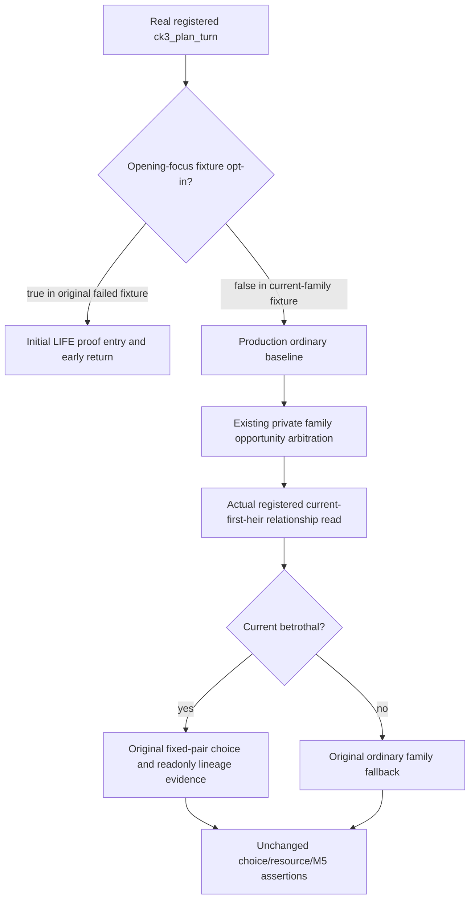

# Source27 lineage and descendants: actual Service fixture-entry repair

Recorded2026-10-08, Asia/Shanghai, ISO2026-W41. This addresses only the two
new runtime27 FIRST consumer failures. Native producer/runtime source is
`3725069765c8e42152fec261e59ac66db6d4430b`, immutable
`C:/codex-ck3-background/migration4-entry-live-fix/g113-r27`.
Root's five new native targets passed; their original generated wires remain
unchanged. No native build, producer or CTest replay is required by this fix.

## Actual failure and concrete production entry

Root retained the actual failed consumers under
`Z:/ck3_mod_rewrite_process_assets/g2-background-20261008/runtime27-first01/`.
The lineage compound had zero recorded private relationship reads in all six
scenes while requiring at least one. The descendant compound had only its
explicit registered direct query in all seven scenes while requiring at
least two. Neither Service compound completed a scene; the records count
remained zero. This is a fixture entry failure, not a native capability RED.

Both new fixture drivers set
`require_initial_lifestyle_focus_before_date_advance=True`, believing that it
would supply an ordinary life-advance opportunity. Actual production source
shows the opposite path:

- `bridge/service.py:1130` seeds the distinct opening-focus plan when that
  option is true.
- `bridge/service.py:1328` explicitly returns
  `_plan_initial_lifestyle_focus_first_v1` before family opportunity
  arbitration. Its comment requires the runner to consume the opening proof
  before a family proposal can replace the selected step.
- Ordinary private family arbitration is at
  `bridge/service.py:1706` and `_plan_private_family_opportunity_v1:1738`.
  Its existing opted-in fixed-pair consumer performs the private relation
  read before falling back to the ordinary unpartnered route.
- `current_first_heir_betrothal_formal_consumer.py:114` accepts the current
  paused actor and ordinary life-advance/query opportunity, retaining any
  already selected unrelated action.

The two fixtures supply a paused living actor, no active event, no pending
interaction, no war, empty command history, and only the `life-advance`
action capability. The ordinary planner retains its own baseline. Its
current-life fallback is `strategy.py:14873`; this repair supplies no
fabricated plan output or additional historical proof.

## Minimal correction and qualification boundary

Only the two new test driver scenario options change to false, with corrected
comments. No production policy, capability registration, native binding,
native fixture, wire, strict contract, route output or action terms change.
The original relationship-count, selected-step and choice/resource/M5
evidence assertions remain intact. The original lineage6 and descendants7
failures are retained; all thirteen scenes still require their first
successful Service qualification.

Root retries only those two consumers against a separately frozen corrected
Python/test source tree, using the already qualified native wires. The
external launcher records native source3725 independently of the corrected
consumer source. Original FIRST logs and attempts are preserved, and the
other three consumers and old Age/floor evidence are not rerun.

Child status is **authored fixture correction / NOTRUN**. Child imports,
tests, native builds, source acquisitions and local game/SDK/Steam/process/UI
operations are zero. New birth, natural succession, live milestones and G2
counters remain unpromoted. Root owns the necessary consumer retry and the
Oct8/W41 shared reports.
