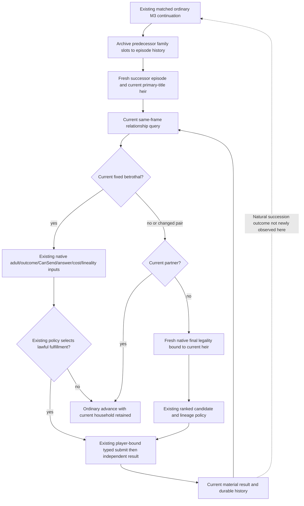

# Ordinary successor episode: current first-heir family consumers

Source pin: `a59b2df4a2b3ab6a951bfdc4f12845faf27439d7`, inspected on 2026-10-08. Native identity: CK3 1.20.0.4 / Steam build25734779 / EXE SHA-256 `98702F88A547CDE2EAF29A85F93B85F68EE4CF8148336A4F7AFAEB75319DD518`. This is a review of the adopted consumer routes, reusing the existing actual4 observations and native tree; no native body was recaptured and no policy was added.

The ordinary M3 continuation already archives predecessor-owned pending/resolved family records before the successor episode takes ownership. Root reported the unique M3-to-family compound FIRST02 GREEN. That is software qualification of the episode handoff, not a naturally occurring succession or a marriage outcome.

## Current remarriage route

`family_marriage_formal_consumer.py:572` obtains the paused current first-heir relationship. Its `614–619` branch stops treating a nonmatching historical material pair as the current resolution: the old heir can have changed or its previously observed partnership can have ended. It preserves the durable record while routing the current opportunity forward.

The current partner branch at `628–631` retains the observed household and ordinary advance. If the current heir is unpartnered, `638–643` obtains fresh native final legality and checks that its subject equals the current relationship heir. The legality transport independently resolves the current primary-title heir; it does not borrow the predecessor's selector or cached default child choices.

The existing submit path binds the same-frame unpartnered relationship. A new pending record preserves the prior resolved evidence until the independent result replaces the active resolved slot. Writes retain the rest of the ledger through `**ledger`, including episode history. This source path does not need a new remarriage branch.

## Current betrothal and wedding route

The fixed-pair consumer precedes ordinary new-candidate selection. A current relationship matching the historical resolved pair is consumed once; an observed betrothal becoming a marriage is classified from the current relation. A missing or changed current betrothal returns to the ordinary current-family consumer rather than reusing the former target.

The actual4 relationship transport validates the same-frame public heir and CampaignRoot query sequence. It already consumes native adult threshold inputs, final CanSend, recipient answer, immediate costs, predicted marriage/betrothal outcome, and selected/effective lineality. The ordinary family opt-in sets both fixed-pair and current-relationship permissions. Service dispatches submit and result through the existing typed methods; these private steps do not require a second generic `execute_step` route.

The current reproductive-input and descendants objects remain whole current observations. Fertility, marriage, or an empty children roster does not establish pregnancy. The separately authored pregnancy33 observer and its qualification belong to the dynasty lane; this packet does not add or assume those fields.

The two reviewed normal paths are source-closed. No new missing decision field or reached dispatch omission was found, so this packet adds no production patch or new compound. Native final legality and actual outcomes continue to decide which existing branch applies. Naturally occurring succession, remarriage, adult wedding, pregnancy, and birth each require their own actual paused observations; none is credited by this source review.

Evidence packets:

- [Current remarriage source tree](Z:/ck3_mod_rewrite_process_assets/g2-parallel-20261008/family-current-decision32/m7-family-current-after-succession/current-remarriage/SOURCE-TREE.md) and [no-gap receipt](Z:/ck3_mod_rewrite_process_assets/g2-parallel-20261008/family-current-decision32/m7-family-current-after-succession/current-remarriage/NO-GAP-RECEIPT.json).
- [Betrothal execution source tree](Z:/ck3_mod_rewrite_process_assets/g2-parallel-20261008/family-current-decision32/m7-family-current-after-succession/betrothal/SOURCE-TREE.md).
- [Original M3 handoff candidate](Z:/ck3_mod_rewrite_process_assets/g2-parallel-20261008/family-current-decision32/r77-family-next/prepared/ROOT-DELIVERY.json) and [fixture-only FIRST02 correction](Z:/ck3_mod_rewrite_process_assets/g2-parallel-20261008/family-current-decision32/r77-family-next/prepared-first02/ROOT-DELIVERY.json). Those frozen receipts preserve their original pre-execution status; Root's later GREEN report is recorded separately above.
- [Task worktree move receipt](Z:/ck3_mod_rewrite_process_assets/g2-parallel-20261008/family-current-decision32/m7-family-current-after-succession/WORKTREE-MOVE-RECEIPT.json). Only the new task tree moved from C: to Z: after Root reported low free space; historical trees and evidence were retained.

Worker game/SDK/import/test/build/EXE-read/hash counts are zero. Source review does not upgrade live readiness.
