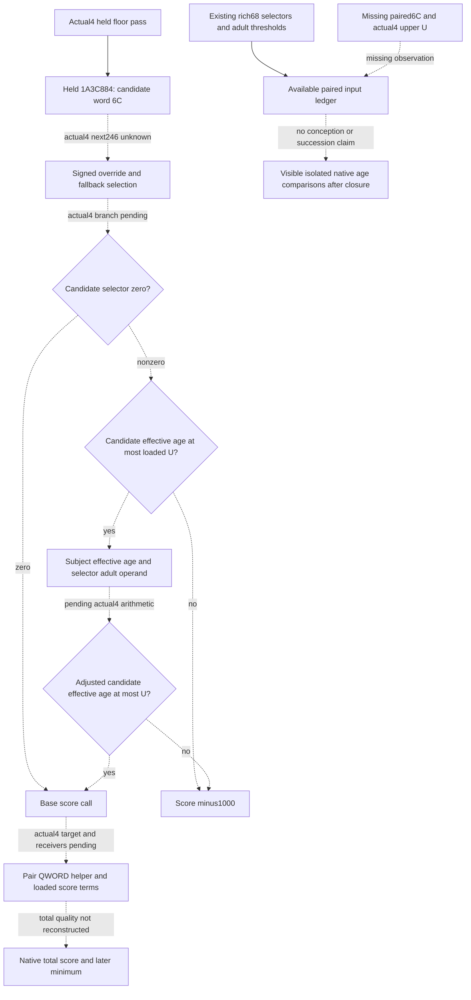

# First-heir post-floor quality inputs, native 1.20.0.4

Recorded 2026-10-07, Asia/Shanghai, ISO 2026-W41. This is a source-first
input ledger for the next useful rich-five observation. Target build is
CK3 1.20.0.4, Steam `25734779`, with the existing frozen EXE identity
`98702F88A547CDE2EAF29A85F93B85F68EE4CF8148336A4F7AFAEB75319DD518`.
Source inventory is pinned to `e8a3cd4836eadec590c14a8d29195532db9a8526`.
No new EXE bytes, source capture, import, test, build or game operation was
performed for this package. Root owns source mapping and qualification.

The closest missing native quality input is `Character+6C`, the age override
whose first actual4 load follows the fertility-floor pass. The current rich
query publishes `Character+68` and adulthood thresholds, but these do not
substitute for the scorer's override-selected age. Actual4 signed selection
and the following loaded upper-age comparison still need one finite source
mapping. No new chooser rule or estimated conception probability is supplied.

The [loaded-floor package](first-heir-loaded-fertility-floor-12004.md) has
its own qualification. Its e8 candidate was unqualified when this inventory
began; Root subsequently reported FIRST native GREEN over four compiled
frames in 0.252 s and the sole complete Service compound GREEN over five
scenes / 25 rows in 3.642 s. That is existing floor evidence, not an execution
or age-branch qualification by this package. Birth, succession and full G2
completion remain separate.

## Published values and concrete omissions

| Input | Existing production landing | Native scope and remaining work |
| --- | --- | --- |
| Candidate and heir fertility | `family_value::ReadCharacterValue`, `ck3_12002_family_value.cpp:80`; actual4 gate binding `28BB4C0`; rich paired values at `ck3_12002_family.cpp:402` | Gated signed effective raw, extension presence and eligibility are already published. Absent extension or false gate produces observed zero. No new fertility getter is required. |
| Loaded fertility floor | Actual4 signed QWORD slot `5C6A1B0`; rich `native_candidate_fertility_floor_raw` and derived comparison | Root's new floor FIRST is independent evidence. The branch checks strict signed `effective_raw > floor`; equality does not pass. |
| Adult measures and selectors | Rich signed16 `Character+68`, sex selectors, signed32 adulthood thresholds; paired value sampling and repeated frame comparison | Published adult measures are not the scorer's override-selected effective ages. Raw `Character+6C` is absent. |
| Current proposal legality | Rich native final-legality, CanSend, acceptance and answer | Current proposal legality and recipient acceptance remain distinct from producer quality. |
| Current heir relationships | Rich current betrothal / primary-spouse / complete spouse IDs, plus current first-heir relationship join in the formal consumer | Already observed. Diagnostics retain a spouse count, and the real relationship join is used by the existing consumer. |
| Current candidate relationships | `ck3_12002_family_wire.cpp:281`, `:288`, `:295` emit betrothal / primary-spouse / complete spouse IDs | Already on the rich wire; the formal diagnostic and selected-value tuple omit them. This is a retention omission, not another missing native reader or a new marriage restriction. |
| Current player relationships | Actual4 relationship reader and public `ck3_take_snapshot` expose `played_character.betrothed_id`, `primary_spouse_id`, `spouse_ids` | IDs are already available. Player/current-partner fertility and effective age are a different pair scope and are not demanded by the first-heir scorer tail established below. |
| Actual selected option and prospective child-House parent | Existing rich lineage reader, `native_child_house_preview`, `first_heir_native_lineage_policy.py` | Selected/effective lineality and parent House/Dynasty already exist. The preview does not observe a descendant or an existing marriage's stored lineality. |

The rich first-heir reader rejects `subject == played` and disables fertility
for its played-character lineage read (`ck3_12002_family.cpp:380`, `:384`,
`:452`). Therefore changing Python IDs cannot turn it into a current-player
couple observation. The current player relation IDs can be reused if a later
source-defined current-couple decision requires values. The existing arbitrary
pair endpoint `ck3_query_family_obligations_private_v1` is the smallest such
join entrance; no duplicate player relationship or child-House observer is
proposed here.

## Held actual4 source and old tail separation

The existing actual4 filter calls the scorer at `1A3C7E0`. Root's held 76B
fragment `[1A3C83C,1A3C888)` closes the signed QWORD floor branch. The
pass target `1A3C884` is `0F B7 43 6C`, a four-byte load of candidate word
`+6C` into EAX. Actual4 signed selection, fallback `+68`, selector gate,
upper-age operand, helper targets and score terms after that load are
**not yet source-qualified**. Old operand addresses are not actual4 bindings.

The named cached .3 scorer body is `[1A3C800,1A3CA0B)`, 523B, retained SHA
`52CABB476E38C58BE63A4F41B4251E94D7B0DAFF57B27C5BAD84628374702A1E`.
Its receipt and ASM were reused once by the source owner; it was not recaptured
or rehashed. In that old source, RBX is the candidate, RBP the parameter block,
R14 the scored-row container and parameter `+10` the subject Character.

The old tail establishes these literal operations:

1. Candidate effective age `Ec` is signed16 `+6C` when that value is
   nonnegative, otherwise signed16 `+68` (`1A3C8A4` onward). Candidate
   selector `+1A1 == 0` skips both subsequent hard age gates.
2. For the nonzero selector, signed32 `Ec <= U` passes, using the loaded
   DWORD upper operand at old slot `5C6A1A8`. Failure sets score `-1000`.
3. The subject effective age `Es` uses the same signed override/fallback
   rule. Subject selector chooses loaded adulthood operand `A0` or `A1`.
   The native signed32 calculation is `D = wrap32(A - Es)` when `Es < A`,
   otherwise zero; signed `wrap32(Ec - D) <= U` passes the second gate.
4. At old CALL `1A3C920 -> 1A3CA10`, RCX is the parameter block and RDX
   the candidate. Its signed32 result is the base score; its body remains
   opaque for this observation plan.
5. At old CALL `1A3C936 -> 2504820`, RCX is a stack QWORD output address,
   RDX the subject, R8 the candidate and R9D zero. The output is divided
   by 100000 with the signed reciprocal sequence and consumed through EDX.
   A nonnegative EDX receives a loaded signed32 bias before addition to the
   base score. No business meaning is assigned to that helper.
6. Candidate selector chooses a loaded signed32 age start and weight.
   If `Ec > start`, low32 IMUL of `weight * (Ec - start)` is subtracted
   from the signed32 score. Loaded values and beneficial/adverse signs
   are not guessed. The later signed minimum-score comparison suppresses
   rows below the supplied minimum; the stock old minimum is one.

| Old .3 instruction | Old loaded DWORD | Use, not an actual4 slot |
| --- | --- | --- |
| `1A3C8C2` | `5C6A1A8` | Selector-nonzero upper-age operand `U` |
| `1A3C8F3` / `1A3C8F9` | `5C6A15C` / `5C69D10` | Subject selector-based adulthood operands `A0` / `A1` |
| `1A3C95C` | `5C68794` | Conditional nonnegative helper-quotient bias |
| `1A3C962` / `1A3C973` | `5C68780` / `5C68784` | Selector-based candidate age starts |
| `1A3C97E` / `1A3C986` | `5C68778` / `5C6877C` | Selector-based candidate age weights |

The earlier pre-floor minimum-age operand is outside this package. Duplicate
suppression and append are later old-tail facts; they are not needed to close
the next paired age observation. Sorting and recipient acceptance remain
their existing producer/legality paths.

## Finite source step and implementation recipe

Reuse only old `[1A3C8A8,1A3C99E)`, 246B, at offset `0xA8` of the named
523B cache. The retained actual runtime fragment candidate is adjacent to
the held floor: `[1A3C888,1A3C97E)`, also 246B. The actual scorer entry
comes from real filter CALLs, and the runtime records provide finite fragment
geometry. These select a mapping candidate, not an assumed global `-20`
RVA move or already equal semantics. Root's central finite mapper must return
actual decode, control correspondence, RIP operands and direct call targets.
No new PE/pdata, earlier floor/filter read, whole scorer capture, helper body,
loaded runtime value, EXE hash or game query is required for that source step.

After actual4 closure, the smallest observer uses the existing rich paired
value reader and its whole-value repeated sample. Add the source-defined
signed16 raw override to `CharacterValue` and the heir/candidate rich fields;
derive effective age only after the actual signed fallback branch is proved.
Capture the actual loaded signed32 upper operand once in the same rich query
frame and copy it to the rows, as with the qualified floor. Reuse already
published selectors and actual4 adulthood thresholds if the returned source
confirms those operands. No extra proposal endpoint or pool is needed.

The real consumer route is `GameplayBridgeService._plan_private_family_opportunity_v1`
to `plan_family_marriage_private`, the existing Driver rich first-heir query,
strict rich transport and formal diagnostics. Retain lawful negative override
sentinels, zero values, old-field absence and independent unavailable loaded
operands. A future isolated comparison must carry its derived source and
branch applicability; selector-zero does not require an unused upper bound.
No conception probability, opaque total-score recreation or new action gate
follows from observing this branch.

One new native reader/wire to complete Service compound can then cover
positive override, negative fallback, equality/greater upper comparison,
subject not-yet-adult adjustment, selector-zero bypass and missing optional
operands. That fixture and test are only a next implementation recipe; none
was authored, imported or executed in this research package. Root must first
review the finite mapping result, then authorize the coherent observer.

External manifest, source/input ledger, two child source drafts and Oct7/W41
handoff are under
`Z:/ck3_mod_rewrite_process_assets/g2-parallel-20261007/first-heir-next-quality24/`.
Current readiness is **research**. Existing floor qualification is reused;
new age observer, policy, native FIRST, paused evidence, game days, births,
natural succession and new G2 completion credit are zero.
