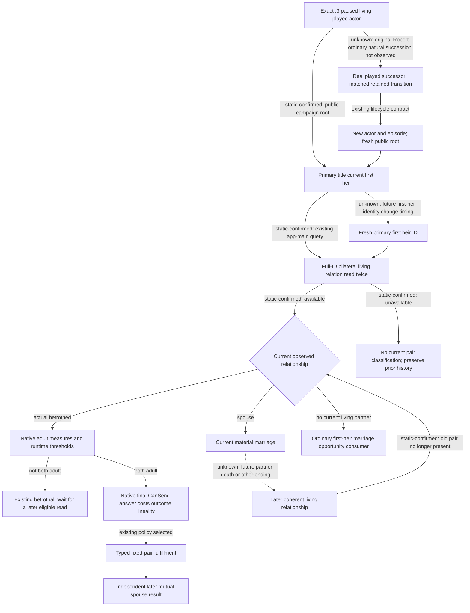
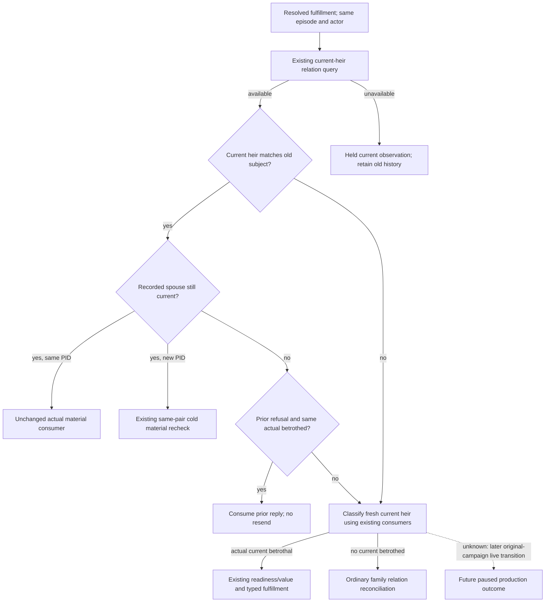

# Current first-heir marital lifecycle: frozen source tree

Sealed at **2026-10-06T23:38:18+08:00**, before the proposed lifecycle change.
This is an engine relationship/observer tree, rather than an NPC utility tree.
Readiness of this new package is **research**. It supplies an existing-consumer
replacement contract; it introduces no new getter, test result or live sample.

Frozen source supplied by Root: `C:/codex-ck3-background/joint-source-cap64-batch/g104`
at `71b729f0cc4894331f1dadb89155920fccd42a00`. Target: CK3 **1.20.0.3**, Steam
build `25652598`, EXE SHA-256
`94B55397ABB687A3DCD436805A5D885E6BE90FA6C693FEB44A9E3BBEEADE02A6`.
Identity comes from the already frozen `.3` manifests and Root's source pin;
this package did not inspect an EXE, calculate hashes or invoke Git.
`Z:/gb0` was read only. All output belongs to this external directory.

## Source inputs read before proposing a change

The native-AI README research workflow requires source-first evidence and
Mermaid with unknown edges dashed. The existing succession-transition,
current-first-heir actionability, fulfillment, formal-entry and `.2` marriage
topics were read as historical input, with their respective build and live
boundaries retained. The current `.3` source/manifest binding is the authority
for this proposal; no old-version raw address is newly admitted here.

| Evidence | Frozen g104 entry | Source-supported conclusion |
| --- | --- | --- |
| Exact `.3` foundation | `native_bridge/research/ck3_1_20_0_3_foundation.json`, `character_full_generation_check`, `character_death_pointer` | Full CharacterID resolves against `CCharacter+0x18`; death data is `+0x1D0`, null means alive. |
| Reviewed ABI reuse | `native_bridge/research/ck3_1_20_0_3_abi_reuse.json`, target build and PASS `ck3_12002_family_query_abi.json` entry | Shared `ck3_12002` family types are admitted under the `.3` exact-build selector; namespace is not an older-build claim. |
| Runtime family binding | `native_bridge/src/bridge.cpp:9611`, `BindFamilyMailbox12002`; `:17834` | Binds the family image through `ReviewedCrozierAbiSha256(game.descriptor())`, using the current adapter descriptor. |
| Public current-heir binding | `src/xar_autoplayer/bridge/current_first_heir_relationship_private_transport.py:138`, `query_current_first_heir_relationship_private_v1` | Fresh same-frame public campaign root selects the primary title's current first heir; accepts no arbitrary subject ID. |
| Native relationship read | `native_bridge/src/ck3_12002_family.cpp:45`, `ReadRaw`; `:77`, `ReadRelation`; `:463`, `ReadCurrentFirstHeirRelationshipV1` | Reads bilateral living relationships twice on the paused player frame. Family `+0x10` is betrothed, `+0x14` primary spouse, `+0x20` spouse vector. |
| Deceased spouse semantics | `native_bridge/src/ck3_12002_family.cpp:67` | Spouse vector may retain a deceased former spouse; the existing query omits entries whose resolved character has death data. It does not edit native history. |
| Current-pair adulthood | `native_bridge/src/ck3_12002_family.cpp:139`, `ReadAdult`; `:482`, `ReadCurrentFirstHeirBetrothalActionabilityV1` | Uses native signed measures, selectors and runtime thresholds; no fixed age forecast. Reads fixed-pair final CanSend, answer, ten costs and outcome. |
| App-main observer | `native_bridge/src/bridge.cpp:9543`, `ExecuteCurrentFirstHeirBetrothalMailboxQueryV1` | Current relation and actionability are already in one existing private observer lane. |
| Ordinary lifecycle replacement | `src/xar_autoplayer/family_marriage_formal_consumer.py:552`, relation reconciliation; `:78`, `_resolved_relation_matches` | Ordinary consumer distinguishes matching material pair, new heir, ended relation and unavailable observation before considering another opportunity. |
| Fixed-pair seam | `src/xar_autoplayer/current_first_heir_betrothal_formal_consumer.py:159` | Resolved fulfillment currently checks source episode and actor, then returns before the relation query at line183. It does not inspect the current heir or current pair on that path. |
| Production consequence | `src/xar_autoplayer/bridge/service.py:1710` | `current_betrothal_fulfillment=True` returns early and prevents the ordinary family consumer at line1714. |
| Real successor binding | `src/xar_autoplayer/bridge/native_driver.py:20558`, `_execute_continue_as_reconciled_successor`; `:20650` | A matched real successor receives a new actor/episode identity with no CK3 command/restart. Old resolved source identity already stops matching after this transition. |
| Cold first-heir binding | `src/xar_autoplayer/bridge/observed_heir_marriage_private_action_v1.py:170`, `query_observed_first_heir_marriage_cold_result_private_v1` | Existing cold result rebinds the current public first heir; changed old subject is rejected before its result query. Resolved dispatch must recognize an available changed heir before requesting that old-pair cold route. |

Paths in the table are relative to `g104/ck3_autonomous_player/` except the
existing topics under `g104/docs/ck3-native-ai/`. Entries are source-confirmed
inspection; the new seam has not been executed or classified as a live fault.

## Decisive native observations and legitimate migration branches

| Observed current value | Legitimate branch | Existing next input/action | What remains unknown |
| --- | --- | --- | --- |
| Available, bilateral spouse contains the recorded candidate, same current heir | Continue consuming the actual recorded marriage | Existing warm material consumption; cold mode keeps its independent old-pair recheck | Future death, birth and dynasty are not promised. |
| Available, bilateral actual betrothed; at least one native adult predicate false | Keep actual betrothal and wait | Existing fixed-pair actionability on a later eligible frame | Future maturity/date/outcome is unknown. |
| Available, same heir and same actual betrothed after recorded fulfillment refusal/invalidated reply | Keep consumed reply without retrying that unchanged pair | Existing recorded refusal/invalidated consumer; current actual betrothal stays intact | An available read does not reverse a prior actual reply or authorize cancellation. |
| Available, bilateral actual betrothed; both native adults and final positive zero-cost marriage opportunity | Fulfill this current pair | Existing typed fulfillment choice, submit, result, checkpoint and independent spouses | ACK and unchanged betrothal remain pending, not a marriage. |
| Available, same heir, recorded old spouse absent from primary spouse and living spouse list | Old material pair is no longer the current living relationship; resume current relationship dispatch | If no current betrothed, return to ordinary family consumer; if another actual betrothed, use its existing actionability | Absence alone does not prove the cause was death rather than another engine transition. |
| Available, current heir differs from recorded subject | Old subject is history; classify current heir from this new read | Existing fixed-pair consumer for an actual current betrothal, otherwise ordinary family consumer | Do not guess that Guy38988 or any historic split successor is now primary heir. |
| Relationship `status=unavailable` | Retain old historical material record without treating it as the current pair | Existing held/read-unavailable result and later normal observation | Neither no-partner nor new-heir is inferred. Missing values stay missing. |
| Real ordinary natural successor matched | Rebind actual player and episode, then query successor's current primary first heir | Existing successor continuation + checkpoint + fresh public root and relation | Robert campaign has **natural succession0**; this package grants no successor-live credit. |

The spouse-vector death branch is already observed by native code. A stale
dead scalar betrothed/primary-spouse reference produces an unavailable read
until the engine provides a coherent current relation; it does not become
an invented empty relationship. Timing/order of native partner-death cleanup
has not been established by a new `.3` sample and remains **unknown**.
Selecting a new current opportunity does not require naming that cause.

## Native/observer tree

## Smallest existing lifecycle-consumer replacement contract

Only the resolved fulfillment branch in
`plan_current_first_heir_betrothal_fulfillment_private` needs the proposed
functional extension. Pending mode remains its existing result/checkpoint
consumer. Same-pair cold material recheck and real same-pair warm consumption
retain their existing meanings. The external durable ledger remains history;
do not clear, relabel or overwrite it merely because the current heir changed.

On a normal eligible opportunity, reuse the already published relation query
before treating a resolved fulfillment as current. Apply the ordinary
consumer's established relation comparison semantics:

1. **Available + same current heir + recorded spouse still present:** keep the
   existing material consumption. No new submit, candidate preview or option
   change is needed.
   **Available + same actual betrothed after a consumed refused/invalidated
   fulfillment reply:** keep that prior reply and do not resend the unchanged
   pair. No cancellation or alternative lineality is introduced.
   If the observed same material pair is in a new PID, retain the exact existing
   `RESULT_STEP` cold material recheck; the new dispatch does not replace it
   with warm success.
2. **Available + changed current heir**, or **available + same heir with old
   pair ended:** leave the old result historical and continue current relation
   dispatch. An actual new betrothal uses the existing evaluator; no betrothed
   returns to the existing ordinary family consumer. A currently married new
   heir stays partnered through existing classification.
3. **Unavailable:** attach/read the actual unavailable observation and keep a
  held classification. Do not mark the old pair ended or invent a new pair.

The existing cold result transport insists on the current public first heir.
Consequently, an **available changed heir/pair** must also leave the old result
historical before attempting an old-subject cold query. This is the same
positive current-relation comparison as warm dispatch, not a new cold result
interface or a relaxation of same-pair verification.

This is a lifecycle capability candidate, not a new safety gate or an added
prerequisite for the current Robert marriage loop. Main implementation belongs
to Root; this package changes no production source.

## Unique new production fixture recommendation

One new compound **Service-family-dispatch** fixture can cover the decisive
states without repeating the GREEN2/2 native-preview candidate fixture or old
M5 tests. Start from one warm resolved fulfillment ledger under actor101 and
episode `robert-test`, subject202/candidate300; no pending record. In that same
production fixture, branch its fresh existing relation response into:

- available new first heir203, actual ready betrothed301: the real service
  route selects the existing typed fulfillment for203/301;
- available subject202, no current living partner: the service resumes the
  real ordinary five-candidate opportunity, using the existing fake source;
- unavailable current relation: no new family submit or candidate enumeration;
- available unchanged spouse202/300: existing material consumer, no resend;
- prior resolved fulfillment refusal, same subject202/actual betrothed300:
  consumed refusal, no retry of the unchanged pair.

After planning each branch, compare the original ledger bytes to show its
old material record stayed historical. Use synthetic IDs and disclose that
the branch inputs are fixtures; do not call a static absent partner a live
death. This is one future production-path fixture recommendation, **NOT RUN**,
not an implementation or helper-mirroring test delivered by this research lane.

## Existing observer and command inputs

These are published existing contracts, not new interfaces:

| Existing entry | Exact inputs and observed result |
| --- | --- |
| `query_current_first_heir_relationship_private_v1` | `expected_native_revision=snapshot.native_revision`; optional `campaign_root_result` must be the same frame. The method obtains `held_title_partition[primary].first_heir_character_id`, then sends `query-current-first-heir-relationship-v1-private` with native `expected_revision`. Returns heir ID, bilateral betrothed/primary spouse/living spouse list and additive `betrothal_actionability`. |
| `submit_current_first_heir_betrothal_private_v1` | Method accepts the complete same-frame `relationship`. Existing serialized step is `submit-current-first-heir-betrothal-fulfillment-v1-private`; fields are `expected_revision=before.native_revision`, `heir_character_id`, actual `candidate_character_id` and finalized `recipient_character_id`. No candidate inventory or lineality setter is introduced. |
| Warm result | `query-observed-first-heir-marriage-result-v1-private`, `expected_revision=current native revision`, `fulfill_existing_betrothal=true`; unchanged actual betrothal stays pending. |
| Cold same-pair result | Same result step plus `cold_recovery=1`, retained `heir_character_id`, `candidate_character_id`, `recipient_character_id`, `source_date_raw`, `fulfill_existing_betrothal=true`, retained observed `matrilineal_option_selected`. Existing public current-heir binding remains required. |
| Actual marriage verification | Only independently observed mutual spouses qualify fulfillment material success; ACK, adult readiness and the existing betrothal do not. Existing result/checkpoint consumers remain the owners. |

## Historical evidence and current boundary

Root supplies historical first-heir38822/38718 marriage with warm/cold evidence
and Guy38988/37689 betrothal. They remain prior pair observations, not a fresh
current frame or proof of ordinary succession. The candidate-selection fixture
authored in the preceding package now has Root-reported **FIRST GREEN2/2**;
that result is reused exactly once and was not rerun here.

Original ordinary Robert29829 remains the only actual campaign entry. This
package performed zero game, SDK, pipe, process, EXE, build, test, Git or main
tracked-file operations. No new day, natural succession, artifact from a live
query, capability action or readiness upgrade is claimed. Unknown native
cleanup timing and future successor relationship values are explicit above;
neither is a reason to stall the existing available observation consumers.

## Implemented consumer and FIRST qualification

After the source tree above was sealed, the own-worktree candidate changes
only resolved fulfillment dispatch and the existing relationship helper's
optional same-frame campaign-root forwarding. Pending handling is unchanged.
Available fresh relationships now reconcile the recorded heir/pair before
warm consumption or cold material recheck. A different current heir or ended
pair reaches the existing fixed-pair/ordinary consumers; unavailable stays
held. The unchanged refused/invalidated actual betrothal is consumed without
resending. Planning preserves the historical durable ledger bytes.

The unique production fixture
`test_first_heir_fulfillment_relationship_transition.py` calls actual
`GameplayBridgeService._plan_private_family_opportunity_v1`. Its single method
`test_service_dispatch_tracks_current_heir_and_pair_after_fulfillment` covers
six source-reachable normalized states: changed current heir with an actual
ready betrothal, ended material pair with the existing ordinary native-preview
choice, unavailable relation, same marriage warm/cold, and unchanged refused
betrothal. These are synthetic states, not an observed spouse death or
ordinary succession. No old test method or prior candidate2 method was run.

FIRST result: **GREEN 1/1 method, six service branches, exit0**, once on
2026-10-06T23:48:44–23:48:48+08:00. Unittest reported0.030s;
process elapsed3.550093000s. Full argv, import environment, stdout, stderr and UTC timing: [external RESULT.json](Z:/ck3_mod_rewrite_process_assets/g2-parallel-20261006/marriage-candidate/next-generation/transition-first-execution-01/RESULT.json).

Readiness is **static-ready production consumer**, not new live capability.
The exact `.3` existing observer was reused; no new getter, native build,
runtime contact or game day was added. Original Robert29829 remains the only
actual entry and natural succession remains0. Adult-pair fertility publication
and its native loaded threshold remain separate construction entries in the
[pair input tree](first-heir-adult-pair-inputs-12003.md) and
[native quality tree](first-heir-native-fertility-quality-12003.md).
