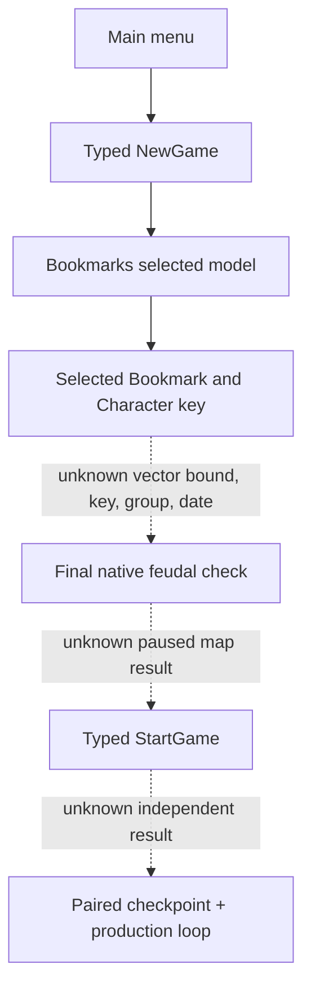

# Exact-build 1066 frontend selected model (private gate)

CK3 1.19.0.6 EXE SHA-256 `2D00FF3101EF70B566F2FCBAE292F09263199C80E9DC8F139B82D7D96F83DB86`; `frontend_bookmarks.gui` SHA-256 `C853B48F42A5A3B84208B2FC570C02F5FCB5DA217133553C6A5B70B7F8F0F267`; `00_bookmarks.txt` SHA-256 `820C8F3F5A99CF1141A21A34F0661A7300E5D12938BB3EA7EA07A84A0D3BEB14`.

The original GUI binds `map_characters` to `GameSetup.GetSelectedBookmarkCharacters` (line 193), each card to `GameSetup.SetSelectedCharacter(BookmarkCharacter.Self)` (line 240), the selected panel to `GameSetup.GetSelectedCharacter` (line 1589), and StartGame to `GameSetup.StartGame` (line 2024). The five repeated buttons in sole CK3 R719 are **widgets**, with no character key, government, or selected state. R719 official read-only artifact SHA-256 `92C3189EE4B7C0E85E2787F33E0B772BAB236291CC33CD088644CC2BB5369E3F`; it created no seed.

Original 1.19.0.6 callback registration resolves `GetSelectedBookmark` through RVA `0xF719F0→0xF6FE80` to `[setup view+0x150]`; `GetSelectedCharacter` through `0xF71150→0xF70810` uses **view+0x158**; `GetHoveredCharacter` through `0xF71B90→0xF70AF0` uses view+0x15C. `GetSelectedDate` through `0xF71100→0xF706D0` returns selected Bookmark+0x38. Selected Bookmark characters use an inline native collection at Bookmark+0x170: qword base+0, dword capacity+0x8, dword count+0xC, dword allocator identity+0x10, element stride 0x1A0. Original collection initializer/copier `0x3358EF0/0x3359030` and generic consumer `0x3346800` establish this layout; the earlier three-qword begin/end/cap assumption was invalid and was corrected before any live query or action. A candidate's `GetBookmark` getter at RVA 0x1126920 reads element+0x130, so it must equal the selected Bookmark pointer. `GetName` uses the SSO key at element+0x8, not the rendered name. `GetGovernmentType` starts from element+0xA8 but may switch to element+0xB0 after an original DLC-feature check; the final native result must decide `feudal_government`.

The BookmarkCharacter data-model callback `0xF71860` binds type table RVA `0x4028D78` and resolves the collection via the original data-model adapter `0xF79040`: `0xF79062` reads count at model+0xC, and `0xF79070` uses stride 0x1A0 from model+0. The element path `0xF78EB0` requires `0<=index<count` at `0xF78F21`, then resolves that element at `0xF78F25–0xF78F2C`. `0xF70B60` returns the model address as selected Bookmark+0x170. This is the Bookmark-specific count/bound source; the probe uses those exact fields, not a generic three-pointer vector guess.

`GetSelectedBookmarkGroup` callback `0xF71DB0→0x817F70` returns `[view+0x108]`; `BookmarkGroup.GetName` formats its script key at group+0x38. `GameSetup.GetBookmarkName` callback `0xF71080→0xF706E0` formats the Bookmark script key at Bookmark+0x18. The original StartGame path `0xF700C8→0xE321E0→0x11CE770` transfers the raw qword at Bookmark+0x38 into game setup+0x88, so the private probe preserves that raw date and waits for the original formatter to interpret it.

`frontend_bookmarks.gui` lines 2495–2496 call `SetSelectedBookmark(Bookmark.Self)` and then `ClearSelectedBookmarkGroup`; group+0x108 may therefore be null in a valid selected-Bookmark state. The private query records a group key when present but does not require it to choose a candidate.

Original `BookmarkCharacter.GetGovernmentType` getter RVA `0x2DAB260` runs the DLC-feature check `0x2C74B40` before choosing element+0xA8 or fallback element+0xB0. Original `GovernmentType.IsType` registration RVA `0x5759BD–0x575A48` calls `0x2C75220→0x2C6D420`, comparing the returned government's SSO script key at government+0x18. The private producer invokes the final getter only for the source-key-matched target and reads that key. A raw element+0xA8 value is not accepted as final government.

Original `SetSelectedCharacter` GUI callback `0xF71460` validates the `BookmarkCharacter.Self` model argument and calls `0xF707E0(setup view, element)`. The latter derives the index from `(element - [selected Bookmark+0x170]) / 0x1A0` and writes view+0x158; `GetSelectedCharacter` later reads that index. A future typed selector can use the **key-found native element** and that original setter, then confirm the next independent selected model frame before StartGame. The current private producer makes no setter call.

GUI global slot RVA `0x576CC68` publishes the same object constructed by base `0x203D9D0→0x3466640→0x35535A0`; the normal frontend subclass `CInterfaceApplication` constructor `0x81F4A0` then overwrites its vtable to RVA `0x4093158`. Factory `0x7F7BC0` also has a base-only mode. The probe checks the actual vtable and refuses to follow app+0x78 unless the live object is the subclass, so the base constructor's intermediate vtable `0x44F4650` is not mistaken for a ready application.

`00_bookmarks.txt` lines 1481–1500 define `bm_1066_rags_to_riches`, date `1066.9.15`, and the Murchad key `bookmark_rags_to_riches_petty_king_murchad` with `feudal_government`. Its history ID is source provenance only, never a production selector. Runtime values for selected Bookmark key/group, element count, date, final government result, and paused map campaign-root identity remain unverified.

The existing native bridge `research/README.md` “State anchors and widths” section identifies `CGameState+0x08` as an eight-byte `HistoricalDate` and only its low signed dword as published `date_raw`. The private frontend producer keeps the full Bookmark+0x38 launch qword; it does not invent a calendar conversion or compare an unclassified high dword. The paused map must independently publish the actual `date_raw` after StartGame.

The private probe reports selected indices and ABI diagnostics only. Identity readiness and StartGame remain disabled until the dashed branches have exact-build source and real paused evidence. The next useful CK3 wait is one controlled Bookmarks read-only model frame; no card selection or date advance is required.
