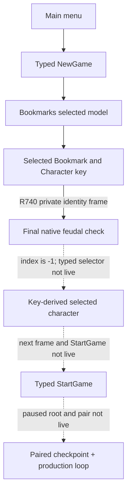
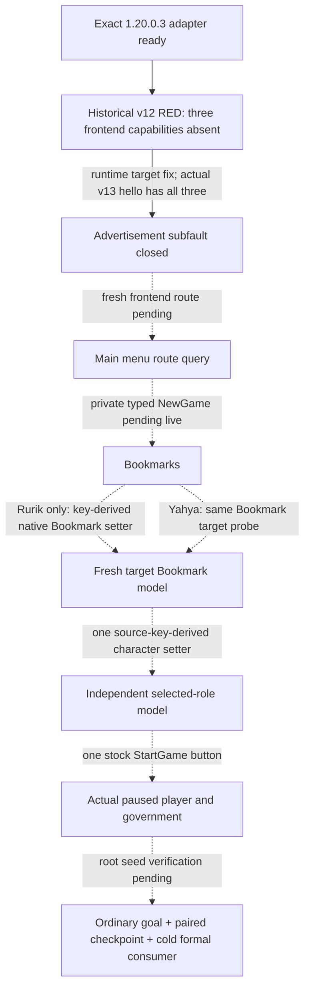

# Exact-build 1066 frontend selected model (private gate)

CK3 1.19.0.6 EXE SHA-256 `2D00FF3101EF70B566F2FCBAE292F09263199C80E9DC8F139B82D7D96F83DB86`; `frontend_bookmarks.gui` SHA-256 `C853B48F42A5A3B84208B2FC570C02F5FCB5DA217133553C6A5B70B7F8F0F267`; `00_bookmarks.txt` SHA-256 `820C8F3F5A99CF1141A21A34F0661A7300E5D12938BB3EA7EA07A84A0D3BEB14`.

The original GUI binds `map_characters` to `GameSetup.GetSelectedBookmarkCharacters` (line 193), each card to `GameSetup.SetSelectedCharacter(BookmarkCharacter.Self)` (line 240), the selected panel to `GameSetup.GetSelectedCharacter` (line 1589), and StartGame to `GameSetup.StartGame` (line 2024). The five repeated buttons in sole CK3 R719 are **widgets**, with no character key, government, or selected state. R719 official read-only artifact SHA-256 `92C3189EE4B7C0E85E2787F33E0B772BAB236291CC33CD088644CC2BB5369E3F`; it created no seed.

Original 1.19.0.6 callback registration resolves `GetSelectedBookmark` through RVA `0xF719F0→0xF6FE80` to `[setup view+0x150]`; `GetSelectedCharacter` through `0xF71150→0xF70810` uses **view+0x158**; `GetHoveredCharacter` through `0xF71B90→0xF70AF0` uses view+0x15C. `GetSelectedDate` through `0xF71100→0xF706D0` returns selected Bookmark+0x38. Selected Bookmark characters use an inline native collection at Bookmark+0x170: qword base+0, dword capacity+0x8, dword count+0xC, dword allocator identity+0x10, element stride 0x1A0. Original collection initializer/copier `0x3358EF0/0x3359030` and generic consumer `0x3346800` establish this layout; the earlier three-qword begin/end/cap assumption was invalid and was corrected before any live query or action. A candidate's `GetBookmark` getter at RVA 0x1126920 reads element+0x130, so it must equal the selected Bookmark pointer. `GetName` uses the SSO key at element+0x8, not the rendered name. `GetGovernmentType` starts from element+0xA8 but may switch to element+0xB0 after an original DLC-feature check; the final native result must decide `feudal_government`.

The BookmarkCharacter data-model callback `0xF71860` binds type table RVA `0x4028D78` and resolves the collection via the original data-model adapter `0xF79040`: `0xF79062` reads count at model+0xC, and `0xF79070` uses stride 0x1A0 from model+0. The element path `0xF78EB0` requires `0<=index<count` at `0xF78F21`, then resolves that element at `0xF78F25–0xF78F2C`. `0xF70B60` returns the model address as selected Bookmark+0x170. This is the Bookmark-specific count/bound source; the probe uses those exact fields, not a generic three-pointer vector guess.

`GetSelectedBookmarkGroup` callback `0xF71DB0→0x817F70` returns `[view+0x108]`; `BookmarkGroup.GetName` formats its script key at group+0x38. `GameSetup.GetBookmarkName` callback `0xF71080→0xF706E0` formats the Bookmark script key at Bookmark+0x18. The original StartGame path `0xF700C8→0xE321E0→0x11CE770` transfers the raw qword at Bookmark+0x38 into game setup+0x88, so the private probe preserves that raw date and waits for the original formatter to interpret it.

`frontend_bookmarks.gui` lines 2495–2496 call `SetSelectedBookmark(Bookmark.Self)` and then `ClearSelectedBookmarkGroup`. Exact core `0xF6FE00` stores a global sentinel object at view+0x108; it may also replace the selected Bookmark and clear both role indices when its predicate resolves a default. Thus the group pointer may be null, a real group, or a non-key sentinel in a valid frontend state. The private query reads its script key only as an optional diagnostic, then verifies the actual selected Bookmark+0x18 key, date, role parent, and final government independently. A setter ACK cannot prove the intended Bookmark survived the subsequent group-clear path.

Original `BookmarkCharacter.GetGovernmentType` getter RVA `0x2DAB260` runs the DLC-feature check `0x2C74B40` before choosing element+0xA8 or fallback element+0xB0. Original `GovernmentType.IsType` registration RVA `0x5759BD–0x575A48` calls `0x2C75220→0x2C6D420`, comparing the returned government's SSO script key at government+0x18. The private producer invokes the final getter only for the source-key-matched target and reads that key. A raw element+0xA8 value is not accepted as final government.

Original `SetSelectedCharacter` GUI callback `0xF71460` validates the `BookmarkCharacter.Self` model argument and calls `0xF707E0(setup view, element)`. The latter derives the index from `(element - [selected Bookmark+0x170]) / 0x1A0` and writes view+0x158; `GetSelectedCharacter` later reads that index. A future typed selector can use the **key-found native element** and that original setter, then confirm the next independent selected model frame before StartGame. The current private producer makes no setter call.

GUI global slot RVA `0x576CC68` publishes the same object constructed by base `0x203D9D0→0x3466640→0x35535A0`; the normal frontend subclass `CInterfaceApplication` constructor `0x81F4A0` then overwrites its vtable to RVA `0x4093158`. Factory `0x7F7BC0` also has a base-only mode. The probe checks the actual vtable and refuses to follow app+0x78 unless the live object is the subclass, so the base constructor's intermediate vtable `0x44F4650` is not mistaken for a ready application.

Sole CK3 R731 used source/agent commit `8ea06348f10c9dd528937b1661d39b1786c03cf4` and the private read-only official Bookmarks route. Its artifact `Z:/ck3_mod_rewrite_process_assets/g2-feudal-model-live-20260916/candidate-8ea-read-only-01/bookmarks-model-live.json` has SHA-256 `4B681991B0C9D5B2D1D5927F19DD61D4240BCAB3D91724B6305B5A9E180333E9`. NewGame, Bookmarks, the native GUI tree and private frame were real, but the model returned `gui_owner_type_unreadable`: chain vtable RVAs were `[0x4093158, 0, 0]`. The selected key/date/government and candidate count were **unread**, so no candidate or seed was established. This is a capability RED, not a legal empty model.

The exact-build owner chain explains the RED. `CInterfaceApplication` vtable RVA `0x4093158` virtual+`0x68` enters factory `0x827350`; `0x827716` stores the wrapper at orchestrator+`0x10`, `0x827737` stores the freshly constructed owner at wrapper+`0x08`, `0x3555156` stores orchestrator at application+`0x78`, and Bookmarks constructor `0xE318BA` stores `CFrontEndGameSetupView` at owner+`0x30`. RTTI COLs at `0x45C4FC0` and `0x467D328` identify the application and SetupView vtables `0x4093158` and `0x410B070`. Separate GUI constructor `0xE317C8` reads application+`0x1B8` then host+`0x58` as untyped context pointers and passes the result to `0x36E6FC0`; it never type-checks those two nodes. The R731 probe incorrectly required image vtables for both. The minimum correction keeps their pointers readable and records any vtable RVAs only as diagnostics, while still requiring the exact application/SetupView vtables, owner path, named Bookmarks root equality, selected Bookmark/character keys, date, collection parent/bounds and final native feudal government. A follow-up paused frame must verify the owner path and selected model in reality before any typed selection; public advertisement and StartGame remain off.

Original GUI base constructor `0x36E6FC0` stores the untyped third context at SetupView+`0x80` and initializes SetupView+`0x78` to null; virtual `0xF6FE90` later reads +`0x78` for GUI animation. The publisher of the nonnull +`0x78` handle and its equality to the named `frontend_bookmarks` resolver root are not statically closed. The probe keeps that equality as a real paused-frame gate; it does not infer it from the constructor or from transport ACK.

Sole CK3 R734 read-only artifact `Z:/ck3_mod_rewrite_process_assets/g2-feudal-model-live-20260916/candidate-e655-owner-read-only-02/bookmarks-model-live.json` SHA-256 `B8B5D0988B1929317CD8C4C911B2C04EF6CB5B490D0DA7E26C20A0E2614ECC13` used exact source `e655d28fc5b6701f48f996d75682b101e3330590`. The public NewGame/Bookmarks and named native tree succeeded, then the private model returned `frontend_setup_view_unverified`, with application vtable `0x4093158` but SetupView vtable `0`. The four owner pointer stages were not serialized in that version. Key, date, final feudal government, and candidate count remain unread; there is no independent seed.

Original frontend factory `0x827350` creates `CFrontendInterfaceIdler` vtable `0x40C9BD0` at application+`0x78`, `CFrontendInterfaceIdlerGfx` vtable `0x40F3A10` at idler+`0x10`, `CFrontEndInterfaceHandler` vtable `0x40F3CF0` at gfx+`0x08`, and Bookmarks `CFrontEndGameSetupView` vtable `0x410B070` at handler+`0x30`. Exact RTTI type-descriptor RVAs are `0x51B4A80`, `0x5024290`, `0x51FCE10`, and `0x5212C48` respectively. Setter `0x3555120` can replace application+`0x78` through seven frontend factories and destroys the old idler/wrapper/handler chain; a visible Bookmarks tree does not prove that the app owner chain still points to its view. The private producer now reports each live node's vtable/RTTI RVA and a distinct failing stage instead of one combined failure.

The same exact Bookmarks constructor `0xE31BDF–0xE31C28` registers its handler into the third GUI context via `0x36CF640`. Original insertion `0x36D64C0/0x36D6542` uses the inline collection at context+`0x230`: qword base, dword capacity+`0x8`, dword count+`0xC`, owner pointer at each entry+`0`, stride `0x50`. If the direct app owner was replaced, the private read-only fallback scans this current collection and accepts **only one** handler with exact `CFrontEndInterfaceHandler` RTTI whose +`0x30` view has exact `CFrontEndGameSetupView` RTTI and whose +`0x78` equals the independently named `frontend_bookmarks` root. Zero, multiple, unreadable or root-mismatched entries remain RED; registry order never selects a ruler. Any recovered view must still pass the original selected Bookmark key/date/parent/count/final-government identity gates. The R734 repair has static focused evidence only; Windows CK3/screen are reserved for the user's manual use, so a new paused replay is pending release of that resource.

`00_bookmarks.txt` lines 1481–1500 define `bm_1066_rags_to_riches`, date `1066.9.15`, and the Murchad key `bookmark_rags_to_riches_petty_king_murchad` with `feudal_government`. Its history ID is source provenance only, never a production selector. R740 subsequently observed the selected Bookmark key, element count, date and final native government in one private frame. The group key is legally null after the original group-clear path; selected-character, paused-map and campaign-root results remain unverified.

The existing native bridge `research/README.md` “State anchors and widths” section identifies `CGameState+0x08` as an eight-byte `HistoricalDate` and only its low signed dword as published `date_raw`. The private frontend producer keeps the full Bookmark+0x38 launch qword; it does not invent a calendar conversion or compare an unclassified high dword. The paused map must independently publish the actual `date_raw` after StartGame.

Exact `Date.GetStringLong` registration `0x493C0B/0x493C42` calls `0x2222910→0x2222410→0x2221FA0`. Cache updater `0x345B970` derives year/month/day from low signed raw with epoch `0x029C55C0`, 24 raw units per game day, 365 days per game year and original lookup tables at `0x4043000/0x4042E90`. For script `1066.9.15`, day-of-year index 257 yields low32 `43,800,000 + (1066×365+257)×24 = 53,144,328 = 0x032AEB08`. The high date-cache dword may still contain sentinels; the native private identity gate compares low32 only and preserves the full observed qword. A real paused Bookmarks frame must still prove this per-frame value before typed selection.

```mermaid
flowchart TD
  A[Main menu] --> B[Typed NewGame]
  B --> C[Bookmarks selected model]
  C --> D[Selected Bookmark and Character key]
  D -->|R740 private identity frame| E[Final native feudal check]
  E -. index is -1; typed selector not live .-> F[Key-derived selected character]
  F -. next frame and StartGame not live .-> G[Typed StartGame]
  G -. paused root and pair not live .-> H[Paired checkpoint + production loop]
```

The private probe reports selected indices and ABI diagnostics only. Sole CK3 R740 used exact source 0ab58c02dbe440a26a35b7840ad2595f0eae5746; the official MCP NewGame to Bookmarks route and one private native read-only frame are preserved at C:/g2f7340ab/candidate-read-only-02/bookmarks-model-live.json (SHA-256 3AEDADD0656058E3A679D551FB11D33A971E274BC2E1018B096A32D135FB0652). The frame recovered exactly one CFrontEndGameSetupView through the GUI-context registry, matched the independently named Bookmarks root, selected bm_1066_rags_to_riches, and read five distinct runtime character keys. Source-key-matched Murchad is native vector index 0 with final native feudal_government; low date 0x032AEB08 matches 1066.9.15. Group key is null after Bookmark.Self/group-clear and is only diagnostic. This closes the private model identity read-only gate for that exact frame; it does not select or start a player.

R740 also read selected_character_index=-1, so GameSetup.HasSelectedCharacter is not yet true. The next typed action must re-resolve the same unique GUI owner and current key-matched native element in an application-main decision frame, call exact setter 0xF707E0 at most once, and then query a new frame with selected index equal to that element's current index. Only then may the existing StartGame path check selected projection/start-button fireability and submit once; an independent paused-map campaign-root result plus paired checkpoint is still unexecuted. Unknown owner, changed Bookmark/key/date/government, ambiguous target or missing requery leaves StartGame OFF. Public advertisement remains disabled.

The guarded native protocol-v1 read-only step is `probe-frontend-bookmark-model-v1` (`expected_revision=0`), compiled only with `XAR_CK3_ENABLE_FEUDAL_1066_BOOKMARK_MODEL_PRIVATE_V1=ON` and absent from public capability advertisement. Its `command_result.result` carries `private_scope=exact-build-bookmarks-model-v1`, source keys, selected/hover indices, collection count/capacity, full launch-date qword and low32, final government key, `candidate_identity_ready`, and a distinct `unavailable_reason`. The controlled runner's `--bookmarks-read-only --bookmarks-model-private` option first uses the public MCP NewGame and Bookmarks-tree path, then sends exactly one private read-only pipe query. This is an acceptance interface, not a production ruler-selection or StartGame capability. The eventual public MCP mapping and `open_kaishek` impact remain dependent on the live identity frame and typed selector result.

## CK3 1.20.0.3 ordinary Clan and Tribal seed migration, 2026-10-02

The installed Steam EXE is CK3 1.20.0.3, build 25652598, SHA-256
`94b55397abb687a3dcd436805a5d885e6be90fa6c693feb44a9e3bbeeade02a6`.
M7's next government seeds exposed a concrete producer gap: the existing
private native route still used 1.19 frontend addresses and layouts, accepted
only Murchad/Robert, and required feudal government. The private runner also
rejected the new EXE's actual SHA. The following source migration addresses
that gap; historical 1.19 evidence above remains historical evidence.

The stock profiles are deliberately narrow:

| Profile | Bookmark / character source key | Expected native government | Start date |
| --- | --- | --- | --- |
| Yahya | `bm_1066_rags_to_riches` / `bookmark_rags_to_riches_emir_yahya` | `clan_government` | 1066.9.15 |
| Rurik | `bm_867_adventurers` / `bookmark_adventurers_rurik_rurikid` | `tribal_government` | 867.1.1 |

Their stock history IDs, 3924 and 40605, describe authored source characters.
They are never passed as runtime player IDs. Only the actual first paused map
and public campaign root can establish each new runtime actor and government.
The prepared profiles remain `ordinary_campaign_succession/xar_off/no-pact`.

Exact PE evidence places the new SetupView selected Bookmark at `+0x120`,
selected/hover indices at `+0x128/+0x12C`, and Bookmarks root at `+0x60`.
The Bookmark launch date moved from `+0x38` to `+0x40`; `+0x38` now contains
the Bookmark magic, so retaining the old date field would be incorrect.
The character collection moved to `+0x160` and retains stride `0x1A0`.
The native selected-character setter is `0x1060A90`, selected-Bookmark setter
`0x1060950`, and final government getter `0x321D1A0`.
The current native list of Bookmark pointers is SetupView `+0xC0`;
Rurik's Bookmark is found by its script key in that list before one setter
submission. The date updater `0x3836770` retains the established low32
encoding; expected 867.1.1 low32 is 51,394,920. Actual native model and paused
date observations must still agree after StartGame.

The common GUI resolver and dispatcher now accept an explicit
`GuiAbiRevisionV1::crozier12003` branch for this frontend. Legacy callers and
all original 1.19 constants keep their existing default. The new GUI global is
`0x5CB87F8`, named widget lookup `0x3AAB100`, shortcut activation `0x3ABC4D0`,
strict descendant `0x3A78230`, and ButtonBase slot 13 `0x3AA0D40`.
The application GUI chain and common Widget/callback field layouts retain their
old offsets. This work does not migrate Zhongguo scoreboard business readers.

The existing private feature options remain default OFF. An actual new seed
requires `XAR_CK3_ENABLE_FEUDAL_1066_BOOKMARK_MODEL_PRIVATE_V1` and
`XAR_CK3_ENABLE_FEUDAL_1066_SELECTED_BOOKMARK_START_PRIVATE_V1` explicitly ON
in the frozen seed runtime. No new CMake option or public MCP tool is added.
Only when both options are ON, the 1.20.0.3 adapter additionally advertises the
three existing generic frontend capabilities needed by the runner: query route,
inspect GUI tree, and activate NewGame. Its inherited 1.20.0.2 capability list
omitted all three, which would otherwise reject the real new-seed producer
before NewGame. The OFF and single-option paths keep the prior descriptor.
Yahya and Rurik use fixed private probe/selector/Start steps naming their
stock target. Rurik first submits one Bookmark switch and queries a fresh
model; both routes query another independent selected-role model before one
stock StartGame button submission. The original `supported_1066_*` private
fields remain compatible aliases carrying the requested profile's observed
index, government, and date; the feudal Boolean remains literal and is false
for Clan/Tribal. The private runner accepts explicit `--expected-ck3-sha256`
and leaves the historical default pin intact.

The source/fixture evidence lives under
`artifacts/g2-maintainer-2026-10-02/resume-12003/m7-frontend-12003/`:
`native-abi/`, `gui-substrate-abi/GUI-SUBSTRATE-12003-ABI.json`, and
`schema-cli/REPORT-FIELDS.json`. The Python runner's 18 targeted tests passed.
The common GUI package passed both existing legacy fixtures and a synthetic
Crozier pointer-chain fixture with MSVC `/O2 /W4 /WX`.
The model fixture passed `/O2 /W4 /WX`, including legacy regressions, the three
native target profiles, independent role requery, new registry owner fallback,
and Rurik's key-derived Bookmark switch followed by independent requery.
The route and 1.20.0.3 adapter also compiled with the same strict flags.
Five descriptor fixtures ran the actual adapter source and production
`supports` body with an isolated two-capability base stub: the original
both-ON source omitted the frontend capabilities, the three OFF/single-ON
cases preserved the base, and the migrated both-ON case added exactly the
three required capabilities. The initial attempt to link the unrelated full
GameAdapter implementation failed as a harness RED; its log is retained.
The initial isolated environment invocation and one incorrect synthetic
fixture assertion are preserved as harness RED attempts; no production
behavior was changed to satisfy the latter.

The first actual 1.20.0.3 Yahya bootstrap used frozen source
`91ede96f19e2d58fafe8a83e8331d68b57a1a0e3` and DLL SHA-256
`58a2659116e25bb0d66b4af8be3b27cbfa394adef76fda408d1df7c517aecf58`.
Its closed report is
`artifacts/g2-maintainer-2026-10-02/resume-12003/m7-clan-preparation/actual-v12-91ede96f-01/actual-native-bootstrap-01`.
After 607.388 seconds and 2,378 capability polls it returned RED:
`native bridge did not advertise frontend MCP capabilities`. The actual
1.20.0.3 adapter was ready and matched the EXE SHA, but neither
`bridge_capabilities` nor `diagnostics.hello.capabilities` contained any
frontend entry. No NewGame, private model, selector, or StartGame ran.
Authenticated cleanup completed with `cleanup_proven=true`, `tree_gone=true`,
and no remaining CK3 process. This is an actual producer integration RED;
it does not test the migrated native Bookmark ABI or give Clan/Tribal credit.

The exact cause is the production CMake target boundary:
`ck3_12003_adapter.cpp` is compiled into `xar_ck3_12002_runtime`, while both
existing Bookmark options were passed only to `xar_ck3_bridge` as private
compile definitions. The static runtime's `foreach(private_option IN ITEMS)`
omitted both options, so the descriptor's both-ON branch was compiled OFF
despite the manifest's ON option values. The isolated descriptor fixtures
above used explicit macro definitions and did not validate this production
target propagation. The two-item runtime option transfer patch is preserved
under `m7-frontend-12003/actual-v12-capability-red/`; it adds no option and
changes no native C++ code or timeout. Root owns its CMake application and the
next frozen production build. Actual hello plus the normal seed producer are
the next validation; repeating isolated descriptor fixtures cannot establish
that the real DLL advertises the capabilities.

The advertisement subfault is now closed by root's existing actual v13
Murchad hello, managed PID 8600. The archived
`artifacts/g2-maintainer-2026-10-02/resume-12003/murchad-v13-current-material-01/002-ck3_get_bridge_diagnostics.json`
has SHA-256
`1257b36b0b8ce131e899029640cc7965d93ba54747c9456c75603e1a819fd99c`.
Its exact 1.20.0.3 adapter is ready and matches the EXE SHA; actual
`hello.capabilities` contains all three required entries:
`game.command.query-frontend-gui-route-v1`,
`game.command.inspect-frontend-gui-tree-v1`, and
`game.command.activate-frontend-new-game-v1`. The retained production build
proof is `native-build-activity-develop-v13/runtime-frontend-defines-proof.json`;
v13 propagates both existing options to the static runtime target. The single
file-only hello parse is preserved under
`m7-frontend-12003/actual-v13-capability-recovered/RESULT.json`.
This establishes actual advertisement only. It makes no NewGame, Yahya/Rurik
model, selector, StartGame, fresh government, or checkpoint claim; their next
fresh producer attempts remain root-owned and serial.

No actual seed, paired save, cold restore, or succession has been established.
M7 remains open. Root must verify actual government, actor, rules, paired
checkpoint, and formal consumer/cold continuation before assigning readiness.

```mermaid
flowchart TD
  A[Exact 1.20.0.3 adapter ready] --> R[Historical v12 RED: three frontend capabilities absent]
  R -->|runtime target fix; actual v13 hello has all three| H[Advertisement subfault closed]
  H -. fresh frontend route pending .-> A1[Main menu route query]
  A1 -. private typed NewGame pending live .-> B[Bookmarks]
  B -. Rurik only: key-derived native Bookmark setter .-> C[Fresh target Bookmark model]
  B -. Yahya: same Bookmark target probe .-> C
  C -. one source-key-derived character setter .-> D[Independent selected-role model]
  D -. one stock StartGame button .-> E[Actual paused player and government]
  E -. root seed verification pending .-> F[Ordinary goal + paired checkpoint + cold formal consumer]
```
