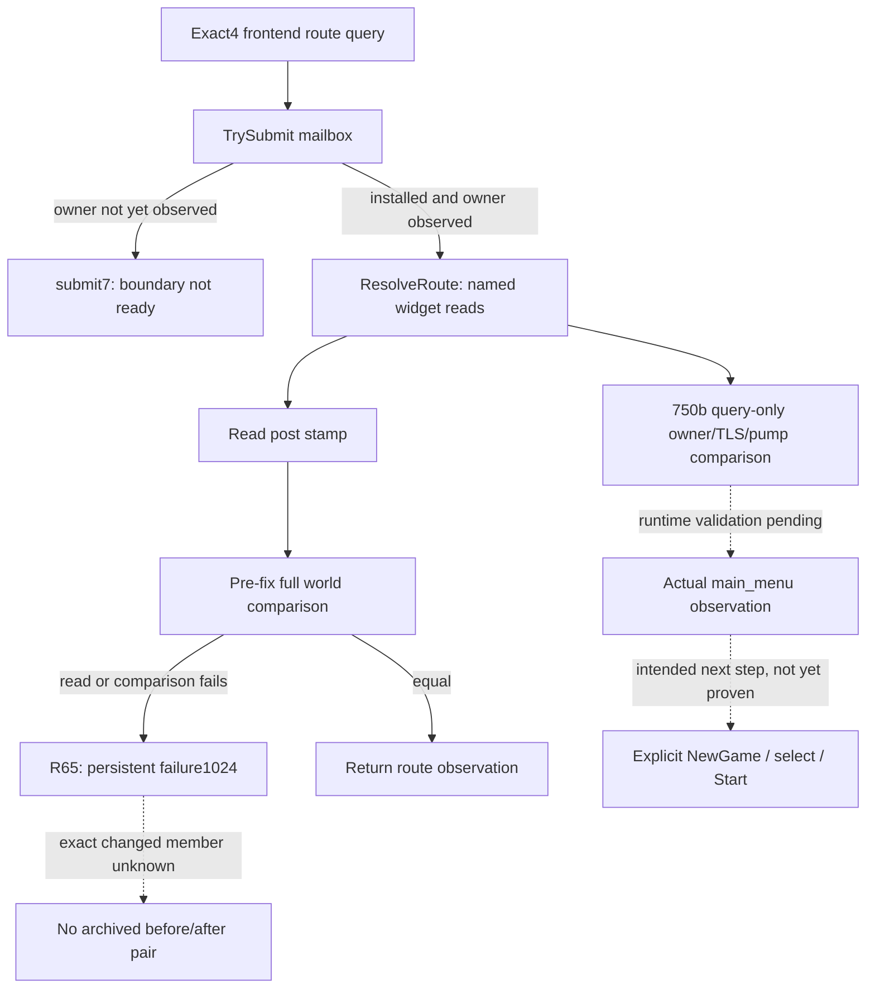

# Actual 1.20.0.4 frontend query startup drift

2026-10-07。Exact game identity：CK3 `1.20.0.4`、Steam build `25734779`、EXE SHA-256 `98702F88A547CDE2EAF29A85F93B85F68EE4CF8148336A4F7AFAEB75319DD518`。版本与哈希复用 Root 冻结记录；本工作包没有重新读取或计算 EXE 哈希。

本专题记录真实前端 provider 故障及其最小源修正，不涉及原生 AI counter-policy。原有入口见 [frontend GUI route](frontend-gui-route-v1.md)、[actual4 common GUI migration](generic-gui-default-path-migration-12004.md) 与 [main-thread query mailbox](main-thread-query-mailbox.md)。

## Actual R64 and R65

R64 在独立隔离 userdir、最小化窗口、entry14 runtime 下，第一条 `query_frontend_gui_route_v1` 持续返回 `application-main frontend executor is unavailable`，harness 没有越过等待 `main_menu` 的阶段，未提交 NewGame。该 attempt 没有保存 hello/heartbeat 与拒绝帧，故无法再确定具体 submit 枚举。保留 [R64 original RED receipt](Z:/ck3_mod_rewrite_process_assets/byzantium-867-review-20261007/real-test-state-01/artifacts/ROOT-BYZANTIUM-867-REAL-TEST.json)。

R64 debug log 同时记录 `Frontend`、`Bookmark`、带 init options 的 `Load Save` 与 `In Game` idler。不能因此声称引擎未进入地图，也不能据此认定用户普通 campaign 已 Start。frontend world 初始化可以包含默认日期和游戏对象；引起这些 idler 转移的完整源路径尚未证明。该副实例没有提供独立 867 游戏的 MCP snapshot 或 mod 效果验收。

R65 使用全新 profile02 和 entry16 runtime。entry16 的已有变更为 clock 修复，不含 frontend 修复。harness 在第一次拒绝与最终失败保存现有缓存，未为诊断追加 native query：

| 实际阶段 | 已保存事实 | 可确定的范围 |
|---|---|---|
| FIRST | `boundary is not ready`；installed=true、stop=false、failure=0、submission=true、pump=0、owner=0 | submit7，启动初期尚未观察到 application-main；不是安装失败证据 |
| FINAL | installed=true、failure=1024、exception code=0；pump8983、owner-verified7015、executor started/executed126；owner/current147324；stamp-readable、application-main-observed、submission 均为 true | 主线程与执行器实际可达，随后进入 post-execution drift 故障分支 |
| FINAL observed world | jomini/game 非零、date_raw53144352、paused=true | 当前原生 world 已初始化；不证明 harness 提交过 Start 或进入授权普通 campaign |

FIRST 与 FINAL 的不同错误是实际阶段区别。FINAL 的 SDL hook=false 不说明此时主线程不可达，126 次真实执行已经排除该解释。原始 [FIRST cached diagnostics](Z:/ck3_mod_rewrite_process_assets/byzantium-867-review-20261007/real-test-state-02/artifacts/FIRST-FRONTEND-REJECTION-WHOLE-CACHED-DIAGNOSTICS.json) 与 [FINAL cached diagnostics](Z:/ck3_mod_rewrite_process_assets/byzantium-867-review-20261007/real-test-state-02/artifacts/FINAL-FAILURE-CACHED-DIAGNOSTICS.json) 保留。副实例已由 Root 回收，不计 G2 日数或 campaign 进度。

## Actual error producer and comparison

`native_bridge/src/bridge.cpp` 的 frontend handler 调用 `TrySubmitMainThreadQueryV1`。submit7 单独输出 `application-main frontend boundary is not ready`，submit4 单独输出 busy；其余未提交状态才输出 unavailable。R64 的 unavailable 不等价于“未观察到主线程”。R65 FIRST 实际捕获 submit7；FINAL failure1024 对应后续 submit5。

`main_thread_query_failure_post_execution_drift = 1U << 10`。唯一设置点在 `native_bridge/src/main_thread_query_mailbox_v1.cpp`：固定 executor 返回后，重新读取 execution stamp；读取失败或 `SameExecutionBoundary(before, after)` 不成立，会记录1024、重置 proof 并进入 infrastructure_failed。故障位会使后续提交被拒绝。

`SameExecutionBoundary` 比较 pump epoch、thread、TLS flag address/value/context/marker、jomini/game、date 和 `left.paused == right.paused`。它**不**要求双方 paused=true。相邻 `SameVerifiedPumpIdentity` 才要求 `left.paused && right.paused`，该函数用于 paused proof，不能混为执行后比较。不能以“任何合法 unpaused frontend 都必失败”的误读扩大修正范围。

Frontend 的独立前置 owner proof 使用 thread/TLS 身份，允许 game/jomini pointee 为空，也不要求 paused world。actual4 纯 route 查询仍套用完整 world identity 的通用执行后比较，是本次 source 修正的范围。R65 没有记录失败请求精确的 before/after pair，**具体变化字段仍未知**；不宣称某个 world-create 调用就是1024的唯一原因。

## Pure query source closure

`bridge.cpp` 将 `query-frontend-gui-route-v1` 明确映射到 `FrontendGuiRouteOperationV1::query=0`，按 exact actual4 descriptor 选择 `GuiAbiRevisionV1::crozier12004`。`ExecuteFrontendGuiRouteMailboxV1` 对该 operation 在 `ResolveRoute` 后直接返回，不进入 NewGame、Select 或 Start 分派。

`ResolveRoute` 的命名根查找调用实际 `.4` finder `0x3AAB0E0`，GUI global 为 `0x5CB87F8`。完整392B finder、chain `1B8→58→3D0→8` 及 widget flags/children/name 复用 [COMMON-GUI-SOURCE-READY](Z:/ck3_mod_rewrite_process_assets/g2-background-20261007/generic-gui-12004/COMMON-GUI-SOURCE-READY.json) 和 [whole finder mapping](Z:/ck3_mod_rewrite_process_assets/g2-background-20261007/generic-gui-12004/initial-map/generic_find_top_named_widget-DETAIL.json)。现行 query 没有误用 legacy finder 的源证据。局部树遍历与 runtime flags/name 读取不分派 GUI action。

对 bounded production startup 的读取覆盖 `WorkerMain`、`DllMain` 与两项 `FEUDAL_1066` compile flags 的生产 uses。已读 uses 为 capabilities、显式 request 匹配、operation 选择和 result formatting；没有发现 compile flag ON 就自动 Start 的路径。`runtime.launch` 实际传入 continue_last_save=false，未给 load_save_name；其 resume helper只完成注入与恢复 suspended primary thread。以上是限定路径结论，不冒充全启动系统审计。

## Adopted source change and scope

Root adopted `750b8c51f2d3e477502bd9cddec52a47f7f6c7f6`：仅 actual4 production typed frontend context、operation=query，执行后使用现有 `SameOwnerVerifiedPumpIdentity` 加同 pump epoch；post stamp 仍必须可读。其他 frontend actions、ingame UI、gameplay executors 与 synthetic offline mailbox fixtures 保留原完整比较。没有新增 capability、schema、header layout、CMake flag、SDK query 或限制。

截至本专题源交付，状态为 **source adopted / static-ready candidate**；该修正的 production compile 与 runtime FIRST 尚未由本工作包获知，不写 frontend production-live GREEN。R64/R65 RED 保留；无 mod 效果、867 开局或截图验收信用。

## Necessary next operations ledger

以下只列实际独立867路径涉及的既有子操作，不因它们共用 executor 而统一改变 execution boundary。

| Operation | 已有真实源调用 | 本轮处理 |
|---|---|---|
| query=0 | `ResolveRoute`，随后直接 return | 750b query-only source 已采用；等待 Root FIRST |
| open_new_game=1 | `DispatchOpenNewGame`→main_menu 的 `new_game_button`→固定 native GUI dispatch | 源证明是显式 action；是否同一调用内改变 stamp 字段未知，保留原比较 |
| probe_bookmark_model=12 | `InspectBookmarkModel`→`ProbeFrontendBookmarkModelV1` | 读模型、无 action；未出现其1024实际失败，不扩大本轮修正 |
| select_supported_bookmark=18 | `DispatchSelectSupportedBookmark`→`SelectSupportedBookmarkV1` | 原模型 setter/ACK/新帧验证保留；尚无 source 证明必改变 GameState stamp |
| select_supported_1066_character=13 | `DispatchSelectSupported1066Character`→`SelectSupportedFeudalBookmarkCharacterV1`，目标由现有 seed profile决定 | 原候选角色与模型身份验证保留；并非自动 Robert bootstrap |
| start_selected_bookmark=11 | 当前选中模型资格→`DispatchFixedNamedWidget`→bookmarks 的 `start_button` | GUI source 对应 StartGame，但同步/异步 world transition 时序尚未闭合；不推断必然1024 |

可施工入口是 Root 使用 query-only 新 runtime、全新独立 userdir，先取得真实 `main_menu`，再按原 recipe提交一个明确意图的下一 action并读回。若该真实前端 action 发生1024，或原生调用链明确证明它在返回前改变完整比较字段，再对该 typed actual4 operation 作最小必要修正。此 ledger 不要求新矩阵，不重跑既有 Events/Window/Phase/Pending 资格，不扩大 ingame UI/gameplay 比较范围，也不因理论风险新增门禁。

本专题 worker 执行：build/test/import/SDK query/game launch/EXE read 均为0；共享报告未编辑。Root 负责编译、实机结果、提交推送与日报/周报合并。
