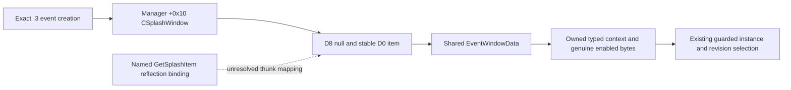

# Fullscreen event context on CK3 1.20.0.3

The generic native bridge owns this observation capability. The mod suite supplies its frozen profile and consumes the existing `ck3_query_profile_event_window_v1` and `ck3_select_profile_event_option_v1` tools. This package changes the native read path and bounded Python presentation waits; it adds no selection command, address input, GUI fallback, or mod-specific decision rule.

## Actual failure and cancelled workaround

The suite's three-mod R2 query, `native-client-0006.json`, returned `event_window_not_materialized`, with no ordinary window match, while a fullscreen startup event was displayed. The exact installed 1.20.0.3 executable retains the ordinary idler and window anchors. Native event creation instead places a `CSplashWindow` in manager `+0x10`; the previous reader inspected only the ordinary vector at `+0x18`.

`active_event.option_count` is an authored count. The legacy `normalize_active_event()` projection can create option slots with `enabled=True`; `source=native` does not change that fact. The proposed singleton workaround was cancelled before implementation. The policy continues to require actual materialized window options, genuine shown/enabled data and strict instance/revision selection.

## Exact native contract

The build is 1.20.0.3, Steam build 25652598, EXE SHA-256 `94b55397abb687a3dcd436805a5d885e6be90fa6c693feb44a9e3bbeeade02a6`. The [manifest](../../ck3_autonomous_player/native_bridge/research/ck3_1_20_0_3_fullscreen_event_context.json) is independently checked by [the offline verifier](../../ck3_autonomous_player/native_bridge/research/verify_ck3_12003_fullscreen_event.py). It binds exact PE identity, 130 decoded instructions, three vtable prefixes, five function spans, 20 RTTI bytes, 87 constants and four source hashes. Hash policy is Git LF bytes, retaining any BOM.

| Object | Native field | Meaning and guard |
| --- | --- | --- |
| Event manager | `+0x10` | Optional splash pointer, exact `CSplashWindow` primary vtable `0x4596D38` |
| Splash window | `+0xB8/+0xC0/+0xC4` | Item vector data/capacity/count, bounded by the existing 32-window limit |
| Splash window | `+0xD0` | Selected item; must occur exactly once in the vector |
| Splash window | `+0xD8` | Pending transition item; any non-null value rejects presentation |
| Splash item | `+0x00` | Owner must equal this splash window |
| Splash item | `+0x08` | Copied active-event pointer; instance and definition must agree with current event |
| Splash item | `+0x10` | Shared `EventWindowData`, constructed through `0x18502F0` |
| Rendered option | `+0x1B0/+0x1B4` | Original native option index and actual enabled byte |

The selector at `0x1822230` reads/writes `+0xD0`, clears `+0xD8`, then materializes selected-item data through `0x1850D60`. The click path writes the pending `+0xD8` slot; GUI `EndTransition` completes selection later. The reader compares splash observations before and after identity/scope decoding, denying any change. Queued items are never treated as presented buttons. Ordinary and splash matches together must be exactly one. Type, vector, owner, event, root/saved-scope and snapshot checks remain mandatory.

Installed `gui/event_windows/fullscreen_event.gui` binds `SplashWindow.GetSplashItem`, then `SplashItem.GetEventData`, and `EventWindowData.GetOptions`. Its SHA-256 is `6bf3c22041c36c98a02de78ed80bf0a9e5defb8c2a5681b71209cfb71127f219`. Native selector/materializer semantics support the selected-item layout; the complete named reflection-getter-to-thunk mapping remains unresolved. This package does not claim that mapping is independently closed, nor that rendered-vector membership proves pixel clipping or animation visibility.

Popup admission uses the actual server-owned adapter descriptor SHA. Only the exact .3 executable enables splash reads. The .2 binder retains ordinary-window behavior and skips the splash field; unknown hashes disable the reader. Internal reviewed-.2 ABI aliases are not used to authorize this new .3 observation branch.

## Frozen n2 option budget and layout refusal

The later [nullable-scope n2 epoch](nullable-saved-character-scope-1.20.0.3.md) retains a 64-option budget. Read-only review used the frozen reader at `C:/cb123n2`, SHA-256 `c858d713a42c4959485a8384b6b6002d87dca83c8d63319520c6520e7bc90263`, rather than treating the latest source as the loaded DLL. `ValidVector` requires `0 <= count <= capacity <= 64` for both rendered and authored option vectors, with non-null data when count is positive (reader lines 226–230 and 678–693). Even a smaller count fails if reserved capacity exceeds 64. The Python context list and profile selection ordinal also remain bounded at 64.

Ordinary-window admission requires a non-null object and the exact bound `CEventWindow` primary vtable (lines 757–765). This reader does not route by GUI type names. A failed ordinary-window check returns the merged `event_window_layout_invalid` reason (lines 949–956): possible failures include that object/type gate, either option-vector gate, owner/index/Boolean checks, authored-option pointers, duplicate indices, strings, effect indicators or allocation. The shared data decoder is also used by the splash branch, which reports its own layout-invalid reason.

An authored set of 70 options exceeds this frozen reader's support if the matched native vector carries that count. The merged reason alone cannot establish which predicate failed first, or distinguish a type/layout mismatch from that budget. Nor does `window_match_count=0` establish absence of a matching window: the decoder increments a temporary candidate before option checks (line 674), while the count is committed to the published output only after layout checks pass (line 978). An early layout refusal can therefore publish zero after reaching an instance match.

The outer `native_event_query_verified` status confirms the guarded query completed; an inner unavailable context still supplies no verified options or decision semantics. Layout refusal remains outside the rendering-wait allowlist. No authored-count or synthetic-enabled fallback follows. A separately reviewed [desktop semantic action](reviewed-desktop-semantic-action-mcp.md) has its own ACK and independent old-instance/state readback contract; it does not qualify the native preview or remove the original RED.

The ignored review receipt is `_runtime/native-n2-event-layout-budget-review-001.json`, SHA-256 `5324234c77975667a184ca6a2be3650c9ce00b6d700352fe630bde35b06123c1`. This is frozen-source interpretation, with no new tests, memory reads, native build or live operation. Existing n2 qualification is unchanged. Custom event/GUI definitions, choices and private artifacts remain in the independent project; the reusable budget and diagnostic limits belong here.

## Bounded read-only rendering wait

The generic campaign policy previously stopped on the first unavailable presentation. It now waits for at most `CampaignConfig.postcondition_timeout_seconds` (default 20 seconds), including slow query/snapshot calls, only when a verified query for the bound instance returns precisely `event_window_not_materialized` or `event_splash_transition_in_progress`. Each retry obtains a guarded native snapshot, requires actual paused state and uses its fresh revision. A changed event is returned to the outer loop for a new identity binding; no selection is replayed.

Every query and wait observation is recorded. Layout, scope, type, identity, guard and unknown failures stop immediately. Timeout or lost pause stops without a selection. Once presentation is ready, the existing real-option filter and strict select postcondition still apply. Synthetic active-event options and authored counts are never used as an alternative. Missing localization remains outside this package's failure criteria.

## Qualification and limits

The final scope is registry admission, adapter/read, commands/pause/resume/speed/save, context/map, events, event-window context including popup and transition guards, thread runtime and semantic adapter, plus the patch3 semantic worker: nine scoped native tests. This is not all-target/all-CTest qualification. Python policy fixtures are a separate receipt and do not establish native ABI or live gameplay.

The earlier prototype source/build directories and receipts remain preserved as superseded RED evidence: the first lacked the later independently established transition guard; the second contained incorrectly transcribed instruction operands caught by the offline verifier; the third did not yet isolate popup admission from the legacy .2 path. Frozen directories are never modified to resemble the final source.

The [research plan](fullscreen-event-context-1.20.0.3.plan.json) records the paused cached-GUI observation contract. The diagram distinguishes static source semantics from the unresolved reflection linkage. `open_kaishek` is not applicable to this exact PE ABI/native reader/Python transport work; no CK3 mod script is changed. R2 remains an actual unavailable-context RED, and R3's preattach startup crash is unrelated evidence requiring its own review. Live correctness of the new read path remains pending a separately authorized cold run and genuine query/select readback.

## Frozen production and independent fixture repair

Production source was frozen at `C:/cb123p4` from main commit `dcd61a5b7d6b94536cab3b0272e220d8f211b1b9`, plus six explicitly hashed window-package overlays. The complete native tree contains 2,758 files, digest `2b786dfe92de59d52c51504b9ade5eaa2b9c8b0470ab7601f006ebed8e33040d`. The separate production fingerprint is `4f381c295c83cc63a265bc80e6533546d39d9ee2a6633d77b2077968c36da739`. The source-binding JSON hash is `f19dd0637ebf9e9aec5ce47926124d66c46f26f94721ce31962e7b238359321a`. The frozen manifest hash is `cc511fbeee2b23c003e256d7ca4358491f0a8683d6e8bd694282e4bd9a6b90bf`.

Fresh Release Ninja/MSVC production build completed in 401 steps with two compiler jobs and default private options OFF. Its first scoped fixture run was genuinely RED, 8/9: the added final test changed speed to 1 while retaining the actual Jomini paused byte at `+0x20`, so the production reader correctly remained paused. Line-number diagnostic replay identified that sole assertion failure. The repair clears the actual pause byte; it changes only the fixture. Production DLL, reader/header, dispatcher and frozen directories were retained unchanged.

The corrected fixture is frozen separately at `C:/cf123p4q/ck3_12002_event_window_context_test.cpp`, SHA-256 `ce1f4d29c3a1defcab8d683be9d102f851be64a0d5377609af6f578b58713222`. It links the original p4 runtime library. A new CTest directory `C:/cn123p4q` invokes the original nine registered command definitions, substituting only this corrected fixture executable: 9/9 PASS. Required Ninja header dependencies and the unchanged production fingerprint were checked afterward. The original p4 RED remains intact.

| Qualified production artifact | Bytes | SHA-256 |
| --- | ---: | --- |
| `C:/cn123p4/xar_ck3_bridge.dll` | 4,075,008 | `4b157f5eaffa1841b8c7563f41bd02e701df074a3480a3cac077d930c2a60c44` |
| `C:/cn123p4/xar_ck3_bridge_injector.exe` | 39,936 | `bcdd0400799074353d89d048309695c8367e8328bf713cd0cd8b1e6155d1e87e` |

The DLL's exact .3 descriptor/EXE strings and transition-unavailable token were checked. After fetch/rebase, later upstream commit `af1ba8e22` changes adjacent feast provenance and campaign-root diagnostics. Those later native changes were not compiled into p4. The popup reader/header and unique event-window dispatcher branch remain byte-equal to frozen p4; the corrected fixture and current canonical manifest have their own identities. The current manifest binds the rebased source, hash `e09ca799e6f7ada354b6b32ab51bd974ba1e7d6ac3a4fc69fe089f54c84c52a7`; exact installed-EXE offline verification again passed. This separates frozen production qualification from the consuming Python HEAD.

Policy fixtures: 36/36 PASS. Rebased Python checks separately passed 48 tests: profile/postwait 22, campaign projection 7, campaign-root diagnostics 11 and feast MCP wire 8. Actual paused/read options on the user's next cold run remain unverified here. Historical C4 full-build RED is not overwritten.

Ignored receipts are under main `_runtime/`: `native-12003-popup4-source-bindings.json`, original `native-12003-popup4-scoped-qualification.json` RED, `native-12003-popup4-fixture-overlay-qualification.json` GREEN, `native-12003-fullscreen-offline-004.json` frozen ABI, `native-12003-fullscreen-offline-006.json` rebased ABI, `fullscreen-policy-tests-003.json`, and `popup-postrebase-python-001.json`. The combined final receipt is `native-12003-popup-final-qualification.json`, SHA-256 `7f2566a68c2c2bebc98493fde8c35e60a61dbbaa113e4ef1edd6623143ed540c`. The fixture-overlay receipt hash is `642c7a9d2cfbcdee83cd573bdc39ee4dc12619acbd343e72a6e20bf6eb2baab6`.

## Consumer handoff

The existing nine-field native bootstrap profile remains unchanged: `schema_version`, `guard_profile`, `guard_profile_sha256`, `userdir`, `state_directory`, `evidence_directory`, `game_version`, `dll`, `injector`. Use version 1.20.0.3 and the qualified artifact paths/hashes above. Root owns fresh exact process/build/userdir, dual Steam process offline continuity, foreground/lease/crash and initialized paused guards; it alone starts or attaches the cold run. Persistent official `Client(..., cache=None)` stays alive through its queue. Native event selection remains one guarded instance/revision command with actual old-instance exit readback; no synthesized enabled state or GUI fallback was added.

`await native_campaign_autoplay.run(native_client, config, pause_provider=controller_client)` remains the public Python entry. The seven-field independent clock-pause profile, fixed scan-code driver and distinct controller identity remain unchanged. Root binds the final pushed Python HEAD and actual three consumer file hashes separately from the p4 production epoch. Source and fixture qualification do not authorize attach or establish any elapsed simulation year.
