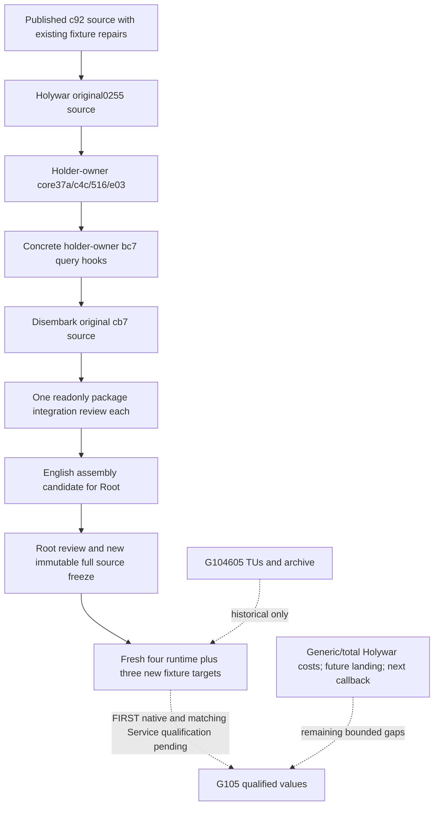

# G105 Holywar, holder-owner relation and Disembark source assembly

This candidate integrates three source packages into a new sparse C worktree based on Root's published `c92d160e75fd179a39694d872e914668118b6005`. It inherits the existing G104 fixture corrections and actual runtime history. This assembly has not been built, tested, queried or run in CK3. The new G105 source and compiled-input closure must be frozen and qualified independently; G104's605 runtime TUs and archived binaries provide no G105 qualification.

The original package pins remain separate:

| Package | Original source commits |
| --- | --- |
| Ordinary Holywar selected context and CB costs | `0255ceae01b0f5b2cc203e6a55d04f87dc86979f` |
| Selected title holder-owner relation core | `37a734b2bbff9d228a994995a46b45e438302338`, `c4c14b8bb767ab5850705b0f8681a40a01216bb7`, `5164ea47b331df16d77ba8b62646085f69418f43`, `e03d6d9e9ec8dcebf09b9de07d66ce9f4ac6aa43` |
| Selected title holder-owner concrete hooks | `bc7b781aba605b1bdcd064d9ea974a2ba6fc87b2` |
| Current Army Disembark penalty days | `cb7f5f06dd112e9444447396d2593b2a5544162b` |

The Holywar package extends the existing selected-context query with a native CB-only ten-resource vector. The actual selected additional role and claimant fallback remain explicit. Generic and total declaration costs remain outside this bounded value. Its original leaf adds two runtime translation units and one native whole-mailbox fixture. The new declaration-context option defaults OFF and must be explicitly ON for G105. The original leaf registers no CTest and binds no output directory: Root must choose a fresh precreated directory for the five native wire samples and can register a CTest during formal integration. No registration is invented by this assembly.

The holder-owner package adds an optional `current_selected_title_holder_owner_relation_v1` family to the existing ArmyStrength query. It reuses the captured post-admission refresh receiver and publishes the actual selected title/holder/Unit-owner relation. Its exact `.3` binder selects the source-closed readonly `28B2820` predicate. The core precedes the concrete query hooks. The actual shared serializer is `army_strength_v1_serializer.hpp`; the older package recipe's `army_serializer_v1.hpp` name is stale. Its collector runs once from the shared query capture, and the owned result is copied to the selected rows. No refresh write, changed selection, next occurrence or full callback is modeled by this current observation.

The Disembark package adds optional `current_disembark_penalty_v1` and the matching per-selected-row Service projection to the same ArmyStrength query. It uses the exact `.3` readonly getter `24AA240` with the existing resolved actual CArmy receiver. Signed int32 values, including0 and−1, remain observations without clamping or sentinel substitution. An omitted legacy field remains compatible. Active/expiry predicates and future route landing dates remain separate.

The shared edits were merged additively. README retained Root's actual Army recovery history and both new topics. The absent holder-owner topic was retained from its native source commit. The binding conflict retained the existing detachment member and appended the new holder-owner member after it. The CMake conflict retained both new leaf includes. Existing unrelated DTO/query/Service families and the prior fixture corrections remain inherited from c92; no whole-file replacement restored an older base.

The sparse tree physically includes `ck3_autonomous_player`, `tools`, `ck3_workshop_mcp/src`, `workshop` and `XenoAmess_s_Eternal_Recurrence`. The SDK registry source and mod descriptor are required real inputs; preparation does not substitute a fake registry or an already-attached Service result. The formal Root-only helper retains the reviewed BASE18/v73 compiler-input and archive mechanics, derives current counts from the new compile, uses64 jobs/BelowNormal with `/W4 /WX`, and builds only the four runtime and three newly declared fixtures. It keeps the baseline explicit65ON50OFF, retains challenger OFF and adds only the source-required Holywar ON. Fixture execution and consumer qualification are separate Root-owned steps.

Preparation and conflict integration began on October6 before midnight Asia/Shanghai. The final assembly review and delivery occur on October7; neither date is presented as new game progress or live evidence. The external package manifests, source provenance, conflict receipt, actual assembly pin and report fields are kept under:

`Z:/ck3_mod_rewrite_process_assets/g2-background-round34-20261006/joint-three-source-g105-preparation/`

Read the individual source topics for the numerical and ABI frontiers: [ordinary Holywar CB costs](ordinary-holy-war-declaration-costs-12003.md), [selected title holder-owner relation](army-selected-title-holder-owner-relation-12003.md) and [current Disembark penalty days](army-current-disembark-penalty-days-12003.md). This assembly remains an unqualified implementation candidate until Root's new native and complete Service results exist; paused Robert29829 production evidence is a later, separate boundary.
