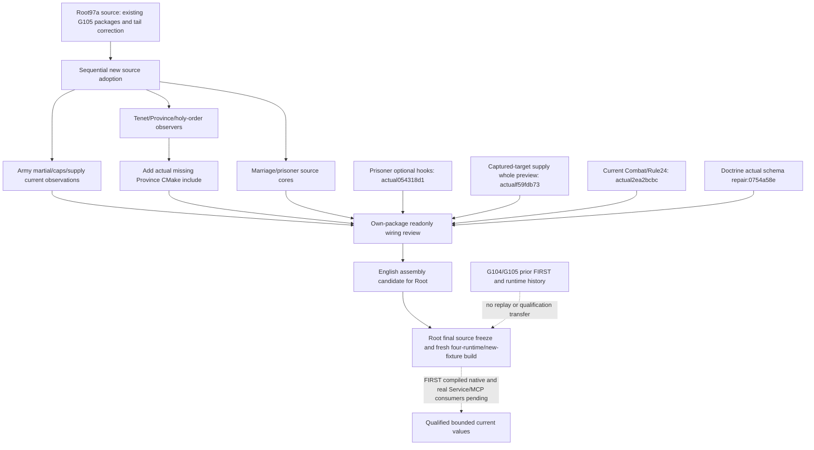

# G106 current-input source assembly

This independent sparse C source assembly starts from Root's exact `97a2a77da0359ceb1215e1ee8ce57831cda5f531`, retaining G105's three packages and Disembark aggregate-tail correction. It integrates newly delivered implementation sources for current commander martial, current warscore caps, supply inputs, Tenet knowledge, Province73C classification, holy-order hire cost/current reinforcement, first-heir marriage observations, prisoner release/kinship observations and current Combat/Rule24 inputs. G105 is being built separately by Root; this source assembly does not replay or borrow its native or live qualification.

Original package pins remain separate from Root's later integrated/frozen HEAD:

| Package | Original source |
| --- | --- |
| Assigned current commander martial | `874a657c9a1804425678370a7e2865cc880b1242` |
| Current warscore caps | `bb6f1dc0788e573bea7469db3e9cc8fd02ce51a0` |
| Current supply dispatch and month-first refill | `3cbffaf59e167b64a1ae7d7a08aad40fcfedbc15` |
| Tenet knowledge catalogue | `0c4e795fae26ddbaedc688fdf8cd3d37ea6b6e25` |
| Current Province73C classification | `3b7c6be14aea976ece3ab5f8d95401e1a329d494` |
| Holy-order hire cost and reinforcement | Original `625b2cf1` then `e5f966ee`; full pins are retained in the package source manifest |
| First-heir marriage lifecycle and paired fertility | `2d0ad369c97b698b58a583360a24b49b2522e1aa` then `04c48596a715ad1f47f85fff74b017c931110992` |
| Prisoner negotiated release and native kinship core | `840d0d9949a0d658f2ef4370d6911b3d13eaa5aa` |
| Prisoner negotiated optional hooks and whole fixture | `054318d1323f6e4c31507d755effa7b08b3ebf04` |
| Captured-target supply whole preview fixture | `f59fdb7307e64a56c8c197e5c6ae8723c82afd9b` |
| Current Combat roles/phase and Rule24 source pins | `2ea2bcbc8fa631679688a6a0f3b9fa8768e6c1c4` |
| Doctrine knowledge exact-build schema selection repair | `0754a58e4343e651883a92174316d49be52d25d7` |

The original martial commit was in an independent local clone rather than Root's object database. Only its exact supplied local HEAD was fetched from `C:/codex-ck3-background/parallel-integrations-20261006/current-commander-martial-source`; no source/catalogue scan or game file read was needed. Other package commits were directly available. Shared hooks are merged sequentially in this isolated tree. Existing holder-owner/Disembark binding members are retained before new supply members, preserving the prior aggregate prefix. README conflicts retain both Root's history and the new package topics.

The Province package adds a native fixture leaf but its original parent CMake did not include it. This assembly adds exactly `include(cmake/current_province73c_classification_12003.cmake)` beside the existing roster-admission leaf. Its five observations belong to the existing AdmissionGate and exact `.3` callback binding, with no new top-level query traversal. The original package pin remains unchanged.

Source target counts are derived from actual CMake, not from the number of packages. Martial has one native target; caps one; supply dispatch/refill two; Tenet one; Province one; holy-order hire/reinforcement two; current prisoner kinship one. The three delivered follow-ons add one target each for prisoner negotiated preview, captured-target supply whole preview and current Combat/Rule24. The final Doctrine schema repair adds one target: thirteen new fixture targets in total. Marriage adds no new native target but includes a changed existing fertility wire publisher. Its original relationship case was already GREEN and is not replayed; the changed fertility inputs retain their separate original NOTRUN boundary.

The Doctrine repair addresses a concrete existing exact-build mismatch: the dynamic normalizer accepted a valid `.3` learned/by-key DTO, then the requested-mode check compared it to the literal `.2` schema. The one-line production change selects the existing build-aware schema helper; it adds no query, argument, getter or action gate. Five new whole native inputs and one sole registered consumer are prepared, with FIRST still NOTRUN.

The Combat source originally inserted new data members into three existing aggregate prefixes. This assembly moves only those members to the ends of `CurrentArmyFlag31Bindings12003`, `ArmyBindings` and `ArmyFlag31OccurrenceV1`, retaining the proven aggregate-initializer compatibility correction used by Root for earlier actual failures. The scoped Army-package review also identified three new ArmyStrength supply/Combat optionals and the new BattleControl warscore-cap optional ahead of existing members; those four additions likewise move to their structures' tails. Named-member getters, serializer semantics, fixture cases and CMake remain unchanged. No additional audit or test was introduced.

The sparse source includes autoplayer source/tests/tools, `tools`, actual SDK registry `ck3_workshop_mcp/src`, `workshop` and the mod descriptor source. The formal projection will retain the reviewed BASE18/v73 input inventory and archive mechanics, actual explicit profile,64 jobs/BelowNormal and `/W4 /WX`. It includes four real runtime targets and only the newly delivered fixture targets with literal CMake output/argv metadata. Actual TU/input counts are derived from the fresh build, not guessed from an earlier batch. No helper automatically runs tests or consumers.

All work here is source preparation on October7/W41. Root owns main-tree integration, final native/Python source freeze, actual FIRST commands, eight shared reports, publication and game operations. The package topics and external source/FIRST manifests retain their own branch-local unknowns and current-versus-future boundaries. No CK3, Steam, SDK, process, live memory, test or compiler was operated by this assembly owner.

External preparation and delivery root:

`Z:/ck3_mod_rewrite_process_assets/g2-background-round35-20261007/joint-g106-source-preparation/`
