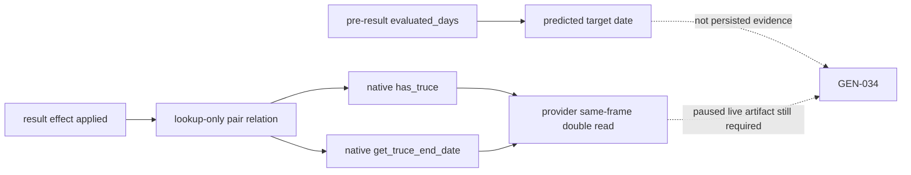

# G2 actual truce expiry: exact-build read-only candidate (2026-09-04)

Status: **static-ready / compiled candidate / live-pending**. No CK3 process was
started, attached to, or mutated while producing this package. The CMake option
`XAR_CK3_ENABLE_G2_ACTUAL_TRUCE_EXPIRY_CANDIDATE_V1` defaults to `OFF`; therefore
the ordinary bridge does not advertise this capability.

## Frozen build and static chain

- CK3: `1.19.0.6`
- `ck3.exe` SHA-256:
  `2D00FF3101EF70B566F2FCBAE292F09263199C80E9DC8F139B82D7D96F83DB86`
- size: `95,206,008`; image base `0x140000000`; image size `0x5C2D000`;
  PE timestamp `0x6A1EEE6D`
- machine-readable contract:
  `native_bridge/research/g2_actual_truce_expiry_v1_abi.json`

The normal `CAddTruceEffect<0>::execute` body (`0x2EDAD20..0x2EDB27C`) calls
the pair-relation get-or-create routine at `0x26108F0`, evaluates duration at
`0x3373000`, selects owner-direction slot `relation+0x28` or `relation+0x58`,
writes the resulting date there, and calls expired-slot cleanup `0x2367C00`.
The forced specialization (`0x2EDB3A0..0x2EDB9A5`) follows the same chain.

The post-application read chain is distinct:

- `0x26631E0` is the native one-way `has_truce(owner,toward)` predicate. It
  calls the lookup-only pair-relation routine `0x2610840`, selects the same
  directional slot, and compares its date with the native no-date sentinel.
- `0x2663250` calls the same lookup-only routine and returns the persisted date
  object for the same directional slot.
- the script trigger named `has_truce` is registered from the exact string at
  `0x43AC098`; its evaluator (`0x28852E0`) resolves the target and calls
  `0x26631E0` at `0x2885404`. This independently identifies the predicate.

This closes the static identity of the native stored-date getter without
directly reading undocumented relation-object fields in provider code.

## Temporal distinction

Before result application, `evaluated_days=1825` plus the execute-body formula
can only predict a target date. It is not evidence that a relation row was
created or that another native rule did not replace/clear it. After result
application, the new query asks CK3's own one-way predicate and date getter for
the persisted relation state. Only the latter can make
`actual_expiry_observable=true`.

## Candidate API and fail-closed rules

Capability template:
`game.command.query-raiktor-actual-truce-expiry-v1-N`, where `N` is the frozen
full-generation opponent `CharacterID`. The owner cannot be selected: it is
always the current living played character. There is no script-variable name,
raw address, arbitrary character owner, or arbitrary relation field in the
request.

The response uses temporal semantics
`post_application_persisted_relation_state`. Readiness becomes true only when:

1. the map is paused and the played character is alive;
2. both generation-safe character handles resolve;
3. two native `has_truce` observations are true;
4. two native end-date reads agree;
5. the full semantic snapshot is identical before and after;
6. the persisted expiry is later than the observed current date.

An accepted command-result frame is only query transport acknowledgement. If
the predicate reports no truce, the provider returns typed `no_truce`, null
expiry, and `readiness=false`; ACK cannot produce GREEN.

## Next live checkpoint

Build the opt-in candidate, use the retained exact post-surrender branch, pause
after the termination result has been applied and the old WarID has vanished,
then issue the query twice for the preserved primary defender CharacterID at
one native revision. Retain both raw frames, heartbeat identity, process/DLL
hashes, and cleanup evidence. Until those frames agree with a future persisted
date, `actual_expiry`, the full surrender decision/action, and `GEN-034` remain
false.
