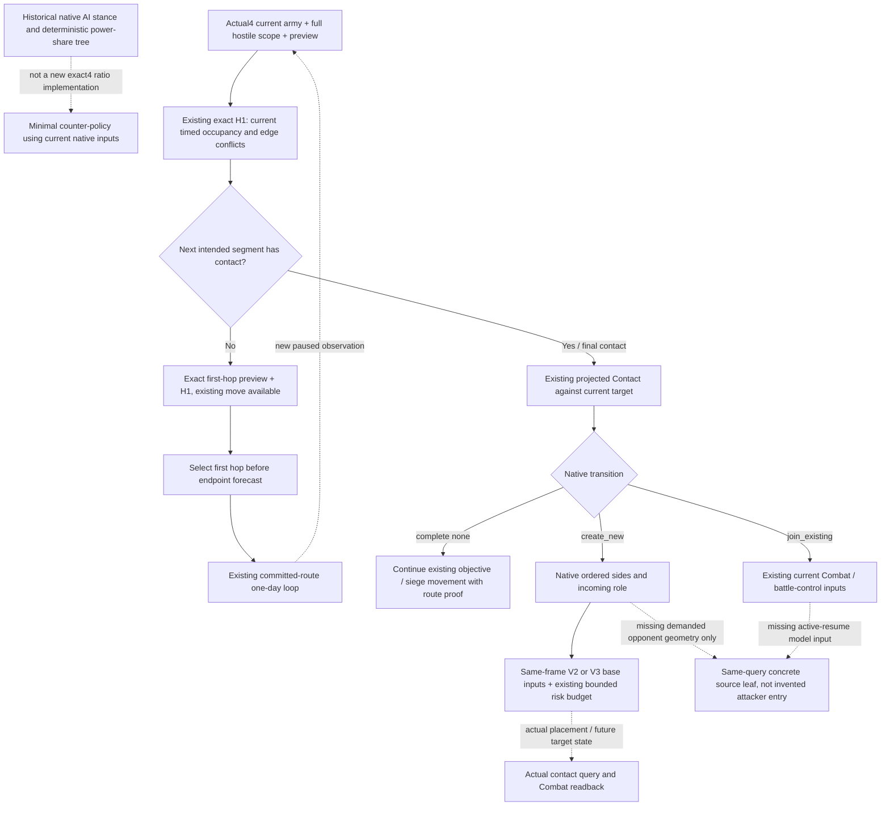

# G2: current contact versus a contact-free first hop on 1.20.0.4

Source-only recipe, 2026-10-07 / 2026-W41. Source base is `14f07ade00e9ad359da3aa6af3642592ede3f48d`; current Root runtime is entry19. Exact native build is CK3 `1.20.0.4`, Steam25734779, SHA `98702F88A547CDE2EAF29A85F93B85F68EE4CF8148336A4F7AFAEB75319DD518`. Root supplied original Robert29829, paused raw date53288448, ordinary save H9638 and saved total6005. This package does not read a fresh gameplay response, choose a numeric opponent/target, execute a query/action, or award sideR68 any G2 credit. Earlier enemy134218098 at2606 is a dated scene, not a current input.

The immediate useful change is to let the existing exact contact-free first-hop branch run before the distant endpoint battle forecast. Genuine endpoint contact continues to use the bounded estimate and its existing risk budget. `monte_carlo_ready` or complete native parity is not an added prerequisite for ordinary contact-free movement or siege travel.

## Native input tree and version boundary

[Army controller](army-controller.md), [combat prediction](combat-prediction.md) and [contact resolution](army-contact-resolution.md) preserve the exact historical1.19 native AI tree: stance/objective selection and deterministic estimated-power-share admission decide a destination; native movement places units; the local contact resolver independently selects an existing Combat or ordered new opponents. The estimated-power share is neither a simulated win probability nor bare soldier ratio. Those pages' historical thresholds, RVAs and stance semantics are not asserted as newly mapped .4 predicates. Reimplementing the full AI predictor is unnecessary for the bounded policy below.

The current .4 source authorities are [Contact migration](existing-contact-phase-migration-12004.md), [H1 restoration](route-contact-horizon-12004-restoration.md), [arrival bindings](battle-reinforcement-arrival-bindings-migration-12004.md), and [projected Contact](projected-contact-scope-v1-12003.md), whose algorithm and existing DTOs are adopted through the separate .4 factory. The [committed-route source chain](route-source-chain-12004-g2-restoration.md) already documents the existing daily consumer; this package does not repeat its qualification.

| Current .4 provider | Closed physical input and semantics |
| --- | --- |
| `BindRouteImage12004` | Actual Core/Army/movement roots; stored progress/path; native speeds and prefix duration `24AAD80`; complete subject/hostile timed routes. `one_day_contact_free` concerns only `[date_raw,date_raw+24]`, including boundary overlaps. |
| `BindContactImage12004` | Qualified Core/Army/H1 roots plus hostility `2C09620`, empty `24E83A0`, in-combat `24E8340`, holder `247D010`, holder classifier `2C097F0`, fallback `2C164C0`. Calls use the already closed null third hostility argument. |
| Existing local contact reader | Current target gate/mode, real unit/army/owner identities, stored target Combat/Unit order; last compatible Combat or first eligible hostile seed, independent reverse hostility and native defender classification. |
| Existing projected query | A real incoming army inserted in a caller-owned ordered list against the **current** target state. It publishes `none`, `create_new` or `join_existing`, native ordered sides and incoming role. It does not move an object or establish future membership. |
| Existing actual query / arrival admission | Actual subject-at-target or current arrival eligibility/side and current roster. It does not replace the timed H1 and does not authorize a future battle from an old observation. |

H1's common reader computes closed-interval conflicts and sets `one_day_contact_free = conflicts.empty()` (`ck3_12002_routes.cpp:816–1022`). The current Contact receiver/layout proof is the already sealed actual4 packet, not the historical19 offsets. Contact-capable, move-valid, favorable battle estimate, actual arrival and actual victory are distinct observations.

## Concrete current consumer seams

The exact source `strategy.py::_general_battle_forecast_ingress` parses only a newly proposed `move-army` step. Its existing committed-route advance therefore bypasses this ingress. Its ordinary endpoint branch currently:

1. collects target `defenders` from snapshot enemy rows and assumes incoming is attacker (`16375–16438`);
2. obtains full-route preview and H1 (`16442–16500`);
3. requires endpoint V2/V3 inputs and evaluates `forecast_fixed_contact` / `contact_admission` (`16501–16575`);
4. only after admission reaches the existing exact contact-free first-hop branch (`16599–16653`).

Thus absent or rejected **endpoint** inputs can prevent an independently useful noncontact waypoint from ever being considered. This is a source-demonstrated functional coupling, not a claim that a newly read H9638 planner has failed at this branch. The current ordinary `_general` source does not consume the already available projected Contact query, so its target enemy-row partition is not the native projected attacker/defender partition.

`forecast_fixed_contact` actually checks `input_observation_ready` and exact scenario/participant identity, then runs the declared approximate model. It does not require `monte_carlo_ready`. Its optional Phase absence permits an explicitly generic estimate. `contact_admission` requires an estimated distribution and the existing loss/wipe/win risk budget, with `native_parity_required=false`. Preserve these meanings; neither completed Phase simulation nor full first-contact Entry is a new ordinary-movement condition.

The existing primary-defender siege ingress already has a first-hop escape for an unresolved future roster (`strategy.py:17050+`). It provides a construction precedent for the ordinary first-hop split. Existing `_native_operational_balance` calls base soldiers/power a routing signal, not battle odds; those values must not be renamed native probability.

## Minimum strategy construction recipe

Own one future isolated `strategy.py` change and one new focused compound case; this source package does not implement or run them.

**P0: reach the existing first hop without requiring the endpoint model.** After the existing subject/route/full-hostile checks, detect a genuinely intermediate waypoint: the normalized remaining path has more than one Province and its first hop differs from the final contact target. Move the already present exact one-hop preview/H1 selection ahead of endpoint V2/V3 query and forecast admission. Reuse `_fresh_move_route_preview`, `_fresh_route_contact_horizon`, the existing history/frame joins, actual current hostile IDs and existing move-step availability. The selected hop needs its own exact `[first_hop]` path and H1 with no conflicts. It authorizes that waypoint order and the already existing day-by-day continuation, not the final endpoint battle. Do not mark an uncomputed model as used; report `future_contact_authorized=false` and current native route evidence. No new capability, native field, safety gate or model computation is needed for this branch.

If the same-route first day is contact-free but arrival is several days away, the current committed-route consumer already re-reads H1 each day. Starting an observed exact one-hop distant order can also be treated as travel rather than approval of the eventual encounter, while preserving its existing full-hostile/current-war checks. Keep this a separately named bounded travel result, rather than attaching a successful distant forecast that was not computed.

**P1: make actual contact scenarios use the existing native partition.** For the final intended contact, first consume a fresh `ck3_query_projected_contact_scope_v1` using the current target and preview-derived terminal incoming entry. Preserve its `hypothetical_arrival_against_current_target_state` scope. A complete `none` does not need a battle model and returns to the existing movement/siege objective path with route proof. A `create_new` incoming-attacker projection supplies ordered attacker/defender arrays and the same incoming edge for the existing V2/V3 scenario. A `join_existing` uses its actual selected CombatID and ordered sides with the current battle-control path; never feed an ongoing Combat to the new-contact model.

An incoming-defender projection does not make the player's incoming edge the enemy attacker's edge. Preserve the existing lower primitive only with explicitly declared scenario geometry; do not silently relabel that fixed scenario native future geometry. If a demanded native operand is genuinely missing, attach the next source input to the **same existing projected/contact query**, as specified below. This only limits that unresolved contact branch; the already proved first hop, siege travel or unrelated objective remains useful.

The future compound case should invoke the production decision path with: (a) an exact safe intermediate hop and absent/rejected endpoint model, selecting the existing first-hop query/order without evaluating the endpoint model; (b) a fresh projected incoming-attacker scenario continuing through the existing bounded model despite `monte_carlo_ready=false`; (c) first-hop conflict or stale frame retaining the actual required query/failure, and incoming-defender role preserving its demanded geometry gap. This is one new meaningful compound case, not a rerun of old passing cases.

## Concrete fresh query sequence and source-only missing leaf

Root obtains the next existing formal paused snapshot and derives actual subject, endpoint/objective and complete nonretreating hostile scope. Do not fill these IDs from the old2606 artifact. Current H9638 supplies date/player/save baseline only in this package; its public/native revisions and army roster have not been independently observed here.

| Need | Existing exact call / input |
| --- | --- |
| Current route preview | `ck3_execute_step(step=preview-move-army-<current subject>-to-<chosen target>, expected_revision=<fresh public revision>)` |
| Timed route scope | `ck3_execute_step(step=query-route-contact-horizon-v1-<subject>-to-<target>-h-<count>-<fresh sorted IDs>, expected_revision=<fresh public revision>)`; reuse the existing builder rather than hand-encoding stale IDs. |
| Intermediate hop | Existing preview to `remaining_route[0]`, then same existing H1 for that exact one-hop path. |
| Current-target role and roster | `ck3_query_projected_contact_scope_v1(subject_army_id, target_province_id, incoming_entry_province_id, expected_revision)`; entry from the fresh terminal preview edge, not a campaign constant. |
| Actual membership after arrival | `ck3_query_actual_contact_scope(subject_army_id, target_province_id, expected_revision)` and existing battle-control query if an actual CombatID exists. |
| Comparative endpoint stats | Existing V2/V3 query with the projected native ordered sides and an explicitly valid scenario edge. No Army-strength full payload is required just to choose a contact-free first hop. |

There is **no missing native leaf for P0**. The whole H1 plus current canonical snapshot/preview already publishes the required independent game values. Do not add a metadata-only observer.

For a demanded incoming-defender/new-contact geometry, the shortest potential same-query seam is the native selected opposing public CUnit/CArmy identity plus the **actual receiver's** current raw contact adjacency inputs already read by `ReadContactAdjacencyKind` (`ck3_12002_routes.cpp:1376`): Province pointers at the existing `kArmyCurrentProvinceOffset` and `kArmyTargetProvinceOffset`, validated full Province IDs, adjacency kind/raw match and source receiver. That helper uses existing `.4` Unit/Province mapping; the historical variable name `prior` does not itself prove an attacker's historical entry. Before implementation, reuse the closed constructor/caller source to prove which selected receiver/role demands it. Publish a legal nullable raw source result with that branch identity, rather than manufacturing an attacker-entry Province from a movement target. If the constructor needs a different operand, record that exact named existing caller edge and extend only it. No new EXE capture or such collector is justified merely by this plan.

Existing fixture construction is `projected_contact_scope_v1_production_test.cpp` plus its registered production serializer/normalizer/MCP ten-case receipt recorded in the projected topic. Its current actual4 factory/profile source is in `existing-contact-phase-12004/contact/CONTACT-PROFILE-SOURCE-CLOSED.json`. H1 uses `ck3_12002_routes_test.cpp` and `test_route_contact_horizon_contract.py`; ordinary strategy construction is `test_general_battle_strategy.py`, with `test_general_battle_v2_actual_814_12003.py` retaining the historical V2 approximate-consumer contract. These are references for the next **new affected fixture**, not instructions to rerun old qualified matrices or claim old fixtures as fresh .4 live evidence.

## Readiness and next outcome

This package is **research** with a concrete minimal strategy recipe, Tests0/Build0/EXE0/Game0/SDK0, central source edits0, days0, saves0 and G2 credit0. Root owns the actual fresh replan, action and independent paused postcondition. P0's input contract is ready to construct without another native leaf. P1 can first wire the already existing projected query; demanded defender/join operands remain branch-specific construction entries. Saved6005 and H9638 are Root-provided baselines, not new saved progression. Full Entry/person preparation, calibrated battle forecasting, resolved battle/occupation, war completion and full G2 remain unclaimed.
