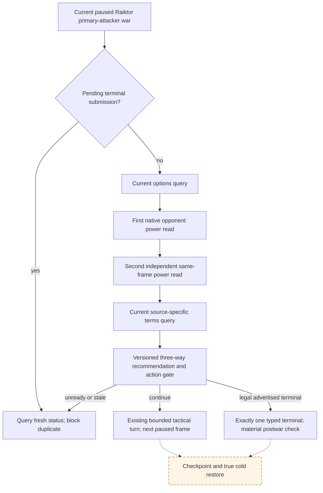

# GEN-034-C formal Raiktor three-way consumer, 2026-09-15

The exact CK3 build remains `1.19.0.6`, EXE SHA-256
`2D00FF3101EF70B566F2FCBAE292F09263199C80E9DC8F139B82D7D96F83DB86`.
The native decision tree and Raiktor defeat/white-peace semantics are recorded in
[player-war-exit-policy.md](player-war-exit-policy.md). This patch changes only
our Python consumer for the primary-attacker `raiktor_claim_cb` slice. It does
not open a terminal action capability or claim that GEN-034-C/D passed.

R715 made four controlled public MCP reads on one paused R710 frame, source
report SHA-256 `9858637EBF7501E232F963C597322916A817F9BF0E42601CD9F59E54D4D5D29E`.
The native white-peace validator was false, surrender was legal but had a high
owner loss, and the versioned three-way provider recommended `continue`.
Those reads did not go through the ordinary formal turn consumer and did not
submit an action. R661's direct `resume-map` experiment yielded no successor
in its bounded observation window, so a formal continue result is handed to
the existing bounded tactical planner rather than treated as a completed turn.
R721 and R723 independently demonstrated a typed move, its next-turn route
consumption, process recycle and cold restore without an old move repeating;
their run versions were the original f342 consumer and do not prove this patch
live.

The read-only snapshot interface adds
`war_entry_assessments_two_read_trace_v1`. Each entry binds one independently
returned `query-war-entry-assessments-v1-1-<opponent>` payload to before/after
paused-frame projections, source scope and native query sequence. The trace is
available only for an unchanged single primary-attacker war frame; a new
revision, process generation, episode or WarID yields an empty list. The
existing public war-entry query is still version `v1` and its result now
includes the existing target-scope contract so downstream consumers can tell
active-war opponent from declarable-war target. No new tool registration is
required; MCP snapshot and query clients can read the additive field.

Formal strategy now asks for options, two power reads and terms in that order
when registered. It compares continue, white peace and surrender through the
existing providers. A `continue` certificate authorizes the **outcome**; the
separately selected bounded tactical step must pass its ordinary action-step
legality and has its own independent next-frame postcondition. The certificate
therefore records its original gate literal and does not pretend that the gate
authorized a different tactical literal. A terminal literal is emitted only if
the action gate and current action-step registration both pass. Previous
unconfirmed terminal submissions block new submission until actual war status
is checked. Unknown or stale input remains blocked, with the exact reason.

Remaining GEN-034-C live gate: an integrated frozen build must perform this
formal same-frame choice, one bounded typed action, independent next paused
material result, checkpoint and new-process cold restore. GEN-034-D still
requires a lawful newly created ordinary war with pre-war source-specific army
capture, one legal terminal, material postwar/truce results and cold restore.

## R831/R832 terminal-control correction, 2026-09-17

R831 reached player-relative war score `-100` while `WarID=33554473` remained
active. R832 cold-restored that exact frame. Its same-frame recommendation still
ranked continue at `-50,000,000` above the legal surrender at `-91,125,000`
because recommendation v5 had no war-score input and always marked continue
eligible. White peace was unavailable. The bounded tactical sentinel then
advanced 11 game days and CK3 ended the war naturally, with zero explicit
terminal submissions. This is a production B0 for GEN-034-C/D: the material
defeat is real, but it cannot satisfy an action-bound terminal contract.

Recommendation v6 therefore consumes an explicit, hashed and frame-bound
`opponent_terminal_control` input derived from the current normalized options
query. For a same-frame Raiktor primary attacker at player-relative score
`<= -100`, with observable mutually inverse attacker/defender absolute scores,
continue remains in the three-option trace but is ineligible. The provider then
compares only otherwise-legal white peace and surrender; it does not hard-code
surrender or bypass terms, budgets, margin, action registration or the current
action gate. Missing or cross-frame terminal-control evidence blocks the whole
recommendation and cannot fall through to the tactical planner.

The boundary is deliberately narrow. Score `-99` retains the existing utility
behavior, own-side `+100` still returns to the higher-priority enforce-demands
branch, and any previous unconfirmed terminal submission still requires fresh
war status before another command. A terminal selection remains only an
authorization: GEN-034 still requires exactly one submission, independent
WarID/loss/truce/resource postconditions, checkpoint, and true cold restore.
