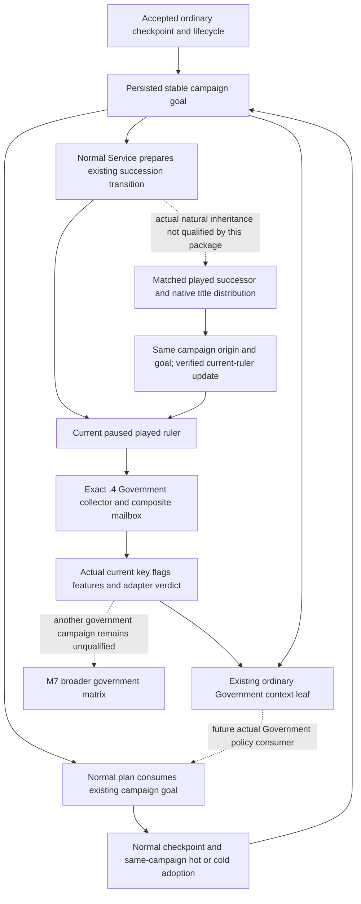

# G2-M7 government applicability and ordinary checkpoint restoration: 1.20.0.4

This source review is pinned to `23c3c4bc7fdf261f46174d35db12732808523463` on 2026-10-07 (ISO W41). [G2 requirements](../autonomous-agent-progress/g2-requirements-v1.json) define M7 as identity adapters and long campaign qualification: the same high-level intent survives checkpoints and inheritance, with actual ruler, seed and government qualification. M7 remains `in_progress`. The current authorized live entry is Robert 29829's original ordinary campaign, `native-29829-2bc2d599f7f9`; this package creates no seed or game session.

The installed build is CK3 `1.20.0.4`, Steam `25734779`, EXE SHA-256 `98702F88A547CDE2EAF29A85F93B85F68EE4CF8148336A4F7AFAEB75319DD518`. The [adopted Council/Government port](council-government-12004-adopted-mcp-port.md) supplies the native input ledger and closed bindings. This document adds the ordinary restoration and qualification entry, rather than repeating migration tests.

## Implemented applicability and the future normal-planner seam

[`ck3_12004_government_runtime_binder.cpp`](../../ck3_autonomous_player/native_bridge/src/ck3_12004_government_runtime_binder.cpp) binds the actual `.4` image and resolves the current played Character through `.4` Core. Its collector copies the whole current Government key at `+0x18`, the complete flag vector at `+0x50/+0x5C`, the actual 44-row feature registry and effective bits, and the script DLC set. The existing mailbox, composite source adapter and serializer retain this current build identity. The `.4` profile chooses the existing semantic identity table; it does not reuse an old native image binder.

[`government_runtime_adapter_observer_v1.cpp`](../../ck3_autonomous_player/native_bridge/src/government_runtime_adapter_observer_v1.cpp) selects these existing verdicts. The table describes implementation applicability, not a matrix of completed play styles.

| Current runtime identity | Existing adapter verdict | Scope that is actually implemented |
| --- | --- | --- |
| `feudal_government`, `clan_government` | `core_supported`, `core_landed` | Existing bounded core planner family; current-frame observation is still required |
| `tribal_government` | `core_supported`, `core_tribal` | Existing bounded core family; this is not a new tribal campaign qualification |
| `republic_government`, `mercenary_government` | `unsupported_nonplayer_identity` | Identity observation, without a playable adapter |
| `holy_order_government`, `monastic_holy_order_government` | `religious_adapter_implementation_pending` | Current key/flags are observable; dedicated mechanics are unimplemented, not prohibited |
| Wanua, administrative, landless adventurer, nomad, herder, celestial, mandala, steppe administrative, meritocratic, Japanese administrative and Japanese feudal | `adapter_spec_ready_not_implemented` | Family/profile identity; required effective features are evaluated and can produce `unavailable_feature_mismatch` |
| Another copied runtime key | `unadapted_runtime_government` | Preserve the actual key/flags without inventing an adapter |

The `.4` table has 18 stock identity rows. It does not contain the historical stock theocracy row. All copied flags and feature/DLC identities remain raw observations; feature presence does not prove mechanics implementation or store entitlement.

The existing [private transport](../../ck3_autonomous_player/src/xar_autoplayer/bridge/government_runtime_adapter_private_transport.py) accepts exact native build provenance and checks the response against the current snapshot's native revision, actor and date. `available` preserves unsupported/spec-only verdicts. `core_adapter_ready` is true only for `available` + `core_supported` + `requirements_met`.

[`ordinary_campaign_government_context_v1.py`](../../ck3_autonomous_player/src/xar_autoplayer/ordinary_campaign_government_context_v1.py) already combines that observation with the accepted ordinary goal. It emits `ordinary_goal_context_ready=true` only when same-frame/core readiness is true and the goal's current ruler matches the observed played ruler. It persists no government profile and never borrows the predecessor's government. The service performs the fresh query only when the existing permit is enabled and the ordinary goal, paused map and absence of modal/pending/terminal work permit that query.

There is a concrete source distinction at this base: [`GameplayBridgeService`](../../ck3_autonomous_player/src/xar_autoplayer/bridge/service.py) emits `campaign_government_context_used` only in `plan_nonwar_turn` (line 957). Normal `plan_turn` (line 1003 onward) already prepares succession and supplies `campaign_goal_plan_used` to its bounded policy, but does not call `_ordinary_government_context_v1`. The existing registered `ck3_plan_turn` selects normal `plan_turn` unless the legacy `nonwar_only` option is set. Therefore a direct Government query alone does not establish normal-planner Government policy consumption. This metadata difference does not block the existing normal checkpoint/goal restoration route.

Root's current direction is to retain only a recipe when the proposed hook would merely add metadata and would not change M7 decisions. No new field, Service hook or gate is implemented for this difference. A future actual policy consumer can reuse `_ordinary_government_context_v1` with the post-succession snapshot and existing query permit when it needs that decision input; pin the resulting source and actual consumption then. The current normal policy and action permissions stay as authored. This document does not modify the shared Service or Driver.



## Existing restoration route

[Ordinary goal continuity](ordinary-campaign-goal-continuity.md) records the already implemented persistence contract: `campaign_id` and origin ruler are stable; an accepted same-PID/cold checkpoint carries the goal; an older legal omitted/null ordinary goal is initialized by the accepted normal consumer. Existing `continue-as-reconciled-successor` changes the current ruler and verified estate progress after the existing matched-successor/title checks. A time advance or a new process is not an inheritance. This review uses that existing contract and does not read or modify `native_driver.py`, any live Driver state or a save.

For an unchanged prepared state, use its existing normal save/restore consumer. Moving an archived ordinary pair to a different prepared environment already has an implemented [official rebinder](ordinary-xar-off-seed-rebind-v1.md). [`ordinary_seed_rebinder.py`](../../ck3_autonomous_player/src/xar_autoplayer/ordinary_seed_rebinder.py) changes only three existing lifecycle objects: top-level `succession_lifecycle`, `last_checkpoint.succession_lifecycle`, and the matching successful `save-checkpoint` history result's `succession_lifecycle`. It retains the opaque save, persisted pipe, episode and campaign goal. The normal cold consumer owns saved-prefix and physical restore lineage; hand-trimming history, rewriting a goal or editing save fields is unnecessary.

[`tools/g2_preview_operator.py`](../../tools/g2_preview_operator.py) already provides the archived-pair preparation route. `prepare-state` takes `xar_checkpoint.ck3` and `driver-state.json` from `--sample-dir`, prepares/verifies the destination's ordinary `xar_off` profile, copies the paired files, invokes `rebind-ordinary-seed-v1`, consumes its exact no-launch preflight expectations and updates the operator manifest to the actual rebound environment/Driver digests. Existing pending sidecars and formal proof arguments remain part of their corresponding action recovery. Preparation/rebind proves file compatibility, not actual game restoration or elapsed days.

## Current-only Robert recipe for Root

The small actual R0061 receipt is external `Z:/ck3_mod_rewrite_process_assets/g2-background-20261007/upstream-build-migration/managed-full-h9613-finaltools10/operator/ROOT-FULL-ORIGINAL-PAUSED-SNAPSHOT-QUALIFIED.json`. At UTC `2026-10-07T04:13:10.296278+00:00`, source `23c3`, it qualifies the actual `.4` paused map and original living Robert in minimized GAME PID109764. Its sibling `final-owner-fields/SCENE-FIELDS.json` records raw `53288256`, `active_event=null` and `pending_character_interaction=null`. The scene receipt itself records zero new days, no added checkpoint, `g2_resume_ready=false` and `migration_complete=false` at that capture; those at-capture fields are not a veto over subsequent Root qualification.

Root's accepted `.4` Government primitive is separately retained at `Z:/ck3_mod_rewrite_process_assets/g2-background-20261007/upstream-build-migration/managed-full-h9613-entry02/actual-live-review/government.json`. The continuation owner relayed its small receipt: R0054 base04, source prefix `fb377`, DLL prefix `3245`, actor29829/raw53288256/public3/native2, actual `.4` EXE, `feudal_government` / `core_landed`, all 44 effective-feature rows enabled, 30 script DLC keys, and true same-frame/core readiness. This is accepted production-live observation evidence on its own source/frame. Equal actor/date/revision numbers do not turn it into a new R0061 Government query or normal-policy consumer result. Reuse this accepted input without replaying its query.

Root also supplied the subsequent small `managed-full-h9613-finaltools10/operator/final-owner-fields/NORMAL-SAVE-FIELDS.json` under the same migration root: source `23c3`, ordinary `xar_off`, original episode, saved history **h9626**, raw **53288256**, **104,698,239 bytes**, checkpoint SHA-256 **`253823552760e5361d252f5f73861f7cde3e059343853ef7547c87e19828782e`**. This is an actual normal saved checkpoint with zero date advance, not a new cold/succession/goal-consumption proof. The finite continuation collector owns the campaign-goal and actual Driver/restore metadata; this review neither reads the large Driver/save nor supplies missing values.

Use the same local operator/MCP route and original state under Root's existing migration and continuation recipe:

1. Reuse the accepted `.4` Government primitive and actual current scene/save receipts with their distinct source/frame pins. If a later current-ruler decision needs a fresh Government observation, call existing `ck3_query_government_runtime_adapter_private_v1` with the actual current **public** `expected_revision`; the transport obtains the native revision itself. This recipe does not require another query for an already accepted identical qualification.
2. Call normal `ck3_plan_turn` without enabling the legacy nonwar selector. Record existing `campaign_goal_plan_used`, the accepted original campaign/origin/goal, observed current ruler and actual selected plan. Government applicability is supplied by the accepted input above; no new `campaign_government_context_used` field or global gate is required. A future decision-specific policy consumer must separately record its real fresh Government consumption.
3. Reuse actual h9626 as the current normal checkpoint rather than repeating a save for this document. After actual subsequent gameplay, existing `ck3_save_checkpoint(expected_revision=...)` supplies the next pair. Preserve the current goal and all existing action-ledger recovery; record actual Driver/goal metadata through the continuation owner's finite collector.
4. When Root's normal continuation needs its cold slice, use existing `ck3_restore_checkpoint(expected_revision=...)` on the same prepared state. Observe the actual accepted checkpoint, replacement game identity and current ruler, then consume the same goal in the next normal plan. Refresh Government when the actual current-ruler decision requires it; do not inherit a predecessor's profile. Do not add game days for restore or resubmit an already pending/applied action.
5. Run the next bounded normal `ck3_auto_turn` under the continuation owner's recipe, then use the ordinary durable checkpoint result. A later natural succession must use the existing reconciliation route, preserve campaign/origin/goal, record the actual successor/title result and observe that successor's current Government before a policy depends on it. Record the actual successful next normal plan. No forced death, ruler switch or separate seed is part of this task.

The finite evidence fields are campaign ID, goal key, origin/current Character IDs, actual verified succession progress; current public/native revision, date and Government key/family/verdict/readiness; accepted checkpoint identity, actual restore lineage, next formal plan/result and saved day delta. These are fields from existing consumers, not new protocol gates. The continuation owner owns the compact collector and shared hook recipe.

## Existing archive route for a later matrix

Historical Robert and Murchad `.3` first/cold proofs are already recorded in [ordinary goal continuity](ordinary-campaign-goal-continuity.md). Both observed `feudal_government` / `core_landed`, so two rulers/seeds contribute **zero additional government families**. Murchad's historical genuine h2013 pair and 50-day formal loop are separate from Robert's mainline. Their source/build evidence remains historical; neither is a new `.4` qualification.

The archived-pair route can be reused if a later Root task selects an existing archived seed. Its operator manifest must name the selected archive's real actor/episode/pair, the frozen current source/native deployment, destination paths and persisted pipe, with `xar_enabled=xar_off`, `succession_lifecycle=ordinary_campaign_succession` and `ordinary_campaign_no_pact=true`. Do not substitute historical PRV008/h2013 hashes for a later pair. This package neither reopens that archive nor confirms its present local availability.

Root's existing preparation entry, shown as a future recipe rather than an executed command, is:

```text
Z:\ck3_mod_rewrite\tools\.venv\Scripts\python.exe -B -X utf8 <frozen-source>\tools\g2_preview_operator.py prepare-state --manifest <actual-ordinary-operator-manifest.json> --sample-dir <selected-existing-paired-sample-directory>
```

That operator already invokes the following formal agent subcommand; do not run it a second time after successful `prepare-state`:

```text
Z:\ck3_mod_rewrite\tools\.venv\Scripts\python.exe -B -X utf8 <frozen-source>\ck3_autonomous_player\agent.py --state-dir <prepared-state> --game-dir <frozen-installation> rebind-ordinary-seed-v1 --expected-pipe <persisted-pipe> --receipt <prepared-state>\ordinary-seed-rebind-v1.json
```

The receipt's `no_launch_preflight_expectations` supplies the actual actor, episode, unchanged checkpoint digest and rebound Driver digest for existing `native-one-generation-preflight`; its lifecycle arguments are `--xar-enabled xar_off --succession-lifecycle ordinary_campaign_succession --ordinary-campaign-no-pact`. Root then uses the normal MCP/session continuation and records the actual current Government, first checkpoint, cold continuation and next formal turn. The next ordinary actor is the archived actor or a genuinely reconciled successor, never a hand-filled identity. Another feudal archive can add a separately qualified seed but still cannot supply a second government family. Tribal/clan and spec-only families require their own actual applicable campaign and necessary mechanics/outcomes; their implementation table rows cannot fill that evidence gap.

## Source-only delivery and remaining work

This package authors one exclusive topic and an external Oct7/W41 field packet. Builds, tests, imports, native FIRST, registered consumers, SDK/MCP/game/Steam actions, process/save/EXE reads, new actors/seeds and shared source/report edits are all zero. The existing `.4` native whole fixture (`xar_ck3_12004_government_whole_first`, two whole cases) and sole registered consumer are retained inputs; this package does not execute or requalify them. Root's actual migration receipts govern their execution status separately.

Remaining work is concrete: the continuation owner's compact same-goal consumer recipe; Root's actual `.4` same-goal cold/next-turn proof from the normal pair; eventual natural inheritance under the same intent; and separately authorized broader seed/government campaigns. The existing Government context leaf is a future policy construction entry when needed, not a metadata prerequisite for current continuation. Existing file restoration needs no duplicate implementation. The current package grants no new M7 completion, government-family count or saved days, and does not change the requirement denominator.
