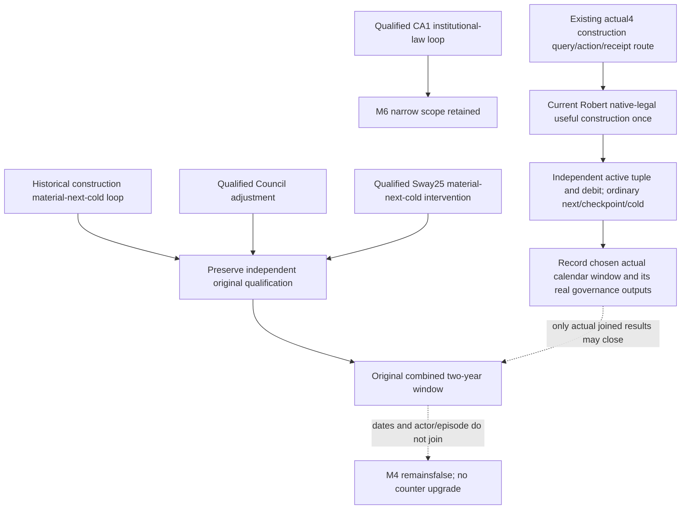

# G2-M4 original visible outcome: existing evidence reconciliation

2026-10-07 / ISO2026-W41. This is a read-only comparison of the original
contract and already qualified production evidence, at Root's supplied cut
H9638 / Robert29829 / raw53288448 / saved6005. It adds no game day, action,
live sample, test, build, image read or G2 credit. Root docs HEAD observed during
the review was6ac64cda701a549279bba9dc464156b47ffdb506; shared reports remain
Root/ally-owned.

## Original conditions and existing interpretation

`docs/autonomous-agent-progress/g2-requirements-v1.json`, G2-M4, fixes:
**within two game years perform and verify one construction, one council
reassignment and one real vassal or faction intervention**. Its planner is
budgeted construction, council and faction response. The Chinese original is
“两年内完成并验证建设、内阁调整和一次封臣/派系处理”. The original
combined window remains open; this review does not change the contract/counters.

The existing2026-10-02 Council interpretation accepts a useful native-legal
vacant appointment as an adjustment; no incumbent replacement is additionally
required. The existing Sway closeout accepts a dedicated positive material,
ordinary following consumption and cold retention as the useful intervention;
whole-instance termination and exact hidden-phase attribution are separate.
Private construction submit/material/next/cold is already a narrow qualified
loop. Public advertising, measured tax increase, ROI, per-building income
attribution, lifestyle breadth and CA1 are not extra M4 visible-outcome gates.

## Existing production evidence stays credited at its original scope

| Item | Existing independently verified evidence | Scope and source |
| --- | --- | --- |
| Construction R0080/R0081 | Once construction action `construction-submit-987aec8771e1451ba389f0d1b10cb2c3`; matching active tuple2103/2635/type24/slot1/initiator29829 and exact150gold debit; original R0080 receipt RED preserved; R0081 cold/20formal turns and next-consumption GREEN without resubmit, date53178312→53181984. | Historical private loop, not current raw53288448 construction. Existing manifest pinED175A02101C73AD8E0B5765EBF52397154EAA134CB54974D4AE84988B8BDAA2;09-22 daily and current M4 ledger. |
| Murchad construction | Original once action `construction-submit-f0ff9299cc8341af93cd62957c60ecbd`;150gold debit, target604/slot1/Province48/initiator31853, cold and formal following retained. V13 actual date53328600 observes target still active, work102833340/divisor0. | Actor31853 / episodeaf642, independent branch. Existing loop is preserved, but it is not Robert29829/episode2bc construction. No completion/attributed income is inferred. |
| Murchad Council | Vacant Steward39761/skill8 over legal36403/7; once native-legal assignment, independent holder/task_collect_taxes, formal next and newPID cold. | Original Council subitem satisfied; decision `M4-COUNCIL-VACANCY-ORIGINAL-CONTRACT-DECISION.json`. Separate31853/af642 episode. |
| Robert Council | Steward32716/11→43706/14 with CollectTaxes preserved; once `council-formal-4c1b14d305234ba0ad2d0fd12ea7dc08`, independent applied, original next at53220000, one normal day and cold at53220024. | Actual narrow production-live loop in29829/2bc. No repeat assignment or measured tax delta is needed to retain it. |
| Robert Sway | Once original `sway-31d5dda86cf74716bf3c8cb546e7ba70`, full134217986/gen8/target34333; pre-start dedicated modifier absent, independent start53220000/next53220048; dedicated25 at53249664, retained after three normal days53249736 and newPID R27 at53249808/saved4395. | Useful real intervention action/material/next/cold is CLOSED. .3/39b55512, actor29829/2bc; whole terminal remainsfalse. Total opinion−8→27 is not attributed as35 Sway gain. |
| Robert CA1 | Once `robert-ca1-2bc2d599f7f9-53220000-once`, CA0→CA1, independent207prestige debit/material, normal next and cold53220024. | Already qualified institutional/law loop. Preserve its own M6 scope; it does not replace any M4 construction/Council/intervention item. |

The review used only the named source topics, daily references, interpretation
memo and small closeout/REPORT-FIELDS objects. Original saves, Drivers, raw SDK
leaves, native bodies, EXE hashes and old tests were not replayed.

## Combined window is not established by these existing records

The original date contract publishes24 raw units/day and a365-day calendar;
its historical source identity remains1.19.0.6 in
`simulation/data/ck3_1_19_0_6_historical_date_layout_v1.json`. This is the
existing calendar basis for the original R0081 era, not a new actual4 source
qualification. Do not substitute Root's nominal36,524-day long-game denominator
for two game years or mix Murchad's saved-day counter with Robert's.

Even the favorable last R0081 date53181984 precedes Robert's53220000 Council
by38016raw/1584days. Robert Council material/next at53220000 precedes the
first actually observed beneficial Sway material53249664 by29664raw/1236days;
cold53249808 is1242days after the same original action/start date. Those records
do not provide a jointly sealed two-calendar-year interval. They remain valid
historical subloops; their timestamps cannot be moved to today's paused cut.
The separate Murchad construction does not fill Robert's missing current
construction or join a common window merely because its raw date is later.

## Shortest concrete next functional package

The first missing current Robert action is **one useful, native-legal
construction**, through the existing actual4 world-building route. The adopted
binding already closes final legality2C77D30, ten-resource cost2C247A0,
CAddConstructionCommand validator2982420/materializer2985DA0 and the shared
command foundation. No new census, ROI getter or theoretical audit is needed
to reach submit/material verification.

Root should obtain one fresh same-frame building/cash candidate, choose within
the existing resource policy, submit once, independently read the matching
Province/slot/type/initiator and actual debit, then use existing normal next,
checkpoint and cold consumption. Actual4's earlier readonly candidate
2103/2635/slot3/type604/cost142.5 is only a historical opportunity, not a tuple
to pre-lock or a proved current action. At H9638 there is no sealed new Robert
construction action/material loop in the reviewed evidence.

That one action does not automatically close M4: Root must select and record
the actual native calendar window and its real Council/intervention outputs.
The already qualified old loops need no replay to preserve their history.
If a new useful lawful Council adjustment is actually available in the chosen
window, the existing candidate/final-gate/action/receipt path is ready for it;
equal/worse candidates remain legitimate NO_CHANGE. Current intervention
material/continuation must be observed at its own real date. Do not fabricate
another Sway Start, relabel an old action timestamp, or force a useless
appointment solely to manufacture window credit.

Natural current Council selection uses the already registered
`ck3_query_council_composition_candidates_private_v1` and
`ck3_query_council_final_gates_private_v1` together with the actual incumbent,
role skill and existing task. A useful final-legal choice goes through
`ck3_assign_councillor_private_v1` and later
`ck3_query_council_assign_receipt_private_v1`, then the existing ordinary
following/checkpoint consumer. These exact registrations already exist in
`bridge/mcp_server.py`; this review neither calls nor changes them.

The current intervention observation entrance is the existing
`ck3_query_active_scheme_sway_target_private_v1` plus
`ck3_query_active_scheme_sway_outcome_opinion_private_v1`, explicitly joining
the original actor29829/target34333/full134217986/gen8. The recorded actual4
request for34730 is a different target and cannot supply that join. Current
positive dedicated material can feed the existing material/normal-following
consumer at its actual date. This continuation does not submit another Start;
an observed setback stays a setback and absence is not a fabricated terminal.

Current support/read-only and new offline Sway/M6 FIRST results remain at their
recorded readiness. They add no actual4 live material, intervention, days or
M4/M6 counter credit. External machine-readable handoff and Oct7/W41 fields are
under `Z:/ck3_mod_rewrite_process_assets/g2-parallel-20261007/g2-m4-visible-outcome-review/`.
