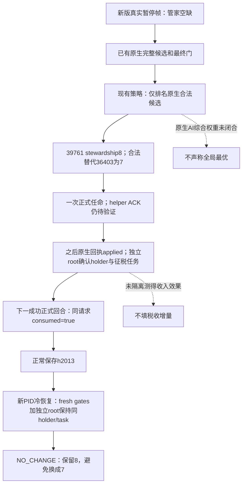

# G2 M6：Murchad 已完成的管家制度动作

2026-10-02。状态：**`production-live loop`，仅限 M6 的一次有价值合法制度动作子项**。本页复用 root 已保存的真实任命、独立回执、下一正式回合及新 PID 冷恢复材料；此次评估没有连接游戏、SDK 或 pipe，没有读取 canonical state，没有新增动作或代码。

## 原合同与结论

[原 G2 requirements](../autonomous-agent-progress/g2-requirements-v1.json) 的 `G2-M6.visible_outcome` 要求 `complete one scheme, one prisoner or institutional action, one non-religious decision or law project, and one activity lifecycle`；[度假交接](../handover/2026-10-02-g2-r11-maintainer-vacation-handoff.md) 第 123 行同样明确“一囚犯或制度动作”。合同没有要求必须处理囚犯，也没有排除内阁制度动作。

据此，Murchad 已完成的一次**合法填补管家空缺**可以满足这一制度子项：它实际恢复了原来空缺的行政席位，选择当帧原生合法候选中已观测 stewardship 最高者，并独立确认其在征税任务上任职、被下一正式回合消费及冷恢复后保持。当前真实囚犯集合为 `total_count=returned_count=0`，没有赎金机会；不需为了计数补消费者或创造另一动作。

这项结论不授予 M6 整体完成。scheme 完成与完整活动生命周期仍由各自实机材料验收；法律子项复用已有 Rogue CA1 完整 loop，不再 enact。此次初始席位是空缺，不能据此声称替换了一名在任管家；原 M4 的换任、建设、真实封臣或派系干预及共同两年窗口仍按原合同验收。

## 原生输入与已有消费路径

原生研究入口保持为[候选 producer](ck3-1.20.0.2-council-candidates.md)、[最终门](ck3-1.20.0.2-council-gates.md)、[任命与独立回执](ck3-1.20.0.2-council-assignment.md)和[正式消费者](ck3-1.20.0.2-council-private-formal-consumer.md)。本页记录已迁移的 Steam `1.20.0.3` / build `25652598` 实测消费，不把旧版静态资格外推为新版 live，也不新增原生 AI 总分或收入预测。

新版实际 EXE SHA-256：`94B55397ABB687A3DCD436805A5D885E6BE90FA6C693FEB44A9E3BBEEADE02A6`。普通玩家 actor `31853`，episode `native-31853-af642d76cb41`，`ordinary_campaign_succession` / `xar_off` / 无典当，现有正式入口保留 `--nonwar-only`。

现有 MCP `--private-council-action` 同时启用查询、动作及正式 Council 消费者。入口为 `ck3_plan_turn({})` → 被原生合法且有价值的计划选中后 `ck3_auto_turn({})`；生产步骤保持 `private-assign-councillor-v1` / `private-query-assign-councillor-receipt-v1`。持久账本为 `private-council-formal-v1.json`。当前已经 applied、cold-consumed 的请求不得再次提交。

原查询口仍为 `ck3_query_campaign_root_context_v1(expected_revision)`、`ck3_query_council_composition_candidates_private_v1(expected_revision, position_key)`、`ck3_query_council_final_gates_private_v1(expected_revision, position_key)`，revision 取 fresh public snapshot，职位为 `councillor_steward`。本子项所需数据均已有真实材料，不需要新增查询。现有 typed Council 动作没有 numeric spend quote；本页不手填零费用、零预算或收入收益。

## 实机动作、材料、next 与 cold

所有路径以下述 external 根目录为基准：`artifacts/g2-maintainer-2026-10-02/resume-12003/`。完整字段和输入 SHA 收在 `m6-law/murchad-readonly/LIVE-MURCHAD-INSTITUTION-OUTCOME-PROOF.json`，SHA-256 `ff3c1c8e2601cf15a3cb5234f978d77094bebe87038509de6bae3ede2906beb5`。

| 阶段 | 真实证据与结果 |
|---|---|
| Observe / decide | `m7-murchad/formal-v8-01/turn-001/result.json`；PID74800，native3 / date53327160。完整原生候选3行；39761 skill8与36403 skill7合法，36567已是 councillor而排除。初始 incumbent=null、vacant=true；现有策略返回 `ASSIGN_REQUIRED`。 |
| Once act | 同一 turn001，唯一请求 `council-formal-91a92a6ad4264b029ff829ebd33ecb78`，`assign_vacant`，candidate39761；helper ACK 为 `native_helper_invoked_verification_pending`，未计作完成。原 v8 formal bundle 的任命 submit 数为1。 |
| Independent material | `turn-004/result.json`；native12 / date53327640，native receipt `applied`、`postcondition_verified=true`、full-ID roundtrip成功。独立 campaign-root 当前 holder39761、`task_collect_taxes`、general / infinite、无target、未frozen。原始 `next_turn_consumed=false` 保留。 |
| Formal next | `turn-005/result.json` 已成功消费：同 actionID，`next_turn_consumed=true`，fresh native gates和独立root均保持holder39761与征税任务。turn006的成功 life-advance plan仍消费同一请求并正常推进30天；完整 v8 bounded loop推进50天。 |
| Normal save | `formal-v8-01/result.json`；date53328360 / history2013，存档111736694 bytes，SHA `47cada95586efa7092c74e402867b2bbb33c32afcda908c192c4cb77da299b09`。 |
| Cold material / consumption | `formal-v10-01/turn-001/result.json`；新gamePID54636，fresh native3 / date53328360 / actor31853，同episode、同已applied actionID。当前原生候选查询和独立root均保持holder39761，`next_turn_position` 为原征税任务，`next_turn_consumed=true`。native revision重新从低值开始，不拿旧receipt native12充当当前观测。 |
| Cold value decision | 同 v10 formal plan：现任stewardship8，唯一合法替代36403为7，`NO_CHANGE / incumbent_not_outperformed`。没有重新任命。 |

冷恢复基线由 root 的 `current-continuation-0ccc3f00-v10-01/ROOT-PACKET.json` 和 `runtime-freeze-0ccc3f00-v10.json` 记录；当前保存对为 h2021 / date53328360，save SHA `26b3500707eb075957f973f314b132ed7441bc829544c58b54e2d4e49462336d`。新版 source `0ccc3f00b741598bc7ef72798a831ed2f7157abf`，DLL SHA `af88527cd99d18cdd0b3f493ccc84f25fbe70e58bc1dfacac38647071909c876`。这不是一份仅含历史回执的 snapshot：现有 `plan_council_private` 生产路径重新读取 final gates，再调用 `_root(driver)` 的真实 campaign-root 查询并校验当前帧，之后才产生 cold formal consumption。

原 v8 `production-source-50e353bf` 与 cold v10 `production-source-0ccc3f00` 的 `private_council_formal_consumer_v1.py` 均为15347 bytes、SHA `23b6f31a013fac1b669b534489ea915fc518018113156b52cf8cfc4140fd1cd5`；消费语义未变。v13 后续同请求的正式消费仅作现存延续，不再反复核对，也不增加动作计数。

## 价值和边界

可见玩家价值是**空缺席位恢复运作**与实际征税任务被保持；候选排名只使用原生已读取的主能力和最终门。没有前任，因此 `incumbent_skill_gain=null`；没有隔离税收实验，因此不声称具体收入增长、无损替换收益或原版 AI 全局最优。当前保留8优于合法替代7，换人会降低本策略实际观测的主能力。

一次 file-only 实际字段评估共17项检查 GREEN，保留全部原查询/ACK/receipt/next/cold内容和 SHA；未重跑旧 fixture 或 whole matrix。外部日报/周报合并字段在 `MURCHAD-INSTITUTION-REPORT-FIELDS.json`，SHA `ba968ed9061369e65d2df03589c4121824cbcf03708a4e12b84d23e4f1aff15a`。root 负责提交、推送与共享报告；此 worker 没有使用 Git。所有原 law RED、4097-capacity stack-overflow RED 及不相关事件材料 RED继续保留，制度成功不覆盖其分类。
