# G2 owner-authored exit utility model provider (2026-09-07)

Status: **provider static-ready; repository template is deliberately draft;
owner approval and every downstream live gate remain false**.

## Research-first basis

This delivery follows the already frozen native and counter-policy evidence:

- [war-termination.md](war-termination.md) shows that native white-peace
  willingness is a branching AI heuristic over war score, war duration, debt,
  other wars, personality, culture/traits, special wars, and hostages. It is
  not an owner valuation model and is not copied into this profile.
- [player-war-exit-policy.md](player-war-exit-policy.md) requires the player
  counter-policy to combine a complete same-frame white-peace observation,
  production campaign evidence, owner budget limits, and an explicit owner
  utility evaluation. Hard budget ceilings cannot price trade-offs between
  domains.
- [g2-white-peace-utility-provider-go-no-go-2026-09-07.md](g2-white-peace-utility-provider-go-no-go-2026-09-07.md)
  records the concrete missing inputs: owner-approved domain weights,
  nonlinear thresholds, uncertainty treatment, tail-risk treatment, model
  identity/version, and a binding to the approved budget profile.

The resulting provider closes only the static intake/validation seam for those
owner choices. It does not change the native decision tree, implement an
evaluator, or promote any fixture to production evidence.

## Delivered contract

`raiktor_owner_exit_utility_model_provider.py` accepts one JSON source with
contract `raiktor-owner-exit-utility-model-source-v1`. Its field set is exact:

- explicit approval status, approver identity, and second-precision UTC time;
- model ID, version, and frozen `owner_utility_q100000` unit;
- the exact owner budget profile ID and exact source-byte SHA-256;
- signed Q100000 coefficients for the observed exit domains: gold, prestige,
  removed claims, favor hook, truce days, PoW release, title-holder changes,
  hostage transfers, and war-bound soldier loss;
- explicit rule IDs and integer parameter maps for nonlinear, uncertainty, and
  tail-risk treatment.

No coefficient, threshold, or rule is synthesized. Draft sources may be filled
incrementally, but remain `incomplete`; a source claiming `approved` is
rejected if any owner choice or approval field is unresolved. Extra fields,
booleans masquerading as integers, malformed hashes/timestamps, and split rule
ID/parameter pairs are rejected. The provider hashes the exact source-file
bytes and emits the normalized `raiktor-owner-exit-utility-model-v1` model with
that hash.

The repository fixture is an executable template, not an approved profile:

`ck3_autonomous_player/native_bridge/research/fixtures/raiktor_owner_exit_utility_model_draft_v1.json`

Its exact-byte SHA-256 is
`0C13AE4B9A94319AC5215F03516313AB17DA5C873FB259574566522B3E6AF235`.
All owner choices and approval metadata are `null`; there are no hidden defaults.

## Readiness boundary

```mermaid
flowchart LR
    A[Owner fills every model choice] --> B[Owner signs approval metadata]
    B --> C[Strict provider + exact-byte SHA]
    C --> D[Owner-approved model source ready]
    D -. still missing .-> E[Supported model evaluator]
    E -. same paused frame .-> F[Utility evaluation certificate]
    F -. conjunction .-> G[White-peace comparison]
    G -. policy + execution evidence .-> H[GEN-034]
```

Even a structurally valid approved source sets only
`owner_approved_source_ready=true`. The provider hard-codes the following as
false because configuration is not live evidence:

- `production_live`;
- `same_frame_utility_evaluation_ready`;
- `white_peace_comparison_ready`;
- `decision_ready` and `automatic_surrender_ready`;
- `gen034_closed`.

This is independent of the existing owner budget provider. No live adapter,
lifecycle, bridge public schema, or in-game action path consumes the draft.

## Verification and remaining work

Focused unit tests pass under normal Python and `python -O` (10 tests in each
mode). They cover missing source, the checked-in all-null draft, a synthetic
test-only approved object, partial draft editing, unresolved choices, malformed
schema/types/approval, exact-byte hash binding, bad files, non-mutation, and all
downstream false gates. No CK3 process was launched.

Remaining real prerequisites are unchanged:

1. the project owner must author the actual coefficients/rules and bind them to
   an actual approved budget profile, then explicitly approve that artifact;
2. an evaluator must implement that exact approved model rather than infer a
   default interpretation for rule IDs;
3. the evaluator must bind complete same-frame observation, campaign, owner
   budget, and utility-model hashes into the existing utility-evaluation
   contract;
4. a real paused artifact must be recomputable and owner-accepted before any
   comparison, recommendation, action, or GEN-034 readiness can advance.
