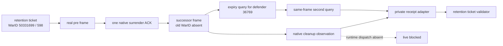

# G2 postwar cleanup / actual-expiry receipt adapter

## Static result

[static-ready adapter / fixture-only / live blocked] Canonical `04c1a00`
contains both the retention ticket from `f16cdf0` and the exact-build,
default-OFF actual-expiry provider. The Python adapter now joins these inputs
without changing native code:

1. accept the exact pre-termination WarID `50331699`, measured `598` soldiers
   and eight-generation vector only when they match retention ticket
   `E0A93DDC584BB2313BC03CE076779BAFD261ABBABB69E9DE3BEF284DFE14823A`;
2. require one native `surrender-war-50331699` ACK in the same fresh-run PID,
   connection generation and episode;
3. require a successor paused postwar frame where the old full WarID is absent
   and a native cleanup observation marks every retained persistent/current
   generation destroyed;
4. query the retained primary defender full CharacterID `36769` twice through
   `query-raiktor-actual-truce-expiry-v1-36769` on that one postwar frame;
5. accept only equal native persisted dates and emit
   `source=persisted_native_truce_row`, `post=0` and boundary loss `598` before
   passing the final receipt back through the retention-ticket validator.

The async `collect_after_surrender` entry point is default-OFF. It performs no
query unless its private caller explicitly supplies
`authorize_private_live=True`; it does not submit surrender itself and does
not expose a public action path.



## No-launch preflight

The committed manifest is
`ck3_autonomous_player/native_bridge/research/fixtures/g2_postwar_cleanup_expiry_adapter_v1_manifest.json`;
the synthetic fixture is
`ck3_autonomous_player/native_bridge/research/fixtures/g2_postwar_cleanup_expiry_adapter_v1_fixture.json`.
The fixture expiry `53270000` is only a non-formula static vector and is not
CK3 evidence.

Executed command:

```powershell
py ck3_autonomous_player/native_bridge/research/run_g2_postwar_cleanup_expiry_receipt.py --manifest ck3_autonomous_player/native_bridge/research/fixtures/g2_postwar_cleanup_expiry_adapter_v1_manifest.json --output "Z:\ck3_mod_rewrite_process_assets\zg361\g2-postwar-cleanup-expiry-adapter-04c1a00-20260904\preflight.json"
```

Result:
`GREEN_STATIC_ADAPTER_LIVE_BLOCKED_ON_CLEANUP_DISPATCH`. The preflight
artifact SHA-256 is
`DA4B52F29CBB3DEC478061877080C674AE11F08C80A13DBE353B6CA170FA6ADF`;
the manifest SHA-256 is
`7CE021720D0749288142040DA5233F7BBDDDD5A2F3B8AC187DF1F72770B5A051`;
the deterministic synthetic receipt SHA-256 is
`66E09371BE876F5BF4A8E97BCCB8BE8B0E19398894FA7B88A0056FDF2E49E4D1`.
Both CK3 inventories were empty and the reserved live attempt remained absent.

## Exact remaining seam

The library function `ReadRaiktorWarBoundLossCleanupV1` exists, but at
`04c1a00` it has no runtime bridge dispatch: its only repository caller is the
native unit-test path. Therefore the Python adapter deliberately refuses to
infer destroyed generations from old-WarID absence. The next minimal change
is to expose that existing default-OFF reader to the private lifecycle runner,
then freeze one DLL containing both candidate providers. Only then is one
exclusive action-bound CK3 run legal.

Current boundaries remain
`live_authorized=false`, `public_readiness_promoted=false`,
`action_readiness_promoted=false`, `decision_ready=false`,
`automatic_surrender_ready=false`, and `GEN-034=false`.
