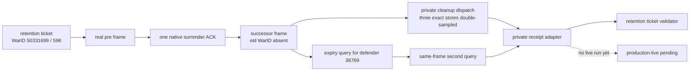

# G2 postwar cleanup / actual-expiry receipt adapter

## Static result

[static-ready private lifecycle / fixture-confirmed / live pending] Candidate
base `a01f8cb` now contains the retention ticket, the exact-build default-OFF
actual-expiry provider, and a private default-OFF dispatch for the existing
exact-store cleanup reader. The Python adapter joins these inputs as follows:

1. accept the exact pre-termination WarID `50331699`, measured `598` soldiers
   and eight-generation vector only when they match retention ticket
   `E0A93DDC584BB2313BC03CE076779BAFD261ABBABB69E9DE3BEF284DFE14823A`;
2. require one native `surrender-war-50331699` ACK in the same fresh-run PID,
   connection generation and episode;
3. let the DLL retain that exact baseline only inside the current bridge
   connection, record the real `surrender-war-50331699` ACK for the same WarID,
   and reject cleanup before that ACK;
4. require a successor paused postwar frame where the old full WarID is absent,
   then dispatch `query-raiktor-war-bound-loss-cleanup-v1-50331699`; absence is
   only admission, while the existing reader double-samples the persistent
   regiment, current regiment and current army stores before it can report
   every retained generation `destroyed`;
5. query the retained primary defender full CharacterID `36769` twice through
   `query-raiktor-actual-truce-expiry-v1-36769` on that one postwar frame;
6. accept only equal native persisted dates and emit
   `source=persisted_native_truce_row`, `post=0` and boundary loss `598` before
   passing the final receipt back through the retention-ticket validator.

The async `collect_after_surrender` entry point is still default-OFF. It
performs no query unless its private caller explicitly supplies
`authorize_private_live=True`; it does not submit surrender itself. The
candidate capability is omitted from generated action steps, and both CMake
options remain OFF by default.



## No-launch preflight

The committed manifest is
`ck3_autonomous_player/native_bridge/research/fixtures/g2_postwar_cleanup_expiry_adapter_v1_manifest.json`;
the synthetic fixture is
`ck3_autonomous_player/native_bridge/research/fixtures/g2_postwar_cleanup_expiry_adapter_v1_fixture.json`.
The fixture expiry `53270000` is only a non-formula static vector and is not
CK3 evidence.

Executed command:

```powershell
py ck3_autonomous_player/native_bridge/research/run_g2_postwar_cleanup_expiry_receipt.py --manifest ck3_autonomous_player/native_bridge/research/fixtures/g2_postwar_cleanup_expiry_adapter_v1_manifest.json --output "Z:\ck3_mod_rewrite_process_assets\zg361\g2-postwar-cleanup-expiry-dispatch-a01f8cb-20260904\preflight.json"
```

The result is `GREEN_STATIC_LIFECYCLE_READY_LIVE_NOT_RUN`, with empty before
and after CK3 process inventories and `ck3_started_or_attached=false`.
The artifact SHA-256 is
`BFB4ACD70B98534ED722F5557504E21FC004C6E568221386A1F05EBB3D539BF6`;
it binds manifest SHA-256
`7874094361E8DE6B38F77441B1FF59F512AFCD13C309E0FFD02147185E86375F`
and synthetic fixture-receipt SHA-256
`FE20C0B3F047AE0D3C259967A788DB10E82DDE66F9BE1CD3E86FF8F13E981DF6`.
The earlier
`GREEN_STATIC_ADAPTER_LIVE_BLOCKED_ON_CLEANUP_DISPATCH` artifact remains valid
only for the pre-dispatch `a01f8cb` tree and is superseded for live readiness.

## Candidate build and exact binding

The Release candidate was built with both
`XAR_CK3_ENABLE_G2_WAR_BOUND_LOSS_CANDIDATE_V1=ON` and
`XAR_CK3_ENABLE_G2_ACTUAL_TRUCE_EXPIRY_CANDIDATE_V1=ON`. Its DLL is
`Z:\ck3_mod_rewrite_process_assets\zg361\g2-cleanup-dispatch-build-a01f8cb-r1\xar_ck3_bridge.dll`
(2,466,304 bytes, SHA-256
`5D366FA321DA436601819E52827210DEFE42D1FE14950380D3D2722D6B992FF5`).
The candidate native test binary SHA-256 is
`F7999CCA5AE9AC70E64515AFCE391049D9E318A9F32B701482FCF1E4996FFE88`.
MSVC `19.51.36248.0` compiled the DLL, adapter-registry target, and loss
candidate target; focused CTest was `2/2 GREEN`.

The full source/ABI ledger is
`native_bridge/research/fixtures/g2_war_bound_cleanup_dispatch_v1_source_contract.json`.
It freezes CK3 `1.19.0.6`, executable SHA-256
`2D00FF3101EF70B566F2FCBAE292F09263199C80E9DC8F139B82D7D96F83DB86`,
the three exact stores and every implementation source hash.

## Exact remaining seam

No CK3 evidence has been collected by this package. The next exclusive live
run must use the hash-bound candidate DLL and one uninterrupted
PID/connection-generation/episode sequence:

1. query the same paused terms frame twice and retain the second exact current
   generation vector;
2. submit exactly one native surrender;
3. wait for the first stable paused postwar frame;
4. let the adapter issue the private cleanup query and two actual-expiry
   queries;
5. accept only a native `destroyed` cleanup and two equal future persisted
   expiry dates.

Current boundaries remain
`live_authorized=false`, `public_readiness_promoted=false`,
`action_readiness_promoted=false`, `decision_ready=false`,
`automatic_surrender_ready=false`, and `GEN-034=false`.

## Current canonical live package

The `a01f8cb` build above remains the implementation milestone, but it is no
longer the current-canonical live candidate. Canonical native source later
advanced through `549076f`; the resulting fresh DLL, exact product projection,
short-path runner and formal `READY_TO_SERIAL_LIVE` no-launch artifact are
frozen in
[g2-postwar-cleanup-expiry-current-pin-no-launch-2026-09-04.md](g2-postwar-cleanup-expiry-current-pin-no-launch-2026-09-04.md).
No CK3 run was performed while producing that replacement package.
