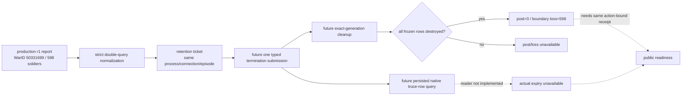

# G2 postwar retention / persisted-expiry no-launch preflight

## Result and scope

[static-confirmed / default-OFF / live pending] The preflight now binds the
existing production-live G2 terms report to the private war-bound loss
candidate and emits one deterministic retention ticket for a future
action-bound postwar query. It does not start or attach to CK3, does not submit
an action, and does not advertise a native persisted-expiry reader that does
not yet exist.

The source run remains:

- report:
  `Z:\ck3_mod_rewrite_process_assets\zg361\g2-production-leaf-1941c56-20260904\live-production-leaf-dual-query-r1\report.json`;
- report SHA-256:
  `AD6EEF83DCCA07C3AE280F01CADE6BBD0C1912FF0E086D797604D5F06C99F7C2`;
- exact CK3 `1.19.0.6` EXE SHA-256:
  `2D00FF3101EF70B566F2FCBAE292F09263199C80E9DC8F139B82D7D96F83DB86`;
- CharacterID `29829`, opponent CharacterID `36769`, full WarID `50331699`;
- paused frame `native:3`, public/native revision `4/3`, date raw
  `53223936`, connection generation `1`, episode
  `native-29829-809d91e48a8d`, CK3 PID `36460`;
- two equal read-only queries with `evaluated_days=1825`, persisted expiry
  explicitly `false/null`, and no mutation/time advance;
- generic war-bound current total `598` across eight persistent generations
  and two current CArmy generations.

## Same-generation retention ticket

The preflight loads the 120,508,263-byte source report by its exact hash,
passes both generic payloads through the existing strict war-bound normalizer,
requires query sequence `1→2` on the same paused binding, then canonicalizes
the ordered persistent/current/CArmy generation vector. The resulting vector
SHA-256 is
`6BD3E54354B267F9E785DE6FB2C2B3CB16AB72ADEF53204D2DB67299A857313F`.
The deterministic ticket ID is
`E0A93DDC584BB2313BC03CE076779BAFD261ABBABB69E9DE3BEF284DFE14823A`.

The ticket deliberately treats `598` only as the measured current total in
the last retained pre-termination checkpoint. It does not substitute the
authored `3000`, does not claim the eight rows came from one named event, and
does not yet bind any termination action.



## Future receipt boundary

The historical PID/connection/episode in the source ticket are provenance,
not values that a fresh CK3 process could or should reuse. The validator
accepts a new positive PID/connection and nonempty episode, then requires the
future pre query, one termination submission and post query to use that same
new runtime binding. It additionally requires all of the following to belong
to the same retention ticket:

- the exact EXE, fresh-run CK3 PID, connection generation, episode, character
  and full WarID match across the future pre/action/post boundary;
- the pre report hash, frame/revisions/date and measured `598` match exactly;
  the future pre receipt must also carry the full ordered generation vector,
  whose recomputed hash and contents must match the ticket before submission;
- exactly one typed `surrender-war-50331699` submission is recorded after
  the two retained queries, with no unrelated mutation command;
- the first stable paused post frame has successor public/native revisions,
  the old full WarID is absent, and every frozen persistent/current generation
  is reported destroyed; only then may the receipt contain `post=0` and
  boundary loss `598`;
- the expiry field comes from a real `persisted_native_truce_row` query for
  `29829→36769`, retains observed `evaluated_days=1825`, supplies a real
  expiry date later than the query date, and marks `formula_derived=false`.

This does not assert that the eventual persisted expiry equals
`date + 24×1825`; the value must be read from CK3. A different PID,
connection/episode, WarID generation, regiment vector, extra command,
formula-derived expiry, still-alive cleanup or non-successor post frame is a
typed RED.

## Executable preflight

The committed manifest is
`ck3_autonomous_player/native_bridge/research/fixtures/g2_postwar_retention_expiry_no_launch_manifest.json`.
The no-launch tool is
`ck3_autonomous_player/native_bridge/research/prepare_g2_postwar_retention_expiry_capture.py`.
The executed command was:

```powershell
py ck3_autonomous_player/native_bridge/research/prepare_g2_postwar_retention_expiry_capture.py --manifest ck3_autonomous_player/native_bridge/research/fixtures/g2_postwar_retention_expiry_no_launch_manifest.json --output "Z:\ck3_mod_rewrite_process_assets\zg361\g2-postwar-retention-expiry-2911ed7-20260904\preflight.json"
```

It returned `GREEN_STATIC_RETENTION_TICKET`. The preflight output SHA-256 is
`093DF2EFC0BE376289484DF1FD1A4FCEC48FEDA80DAB085609241206EFED3E83`;
the manifest SHA-256 is
`21D5E530DF76D80EC5919F536276BCB0340A607D0C83DBBD73E6451B724D5E91`.
Both before/after CK3 inventories were empty and the reserved future attempt
path remained absent.

## Readiness boundary and next seam

This paragraph records the original ticket freeze. It is superseded for the
provider inventory by commit `04c1a00`: the private default-OFF actual-expiry
query now exists and its Python receipt adapter is documented in
[g2-postwar-cleanup-expiry-adapter-2026-09-04.md](g2-postwar-cleanup-expiry-adapter-2026-09-04.md).
The runtime cleanup dispatch is still absent, so no live receipt exists.

At the original freeze, `native_expiry_reader_available=false`; throughout,
`live_authorized=false`,
`termination_action_bound=false`, `actual_expiry_observable=false`, public
readiness/decision/automatic surrender remain false, and `GEN-034` remains
unresolved. Only after the existing cleanup reader receives a private runtime
dispatch may an exclusive CK3 slot execute the single action-bound run and
pass the same receipt through `--validate-receipt`.
