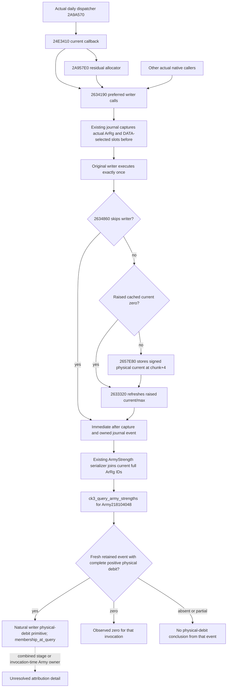

# Robert's ordinary siege: minimal actual loss observation, 1.20.0.4

The next useful G2 result is a **natural native writer event with a positive
physical soldier debit**, linked to the current requested Army row. An attrition
percentage, a requested budget, a conditional projection or a lower later Army
total does not establish that result. The required observer already exists;
this package proposes no new native hook, schema or test.

Source base: `764414ac4d3c2327f28e9acd524d1985735f6e0a`, isolated
`D:/g2-siege-actual-loss-observation`. Reused game identity: CK3 **1.20.0.4**,
Steam **25734779**, EXE SHA-256
`98702f88a547cde2eaf29a85f93b85f68ee4cf8148336a4f7afaeb75319dd518`.

Root's October10 task supplies the observation lead: Robert's public Army
`218104048`, Siege `268435564`, Province `2606`, soldiers `1843`, supply `100`
and displayed attrition `.01`. Root plans to restore saved progress `6051`.
These are supplied observations, not a new paused artifact captured by this
worker. Their date/revision, live DLL identity and natural event history must
come from Root's actual session. No rate-to-men multiplication is inferred.
Root subsequently reports Native66 plus immutable source`624` accepted into the
cold-launch phase. That message does not establish `observer_installed` or a
positive event; the next actual query supplies those observations.

## Reused exact native tree

[Current callback soldier effects](army-current-callback-soldier-effects-12004.md)
already closes the actual4 writer and physical store. The
[actual loss writer observer](army-actual-loss-writer-observation-12004.md)
already implements and qualifies its owned natural-entry/return journal in
Native55, immutable source `1e6d5fa4f6e1696218a730db1dbea8700c81944f`.
Its typed fixture debits `[7,0,0]` and cached deltas `[-7,0,5]` are static
evidence only; they are not game losses and are not rerun here.



| Exact actual4 edge or field | Meaning retained by the observation |
| --- | --- |
| `2A9A570` at `2A9AB46` → `24E3410` | Existing daily callback source edge; the journal does not itself record this outer call |
| `2634190..263448F`, `void(ArRg*, int64 Q100000 request)` | Natural native invocation; actual RCX receiver and signed RDX request |
| Returns `24E35FF`, `24E377C`, `2A958E8` | `supply_preferred`, `siege_or_raid_preferred`, `residual_allocator` respectively |
| ArRg `+10/+14` and `+38/+3C` | Full identity/magic and immediate cached current/max; cache movement is separate from physical debit |
| ArRg DATA `+20/+28/+2C`, stride `0x10` | DATA pointer/capacity/count and ordered aliases selected by `260DB50` |
| DATA `+8/+C` | Persistent full ID and selected chunk ordinal; ordinal is not assumed to equal the chunk's own ordinal |
| Chunk `+0/+4/+18` | Signed physical maximum/current/state before and immediately after the call |
| `2657E80` | Unconditional signed current store at chunk `+4`; exceptional pair clear has its own source guards, with no invented clamp |
| `2633320`, stores `26338A0/26338A3` | Raised cached current/max refresh; a writer admission skip does not refresh |
| Existing `GameState+08` | Actual captured invocation clock; no predicted tomorrow date supplies this value |

These addresses and meanings are inherited source conclusions. This package
reads no EXE or disassembly and performs no native invocation.

## Smallest normal-query contract

Use the existing registered readonly entry with the actual paused revision:

```text
ck3_query_army_strengths(army_ids=[218104048], expected_revision=<current>)
```

Leave both conditional refill modes at their default `observed_prepared`;
their projections are independent of the actual journal. The Service returns
the requested Army subset. Its existing native command still reads the
published player/war scope before that subset is selected; this is not a new
single-Army native sampler and is not an all-world Army scan. No extra global
inventory or repeated query loop is needed for this contract.

Retain the complete actual row and enclosing snapshot/frame/runtime provenance.
The row already provides `native_carmy_id`, ordered `regiment_strengths` full
ArRg IDs and optional `actual_loss_writer_observations_v1`. Its journal fields
are sufficient:

| Existing family fields | Use in the natural-day result |
| --- | --- |
| `observer_installed`, `source`, `membership_basis` | Actual observer availability; source is `native_natural_writer_entry_return`, membership is `membership_at_query` |
| `latest_sequence`, `oldest_available_sequence`, `overwritten_events`, `unattributed_capture_failures` | Sequence fence and actual retained-history coverage, separate from numerical loss |
| Event `sequence`, `army_regiment_id`, `observed_date_raw`, `caller_return_rva`, `caller_kind`, `request_raw/request_scale` | New invocation identity, actual clock, native caller stage and requested amount |
| `same_instance_after`, `physical_capture_complete`, `physical_debit_observed`, `capture_failure_flags` | Published completeness/identity of this event's actual capture |
| `actual_physical_soldier_debit`, `physical_slots`, `data_aliases` | Signed unique-physical-slot before-minus-after, raw samples and alias explanation |
| Cached before/after and `cached_current_delta` | Independent raised-cache movement; never substituted for physical debit |

The current contract and serializer are
`bridge/army_actual_loss_writer_observations_contract.py`,
`army_actual_loss_writer_observations_v1.hpp` and
`army_strength_v1_serializer.hpp`. The serializer reads only owned completed
events using the row's already owned full regiment IDs. A missing optional
family and installed-but-empty `events=[]` have different meanings; neither
proves zero total loss. The ring retains512 invocations and each event captures
at most64 DATA records; existing coverage fields describe truncation/overwrite.

## One natural-day evidence sequence, for Root

1. In the restored paused session, retain the actual subject Army/Siege/Province
   context, frame and runtime identity. Make the ordinary requested-Army query
   above once and retain its row. Set the evidence fence `s0` to the journal's
   observed `latest_sequence` when present; this number is global even though
   the returned events are joined to the selected row's current full IDs.
2. Root performs the already authorized ordinary siege/natural-day step.
   This document runs no action, changes no tactic and promises no loss on a
   particular day. Retain the actual resulting paused date and siege context.
3. Query the same requested Army once at its new actual revision. Inspect the
   original journal events with `sequence > s0`, retaining their actual dates,
   full ArRg IDs and complete physical samples. If no baseline fence exists,
   a later event can still prove an invocation, but must not be labelled a
   newly fenced event from this one-day interval.

A new complete event with `physical_debit_observed=true` and signed
`actual_physical_soldier_debit > 0` proves that **one natural native writer
invocation debited physical soldiers**. Its raw samples independently explain
the value: sum each unique slot's before-current minus after-current once,
using the existing event's alias indexes. Repeated DATA aliases do not multiply
it; separate native invocation sequences remain separate mutations.

The smallest result is this single positive event and its retained provenance.
It does not require a complete interval total or a matching Army net decline:
refill and other effects can offset the visible aggregate. An observed event
with debit `0` proves zero for that invocation, and a negative signed debit is
preserved as an increase. Partial capture, absent events or overwritten history
do not become zero. Deduplicate any reused event by sequence when reporting it;
do not count the same retained event again on later queries.

The correct ownership label is **physical debit on an ArRg currently joined to
Army218104048**. Before/after Army rosters can show matching observed membership,
but the journal expressly does not capture CArmy ownership at invocation. This
does not block the independent physical-debit primitive or require another
owner hook. A `siege_or_raid_preferred` event identifies that combined native
stage, not siege alone; `residual_allocator` does not distinguish flags2 from0.
Displayed attrition`.01`, supply100 and current siege participation do not fill
those source gaps. Do not label the event a full daily/monthly callback replay.

## Readiness and next actual entrance

This is **research / source-defined observation contract**, with one doc delta.
The reused observer is **static-ready** from Native55. The worker performs zero
Game/producer/query/import/test/build/EXE/hash operations and adds no live credit.
The immediate useful next entrance is Root's existing normal Army query on the
actual session, followed by a naturally occurring captured writer event. If the
loaded runtime has no installed family, use its observed availability result;
do not infer a DLL or install/patch anything from this worker's document.

Until Root retains a positive actual event, **native physical-debit proof and
this package's G2 live increment remain0**. A later successful event qualifies
the bounded production-live primitive only; actual siege-only causal loss,
invocation-time CArmy membership, all loss pathways and the complete OODA loop
retain their independent evidence requirements.

Source plan, minimum query/acceptance fields and Oct10/W41 delivery are under
`Z:/ck3_mod_rewrite_process_assets/g2-background-20261010/g2-siege-actual-loss-observation/`.
