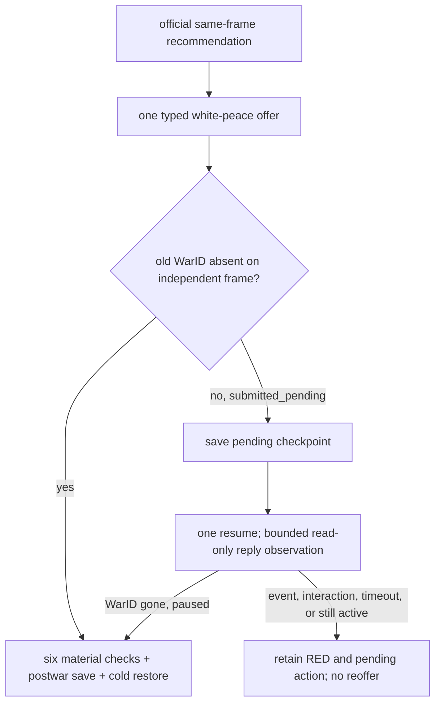

# G2 Raiktor three-way exit recommendation v2

Status: **static-ready / production input path defined / live action pending**.

## Problem closed by this package

The legacy `raiktor-campaign-dominance-certificate-v1` consumer required a
complete campaign outcome forecast, encounter distribution, finance endurance
and continue/surrender utility intervals. No production producer exists for
that combined object. GEN-034-A later delivered a narrower production-live
fact: a stable same-frame measurement of both war leaders' strategic power.
Keeping the old forecast object as the only route to a recommendation left the
new observation disconnected from GEN-034-D.

`raiktor_three_way_exit_recommendation.py` adds the intended minimal policy
path. It composes:

- the existing white-peace versus surrender utility evaluation;
- the v2 measured-power dominance certificate;
- the repository budget profile and versioned utility model already bound by
  the immediate-exit evaluation.

The old full-forecast v1 remains a valid research and quality-improvement
target. It is no longer a prerequisite for this bounded Raiktor exit loop.

## Continue-war value

Continue is not relabelled as a win probability or campaign forecast. Its
base utility is zero, then the model's existing
`measured-power-relation-penalty-v1` subtracts one versioned tail penalty:

| Measured relation | Continue penalty |
|---|---:|
| actor stronger | `0` |
| equal | `10,000,000` |
| opponent stronger | `50,000,000` |

These values come from
`ck3_autonomous_player/strategies/raiktor_exit_utility_v1.json`; they are
replaceable strategy configuration, not native-AI behavior or a claim about
the campaign's true outcome. White peace and surrender retain their observed
terms, hard-budget eligibility and bounded unobserved-effect penalties.

The provider compares all eligible options in the shared
`strategy_utility_q100000` unit. It publishes a unique recommendation only
when the leading utility exceeds the runner-up by the budget profile's
`minimum_switch_margin_raw`. Otherwise it returns
`three_way_underdetermined`.

## Same-frame and action rules

The immediate-exit and power certificates must agree on snapshot/public/native
revision, date, connection generation, episode, PID, WarID, player and primary
opponent. Missing power is a typed blocker; cross-frame evidence is rejected.

Static fixtures may exercise the choice rule, but cannot produce an action.
Only a unique recommendation with production-live immediate-exit inputs and a
production-live measured-power certificate emits one of:

- `resume-map` for continue;
- `offer-white-peace-{WarID}` for white peace;
- `surrender-war-{WarID}` for surrender.

The certificate fixes `single_action_only=true`. It also freezes route-specific
postconditions. A termination route requires old WarID absence, frozen gold,
prestige and claim disposition, directional truce days/expiry, prisoner and
favor results, source-specific war-regiment cleanup, and postwar checkpoint
cold-restore rebinding. A continue route requires the same war/player/episode
and an observed resumed successor revision.

Emitting a plan does not claim the command ran. `action_submitted`,
`postcondition_verified` and `gen034_closed` remain false until the bounded
managed runner produces those observations.

## Verification and remaining live work

Focused normal and optimized Python tests pass `7/7` in each mode. They cover
all three winners, insufficient winning margin, missing measured power,
cross-frame rejection, static-input action suppression and the production-live
single-action mapping. No CK3 process or desktop resource was used.

GEN-034-D now has a concrete recommendation/action contract, but remains
`blocked_live`. GEN-034-C must first reach a white-peace-admitted paused frame.
At that same frame the managed path must take two stable strategic-power reads,
run this recommendation once, submit its single action, verify the relevant
postconditions, save a checkpoint and cold-restore it. The existing R471 power
certificate is evidence for the native query/provider, not a reusable value at
the later horizon because its paused frame differs.

## Bounded same-frame recommendation runner

`run_gen034_three_way_recommendation_live_acceptance.py` prepares the read-only
half of that lifecycle. From an already admitted horizon checkpoint it performs
exactly one termination-options query, one narrow terms query and two stable
strategic-power queries. The before/between/after snapshots must remain on the
same paused identity, and native history must contain exactly those four reads.

The runner builds a fresh v2 dominance certificate on that frame and invokes
the recommendation provider in the same process. A GREEN report requires one
production recommendation and one typed planned action. It records the plan but
contains no action submission, time advance or exit mutation. Focused normal
and optimized tests pass `4/4`, and the CLI surface loads successfully without
starting CK3. This avoids spending another live run merely to refresh R471's
stale-frame value; the later action runner can consume the frozen same-frame
recommendation artifact.

R657 exposed one concrete scheduling constraint: after both worker-thread exit
reads completed, the first application-main strategic-power ticket did not
execute on the cold paused UI. The source checkpoint stayed unchanged, no
mutation occurred, and cleanup was GREEN. The runner now takes the two
application-main power samples immediately after the first paused snapshot,
then performs the options and terms reads that do not depend on that scheduling
window. The four-read budget and same-frame checks are unchanged.

R658 showed that query order was not a sufficient repair: the first
application-main power read failed before either worker-thread exit read ran.
This remains a native scheduling RED. R657 and R658 are retained as failed
attempts; neither advanced the date, submitted an action, nor changed the
frozen checkpoint. Repeating the same launch is not an acceptance strategy.

## Immutable-checkpoint power replay

The v3 campaign-dominance certificate supplies a bounded recovery path for the
read-only recommendation. It accepts a direct v2 double-sample certificate
from one process and rebinds its measured power to a different process only
when all of these values agree:

- checkpoint SHA-256 and pre-launch driver-state SHA-256;
- snapshot/public/native revision, raw date and connection generation;
- episode identity, pause state, WarID, player and primary opponent;
- distinct source and target process IDs.

The certificate keeps both runtime frames and marks
`same_runtime_frame_ready=false` and
`immutable_checkpoint_state_replay=true`. It therefore does not rewrite a PID
or claim that separately collected evidence came from one process. It only
asserts that a read-only strategic-power sample is reusable after restoring the
same immutable gameplay state. The recommendation records whether this replay
form was used. It still does not authorize or submit an action.

The concrete evidence join is R471 power plus R657 terms. Both derive from the
same 68,603,154-byte checkpoint
`FAA32578602EF546D991C364D196292C70C2D491FBCC6D4558FAB31444E14E78`
and the same pre-launch driver state
`A5DB3F1E5FEDCD019B60FDAB0380E072D9D8465E330DD6D080AA3D0208994B5E`.
Their state identity is snapshot `native:3`, public revision `4`, native
revision `3`, raw date `53183856`, connection generation `1`, episode
`native-29829-6df1a5025f07`, WarID `33554473`, player `29829` and opponent
`28551`. R471's source report SHA-256 is
`F467676201497A75C08ED5F6C72AFE64618337C73EFD2BA816B981470CE1E7CD`;
R657's failed report and final driver-state SHA-256 values are respectively
`80F421452B975F0DA74216F4EA6FD896187C274B68E5D52710243C2FAB60673C`
and `D0D4B7D389B7ACD387315E6194DA8D9662A24FC9F1F593F0B84D07E41DD7EC53`.
The R658 failure remains separate evidence with report SHA-256
`2D654EDB045C353AE05DC70B8C8E97D4C7400A317E86185F234B69ED0B6214BF`.

Focused dominance, projection, evaluation, recommendation, action-gate and
postcondition tests pass `41/41` in normal Python and `41/41` with optimized
assertions. These tests validate the join contract; producing the composed
artifact and executing any resulting action remain the next bounded steps.

## Composed recommendation evidence

`prepare_gen034_checkpoint_replay_recommendation.py` performs the join as a
reusable, no-launch tool. It hash-checks the R471 report and its GREEN
reclassification, the R657 report and final driver state, the checkpoint and
its pre-launch driver state. It then verifies that R657 ended with exactly two
successful retained exit reads followed by the application-main power RED.
It reconstructs the paused snapshot from the report's own readiness payload,
projects the exit terms, issues a v3 replay certificate and runs the v4
recommendation provider. The tool neither starts nor attaches to CK3.

The resulting artifact is
`Z:\ck3_mod_rewrite_process_assets\g2-gen034-checkpoint-replay-recommendation-v1\recommendation.json`,
SHA-256
`D9222517FCFF5FF295A9E00A3E1DAE8840DFD92CACEE84423AEBF6C20D7644E9`.
It is GREEN for the offline composition while retaining
`source_live_attempt_status=RED_preserved`. The recommendation is `continue`
with planned literal `resume-map`: white peace is unavailable and breaches
the frozen prestige/favor budgets, while surrender has lower utility than the
continue baseline under the versioned model. The report explicitly records
that no current live session exists, no authorization was issued and no
action was submitted. A fresh live paused frame is still required before the
action gate can authorize that plan.

## Bounded replay action runner

`run_gen034_checkpoint_replay_action_live_acceptance.py` consumes that report
through a hash-bound admission path. On the fresh restored process it issues
only one options query and one terms query, creates a new replay certificate
for the current PID, recomputes the recommendation, runs the ordinary action
gate and submits the single authorized semantic action. It does not issue a
strategic-power query. The shared action tail now accepts either the original
four-read list or this exact two-read list; its command-history and
postcondition checks remain unchanged.

Focused runner/provider/action tests pass `35/35` in normal Python and
`35/35` with optimized assertions. The R659 no-launch preflight is
`ready-to-run`, used no CK3 process and did not prepare a profile. Its report
is
`Z:\ck3_mod_rewrite_process_assets\g2-gen034-r659-checkpoint-replay-action-bef0527-preflight.json`,
SHA-256
`ECF06B29D139FD1E5D22F8375B2B6B6A88B7C5A3835D29EDBC613AE3B2F70FB3`.
The admitted live run is bounded to one launch, two fresh exit reads, zero
fresh power reads and one strategic action. If `continue` remains the winner,
the runner verifies only the resumed successor and deliberately leaves
`gen034_closed=false`; it does not extend into a war long-run.

## R659 submitted continue before observing its successor

R659 used the unique PID `215556`. Exact-build proof, the two fresh exit reads,
immutable-checkpoint replay, production recommendation, action authorization
and the exact command delta all passed. The retained command history is
options, terms and one `resume-map`; fresh power-query count is zero. The
action returned `accepted=true/status=submitted`, but the immediately following
snapshot still had the original revision, native revision and date. The pure
postcondition therefore correctly kept
`map_resume_is_observed_on_a_successor_revision=false` and the run RED.

This is an observation-timing defect in the harness, not permission to treat
the ACK as execution. The source checkpoint and driver state stayed unchanged,
cleanup is GREEN and CK3 returned to zero. Report and final driver-state
SHA-256 values are
`CC19C975F6791049D7797101A78740F24DCE01AE67D0A26EA3C92CE0E1A172BB`
and `75D97E5303540385BA846BFFEFCDD53D35CDF63F07C5D71A0CBBFA4321ACD4FF`.
The outer report's `paused double-sample MCP proof failed` text was a stale
generic-runner label; the embedded typed result above is authoritative.

The continue tail now observes snapshots for at most five seconds after the
single submitted `resume-map`. It never resubmits the command. A successor
still requires higher public/native revisions, a later raw date, the same
episode/player/WarID and no active event. The shared outer error label is now
the accurate `managed MCP sequence proof failed`. Focused action/gate/
postcondition tests pass `21/21` in normal and optimized Python, including a
stalled first snapshot followed by a valid successor. One R660 replay of this
changed behavior is justified; another unchanged retry is not.

## R660 disproved the observation-timing repair

R660 used one unique managed process and repeated the corrected five-second
observation. Its recommendation path was again entirely GREEN and submitted
exactly one `resume-map`, followed by 42 read-only snapshots. Every snapshot
remained at the original paused revision and date. This disproves the timing
hypothesis and keeps the action result RED. Report and final driver-state
SHA-256 values are
`B3588619AD28FBBF367B8CFD25E4E8CFAB7CF60C187087C73F175537035223DD`
and `D0A24FE4E81DE06D950582C205D22AB4F965C28B2C775465A33D15C9B85A5EEE`.
The input checkpoint and driver state were unchanged and cleanup returned the
CK3 count to zero.

R655/R656 had already shown that `resume-map` can advance a cold-restored
production process immediately. At this point their apparent actionable
difference was command order: R659/R660 performed worker-thread reads before
the map command. The first-command experiment below tested that hypothesis
directly. Increasing the wait or repeating R660 was already unjustified.

`raiktor_checkpoint_replay_recommendation_provider.py` now rebinds the complete
hash-bound production `continue` recommendation to a fresh PID before any
gameplay command. It requires identical checkpoint, driver state,
snapshot/revisions/date/connection/episode/player/WarID/opponent, retains both
runtime frames and rejects every route except `continue`. The ordinary action
gate recognizes this explicit replay certificate. The specialized runner can
therefore submit `resume-map` first and uses zero fresh exit or power queries.
Focused provider/gate/action tests pass `24/24` in normal and optimized Python.
The R661 no-launch preflight is GREEN at
`Z:\ck3_mod_rewrite_process_assets\g2-gen034-r661-checkpoint-replay-action-preflight.json`,
SHA-256
`49BD658725E833E318947B6E465A75C6594EF0569940B9345C800993E929210A`.

## R661 isolates the RED to the R459 map-control fixture

R661 used unique PID `194108` and submitted `resume-map` as the first gameplay
command after the immutable R459 checkpoint was cold-restored. It performed
zero fresh exit queries and zero fresh power queries. The replay provider,
production recommendation, action gate and exact one-command delta were GREEN;
the bridge acknowledged the command as submitted. Forty-five read-only
observations over five seconds nevertheless remained on snapshot `native:3`,
public revision `4`, native revision `3` and raw date `53183856`, with the map
still paused. The required successor therefore remained RED.

The report is
`Z:\ck3_mod_rewrite_process_assets\g2-gen034-r661-checkpoint-replay-action-ed1ebb0\report.json`,
SHA-256
`BD6682AAB5DBD71E5E5ED327C050750CA695ADD0E289D25587A64AAB36EB5DA2`;
the final driver state is SHA-256
`C9D503E912C82CD1FD86C820C025CF105F1E16CBAFEE9AE9068874655B53ED84`.
The source checkpoint and driver-state hashes were unchanged, cleanup was
GREEN, and the process count returned to zero.

This supersedes the tentative command-order explanation above. R655/R656 used
a different checkpoint and source frame (`53187096`) and observed an immediate
successor after the same first-command shape, whereas the R459 frame
(`53183856`) does not. The remaining failure is scoped to map-control execution
from this immutable fixture; it is not a missing recommendation, authorization
or observation wait. The RED remains recorded, GEN-034 stays `2/4`, and no more
unchanged R459 retries are allowed. G2 work proceeds on the next visible-value
milestone while this fixture-specific lifecycle seam remains separately open.

## Exact action admission

`raiktor_three_way_exit_action_gate.py` is the final side-effect-free handoff
before the managed executor. It validates the recommendation certificate hash,
then binds its action to the current paused snapshot's revision, date,
connection generation, episode, PID, WarID, player and primary opponent. An
active event blocks the handoff. The exact action step must be advertised;
white peace and surrender additionally require their typed bridge capability.

On success the gate emits one hash-bound authorization with the expected
revision and the recommendation's postcondition plan. It never invokes the
command, and explicitly leaves ACK, postcondition, cold restore and GEN-034
closure false. Static recommendations, stale snapshots, missing actions or
missing capabilities remain blocked. Focused normal and optimized suites pass
`18/18` across the recommendation, runner and action-gate contracts. The
read-only recommendation runner now records this authorization in its report.

## Post-action prestige observation

GEN-034-D can now observe the player's post-action prestige after the old WarID
has disappeared. The additive `played_character_prestige` state-snapshot field
reuses the exact `extension+0x130` signed Q100000 leaf already exercised by the
war-exit terms reader. Legacy snapshots may omit it; malformed fixed-point
objects fail closed.

This closes only the offline visibility gap. The action executor must still
bind the pre-action balance and delta from the recommendation terms, submit one
authorized action, then compare the next paused snapshot before accepting the
prestige postcondition. Native fixture and focused normal/optimized Python
tests are GREEN; production-live evidence remains pending under the owner's
CK3-use hold.

## Frozen postcondition expectations

The recommendation certificate now carries concrete route-bound expectations,
not only requirement names. For a termination it freezes the player's pre-action
gold and prestige, the selected deltas and exact expected post-action balances,
plus WarID, opponent, evaluated truce days, required destroyed cleanup state and
cold-restore requirement. The action gate copies this object unchanged into its
authorization.

The D completion gate follows the fixed G2 requirement:

1. old full-generation WarID absent;
2. gold equals the frozen post-action balance;
3. prestige equals the frozen post-action balance;
4. directional truce days and persisted expiry observed;
5. source-specific war-bound regiments destroyed;
6. postwar checkpoint cold-restores to the same identity.

Claims, prisoner pairs and favor remain inputs to the selected route's utility
model. They are not extra GEN-034-D postcondition gates because the milestone's
accepted visible outcome is `WarID/loss/truce/resources -> checkpoint/cold
restore`. Focused recommendation/action-gate suites pass `14/14` in normal and
optimized Python. No CK3 process or public MCP/native schema was used or changed.

## 2026-09-15: bounded asynchronous white-peace result

The exact-build production GEN-004 loop established that an accepted
`offer-white-peace-N` can return `submitted_pending` while the same WarID is
still active. The original reply queue has `ai_min_reply_days=4` and
`ai_max_reply_days=9`; the observed war disappeared on the tenth game-day
advance after submission. This is a real D-path mismatch: the earlier managed
executor queried cleanup and truce immediately after ACK, so a valid white-peace
winner would fail before the original reply could apply. See
[`war-termination.md`](war-termination.md) at its production normal-desktop
evidence for the exact run and hashes.

The managed D candidate now saves a pending-offer checkpoint, resumes the map
once, and observes at most 12 game days within 45 wall-clock seconds. It never
resubmits the offer. When an independent paused frame shows the old WarID gone,
the existing exact-store cleanup, two persisted-truce reads, postwar save and
true process-replacement cold restore remain mandatory. An event, pending
interaction, missing typed frame, deadline or still-active WarID returns RED
with the submitted action and pending checkpoint recorded; no six-item outcome
is claimed. The pure postcondition accepts the submission's earlier
`observed_snapshot_id` only for a typed `submitted_pending` result with
`war_id_absent_after_ack=false`; the later independent postwar frame still has
to satisfy all six material checks. A native `applied` result continues to bind
its observation ID to the final frame.

This is a focused Python consumer/runner change with no public MCP schema,
native ABI or `open_kaishek` version change. Focused normal and optimized
tests cover asynchronous disappearance and interrupt retention. It is
`static-ready / live=false`; R656's Raiktor white peace remained natively
unavailable at war day 366, so C/D still need a legal same-frame production
candidate. The strict frozen gold/prestige postcondition is unchanged. If
ordinary finances change during an actual asynchronous reply, that real
resource mismatch remains RED pending a narrow action-boundary observation;
the executor does not relax the accepted G2 requirement.

## 2026-09-21 R0031/R0032 magnitude-aware continue utility

R0031 and its true process-replacement continuation R0032 supplied the missing
production counterexample to the v1 categorical continue penalty. The formal
provider, terms evaluator and action gate were all ready; the only eligible
routes were continue and surrender. Nevertheless the fixed
`opponent_stronger=50,000,000` penalty ignored stable ratios `2.17782` and
`2.28560`, leaving continue ahead of the observed surrender cost for 27 R0032
decisions. R0032 ended at its 256-turn bound without a terminal intercept.

The v2 tail-risk rule keeps the same-frame certificate and action contracts,
but after 730 days at a negative player-relative score it scales the configured
opponent-stronger penalty by the certificate's exact
`actual_power_ratio_raw/fixed_point_scale`. This uses an existing validated
production input and introduces no native or MCP field. At the R0032 frame it
changes continue from `-50,000,000` to `-114,280,000`; surrender remains
`-101,825,000` and wins by `12,455,000`. Terms legality, option-specific
execution availability, hard budgets, minimum switch margin, single-action
authorization and all termination postconditions remain unchanged.

This package is static until a focused replay from the clean R0032 checkpoint
produces a terminal intercept. It does not retroactively turn R0031/R0032
GREEN, close GEN-034-D, or change the whole-program G2 status.
