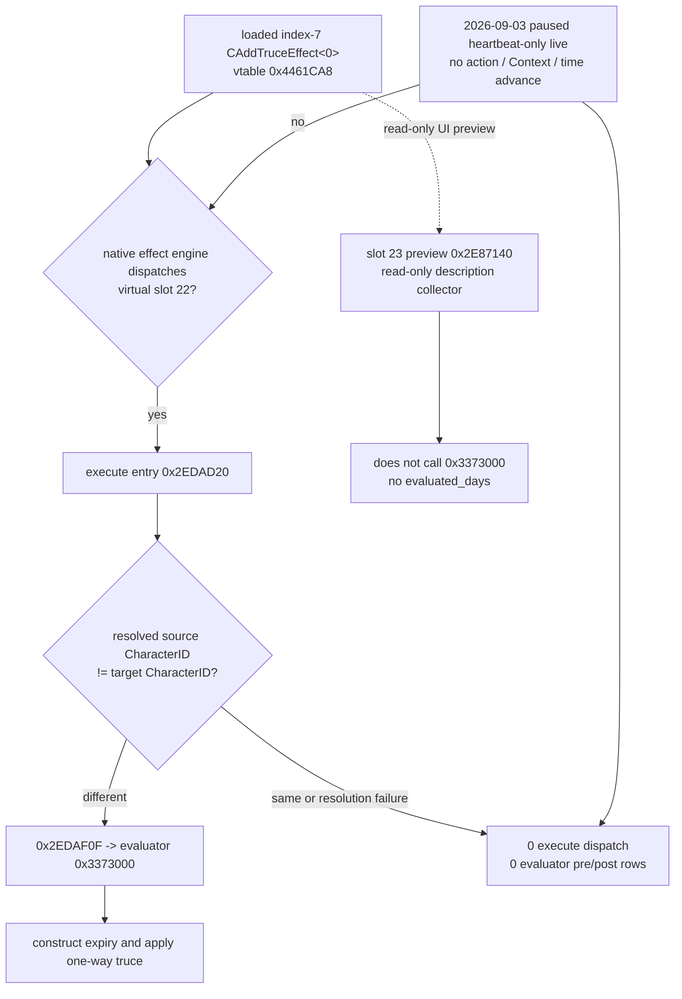

# G2 Truce callsite activation boundary (2026-09-03)

## Result

[static-ready; no CK3 launch] The 2026-09-03 passive live did not disprove the
two installed hooks.  It proved that the paused, heartbeat-only state never
entered the mutating `CAddTruce` execute method.  The two hooked calls belong
to different template specializations, and only one is structurally relevant
to the loaded index-7 node.

| Loaded type | Vtable | Slot 22 execute | Evaluator call | Slot 23 preview |
| --- | --- | --- | --- | --- |
| `CAddTruceEffect<0>` | `0x4461CA8` | `0x2EDAD20` | `0x2EDAF0F` | `0x2E87140` |
| `CAddTruceEffect<1>` | `0x4461D70` | `0x2EDB3A0` | `0x2EDB59E` | `0x2E87140` |

The earlier targeted index-7 live fixed the actual loaded object at vtable
`0x4461CA8`, so its only applicable evaluator call is `0x2EDAF0F`.
`0x2EDB59E` belongs to `CAddTruceEffect<1>` and cannot be reached by that
object.  Keeping both exact hooks was useful for type discovery, but a
two-site-return requirement was too strong for this concrete path.

## Exact local CFG

Both execute implementations resolve the source and target character objects,
then branch around the evaluator when their CharacterIDs are equal.  The
branch windows are:

- specialization 0: `0x2EDAE3C..0x2EDAE4C`, `jne 0x2EDAEDA`, then the
  straight-line setup ending at evaluator call `0x2EDAF0F`;
- specialization 1: `0x2EDB4CA..0x2EDB4DA`, `jne 0x2EDB56A`, then the
  straight-line setup ending at evaluator call `0x2EDB59E`.

The frozen active war has player CharacterID `29829` and primary opponent
CharacterID `36769`, so the game-state identities differ.  This is supportive
state evidence, not a claim that those exact objects reached the execute
frame: no execute entry row exists in the no-hit capture.

The original Raiktor scripts agree with this runtime boundary.  Each
`on_victory`, `on_white_peace`, or `on_defeat` effect eventually executes
`add_truce_one_way` from `scope:attacker` toward `scope:defender`.  The frozen
war was still active and the observer runner explicitly submitted no war
termination, Context effect, mutation, or time advance.  Therefore the lack of
slot-22 dispatch is expected; repeating the same paused/no-trigger run cannot
produce a native evaluator return.

## Next distinct read-only seam

The earliest CAddTruce-specific read-only method is the shared preview entry
at vtable slot 23, RVA `0x2E87140`.  A private observer there, paired only with
a game-native effect-description preview traversal and no confirmation, can
answer whether the CAddTruce node is traversed by a UI/description path.  It
cannot produce duration: the complete preview PDATA span
`0x2E87140..0x2E8723B` has no call or tail jump to evaluator `0x3373000`.

An execute-entry observer at `0x2EDAD20` is also earlier than the current
callsite hook and would distinguish entry from the same-character/error
branch.  It is not a no-action duration seam because slot 22 remains the
mutating effect method.  Static evidence therefore does not authorize either
a forced execute or a production readiness change.

The reusable exact-build evidence is:

- [`extract_g2_truce_callsite_activation.py`](../../ck3_autonomous_player/native_bridge/research/extract_g2_truce_callsite_activation.py);
- [`g2_truce_callsite_activation_v1.json`](../../ck3_autonomous_player/native_bridge/research/g2_truce_callsite_activation_v1.json).

The generated static artifact is
`Z:\ck3_mod_rewrite_process_assets\zg361\g2-truce-callsite-activation-static-20260903T0110\g2-truce-callsite-activation.json`,
SHA-256
`23426315520BD45AB899F0A62FA3350C24F8CC04A95E2DAC6102248D747255AD`.

Both bind CK3 `1.19.0.6` executable SHA-256
`2D00FF3101EF70B566F2FCBAE292F09263199C80E9DC8F139B82D7D96F83DB86`,
both RTTI/COL identities, both vtable slots, execute PDATA/function hashes,
the local predicate bytes, shared preview bytes, the loaded-node live hash and
the no-hit report hash.  No process is opened, no effect is executed and no
public ABI, projector pin, capability or readiness bit changes.
