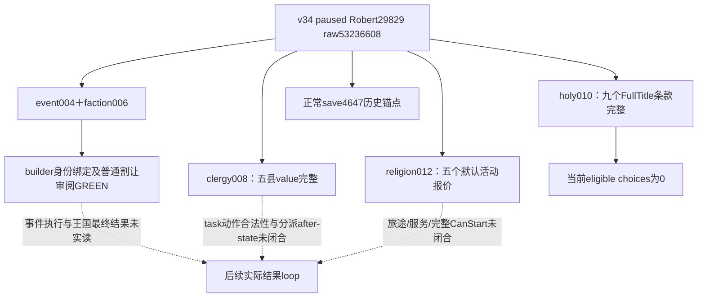

# G2 v34：罗贝尔暂停帧的宗教、派系与事件实读

当前状态：**production-live primitive**。v34新PID真实只读批次的五项查询及末尾正常保存全部GREEN；县改宗价值输入、圣骑士团逐地产条款、朝圣默认活动报价与派系普通割让损失已实读。该批次没有选择事件、分派县改宗、创建圣骑士团或启动朝圣，不记游戏日、动作、收益或完整OODA增量。

本页汇总已封存的actual结果，不替代各专题的原生树、ABI或失败记录。worker只复用文件，未调用SDK、游戏、pipe、窗口或Git，也未重跑旧fixture或builder。

## 冻结身份与历史保存锚点

| 项目 | v34实际绑定 |
| --- | --- |
| CK3 | 1.20.0.3，Steam build25652598 |
| EXE SHA-256 | `94B55397ABB687A3DCD436805A5D885E6BE90FA6C693FEB44A9E3BBEEADE02A6` |
| source／native编译源 | `5b2030b09041dbfcea11104e15d155a3b9aac1d6`，冻结树 `Z:/g34` |
| DLL SHA-256 | `5e60dbb7fb7626da1dab708ed3c1d56624e55380886372d6e8b2e69047f46886`，8411136 bytes |
| binary manifest SHA-256 | `756226abdfebc74c7af316f37c61b00cd2a630225d4f6468458099fb4434c030` |
| environment SHA-256 | `12ced0abd20cabb7facbc62f371169c441535219ee8a9f2a93eb05d486eb0804` |
| live run | `xenoamess-full-tower-eb9d2c1186--eternal-recurrence--R0012` |
| PID／角色／episode | 119724／Robert29829／`native-29829-2bc2d599f7f9` |
| 日期与revision | raw53236608；本批查询public queried revision2／native revision3 |
| 窗口实读 | minimized=true，CK3 foreground=false，window mutation/input=false |
| 历史checkpoint | `014-ck3_save_checkpoint.json` 正常save，history index4647，90951584 bytes |
| 历史checkpoint SHA-256 | `83412dc51de83308a2cb85b41a8bf0ee60b2b479d2a361dbabbcc64398165b4f` |

原批次目录为 [actual-paused-v34-01](Z:/ck3_mod_rewrite_process_assets/g2-resume-20261003/runtime-preparation/v34/actual-paused-v34-01/result.json)。14次调用全部GREEN，包含7次snapshot、diagnostics、5次具名查询与save；具名查询依次为event004、faction006、clergy008、holy010、religion012。县、holy、朝圣capture epoch分别为8811、9147、9487，不将这些独立capture epoch混作同一个值。

save4647属于本宗教/派系观察批次。ROOT后续军事批次的save4653是另一份当前接续记录；本页不重写4647历史锚点，也不将后来同名保存文件的当前内容冒充4647内容。本页保存哈希来自冻结014结果，没有重新读取会被覆盖的游戏存档。

**当前用户已全面撤销全部nonwar约束。** v34宗教批次启动时的 `--nonwar-only`／战争开关与builder中的 `war_execution_authorized=false` 是当时的历史事实，原artifact原样保留；它们不是当前等待战争授权的条件，也不限制后续军事推进。仍需区分当前授权、已实现的typed能力和实际after-state结果。

## 实际能力与输入完整度

| 能力 | 当前实读 | 尚未完成的结果层 |
| --- | --- | --- |
| event／faction只读审阅 | binding_ready=true，readonly_review_ready=true；普通县/公国损失完整 | 事件未选；王国receiver/capital/existing-domain分支未闭合；未验收最终接受/拒绝结果 |
| 县改宗 | 5候选的Faith/Rite、目的分支、现县民意、原生月速率完整；decision_inputs_complete=true | task分派动作合法性及独立after-state未闭合；无改宗收益 |
| 圣骑士团selected-title | 3决议、9个完整Title条款、独立shown/title_valid/CanTake/CanAfford及十槽报价完整 | native eligible choices=0；未实现typed action及收益结果 |
| 朝圣默认活动 | 5个可选圣地均有可支付的默认活动报价，普通phase choices实际空集 | 报价不含journey；完整旅途/服务费用、CanStart、完成收益未实读 |

## 派系event23：接受的直接损失与领地范围

冻结事件为 `faction_demand.1001`／instance23。saved FullFactionID33554465、leader70766、target29829，与peasant_county2102／target_title2115／new_title16795606绑定成功；事件与派系native revision均3。原版option映射为接受native2→API3→rendered0，拒绝native3→API4→rendered1。此映射来自已实读事件与现有builder，不代表提交动作。

当前government allows_state_faith=false、leader_at_war_with_target=false，普通分支 `county_loss_complete=true`。接受会转移realm counties **2102、2107、2111、2115**；其中Robert直辖损失为 **2102、2111、2115** 三县，2107由vassal32716持有，是同公国内额外纳入的realm县。被转移的duchy2101当前无持有人，Robert无直接公国损失。普通直辖县domain由 **5→2**，剩余 **2142、2173**；player-subrealm县集由 **13→9**。这些是未来接受时的原生普通transfer集合，尚未实际扣除地产。

kingdom2100当前无持有人，冻结seized-set只占其法理县 **4／17**，严格大于半数为false。最终receiver、capital、已有直辖法理县及转移后持有集仍未发布，故 `kingdom_outcome_complete=false`、`complete_acceptance_outcome_ready=false`。不能仅用4／17宣称最终王国结果。接受脚本另有prestige **level** -1与current dread>0时dread delta -20；两者不是实测净结果，prestige level不能写成prestige点数。

拒绝的原版effect是 `faction_start_war`，使用saved faction33554465及target_title2115；冻结批次未执行该选项，未产生该分支的实际WarID或exact CB。旧builder的actions=false和war authorization=false保留为历史结果；当前全部nonwar限制已撤销，无需再次等待战争许可。本页不代替ROOT后续的实际策略选择及军事结果报告。

证据：[ACTUAL-CHOICE-COST.json](Z:/ck3_mod_rewrite_process_assets/g2-resume-20261003/faction-extent/actual-paused-v34-01/ACTUAL-CHOICE-COST.json)、[ACTUAL-SURRENDER-READOUT.json](Z:/ck3_mod_rewrite_process_assets/g2-resume-20261003/faction-extent/actual-paused-v34-01/ACTUAL-SURRENDER-READOUT.json)、[builder RECEIPT.json](Z:/ck3_mod_rewrite_process_assets/g2-resume-20261003/event-scopes/actual-paused-v34-01/RECEIPT.json)。既有builder只执行过一次，本次仅复用结果。

## 县改宗：价值输入已完整，动作资格继续施工

实际incumbent56513当前执行 `task_religious_relations`，并未执行改宗任务；当前convert target与月速率为合法未适用的null，不能据此说候选观测失败。owner/incumbent Rite均152、Faith均23、ministry=false；native task shown=true、valid=true、候选集合完整。目的Rite152／Faith23由已冻结原版规则矩阵对实际输入投影，不能当成当前任务的原生已生效目的结果。

| 省份／county FullTitle | holder | 原Faith／Rite | 原生月速率，百分点/月 | 当前县民意，scale1 |
| --- | --- | --- | --- | --- |
| 2635／2102 | Robert29829 | 157／13 | 1.09917 | -56 |
| 2638／2111 | Robert29829 | 157／13 | 1.17175 | -75 |
| 2640／2115 | Robert29829 | 157／13 | 1.17175 | -65 |
| 2627／2165 | vassal32716 | 24／153 | 1.20804 | -68 |
| 2629／2173 | Robert29829 | 24／153 | 1.22013 | -44 |

五候选均native target valid、Faith/Rite均会改变，无same-faith rite-only候选。最快直辖候选2173与当前民意最低的2111是不同输入；月速率差0.04838百分点，民意差31。这里不假造utility，也不把aggregate county opinion当作宗教分量或预期改宗民意收益。`decision_inputs_complete=true`、`value_inputs_status=available`；`action_eligibility_complete=false`。clergy appointment查询中的candidate_character_id29829是另一个appointment语义，不能代替county task分派的最终合法性。

证据：[county actual ROOT-DELIVERY.json](Z:/ck3_mod_rewrite_process_assets/g2-resume-20261003/county-conversion/actual-paused-v34-01/ROOT-DELIVERY.json)；原生依据见 [县改宗专题](religion-fervor-county-conversion-native-ai-12003.md)。本页不将后续v35 fixture/static task-dispatch工作冒充v34实际动作。

## 圣骑士团：九个实际报价，当前无可执行候选

| 固定决议 | isShown | 完整原生候选，按顺序 |
| --- | --- | --- |
| `create_holy_order_decision` | true | barony tier1：2144、2176、2117、2104、2114 |
| `cancel_holy_order_lease_decision` | false | available-empty，真实0候选 |
| `create_holy_order_monastic_decision` | false | county tier2：2102、2111、2115、2142 |

九项均title_valid=true、CanTake=false、CanAfford=false；实际十槽signed raw报价全为 `[50000000,0,100000000,0,0,0,0,0,0,0]`，scale100000，即500 gold＋1000 piety，其他八槽为0。资源顺序为gold、prestige、piety、renown、influence、herd、treasury、treasury_or_gold、merit、barter_goods。撤租无候选，不推导撤租零报价。fixture的11／42／25与实机报价严格分开。

18条实际reason sampled且UTF-8中文完整，U+FFFD=0；文字包含战争条件、未满足所有要求、虔诚不足629，不宣称穷尽所有失败条件。先前所谓实机乱码已定位为worker 旧worker终端默认编码显示误读，不是生产reader/serializer/transport损坏，无生产fix或额外矩阵。独立shown、title_valid、CanTake、CanAfford共同满足的候选为 **0**；这不降低已实读报价/资格的primitive状态，也不产生建团动作或收益信用。

证据：[corrected holy REPORT-FIELDS.json](Z:/ck3_mod_rewrite_process_assets/g2-resume-20261003/holy-order-title/actual-analysis/reason-encoding-correction/REPORT-FIELDS.json)、[encoding diagnosis](Z:/ck3_mod_rewrite_process_assets/g2-resume-20261003/holy-order-title/actual-analysis/reason-encoding-correction/REASON-ENCODING-DIAGNOSIS.json)；原生树见 [selected-title专题](religion-holy-order-selected-title-native-ai-12003.md)。ROOT另行采用该专题更正补丁；本包仅新增本页。

## 朝圣：五个默认活动报价可支付，完整旅途仍待

| holy-site ID | title／province | 实际默认活动gold报价 | 原生affordable |
| --- | --- | --- | --- |
| 0 | 8768／5965 | 100 | true |
| 1 | 2410／2577 | 70 | true |
| 2 | 778／2088 | 100 | true |
| 3 | 7888／1785 | 110 | true |
| 4 | 267／1503 | 110 | true |

五候选均can_select=true、location predicate=true；ordinary phase choices是原生实际空集。每个候选有自己的native default phase与选项组，配置日期53236608、目标province一致，ten-slot报价中的treasury与其余槽为0，affordability reasons已采样为空字符串。报价scope是 `activity_host_phase_and_selected_options`，明确 `journey_cost_included=false`，不能写成全旅程价格、CanStart或完整朝圣readiness。没有paid action、完成或净收益增量。

证据：[default-phase actual REPORT-FIELDS.json](Z:/ck3_mod_rewrite_process_assets/g2-resume-20261003/pilgrimage/default-phase-quote/actual-v34/REPORT-FIELDS.json)；原生树见 [default-phase专题](religion-pilgrimage-default-phase-quote-12003.md) 与 [journey专题](religion-pilgrimage-journey-cost-runtime-schedule-native-ai-12003.md)。

## 增量、保留RED与接续

v34实际结果关闭三项已有观察问题：holy selected executor admission RED、independent-liege普通派系损失集合不可用、五朝圣候选无默认活动报价；县Faith／目的分支／当前民意也由已存在schema推进到实际完整输入。原v33 capability RED/缺口、diagnostic wrapper筛选失败、focused harness失败均保留，旧成功fixture不重复运行。本批没有新的failed/skipped调用。

下一步按实际价值接续：消费完整派系损失与当前已开放的军事能力；闭合县task动作最终合法性并验证实际分派after-state；用候选本地朝圣价格结合原生journey/service费用与完整CanStart，再形成启动/完成结果；holy等待或改变当前原生资格后才能执行相应typed action与收益验证。王国最终结果与完整宗教loop仍未完成，不能以查询GREEN代替动作结果。

机器汇总：[ACTUAL-V34-REPORT-FIELDS.json](Z:/ck3_mod_rewrite_process_assets/g2-resume-20261003/runtime-preparation/v34/ACTUAL-V34-REPORT-FIELDS.json)。ROOT负责中央日报、周报、路线图与Git提交推送；本包仅交付新增专题、机器字段与合并字段。
