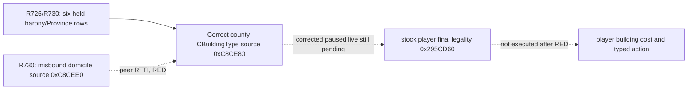

# G2-M4 R726 world construction definition identity RED

CK3 exact build `1.19.0.6`, EXE SHA-256 `2D00FF3101EF70B566F2FCBAE292F09263199C80E9DC8F139B82D7D96F83DB86`. R726 report SHA-256 `0A5C5545D1185692674715A2D5234620ACF4BD3CCDCC5109E0663D944D1735D7`; private paused read is `Z:\ck3_mod_rewrite_process_assets\g2m4-world-definitions-master3c7-20260915\live-R726\paused-player-world-building-source-read.json`. The game was paused at native revision 3/date 53178312 with played CharacterID 29829. The observer returned six real personally held barony TitleID→ProvinceID pairs; its world registry result was `unavailable`/`definition_identity`, and native final legality was not evaluated. Zero construction actions, zero manual date or GUI changes, and the CK3 process was reclaimed. The closed `holding_view` cache count of zero remains GUI scoped; it cannot answer whether construction is legal.

R730 resolved this previously unknown stage without changing the paired paused source: the wrongly selected vector had `1620` entries; its first vtable RVA `0x4172FA8` points through exact RTTI to `CDomicileBuildingType`, a peer of `CBuildingType` under `CGameDatabaseObject`. Thus the stock enumerators at RVA `0x1922305` and `0x15ABC4B` call the domicile accessor `0xC8CEE0`/global slot `0x57BFFD0`. This paragraph records why R726 was RED; it does not validate that peer registry as county construction input. The stock county CBuildingType GUI source refresh at `0x176EFD5` instead calls accessor `0xC8CE80`/global slot `0x57BFFF8` and reads its `+0x68/+0x74` vector. The stock CBuildingType constructor at `0x2C543F0` writes primary vtable RVA `0x44046C0`. R730 report SHA-256 `FDBBC6512A6C422CDA3CEDD12DBB5DDC75C2D9C7B89CC58AE3E792C34A594334`; its private read SHA-256 `AB0022FBFFD3D5F8C081C39E7C3FBE02842A55A1F2C6D67813A39BA6D93741B6`. The R726 patch's scalar diagnostic exposed this root while keeping failure RED; the corrected private source still requires a new paused same-version short replay before stock final legality can be claimed. Native pointers, costs, actions and public advertisement remain absent.

The next sole-owner paused short replay uses the same paired standard feudal source and a distinct feature-ON DLL from the integrated corrected county-source commit. It must report the county registry count and typed CBuildingType IDs on one unchanged frame, then execute bounded stock final-legality checks; any new identity mismatch stays RED. Zero legal samples under truncated checks remain evidence insufficient. A later independent stock cost and typed-action receipt is required before G2-M4 construction policy or public advertisement. This private receipt does not change `open_kaishek` or current MCP public schemas. A versioned read-only MCP query and explicit compatibility mapping remain required before registration.
