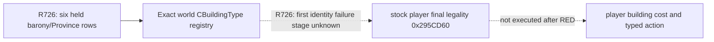

# G2-M4 R726 world construction definition identity RED

CK3 exact build `1.19.0.6`, EXE SHA-256 `2D00FF3101EF70B566F2FCBAE292F09263199C80E9DC8F139B82D7D96F83DB86`. R726 report SHA-256 `0A5C5545D1185692674715A2D5234620ACF4BD3CCDCC5109E0663D944D1735D7`; private paused read is `Z:\ck3_mod_rewrite_process_assets\g2m4-world-definitions-master3c7-20260915\live-R726\paused-player-world-building-source-read.json`. The game was paused at native revision 3/date 53178312 with played CharacterID 29829. The observer returned six real personally held barony TitleID→ProvinceID pairs; its world registry result was `unavailable`/`definition_identity`, and native final legality was not evaluated. Zero construction actions, zero manual date or GUI changes, and the CK3 process was reclaimed. The closed `holding_view` cache count of zero remains GUI scoped; it cannot answer whether construction is legal.

Exact stock world enumerators at RVA `0x1922305` and `0x15ABC4B` call registry accessor `0xC8CEE0`, then read the pointer vector at registry `+0x68` and count at `+0x74`. The stock CBuildingType constructor at `0x2C543F0` writes primary vtable RVA `0x44046C0`. The current private observer checks each borrowed element pointer, its vtable and BuildingTypeID at object `+0x10`, plus duplicate IDs. R726's serialized `definition_identity` merges seven possible failure stages, so this live artifact alone cannot establish that the vtable, ID, pointer, or registry contents are wrong. The patch adds a private scalar diagnostic with first failed vector index, count, stage, observed module-relative vtable RVA and observed signed BuildingTypeID. A native object pointer is never serialized. Failure remains RED and no cost, action or public capability is enabled.

The next sole-owner paused short replay uses the same paired standard feudal source and a distinct feature-ON DLL from the integrated diagnostic commit. It must keep the unavailable/RED result if identity still fails, report the first exact stage, and prove unchanged paused frame and no action/date input. Only then can the smallest stock-aligned repair be selected; a later independent stock legality and cost receipt is still required before G2-M4 construction policy or public advertisement. This additive private receipt does not change `open_kaishek` or current MCP public schemas. A versioned read-only MCP query and explicit compatibility mapping remain required before registration.
