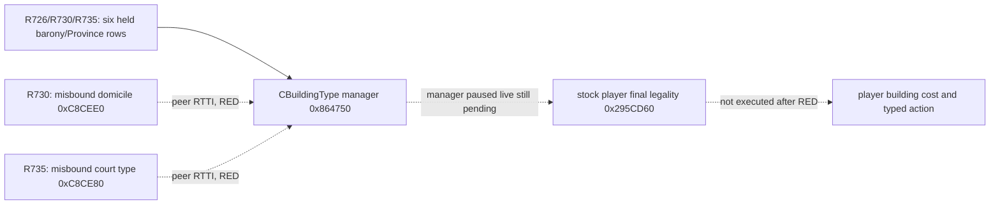

# G2-M4 R726 world construction definition identity RED

CK3 exact build `1.19.0.6`, EXE SHA-256 `2D00FF3101EF70B566F2FCBAE292F09263199C80E9DC8F139B82D7D96F83DB86`. R726 report SHA-256 `0A5C5545D1185692674715A2D5234620ACF4BD3CCDCC5109E0663D944D1735D7`; private paused read is `Z:\ck3_mod_rewrite_process_assets\g2m4-world-definitions-master3c7-20260915\live-R726\paused-player-world-building-source-read.json`. The game was paused at native revision 3/date 53178312 with played CharacterID 29829. The observer returned six real personally held barony TitleID→ProvinceID pairs; its world registry result was `unavailable`/`definition_identity`, and native final legality was not evaluated. Zero construction actions, zero manual date or GUI changes, and the CK3 process was reclaimed. The closed `holding_view` cache count of zero remains GUI scoped; it cannot answer whether construction is legal.

R730 resolved the first unknown stage without changing the paired paused source: the wrongly selected vector had `1620` entries; its first vtable RVA `0x4172FA8` points through exact RTTI to `CDomicileBuildingType`, a peer of `CBuildingType` under `CGameDatabaseObject`. The stock enumerators at RVA `0x1922305` and `0x15ABC4B` call domicile accessor `0xC8CEE0`/global slot `0x57BFFD0`. R730 report SHA-256 `FDBBC6512A6C422CDA3CEDD12DBB5DDC75C2D9C7B89CC58AE3E792C34A594334`; private read SHA-256 `AB0022FBFFD3D5F8C081C39E7C3FBE02842A55A1F2C6D67813A39BA6D93741B6`. This source must never be substituted for county construction definitions.

R735 used the distinct finalac feature-ON DLL on that same paused standard-feudal source. The next presumed registry, `0xC8CE80`/global slot `0x57BFFF8`, returned count `7` and first vtable RVA `0x441EF38`; exact RTTI identifies `CCourtTypeSetting`, another peer of `CBuildingType`. Thus the GUI source refresh at `0x176EFD5` is for court type settings. R735 report SHA-256 `B58DFA61975BF8FC155113FE7F50716C18CC1944BD7427A85836C2A9D7E05A58`; private read SHA-256 `90CF5A4C1A1AC6D4EBC81C1887B57F18CF0BD51146D54F7BA53BF74D86059DF0`. Its same-frame revision `3`, played CharacterID `29829`, date `53178312`, zero action/date change and CK3 tree reclaim preserve `definition_identity` RED; native final legality was not evaluated.

The exact stock construction chain identifies the real source: iterator `0x1922C52` calls CBuildingType manager getter `0x864750`, which reads global slot `module+0x570C108`; the iterator then reads manager `+0x68` vector data and `+0x74` count and loops over definition pointers at `0x1922C70`. Parser `0x2C605CE` inserts a newly constructed `CBuildingType` pointer into that same manager `+0x68` vector. Constructor `0x2C543F0` writes strict primary vtable RVA `0x44046C0`. The reader now uses only this manager vector and retains strict identity, unique nonnegative BuildingTypeID, paused-frame and bounded native final-legality conditions. This exact source is static pending until a new DLL performs the same-version paused read. Native pointers are never serialized; cost, typed action and public advertisement remain absent.

The next sole-owner paused short replay uses the same paired standard-feudal source and a distinct private-ON DLL from the integrated manager-source commit. It must report manager-vector count and typed CBuildingType IDs on one unchanged frame, then execute bounded stock final-legality checks; any new identity mismatch stays RED. Zero legal samples under truncated checks remain evidence insufficient. A later independent stock cost and typed-action receipt is required before G2-M4 construction policy or public advertisement. This private receipt does not change `open_kaishek` or current MCP public schemas. A versioned read-only MCP query and explicit compatibility mapping remain required before registration.
