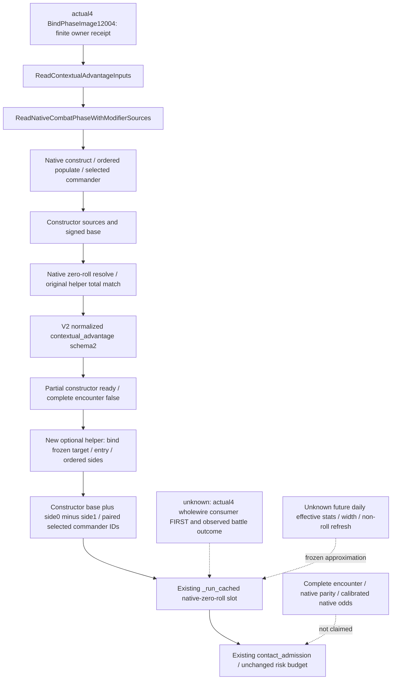

# V2 constructor advantage 消费候选：actual 1.20.0.4

Root 的 actual4 V2 已发布 schema2 `contextual_advantage`，既有 `general_battle_forecast.py` 却只消费 V3 的 native zero-roll advantage；V2 仍回退 generic commander/stock approximation。这是具体已观测值的消费缺口。独立 helper 复用当前模型的 native-zero-roll 输入槽，消耗已严格归一化的 constructor total与所选将领；不改变模拟内核、风险预算、native parity、MC readiness或现役战斗入口。

本候选 **AUTHORED_NOTRUN / research**。独立 helper 与 `general_battle_forecast.py` 的最小生产接线已在独占工作树完成；Bridge、CMake、Root reports均未修改。未运行tests、build、import、SDK、native程序、游戏或EXE读取。本包没有 actual4 模型估计、consumer qualification、游戏动作或实战胜利信用；提交和正式报告由协调者统一交付。

## 版本与证据输入

目标为 CK3 **1.20.0.4**、Steam **25734779**，EXE SHA-256 `98702f88a547cde2eaf29a85f93b85f68ee4cf8148336a4f7afaeb75319dd518`；pin由父任务提供。源码基线 `23c3c4bc`，独占worktree `C:/codex-ck3-background/g2-forecast-model-12004`，branch `g2-v2-constructor-advantage-12004`。

本包复用父任务已读的 [actual4 native source closure](Z:/ck3_mod_rewrite_process_assets/g2-parallel-20261007/battle-pursuit/migration-steam25734779/existing-contact-phase-12004/phase-native/PHASE-SOURCE-CLOSED.json) 与 owner 的 [actual4 R0061/011有限提取](Z:/ck3_mod_rewrite_process_assets/g2-background-20261007/upstream-build-migration/all-existing-live-review/final-phase/PHASE-PRIVATE-EXTRACT.json)，不重读whole响应或EXE。原生绑定证据不来自1.20.0.3历史地址；相同已归一化schema是软件合同，不将其`.3`命名改写为`.4`新逆向成果。

R0061/011 scope为 paused `native:2` / public3 / native2 / raw53288256，hypothetical fixed contact/no reinforcement：target2618、entry2619，A public218104048/native CArmy67109093，D public134218098/native CArmy167772499。它不能充当长路线target2606的cache。17份 knight effectiveness/association 使用 canonical `.3` contract名，保留现有软件schema。

该次 `input_observation_ready=true`，`monte_carlo_ready=false`，缺域为 `damage_to_casualty_allocation`、`pursuit_transition`、`battle_end_and_retreat_transition`、`phase_event_rng_and_effects`。contextual advantage schema2/status available、partial true、complete false、missing=[]、religion constructor source ready。owner没有保留完整context DTO cache；本包不再次索取或读取whole，也不宣称实测total数值、已匹配两侧selected ID或模型准确度提升。Root FIRST将真实wholewire送入生产消费者。

## 原生树与 partial 边界先于模型接线

exact actual4 finite owner receipt给出 `BindPhaseImage12004` 所绑定的成员：construct_side `0x264CA40`、populate_side `0x264DE10`、select_commander `0x264D770`、refresh_strength `0x26505C0`、read_dynamic `0x258A450`、commander_dynamic `0x2589DF0`、side_modifier `0x25899A0`、relation_kind `0x25897F0`。这些RVA从既有owner receipt复用，本包无新二进制读取。

有限源码阅读闭合共用的reader语义：`ReadContextualAdvantageInputs` → `ReadNativeCombatPhaseWithModifierSources` 在本次请求的explicit ordered sides上构造临时context、原生select commander、refresh strength、准备constructor sources与base、在零掷骰context上resolve advantage。reader要求 original helper match，并发布双方command/side/residual贡献、native-selected commander ID、constructor accumulator和original helper total。

```text
side_total_raw = commander_dynamic_raw + side_dynamic_raw
                 + target_conditionals_residual_raw
synthetic_zero_roll_total_raw = base_constructor_accumulator_raw
                               + side0.side_total_raw - side1.side_total_raw
```

总量是 attacker−defender / Q100000，符号必须保留。schema2 base使用 `base_constructor_accumulator_raw`；不拿旧 `base_nonreligious_accumulator_raw` 替代含宗教constructor的base。`combat_contract.py:_normalize_contextual_advantage` 已校验scope/scale、available和partial一致、complete=false、双方order、selected ID、side arithmetic和helpermatch；其optional fragment失败保持局部unavailable，不降级完整V2 base。

该context只承诺 **hypothetical_constructor_context**。`missing=[]`表示schema2 constructor源覆盖，不表示完整encounter或未来日更新完成；complete=false是真实发布边界。新helper不要求complete=true，不添加readiness字段或动作gate。claimed available的参与者/已发布算术不一致按既有 `CombatInputError` 路径处理；schema1、absence和unavailable保持generic。



## 独立软件入口

新文件为 [battle_v2_constructor_advantage.py](../../ck3_autonomous_player/src/xar_autoplayer/simulation/battle_v2_constructor_advantage.py)。`read_v2_constructor_advantage(payload, frozen)` 只消费现有schema2 envelope中的 `base_inputs.contextual_advantage`；V3已有路径先消费且不受影响。

返回 `(attacker_leader_army_id, defender_leader_army_id, total_raw, selected_character_ids, model_sha256, source)`，source固定为 `same_frame_v2_native_constructor_zero_roll_frozen_future`。前五项可接既有 `_run_cached`；SHA覆盖同查询normalized context，保留现有provenance做法。

双方所选将领必须匹配同侧frozen army中的唯一current commander，沿用V3已存在语义。selected ID为None时用该侧first army作placeholder，并把paired selected IDs传到当前research envelope；其现有实现据此不抽该侧commander roll。helper核对已发布side与total算术，不自行重算缺失constructor、补零、调用native、生成V3 slice或改变strategy预算。

生产接线先保留已有V3 adapter，只有schema2且没有V3 native advantage时才消费constructor helper。`advantage_input` 区分V2constructor source与V3来源，并明确 `hypothetical_constructor_context`、complete=false。保留phase-events disabled、fixed participants、future frozen三类刷新假设、人物死亡null、MC false和nativeparity false。外置 `minimal-model/forecast-hook-recipe.md` 记录同一最小接线；没有另外修改native或service路由。

## 已完成 current 观测与后续转移输入账本

R0061/011的17份Knight effectiveness与association契约已由唯一whole-response owner核对；当前base observation ready，没有某个demanded current leaf读取失败的证据。软件契约继续沿用`.3`名称，不因此重建相同`.4`observer。此前current Knight已经发布linked角色的prowess、原生effectiveness和两个loaded whole系数，并区分selected角色的C1..C9上下文；ordinary与MAA current source也已有独立typed arithmetic入口。MAA的fresh accolade/environment来源不能用Side+110 aggregate替代，但当前这部分没有独立未完成leaf可再次立项。

未来first-contact或逐日刷新若改变人物来源，需显式提供实际named person/selected/extra/selector stage及Combat Province，然后调用现有pure calculator；不能把current最终值改名为旧stage。初始Army Province与最终Combat Province不同，selected角色与linked knight也不同。历史`.3`外层 `247A330 → 247AB1F/2586ED0 → 247AB32/41/2651070 → 2657AC0 → 26344C0` 只作为已持有输入账本，本文没有把这些地址宣称为actual4 ABI。详细工作包在 [Knight/MAA inventory](Z:/ck3_mod_rewrite_process_assets/g2-background-20261007/upstream-build-migration/g2-combat-forecast-12004/knight-maa/INVENTORY.md) 与其 `FIRST-CONTACT-INPUT-LEDGER.json`。

前三个missing domain目前表示完整转移模型的fidelity边界，不能当作当前V2 collector故障或新增动作门禁。下一项exact4映射仅在需要替换对应研究假设时读取具体已知callee；本轮没有批准或执行新EXE读取。

| 转移域 | 现有需要的操作数与软件入口 | 后续有限native入口 |
| --- | --- | --- |
| damage_to_casualty_allocation | 同日双方damage先冻结、stored-order levy/MAA current/soft/starting、side toughness与hard-conversion、双方hard casualty modifiers/winter，以及backing component integer allocation和owner ledger | 先复用actual4 main-phase caller；历史1.19.0.6 `23CE080` casualty callee、`23C8FF0` modifier、`239C840` backing component只是映射入口，不沿用旧RVA |
| pursuit_transition | winner/loser side、increment-before-dispatch phase day、runtime pursuit days、追击/掩护/人数与stored-order loss/writeback；已有 `CurrentPursuitSourceContext` / `run_current_pursuit_ticks` | 历史`.3` named `258CA60`；先复用current phase-owner exact4已持映射，再仅补实际缺少的对应callee |
| battle_end_and_retreat_transition | 同帧retreat legality、side退出与残留参与者、normal/no-normal区别、result/account/writeback、旧CombatID删除后重新入场；已有 `assess_current_battle_retreat` 与terminal query | 历史1.19.0.6 `2309E80 → 230A010`、manager `27FB5D0 → 230A590` 与`.3` validator `258AA10`仅作source ledger；本轮未持actual4 transfer receipt |

完整有限输入与现有专题回链在 [三转移账本](Z:/ck3_mod_rewrite_process_assets/g2-background-20261007/upstream-build-migration/g2-combat-forecast-12004/phase-required/PHASE-REQUIRED-INVENTORY.json)。第四域`phase_event_rng_and_effects`由battle_pursuit_inputs独立维护 [source-first gaplist](Z:/ck3_mod_rewrite_process_assets/g2-background-20261007/upstream-build-migration/all-existing-live-review/final-phase/G2-PHASE-GAP-LIST.json)，本包不重复施工。

## Root FIRST与 actual postcondition

2026-10-07 Root已执行既有forecast suite **7/7 GREEN**，复用 [Root source consumer result](Z:/ck3_mod_rewrite_process_assets/g2-background-20261007/g2-candidate-first-consumers/ROOT-FIRST-CONSUMER-RESULT.json)。该记录的forecast source为`9d9dcdf79132c002e3122e7dada7733ab2975221`，没有game/SDK调用；本包不重复运行。这支持既有模型回归，但当前真实schema2 constructor branch仍待Root首次消费，不能把七项测试冒充actual4 forecast loop。

当前帧source-only配方与消费者在 [actual-frame FIRST](Z:/ck3_mod_rewrite_process_assets/g2-background-20261007/upstream-build-migration/g2-combat-forecast-12004/actual-frame-first/ROOT-RECIPE.md)。Root的title12 R63 packet基线为`native:2/public3/native2/raw53288256`、episode`native-29829-2bc2d599f7f9`、connection1，center010未推进帧；这是owner提供的参考事实，本包没有读取whole Snapshot。配方只从Root已持有parser导出的最新frame scalar动态取`expected_revision`，不将3写进请求代码。新realday后必须使用那时的最新scalar与新registered V2响应。

生产source链已有限核对：registered V2→native_driver strict normalize→完整base deepcopy/query cache→strategy既有schema2 envelope→本次forecast hook。Root配方单次消费新返回的normalized base、报告真实signed total/selected IDs及既有admission boolean；模型拒绝也可证明消费者完成，不要求制造admission=true。2618/2619 hypothetical FIRST不批准2606实际接战；一般forecast ingress只有拟移动目标确实有observed defender时才运行，真实2606场景的entry来自同帧route最后一条边，既有cache精确匹配不接收2618输入。

Root FIRST使用本次实际target2618/entry2619的full native V2→strict normalizer→现有同帧cache/envelope→new helper→既有forecast和contact_admission；不拿该输入批准2606。若Root的当前目标已改变，沿原路径取得对应fresh query，保持现有frame/scope匹配规则。源码提交仍待Root在正式runtime采用与首次资格，不据本包source修改授live信用。

指定入口没有14日literal。当前bounded模型默认256trial/120日，普通准入仍为Wilson已结算胜利下界≥0.65、p90 hard loss≤0.25、wipe≤0.05、未决≤0.10。现有防御解围预算保持0.70/0.20/0.02/0.10。正式EU fidelity是独立范围，本包不新增或利用OFF阻断bounded行为。

实际执行后的既有读口：`query-army-strengths-v1` / MCP `ck3_query_army_strengths` 读真实Army链接与current/max；`query-battle-control-snapshot-v1` 绑定实际CombatID、current sides/entries/phase和ledger；`query-battle-terminal-transition-v1-<prior_combat_id>-<subject_public_cunit_id>-<after_terminal_sequence_wire>` 取得同Combat的明确normal/no-normal结果及terminal date。terminal capability为 `game.command.query-battle-terminal-transition-v1`，query函数为 `query_battle_terminal_transition_v1`；wire0表示optional cursor None。这些existing query在actual4的具体资格由Root/各迁移owner确认，不借历史live提级。

把forecast input hash、model build、假设和模型win/loss/unresolved与actual CombatID和实际terminal结果回链；phase winner、Combat消失、命令ACK或日期增长都不单独证明胜负。当前汇总兵数差异可能含补员/损耗/参与者变化，不能当hard casualty对拍。观测器RED和实际模型偏差分列。一次真实scope结果可授有限forecast→actual loop，不授校准原版胜率；native deterministic combat ratio仍是power share。

## Oct7 / W41 合并字段

- 完成：有限source语义先封存；实际已发布constructor值消费缺口明确；独占worktree新helper与生产hook authored；A/B current-field复用和三转移输入账本合入本独占专题。
- 正在做：Root sole FIRST资格与后续actual battle postcondition。
- 为什么：使用已观测native constructor/所选commander增强当前输入覆盖，先解除可见决策价值；不宣称未验模型质量提升。
- readiness：AUTHORED_NOTRUN / research；无static-ready、新live primitive、游戏动作、日期或胜利。
- 测试与artifact：本包tests/build/import/native/SDK/game/EXE均0；使用既有finite source receipt和single-read private extract。
- RED/阻点：没有新execution attempt；完整context cache NOTHELD保持事实，RootFIRST提供truewire；MCfalse和partial≠complete是质量账。
- 下一步：Root采用source后sole actual4同帧production consumer FIRST；实际接战后沿existing battle-control和terminal读回对齐。
- commit/push：协调者统一commit供Root采用，Root负责最终push；子包不独立push。
