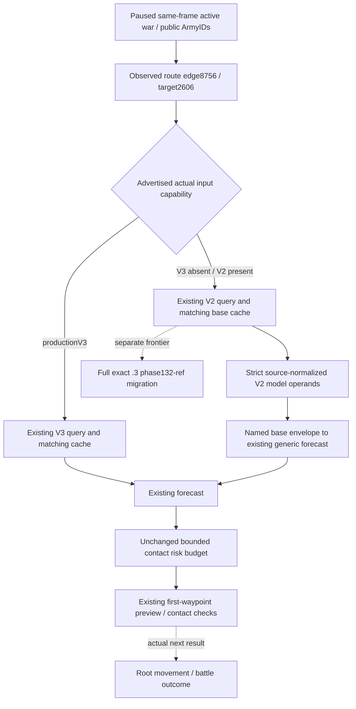

# General battle V2 base consumer on exact 1.20.0.3

## Source and actual input before implementation

The exact-build pin is CK3 `1.20.0.3`, Steam `25652598`, EXE SHA-256 `94B55397ABB687A3DCD436805A5D885E6BE90FA6C693FEB44A9E3BBEEADE02A6`. The implementation baseline is frozen g79/source715 (`715517beaa2bd49ad4c1fad9f4dd15a62c442da7`). Existing native research and pins are reused; this package reads no EXE and performs no game query or native build.

The saved R0048/day5996 plan stopped at `native_war_general_battle_inputs_query`, selected step null, while considering public Army218104048 from2619 toward hostile Army134218098 at2606. The observed route was2618→2615→2609→8756→2606, so final entry8756. The `.3` native descriptor inherits the `.2` capabilities and adds no productionV3 input capability. Its published base query is `game.command.query-combat-simulation-inputs-v2-N`. Both MCP tools are listed, but runtime capability decides executability. No combat-specific MCP launch flag is missing; `--private-war-cash-queries` controls expenses and send-fees.

The native V3 override and typed owning-thread mailbox exist. However `ReadCombatPhaseInputs` (ck3_12002_phase.cpp:1717–1735, reused by `.3`) always keeps the phase unavailable: successful migrated nonreligious collection reports `phase_religion_and_rites_implementation_pending`; failed demanded leaves retain their domain reason. The private diagnostic prefix exposes that bounded observer without productionV3 registration or the historical exact132-ref parser. Religion research is authorized; this is an implementation/coverage boundary. It must not be relabeled as complete132-ref input.

Root then obtained actual814 through the existing **V2** MCP `ck3_query_combat_simulation_inputs`:

```json
{
  "target_province_id": 2606,
  "attacker_entry_province_id": 8756,
  "attacker_army_ids": [218104048],
  "defender_army_ids": [134218098],
  "expected_revision": 32
}
```

Actual814 was accepted/available, query sequence1, `native:31`, public/native revisions32/31, raw date53288232, matching paused812/813 and independent815. Base `completeness.input_observation_ready=true`, **`monte_carlo_ready=false`**, with missing exact domains `damage_to_casualty_allocation`, `pursuit_transition`, `battle_end_and_retreat_transition`, `phase_event_rng_and_effects`. It contained39 attacker regiments/13 knights and8 defender regiments/4 knights. These exact values come from Root's actual existing query, not a new background query or a fixture-generated observation.

Actual files are under `Z:/ck3_mod_rewrite_process_assets/g2-resume-20261006/gameplay-responses/`: `810-v74-war100663329-plan-08.json`, `812-rule43-before-paused.json`, `813-rule43-after-paused.json`, `814-war100663329-combat-v2.json`, `815-v2-query-independent-after.json`. The external source-tree packet is `../war-general-input-query-blocker/` under that same resume root. The committed fixture is a reduced saved normalized814 base; optional diagnostic source leaves are omitted, while model operands, partition, current identities and readiness are preserved. Route mocks in the focused case replay the saved810 geometry; they do not manufacture a new current native route receipt.

## Native/consumer tree and minimal connection

The existing source sequence is request parser → paused alive-player/current active-war scope → source-bound base `ReadCombatSimulationInputs` → same-frame response → strict base normalizer → frozen V2 input. Target-effective stat getters, commander/knight context, counter resolutions and target geometry remain native observations. The optional complete phase-event slice remains separate. No current aggregate army strength, later final cache or guessed unknown replaces a required base operand.

The existing `forecast_fixed_contact` already accepts genuine complete base input through a named non-V3 envelope. Its existing generic branch deliberately reports `generic_commander_and_stock_static_approximation`, `native_phase_not_in_payload`, phase events disabled and future daily effective-stat/width/non-roll-advantage refresh unmodeled. The existing contact risk budgets and simulation math are reused.

The minimal planner connection chooses productionV3 when actually advertised, otherwise publishedV2. It binds the selected cache to the exact target, entry, ordered A/D IDs, paused snapshot ID, public and native revisions and successful query history after the latest restore/life advance. A missing or stale cache emits the canonical selected-version query. A demanded missing base operand remains model-unavailable or rejected; it does not create a synthetic phase slice or promote `monte_carlo_ready`.



This consumer is an approximate model path, not native AI parity or a calibrated victory probability. It preserves `monte_carlo_ready=false`, character-death risk unmodeled, fixed participants and unknown future reinforcement/exit/refresh. An active existing Combat requires resume inputs, not the new-contact model. A long route still needs its own first-waypoint preview/contact proof before movement. The actual query's input-observation readiness does not itself approve the movement.

The background implementation and first focused qualification are recorded below after their actual result. Root owns adoption and fresh same-PID runtime qualification; g79 and the live driver are unchanged by this isolated worktree.

## First focused qualification

Isolated `Z:/gfbs1` implements only the existing general-battle query/cache seam and a typed V2 forecast envelope (`schema_version=2`, source `same_frame_v2_base`, genuine base and genuine completeness). Native code, simulation math and admission limits are unchanged. ProductionV3 still wins selection when advertised; neither capability present leaves the query unsupported. This is not an advertisement of V3.

One new compound case ran once, **1/1 GREEN**, `1.0151453s`, with the reduced actual814 base passed through the existing strict normalizer, actual same-frame cache bindings, production planner ingress, production forecast default256 samples/120-day horizon and unchanged risk budget. The result was estimated256 wins/0 losses/0 unresolved and admitted by the existing rule. The next selected step was `preview-move-army-218104048-to-2618`, through the original first-waypoint path; no move was executed. These synthetic model trials are not observed battles or a calibrated probability.

The same case covers missing cache, native/public stale frames, wrong entry, wrong defender partition, absent current history, unsupported capability and preferred advertisedV3 without running another complete model. Null required damage remains `model_unavailable`; false base observation readiness remains `input_or_encounter_mismatch`. Neither partial branch emits a move. The stored actual base retains false `monte_carlo_ready` and its exact missing domains; no schema3 or phase slice is added.

The result keeps `generic_commander_and_stock_static_approximation`, `native_phase_not_in_payload`, `phase_events_disabled`, native parity false, no commander/knight-death probability and future daily refresh unmodeled. Consumer readiness is **static-ready with actual saved-input replay**. Root's new fresh query/planner execution must establish production-live consumer credit independently. No old fixture, build, game, EXE or pipe operation occurred in this background package.

Receipt: `Z:/ck3_mod_rewrite_process_assets/g2-resume-20261006/war-general-input-query-blocker/consumer-first-case-attempt01/RESULT.json`. Test: `ck3_autonomous_player/tests/unit/test_general_battle_v2_actual_814_12003.py`; fixture: `tests/fixtures/combat/live_814_12003_general_battle_v2.json`. Root owns Oct6/W41/handoff report integration, commit adoption and runtime qualification.

## Actual outer routing failure and minimal connection

After Root adopted the consumer, the ordinary full SDK reconnected g80/source1e7702aa on the same PID4692, session0/connection2, public/native revisions2/33, raw date53288232. The actual `840-v2-owner2-war100663329-plan-04.json` retained the correctly constructed V2 input request as `required_step` but set `selected_step=null`, with reason `selected backend does not implement required step query-combat-simulation-inputs-v2-2606-8756-a-1-218104048-d-1-134218098`. Root retained normal h9586/day5996, action0. The successful directMCP814 query remains separate evidence; no fresh cache or executed query is inferred from this failed plan.

The actual missing connection is the **service planner's outer route**, not native execution or another native capability: `plan_from_view` in bridge/service.py:1077–1094 adds dynamically supplied canonical V3 literals to `routable_steps`, but omitted the already implemented V2 literal. Native action expansion deliberately enumerates neither parameterized input query (native_driver.py:28835–28843), and native execution already parses and dispatches V2 (native_driver.py:9341–9355). `_route_plan_to_available_step`:14108–14122 therefore preserves the required V2 step and returns null even though the runtime backend advertised V2.

The smallest fix adds the existing `parse_query_combat_simulation_inputs_step` import and the same canonical-parser plus actual advertised-capability connection already used for V3. It does not add query literals to every action list, change native dispatch, advertise V3, modify input/model readiness, loosen any model risk budget or create a new gate. Root's next fresh query/planner result remains the production qualification.

The new actual840 required-step regression ran **FIRST1/1 GREEN**, `0.0069406s`, through production `GameplayBridgeService.plan_turn`. With the exact capability advertised, the canonical V2 step remains selected although the parameterized literal is absent from `action_steps`. Missing capability and malformed count preserve the required-step/null result; existing V3 routing is unchanged. The test mocks the inner choice with the actual saved required literal to isolate the observed outer failure, and executes no backend command or model. Its minimal fixture records that reconstruction explicitly. The previous actual814 model compound was not rerun.

Receipt: `Z:/ck3_mod_rewrite_process_assets/g2-resume-20261006/war-general-input-query-blocker/outer-v2-support/first-case-attempt01/RESULT.json`. Qualification of this outer connection is static-ready only; Root owns a subsequent fresh actual planner/query result.
