# Existing generic GUI paths on CK3 1.20.0.4

2026-10-07 / W41. Status: **research; finite source closure and implementation authored, qualification AUTHORED_NOTRUN**. Exact target is Crozier 1.20.0.4 / Steam25734779 / SHA `98702F88A547CDE2EAF29A85F93B85F68EE4CF8148336A4F7AFAEB75319DD518`, reused from Root's frozen metadata. No CK3, Steam, SDK, process attachment, GUI input, native build or fixture test was performed by this lane.

The actual117 compile flag receipt is `C:/codex-ck3-background/migration4-core-build/strict04/binaries-observers/manifest.json`. It supplies the candidate's flag selection, not an actual .4 live result: its recorded game identity is still .3. `NORMAL_EXIT_MAP_PRIVATE_V1`, `ORDINARY_INTERACTION_PRIVATE_V1` and `FRONTEND_GAME_RULES_PRIVATE_V1` are OFF and remain outside this migration. The two ON bookmark flags are covered separately by commit `089ee314c4389a439b8b932f3d0268c1852cfb0f` and [its native topic](frontend-1066-selected-model.md).

The default generic branches in `bridge.cpp` are a real additional input to the original207 registered tools. Their frontend branch selected legacy GUI for .4, while the ingame branch admitted only .3 or1.19.0.6; downstream Army readers, result identity and Python normalization also selected only .3. This package migrates those existing paths.

| Existing path | Actual scope and migration |
| --- | --- |
| `ck3_query_frontend_gui_route_v1`, `ck3_inspect_frontend_gui_tree_v1` | Fixed native route roots and bounded current tree, shared actual .4 GUI profile |
| `ck3_inspect_frontend_coat_of_arms_tree_v1`, `ck3_inspect_frontend_coat_of_arms_pattern_grid_v1` | Existing fixed `ruler_designer` / `coat_of_arms_page` scope and fixed pattern-grid path; no clipboard/source/export migration |
| `ck3_inspect_gui_window_tree_v1` | Existing fixed window root enum and shared bounded tree reader |
| Existing frontend fixed actions | Existing target resolution and original shortcut/button callback path; ACK remains verification pending |
| `ck3_query_ingame_ui_window_v1`, `ck3_select_army_ui_v1` | Existing modern **Army-only** scope; actual owner and reciprocal full-generation public CUnit/native CArmy join |
| Existing Army supply/attrition hover/query/leave | Existing source/nonce/later owner-turn/cache lifecycle with separately derived actual .4 textbox identity |

No new tool, facade, `ck3_execute_step` exception, arbitrary GUI target, character/combat/knights port, campaign or policy was added. The modern Army restriction and the legacy boundary are preserved.

The sole mapper's finite cache/claim API was used for exact declared source bodies and operands. Early shared GUI receipt: `Z:/ck3_mod_rewrite_process_assets/g2-background-20261007/generic-gui-12004/COMMON-GUI-SOURCE-READY.json`. Common field witnesses include the already mapped Setup constructor, actual named FindTop, the original owner lookup, exact app-to-context caller and the original fixed callback groups. The first288B named widget class-destructor block is partial: only four complete, individually matching parent/context instructions are credited. It is not claimed to be a whole equal method or a universal widget layout proof.

| Used actual .4 binding | Source closure |
| --- | --- |
| GUI slot `5CB87F8`; FindTop `3AAB0E0` | Reused Setup RIP plus complete392B FindTop body |
| app`+1B8` → host`+58` → context`+3D0` → lookup-host`+8` → owner`+D0` | Reused Setup body; exact47B current GUI caller and58B lookup span; FindTop root use |
| widget flags`D0`, context`D8`, parent`E8`, children`F0`, count`FC`, name`1B8` | Exact named original source uses, including explicit partial-block field pairs |
| Shortcut `3ABC4B0`, strict-descendant `3A78210`, ButtonBase slot13 `3AA0D20` | Complete declared source spans, modal vector`290/29C`, callback groups`338/3F8`, count`C`, stride`48`, object`40`, virtual slot`10` |
| SelectUnit `AF9000`; handler`C8`; window subject`C8` / root`60` / handler`A0` | Original select, view slot, window constructor/OnInit and native subject getter |
| ArmyWindow VT `454C5C0`, COL `4B43498`, TD `5776990` | Constructor RIP at`+A0`, followed by store`[r12]` at`+A7`; actual COL/self/type/name `.?AVCArmyWindow@@` |
| Jomini `5C6A520`, cast `4260E74`, TD `5514438` → `5514460`, idler`+88`, handler VT `44BA8A0` | Reused Death/Faith exact role receipts; unrelated modal field offsets are not transferred |
| Unit `5D1E380`, Army `5D1DE48`; Unit`10/174/178`, Army`10/124` | Reused `army-world-family/native-main/BASE-READER-SOURCE-CLOSED.json`; complete-generation identity and actual owner |
| Hover `3AA6020`; context hover`F0`, stack`190/198/19C` | Complete902B original hover span; existing stack count/capacity policy unchanged |
| Textbox VT `497B878`, COL `5082290`, TD `55BD330`, getter `1042240`, member`390` | Exact old named slot0 →62B paired class-vptr producer → actual COL/type/name → actual slot66 →8B getter |

Textbox VT moved by`50`, and ArmyWindow TD is`5776990`; neither is a universal `+10` table rule or a `.3` executable alias. A failed ArmyWindow candidate read is retained in `NAMED-ROLE-DATA-MISS.json`: constructor RIP`+25` names a string; the adopted table comes from the actual primary-vptr store at`+A0/+A7`. The invalid COL candidate caused no executable read.

The independent .4 headers select exact source coordinates. `BindIngameUiImage12004V1` requires the actual SHA, and the shared GUI environment receives it from the selected descriptor. `PrepareIngameUiMailboxV1` is the extracted existing worker constructor: published revision, fresh full Snapshot equality, paused/map/actor, original typed parser, exact descriptor, modern operation scope and provider-owned connection/native revision. The mailbox still reads its own fresh Snapshot before and after execution. The result serializers are extracted production producers and preserve the current wire routes.

Qualification recipes reuse full Snapshot source dependency `8e0623ee` (without inheriting a compiled or live success). `generic_gui_12004_fixture.cpp` constructs owned native memory, normal exact descriptor/profile bindings and a normal paused owner mailbox. Its sparse mapped native ABI stubs are offline fixture functions; GUI `offline_fixture_function_overrides` stays false, and the normal constructor, Army/GUI readers, full Snapshot composition and production serializers are used. Its seven whole output files are `state-snapshot-before.json`, `army-query.json`, `state-snapshot-after.json`, `mainmenu-route.json`, `mainmenu-tree.json`, `coa-route.json`, and `coa-tree.json`. They enter the unchanged native driver, protocol snapshot projection, Service and registered MCP through `run_ingame_ui_12004_mcp_fixture.py` and `run_generic_frontend_12004_mcp_fixture.py`. No Python Snapshot or typed result DTO substitutes for those frames. All three recipes are **AUTHORED_NOTRUN** until Root builds and runs them; they assert no action, selection, tooltip loop or Start.

Followup read cost is **8,410 frozen executable bytes in45 finite calls**, including the16B retained named-role candidate miss. There were zero whole EXE scans/hashes, PE reparses or raw pdata reads. Old/new runtime arrays were consumed as existing parsed metadata; preceding Bookmark, Death, Faith and Army source packets were reused without additional game body capture. The exact final source ledger and Root integration recipes are under `Z:/ck3_mod_rewrite_process_assets/g2-background-20261007/generic-gui-12004/`.

```mermaid
flowchart LR
    D[Actual4 exact descriptor and profile] --> C[Existing normal request constructor]
    C --> S[Fresh full paused Snapshot equality]
    S --> M[Original application owner mailbox]
    M --> G[Named GUI and typed Army native reads]
    G --> W[Production whole wire frame]
    W --> P[Existing driver / Service / registered MCP]
    P -. Root offline qualification pending .-> Q[Static ready]
    Q -. Root Robert campaign live pending .-> L[Production live primitive]
```

The .3 Army-panel live history remains in [army-ui-selection-window-12003.md](army-ui-selection-window-12003.md); its failed tooltip/cache and pixel boundaries remain in [army-tooltip-stack-diagnostics-12003.md](army-tooltip-stack-diagnostics-12003.md). A later application owner turn still does not prove GUI update, refreshed text or rendered pixels. This migration supplies no new tooltip live result, GUI update epoch, campaign start, OODA loop or G2 success. Root owns shared bridge/helper/CMake integration, the single build/SDK entrance and any later Robert live verification.
