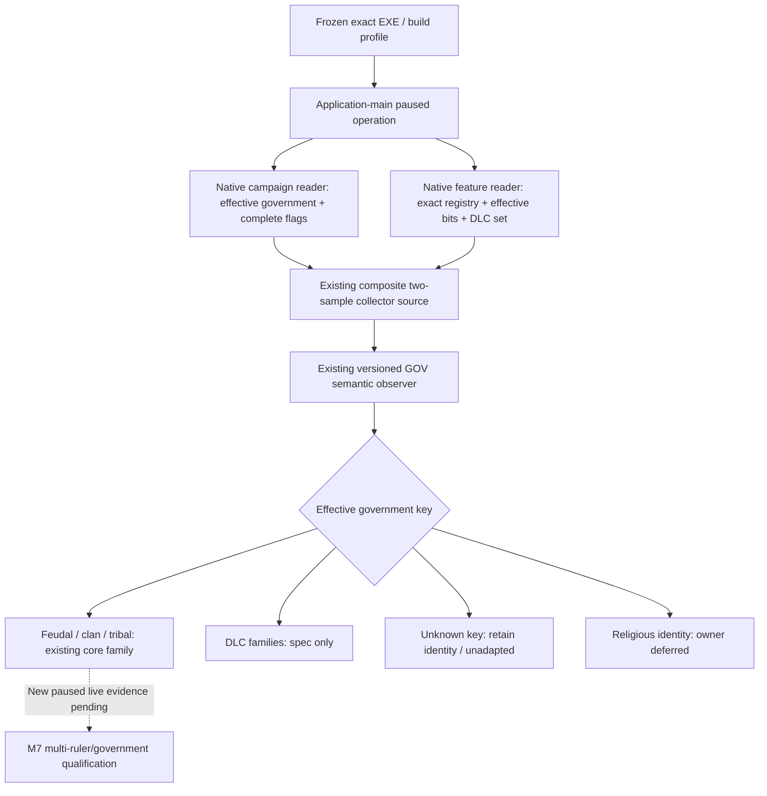

# CK3 1.20.0.2 government runtime adapter

This work migrates the existing GOV observer, collector source adapter and
private mailbox binder to the frozen 1.20.0.2 executable
`AE1BA6FF060BA603842F6F4A2DED0AF4B7D3666B3DD271F75FB01B0DA8E81B2D`.
The legacy 1.19.0.6 profile remains available. No running CK3 process is read,
started, stopped, attached or queried by this offline work.

## Native inputs and decision tree

The exact-build input ledger is
[`ck3_1_20_0_2_campaign.json`](../../ck3_autonomous_player/native_bridge/research/ck3_1_20_0_2_campaign.json)
and [campaign root and features](ck3-1.20.0.2-campaign-root-and-features.md).
The government resolver is `0x28C2E10`; the key is the native string at `+0x18`,
and the complete identifier vector is `+0x50/+0x5C`. Feature root
`0x5CB87F8` supplies the actual effective bitset at `+0x2B0` and enabled count
at `+0x2B8`; the native registry is `0x47334C0..0x4733570`.
The script DLC set is the direct object `0x5CC15E0`.

Both native registries contain 44 entries. In 1.20.0.2 `barter_troops` is absent,
old indices 37–43 become 36–42, and `by_god_alone` is new index 43. That key is
only an opaque feature identity here. No religious mechanism is inspected.
The existing celestial and mandala capability summaries omit the removed key
in the new profile; the new opaque key does not replace it as an adapter
requirement. DLC families retain `adapter_spec_ready_not_implemented`.

The stock identity table also changed: 18 rows now contain 171 flag
declarations, compared with 136 in 1.19.0.6. The old stock theocracy key is
absent and the new monastic holy-order key is retained only as an opaque,
owner-deferred identity. Clan tax-slot, tribal authority, domiciles and the
administrative/celestial budget flags are copied from the current stock files.
The feudal key and its five flags are unchanged. These are identity inputs;
this migration does not implement the budget or deferred religious systems.
The current Japanese feudal `can_get_government` block no longer authors the
old All Under Heaven gate. Its new identity row therefore does not use that
old gate as a readiness condition; the family remains spec-only, and its
capability summary still reports the actually observed feature bits.



The existing stock-government rows describe identity and capability families,
not a new policy or DLC entitlement verdict. Entitlement provenance stays
unavailable. Succession consumers must re-read the effective government and
feature vector; they cannot inherit a predecessor's adapter by assumption.

## Delivery boundary

The observer and source adapter now select the exact feature/stock-government
profile. The existing binder admits both frozen builds and calls the matching
native campaign and feature readers during its composite capture. This reuses
the existing source lifecycle and mailbox operation rather than joining two
independent public observations.

`SerializeGovernmentRuntimeAdapterSourceV1` emits the versioned
`government-runtime-adapter-v1` result, including the complete current feature
identities, copied government flags, selected family and
`readiness.core_adapter_ready`. That flag means the observed current identity
selects an existing core adapter; it does not qualify every core government or
complete M7. Noncore families remain spec-only. Religious governments publish
opaque identity/deferred status without a flag or mechanics projection.

The candidate caller uses `query-government-runtime-adapter-v1` and the fixed
`ExecuteGovernmentRuntimeAdapterPrivateOperationV1` mailbox executor. Its
registration and Python/MCP integration are tracked separately by the shared
bridge owners; this native package does not enable the shipping default.

Focused source acceptance is reproducible with:

```console
python ck3_autonomous_player/native_bridge/research/test_government_runtime_adapter_12002_standalone.py --artifacts <output-directory>
python ck3_autonomous_player/native_bridge/research/verify_government_runtime_adapter_1_20_0_2.py --game-root <frozen-installation-root>
python ck3_autonomous_player/native_bridge/research/test_government_runtime_adapter_observer_v1_source_contract.py
```

The standalone matrix compiles `/Od` and `/O2` with `/W4 /WX`. It feeds the
actual 1.20.0.2 loaded-feature reader's callback-backed memory output into the
source adapter and private mailbox, then retains actual JSON. The initial
four-fixture matrix also passed the three existing legacy observer/source/
binder fixtures. The current-profile fixture checks the new tribal authority
flag, the opaque monastic identity, legacy profile selection and rejection of
equal-sized wrong-version feature rows. The current stock-source verifier
passes all 18 identity rows and 171 declarations. The legacy source contract
passes its four tests. No live process or game pipe is used.

Artifacts and compiler logs are retained under
`artifacts/g2-offline-2026-10-01/government/`; the exact receipt scopes and
hashes are in
[`government_runtime_adapter_12002_abi.json`](../../ck3_autonomous_player/native_bridge/research/government_runtime_adapter_12002_abi.json).
Prior exact-build native campaign/feature ABI proofs are reused, including the
campaign producer's fixture evidence. The new composite fixture owns a narrow
valid feudal campaign input; it does not claim a new full live campaign read.

This package is `static-ready`. Real paused snapshots, multiple rulers/seeds/
governments and checkpoint continuation remain live work. M7 completion is
unchanged.
