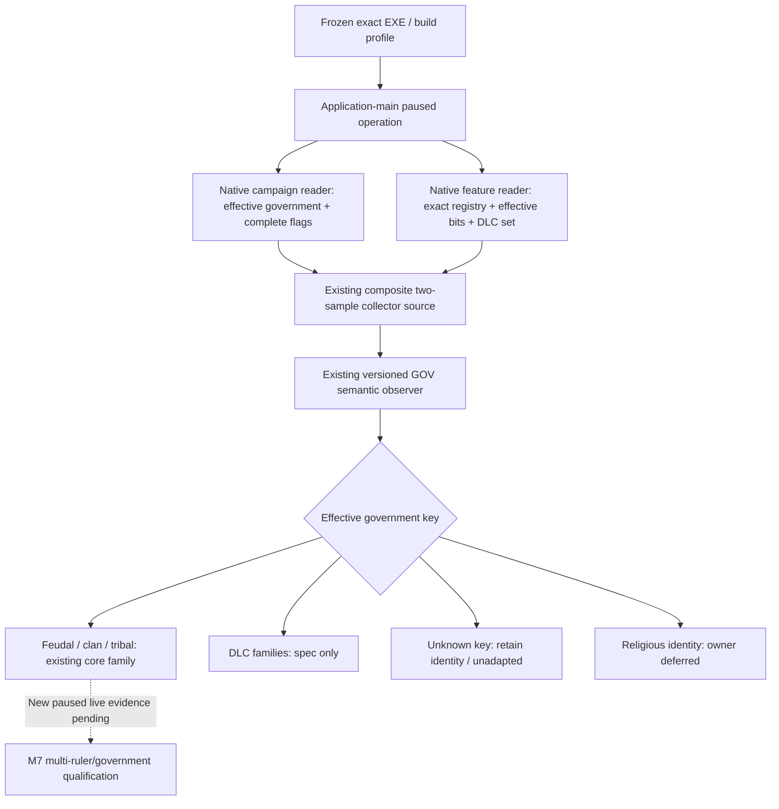

# CK3 1.20.0.2 government runtime adapter

This work migrates the existing GOV observer, collector source adapter and
private mailbox binder to the frozen 1.20.0.2 executable
`AE1BA6FF060BA603842F6F4A2DED0AF4B7D3666B3DD271F75FB01B0DA8E81B2D`.
The legacy 1.19.0.6 profile remains available. No running CK3 process is read,
started, stopped, attached or queried by this offline work.

## Native inputs and decision tree

The exact-build input ledger is
[`ck3_1_20_0_2_campaign.json`](../../ck3_autonomous_player/native_bridge/research/ck3_1_20_0_2_campaign.json)
and [campaign root and features](ck3-1.20.0.2-campaign-root-and-features.md).
The government resolver is `0x28C2E10`; the key is the native string at `+0x18`,
and the complete identifier vector is `+0x50/+0x5C`. Feature root
`0x5CB87F8` supplies the actual effective bitset at `+0x2B0` and enabled count
at `+0x2B8`; the native registry is `0x47334C0..0x4733570`.
The script DLC set is the direct object `0x5CC15E0`.

Both native registries contain 44 entries. In 1.20.0.2 `barter_troops` is absent,
old indices 37–43 become 36–42, and `by_god_alone` is new index 43. That key is
only an opaque feature identity here. No religious mechanism is inspected.
The existing celestial and mandala capability summaries omit the removed key
in the new profile; the new opaque key does not replace it as an adapter
requirement. DLC families retain `adapter_spec_ready_not_implemented`.

The stock identity table also changed: 18 rows now contain 171 flag
declarations, compared with 136 in 1.19.0.6. The old stock theocracy key is
absent and the new monastic holy-order key is retained only as an opaque,
owner-deferred identity. Clan tax-slot, tribal authority, domiciles and the
administrative/celestial budget flags are copied from the current stock files.
The feudal key and its five flags are unchanged. These are identity inputs;
this migration does not implement the budget or deferred religious systems.
The current Japanese feudal `can_get_government` block no longer authors the
old All Under Heaven gate. Its new identity row therefore does not use that
old gate as a readiness condition; the family remains spec-only, and its
capability summary still reports the actually observed feature bits.



The existing stock-government rows describe identity and capability families,
not a new policy or DLC entitlement verdict. Entitlement provenance stays
unavailable. Succession consumers must re-read the effective government and
feature vector; they cannot inherit a predecessor's adapter by assumption.

## Delivery boundary

The observer and source adapter now select the exact feature/stock-government
profile. The existing binder admits both frozen builds and calls the matching
native campaign and feature readers during its composite capture. This reuses
the existing source lifecycle and mailbox operation rather than joining two
independent public observations.

`SerializeGovernmentRuntimeAdapterSourceV1` emits the versioned
`government-runtime-adapter-v1` result, including the complete current feature
identities, copied government flags, selected family and
`readiness.core_adapter_ready`. That flag means the observed current identity
selects an existing core adapter; it does not qualify every core government or
complete M7. DLC families remain spec-only. Religious governments publish
opaque identity/deferred status without a flag or mechanics projection.

The candidate caller uses `query-government-runtime-adapter-v1` and the fixed
`ExecuteGovernmentRuntimeAdapterPrivateOperationV1` mailbox executor. Its
registration and Python/MCP integration are tracked separately by the shared
bridge owners; this native package does not enable the shipping default.

The implemented `ck3_12002_government_mailbox` caller unwraps the worker's
owner-published snapshot adapter, binds the native image of the current host
process after exact-build admission, and supplies snapshot/frame and memory
callbacks owned by the query. Current full snapshot reads and native memory
copies run only during the existing application-main executor. The worker
keeps the binder and operation alive until completion and reclaim, including
an already-running execution after the initial wait. A typed source
unavailable is a completed query with its requested revision, observed date,
current build provenance and reason; it is not a successful government read.
This caller's in-process queue/drain fixture is separate from the positive
native-provider fixture.

The actual caller fixture passes `/Od` and `/O2` with `/W4 /WX`. It exercises
the real predicate and admission, submission, deterministic pump/drain,
provider executor, waiting, serialization and reclaim. Unsupported/disabled
adapters and a zero revision do not queue. The owned fixture process has no
CK3 native roots, so its completed `campaign_collector_unavailable` response
is the expected harness condition, not a capability failure. Its actual
standard `command_result` envelope is retained at
`artifacts/g2-offline-2026-10-01/government/caller-final-v2/Od/wire/caller-unavailable.json`
(also under `O2`), SHA-256
`90817a4d4fb8f5f4521e5938af824c2779a44b0d72c9e07808474c2470213811`.
The receipt is `government/caller-final-v2/receipt.json`, SHA-256
`3af2875e89d204350c5775084075ad4ff6a9be59a15a9252662034dceaf49b27`.
The standalone uses the production unwrap function's bare-adapter identity
branch as a disclosed stand-in; the full bridge links the real unwrap function.
The first caller harness link lacked `User32.lib`; only the runner link was
fixed, and the failed attempt remains under `government/caller-link-red-001`.
The first native caller packet also exposed a real Python interoperability
failure: the standard private-query `accepted`, `private_build`, `read_only`
and `advertised` metadata was missing. The caller now emits the existing
contract values, and its focused fixture asserts them. Only the changed caller
fixture was rebuilt for this fix; the earlier packet and receipt remain under
`government/caller/`, while the positive provider and legacy proofs are reused.
The corrected actual native envelope subsequently passes the real Python
driver query and MCP SDK in one additional focused case (1.23 seconds), with
no metadata inserted by the test. Its unavailable reason and false core
readiness survive the transport. Together with the already-passed six native
payload/driver/SDK/default-off cases, seven transport checks are recorded at
`artifacts/g2-offline-2026-10-01/python-routes/government-actual-caller-sdk.json`
and `government-python-wire-result.json`; the earlier six were reused. Those
tests supplied the completed frame at `wait_for_command_result`; they did not
exercise the shared driver's preceding `NativeProtocolState.ingest` boundary.

## First paused sample: native observation succeeds, transport rejects frame

The first actual MCP sample at 2026-10-01 08:36 UTC retained
`paused-readonly-samples/sample-20261001T083615Z-c35a3d15/003-ck3_query_government_runtime_adapter_private_v1.json`
under the common `artifacts/g2-offline-2026-10-01/` root. It returned
`government runtime adapter command_result unavailable`. The surrounding
paused snapshots retained player 29829, date 53169072 and native revision 1;
the mailbox's published/completed/executed counters changed from zero to one.
This failed SDK attempt remains evidence and is not replaced by later results.

The coordinator then captured the actual native response under
`live-raw/readonly-20261001T084349Z/government-response.json`, SHA-256
`3004d5020ccb605507f4f7346fa2ea41df6e88a998ff5a2240a04480735adad4`.
That paused response has native revision 3 and the same player/date. Its
payload is available: `feudal_government`, five complete stock flags, all 44
current feature identities, actual script DLC identities, `core_supported`
and both same-frame/core-adapter readiness true. The missing `status` or
`backend_id` at the outer result level is not a parser defect: those values
belong to the nested adapter payload and its provenance, where they exist.
The earlier raw attempt whose step incorrectly ended in `-private` was a
separate coordinator harness typo, not this capability failure.

The actual caller omitted `protocol_version: 1` from its outer
`command_result`. The unchanged production `NativeProtocolState.ingest`
rejects the retained raw response with
`native bridge protocol_version must be 1`, before it can cache the result.
`government/live-protocol-red-reproduction.json` records this deterministic
reproduction through the real cache, without opening a game pipe or reading
a process. The production fix adds that existing protocol field to the GOV
caller; the provider, native offsets and shared parser are unchanged.

Only the changed caller fixture was rebuilt under `/Od` and `/O2`, both with
`/W4 /WX`. Its actual output now asserts an integer `protocol_version` equal
to 1 and passes real `ingest` followed by `wait_for_command_result`. The new
packet is `government/caller-protocol-v3/Od/wire/caller-unavailable.json`
(also `O2`), SHA-256
`87c16cc7c4c98fa0df525407ddb956116ff7fa79f31c3d00f7f0944e80396b1e`;
its receipt is `government/caller-protocol-v3/receipt.json`, SHA-256
`6dca5101783ab6e1fe36af1dc766d11a4c79cecbc23d9b5d946923e4f40a2768`.
The fixture's absent CK3 campaign roots still produce the expected typed
`campaign_collector_unavailable`, with false core readiness preserved. The
earlier producer/legacy matrices and all failed artifacts are reused. The
frozen running DLL is unchanged; an updated DLL and a new coordinator-owned
paused SDK query are still required to confirm the repaired live transport.

Focused source acceptance is reproducible with:

```console
python ck3_autonomous_player/native_bridge/research/test_government_runtime_adapter_12002_standalone.py --artifacts <output-directory>
python ck3_autonomous_player/native_bridge/research/verify_government_runtime_adapter_1_20_0_2.py --game-root <frozen-installation-root>
python ck3_autonomous_player/native_bridge/research/test_government_runtime_adapter_observer_v1_source_contract.py
```

The standalone matrix compiles `/Od` and `/O2` with `/W4 /WX`. It feeds the
actual 1.20.0.2 loaded-feature reader's callback-backed memory output into the
source adapter and private mailbox, then retains actual JSON. The initial
four-fixture matrix also passed the three existing legacy observer/source/
binder fixtures. The current-profile fixture checks the new tribal authority
flag, the opaque monastic identity, legacy profile selection and rejection of
equal-sized wrong-version feature rows. The current stock-source verifier
passes all 18 identity rows and 171 declarations. The legacy source contract
passes its four tests. No live process or game pipe is used.

Artifacts and compiler logs are retained under
`artifacts/g2-offline-2026-10-01/government/`; the exact receipt scopes and
hashes are in
[`government_runtime_adapter_12002_abi.json`](../../ck3_autonomous_player/native_bridge/research/government_runtime_adapter_12002_abi.json).
Prior exact-build native campaign/feature ABI proofs are reused, including the
campaign producer's fixture evidence. The new composite fixture owns a narrow
valid feudal campaign input; it does not claim a new full live campaign read.

This repaired package is `static-ready`. One actual paused native feudal
observation is now retained, while its original SDK transport was RED and the
updated transport awaits a coordinator-owned live query. Multiple rulers,
seeds, governments and checkpoint continuation remain live work. M7
completion is unchanged.
