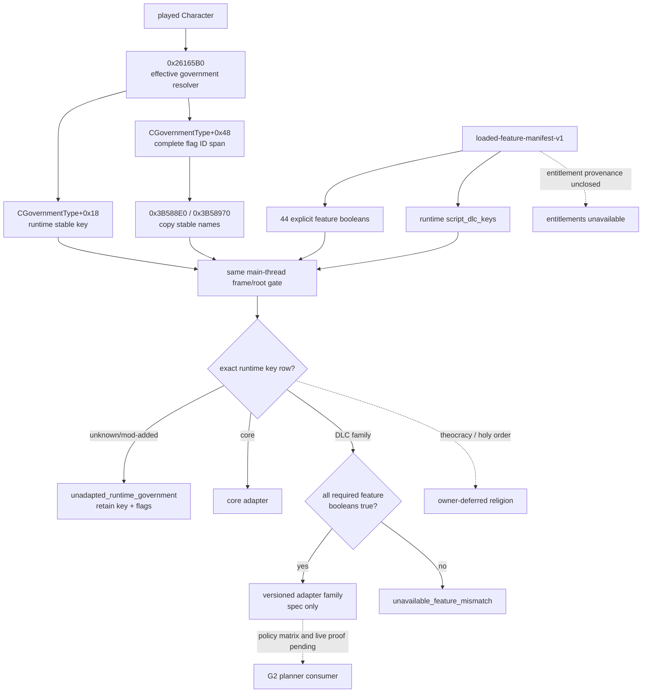

# CK3 1.19.0.6 government runtime identity and DLC adapter native tree

## Status and scope

- **[research / static-frozen]** This topic freezes the exact-build government identity reader, all 18 stock government definitions, their nonreligious native AI switches, and the runtime feature inputs needed to select a future G2 adapter.
- **[static-ready / private bridge binder]** The semantic observer, its
  collector-facing source adapter, and the GOV4 exact-build binder pass
  standalone normal and optimized MSVC `/W4 /WX` tests. The binder is compiled
  into the native bridge and provides a fixed read-only mailbox operation, but
  no bridge caller or mailbox permit slot invokes it yet. No public schema,
  planner, capability, or MCP surface changed.
- **[not live]** CK3 was neither started nor attached. The evidence is executable and source-file analysis only.
- Religion remains owner-deferred. `theocracy_government` and `holy_order_government` are retained as identity rows, while faith, doctrine, tenet, fervor, conversion, religious reformation, and holy-order mechanics are excluded.

Machine-readable evidence and the portable verifier are:

- `ck3_autonomous_player/native_bridge/research/government_runtime_adapter_1_19_0_6.json`
- `ck3_autonomous_player/native_bridge/research/fixtures/government_runtime_adapter_observer_v1_contract.json`
- `ck3_autonomous_player/native_bridge/research/verify_government_runtime_adapter_1_19_0_6.py`

The verifier reads an explicitly supplied installation root and never launches or attaches to the game:

```text
python ck3_autonomous_player/native_bridge/research/verify_government_runtime_adapter_1_19_0_6.py --game-root "<CK3 installation root>"
python -O ck3_autonomous_player/native_bridge/research/verify_government_runtime_adapter_1_19_0_6.py --game-root "<CK3 installation root>"
```

The private source adapter has a separate portable contract and focused test:

- `ck3_autonomous_player/native_bridge/research/government_runtime_adapter_source_adapter_v1_abi.json`
- `ck3_autonomous_player/native_bridge/research/test_government_runtime_adapter_source_adapter_v1_standalone.py`

It consumes already-owned `campaign-root-context-v1` and
`loaded-feature-manifest-v1` collector rows. It performs two captures on
application-main while paused, rejects any frame, lifecycle, player,
government, feature, or script-DLC identity drift, then owns all strings and
vectors passed into the semantic observer. It neither reads native memory nor
publishes a capability by itself.

The private bridge binder has its own versioned contract and focused test:

- `ck3_autonomous_player/native_bridge/research/government_runtime_adapter_bridge_binder_v1_abi.json`
- `ck3_autonomous_player/native_bridge/research/test_government_runtime_adapter_bridge_binder_v1_standalone.py`

The binder admits only CK3 `1.19.0.6` with the frozen executable hash, binds
the existing campaign-root and loaded-feature native environments, and runs
the GOV3 double observation inside one exact mailbox slot. Each sample must
match the operation revision and application-main execution date. The
campaign lifecycle must also match the mailbox stamp's game-state identity;
both collector roots must remain stable around each composite capture. A
private resolver proxy records the raw government object, while the
loaded-feature memory proxy records the script-DLC bucket base, mask, and
maximum spill. GOV3 carries those private identities across its two composite
captures and rejects drift even when the copied semantic values are equal.
The two collectors also retain their own internal government-object,
feature-root, and script-DLC-layout double-read gates.

The offline fixture path exercises the same revision/date boundary. Production
rejects fixture callback overrides. A typed GOV3 unavailable result completes
the mailbox executor, while direct calls, stale tickets, repeated operations,
and non-owner execution fail as transport errors.

Focused static acceptance, which never starts or attaches to CK3:

```powershell
py ck3_autonomous_player/native_bridge/research/test_government_runtime_adapter_bridge_binder_v1_standalone.py
py -O ck3_autonomous_player/native_bridge/research/test_government_runtime_adapter_bridge_binder_v1_standalone.py
```

## Exact-build freeze

| Asset | Exact identity |
|---|---|
| CK3 | `1.19.0.6` |
| `binaries/ck3.exe` | `2D00FF3101EF70B566F2FCBAE292F09263199C80E9DC8F139B82D7D96F83DB86`; 95,206,008 bytes |
| PE image base | `0x140000000` |
| `common/governments/_governments.info` | `14CA628A2C68B9DF4F7D6EABD6ACC44BF32BCDAF62D59ABD758729D0C71AFE5F` |
| `common/governments/00_government_types.txt` | `4AA234FD63CE8BBE73DAE4369A7E80FE8A33E779A22B41B80C3998F0FEE6D656` |
| `common/governments/01_japan_government_types.txt` | `453DBC17F91338FC31F847D2680D9C4DA04B270BE5A1BE793F1E258385CC0AF3` |
| `common/scripted_triggers/00_has_dlc_scripted_triggers.txt` | `E3CD5A7D72017861A5EB4D6EB9A41A345234243197148BA5AE1B4BD7B8AC630F` |
| `common/on_action/game_start.txt` | `84C0101F3273205433F6484A6184887BA377C57FEF18F735337369E0A2ED136C` |
| `common/defines/00_defines.txt` | `C1ECA141C71EC1E741CA5336E01BB538EEFAEC05B0684EDEC477CFC9053C3807` |
| `common/defines/ai/00_ai.txt` | `C78F9CD8DF9938CC9F38E817BCB6E32CD13720B5BD9DE077B85E3E1C6F030293` |
| repository baseline | `35cacc7b8f54070cf9e08d2b2ad946ae21d28c07` |

Every RVA below is relative to that image base. A different EXE or source hash requires a fresh analysis; another build's layout cannot be reused as verified fact.

## Effective government identity

The canonical resolver is `0x26165B0(CCharacter*)`:

```text
living + landed   -> *(Character+0x1B8) + 0x3F0
living + unlanded -> Character+0xC8 full CharacterID
                      -> generation-valid employer/liege
                      -> that Character's effective government
dead              -> *(Character+0x1C8) + 0x88
invalid / none    -> *(module+0x570CB50), the canonical no-government object
```

Its PDATA span is `0x26165B0..0x261668B`, with body SHA-256
`3ADC9AECCF798F877D763DC572B920FE57F5208B7FFDCC7B4A7B9E7D8B0D5AFC`.
The fallback load at `0x2616664` is
`48 8B 05 E5 64 0F 03`, resolving the pointer slot at `module+0x570CB50`.

RTTI binds the result to `CGovernmentType`: type descriptor `0x50C2270`,
COL `0x4A7DBF0`, and vtable `0x44063E8`. The stable key is the MSVC string at
`CGovernmentType+0x18`.

The complete flag set is the sorted int32 identifier span at
`CGovernmentType+0x48` (data at span `+0x00`, signed count at `+0x0C`).
The stock `government_has_flag` evaluator `0x2839340..0x2839464`
(body SHA-256 `FEAA2ED0199AB59F37CB9ED02F01EA1B44741DEFC474941FA8C226B9A3651273`)
calls the same resolver and tail-dispatches to binary search helper `0xB1C4A0`.
Each identifier is mapped to a stable name through `0x3B588E0 / 0x3B58970`;
the observer must copy the existing bytes and must not call the interner.

`CGovernmentTypeLink` is independently tied to the same identity:
type descriptor `0x533E640`, COL `0x47C3EB8`, vtable `0x41D5400`, slot 4
leaf `0x19D5780..0x19D57F9`, body SHA-256
`97357A9A22B25AC73D4CBEB76C1450982B879140AFD1D870449F0902F71036B8`.

The source-ordered stock fixture has 18 keys, 136 flag declarations, and 56
unique flags. Its canonical `[{key,flags[]}]` SHA-256 is
`7641BF95087F22F86ACD7892BAF7E44B02BA4FC2DCDC52ED4EB2DAC4327190BA`.
This fixture checks the parser and exact-build reader. It is not a runtime
allowlist: loaded mods may add a government or flag, so runtime output must
retain the observed key and complete flags.

## Nonreligious native AI policy tree

The government schema supplies these defaults:

| Native AI switch | Default |
|---|---:|
| `use_lifestyle` | true |
| `arrange_marriage` | true |
| `use_goals` | true |
| `use_decisions` | true |
| `use_scripted_guis` | true |
| `use_legends` | true |
| `use_great_projects` | false |

`perform_religious_reformation=yes` is also a schema default. It is
deliberately absent from the G2 contract because that policy belongs to the
deferred religion domain.

The schema additionally exposes
`ai_ruler_desired_kingdom_titles`,
`ai_ruler_desired_empire_titles`, and
`ai_can_reassign_council_positions`. Stock defaults retain three kingdom
titles and one empire title at the top tier. Celestial government authors all
three special fields; steppe-administrative and meritocratic governments
author the two title-count scripts. Their exact script results remain native
authority.

The exact government rows and every authored override are stored in the
research JSON. The adapter-facing summary is:

| Government | Direct source feature gate | Nonreligious policy distinction | Adapter state |
|---|---|---|---|
| `feudal_government` | none | defaults | core supported |
| `clan_government` | none | defaults | core supported |
| `tribal_government` | none | `ai_war_chance=0.25` | core supported |
| `republic_government` | none | marriage/goals/scripted GUI/legends disabled | unsupported player identity |
| `mercenary_government` | none | marriage/goals/scripted GUI/legends disabled | unsupported player identity |
| `administrative_government` | none | defaults | Roads to Power adapter spec |
| `landless_adventurer_government` | none | goals/scripted GUI/legends disabled | Roads to Power adapter spec |
| `nomad_government` | Khans of the Steppe | war chance 2; cooldown -0.5 | Khans adapter spec |
| `herder_government` | none | all listed active switches disabled | Khans adapter spec |
| `wanua_government` | All Under Heaven | war chance -0.5 | All Under Heaven adapter spec |
| `celestial_government` | none | three authored special AI scripts | All Under Heaven adapter spec |
| `mandala_government` | All Under Heaven | defaults | All Under Heaven adapter spec |
| `steppe_admin_government` | All Under Heaven | two title scripts; war chance 2; cooldown -0.5 | All Under Heaven adapter spec |
| `meritocratic_government` | All Under Heaven | two title scripts | All Under Heaven adapter spec |
| `japan_administrative_government` | All Under Heaven | defaults | All Under Heaven adapter spec |
| `japan_feudal_government` | All Under Heaven | defaults | All Under Heaven adapter spec |
| `theocracy_government` | none | identity only | owner-deferred religion |
| `holy_order_government` | none | identity only | owner-deferred religion |

`RARE_TASK_TICK` is `{180,720,360,180,180,180,180}` days by tier.
That cadence explains when stock AI reevaluates rare tasks; it is not a
scheduler for player automation.

## Runtime feature truth and adapter selection

The government row and the loaded feature manifest are independent truths:

1. `campaign-root-context-v1` publishes the effective runtime government key and complete flag vector.
2. `loaded-feature-manifest-v1` publishes all 44 effective feature booleans and the complete runtime `has_dlc` key set.
3. The future observer joins both in one main-thread, two-sample frame/root identity gate.
4. The adapter row is selected only by exact government key. Its required features are checked only against the same observation's effective feature vector.

Disk DLC descriptors, installed files, source `can_get_government` gates,
and the government key itself must not be used to reconstruct feature values.
The runtime `script_dlc_keys` corroborate product identity but do not replace
effective booleans. Entitlements remain
`unavailable/store_verdict_provenance_unclosed`; a cached false cannot be
reported as `not_entitled`.

| Runtime product key | Compiled effective feature group used by this topic |
|---|---|
| `Roads to Power` | `landless_playable`, `admin_gov`, `roads_to_power`, `landless_adventurer`, `advanced_aspirations` |
| `Khans of the Steppe` | `khans_of_the_steppe`, `nomads`, `landless_playable` |
| `All Under Heaven` | `landless_playable`, `all_under_heaven`, `merit_admin`, `advanced_aspirations`, `barter_troops` |

Startup cleanup gives a separate consistency signal. With MPO disabled,
`nomad_government` and `herder_government` become tribal. With TGP
disabled, wanua becomes tribal, while mandala, celestial, meritocratic,
steppe-administrative, and both Japanese governments become feudal. A
recognized row whose required runtime feature is false therefore yields
`unavailable_feature_mismatch`; the observer must not silently substitute a
core adapter.



The dotted edges are deliberate unclosed boundaries. They cannot be
represented as ready or live.

## Minimum read-only observer contract

`government-runtime-adapter-observer-v1` is a prospective, application-main,
paused-state query. It has no mutation surface. Its minimum output is:

- exact build/backend/frame and full-generation player CharacterID;
- effective government stable key plus the complete stable-name flag vector;
- all 44 explicit effective feature booleans;
- the complete runtime `script_dlc_keys` set;
- explicit unavailable entitlement provenance;
- selected adapter status/family, required feature keys, relevant feature
  profile, and `requirements_met`.

The observation is all-or-nothing. An outer orchestrator cannot issue the two
existing queries independently and label their joined results same-frame. A
new implementation must copy both native sources inside one main-thread
double-observation gate and reject changed frame, character/root identity,
government object, feature root, or set layout.

Unknown runtime government keys return `unadapted_runtime_government` and
preserve their identity. Religious identities return
`owner_deferred_religious` without querying religion internals. These states
do not lower G2 acceptance or masquerade as a supported adapter.

## G2 boundary and next work

This freeze removes the identity ambiguity for G2-M7: adapter selection can be
specified against an exact effective government key and a separately observed
feature profile. It does not complete the visible outcome of qualifying
multiple rulers/seeds/governments or restoring the same intent after
checkpoints and inheritance.

The next critical work is to give a private bridge caller ownership of the
existing collector bindings, admit this fixed executor in a candidate-only
mailbox slot, and retain paused live snapshots before any public query is
considered. After that, define policy matrices for supported adapter families
and validate them across multiple rulers and governments. Cross-inheritance
goal memory remains a separate consumer. Any policy derived from a government
transition must re-read the effective identity after succession rather than
carry the predecessor's adapter by assumption.
