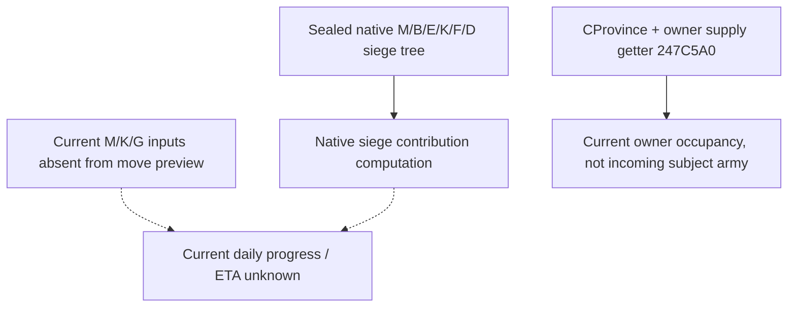

# Guard parallel siege objectives — CK3 1.20.0.3

This topic records a finite observe→choose→move→verify loop for Robert29829's guard
army. Readiness is **production-live loop for the route order**. Arrival, a second
siege, merge and completion of the objective remain unobserved.

## Native inputs before the action

The exact.3 source tree was sealed before MOVE: EXE SHA-256
`94B55397ABB687A3DCD436805A5D885E6BE90FA6C693FEB44A9E3BBEEADE02A6`.
The native siege input `M` is eligible siege-value/stack contribution, not troop
count. `E = 1000 * floor(max(0, B-G)/200)` and the fort factors depend on their own
inputs; thresholds `[4,6,11,16,31]` and `K<=i` multipliers are not observations of
current engines or daily progress. The closed source computes fixed-point `D`
with a minimum50000; previews below do not publish M/K/G or D, so no siege speed
or ETA is inferred from troop count or the supply comparison.

`247C5A0` receives CProvince and owner, with no subject-army receiver. Current
usage therefore is not a preview that has already added this unarrived guard.
Ordinary AI target utility/threat/score inputs and unused branches retain their
precise construction entries in the sealed native ledger; their absence adds no
prerequisite to the existing native-validated move.

## Two candidates and the finite counter-policy

Both readonly previews were observed at raw date `53261352`:

| Destination | Published route | Supply limit | Current owner usage | Conditional excess with3000 incoming |
|---|---|---:|---:|---:|
| 470 | [8651,8652,470] | 4562 | 3147 | 1585 |
| 3711 | [8651,1038,3711] | 2625 | 0 | 375 |

These are conditional sums using a held3000 troop decision operand, not current
poststate soldier values or predicted losses. The excess difference is1210.
Root chose3711, the smaller conditional occupancy cost, for a second objective
in the same CB while main301989997 remained at470. Target1351/unoccupied/fort6/
garrison500 comes from Root's separate occupation context, not these previews.
This choice does not establish siege speed, arrival ETA, sea/land traversal,
embarkation price or absolute supply safety.

## Submitted order and independent verification

MOVE70855 closed with exit0/GREEN: accepted, status`submitted`, war action`moving`,
postcondition_verifiedtrue, native revision106/public2/generation6, same episode.
Its player-army poststate is snapshot`native:107`/revision3: guard184549452 remains
at2619, state7 moving, observable target3711 and route[8651,1038,3711], controllable,
noncombat and nonretreat. Main301989997 remains at470, state3 sieging, route[].
Generic soldier values are null; the old3000 health value is not filled into them.

Root's independent final selected-field verification confirms those poses, actor
29829/same episode/eventnull. Normal SAVE is h8489/raw53261352, 98360219 bytes,
SHA-256 `e3c1756427af92cce486b913eeb2dc433be57c36360e9d4fae5c36ea8cb2325f`;
controller45869/gamePID110616. This verifies the finite route-order loop and save,
not arrival or initiation of the second siege. Subsequent24-day work is separate.

Evidence under `guard-reinforce-siege470/`: `A-native-inputs/` and
`minimum-split-target-policy/` are source-first; `actual-two-target-comparison/`
holds the preview ledger; `actual-move-order3711/` holds the command-cache receipt
and Root-reported independent poststate. `C-existing-recipes/parallel-target3711/`
`actual-move-order-consumption/ROOT-DELIVERY.json` qualifies the existing query/
action path. This topic consumer uses parent messages and the one small poststate
helper, reads no original004/TOP, and advances zero days. Root's last sealed ledger
is4876 global/1723 resumed/Oct5+218; later running days receive no advance credit.
