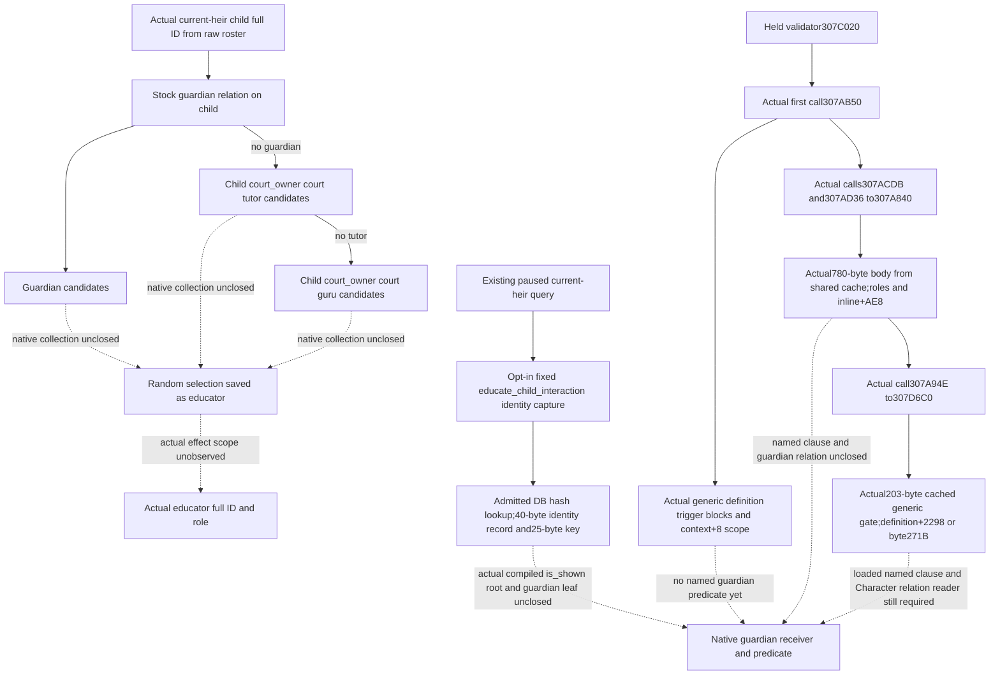

# Guardian and actual educator native source entry (1.20.0.4)

2026-10-09, late continuation of the Oct8/W41 family research packet. Root
supplied public baseline `0d13fd93f6c23741dfefc37f9e64cbdbe057351f`, qualified
SDK45ce and Native41's730-owner parent. Native38 focus and Native40's nine
child education-point trait inputs are qualified parent evidence, reused
without another read or test. Root has local Game permission again and owns
all Game/SDK operations. This lane only prepares source and unique offline
FIRSTs; it has no new child, guardian, educator, education or G2 credit.

## Native tree before implementation

The held `education_point_acquisition_support_effect` selects on the actual
child receiver: any guardian relation, then a random guardian relation;
otherwise the child's court_owner's court tutor; otherwise that court's
court guru. Each successful branch saves its random selection as
`scope:educator`. `guardian.corresponding = ward` and the inverse relation
are authored. The selector adds no explicit alive/adult/at-home/physically
able filter. Assignment eligibility is a different branch and cannot be
silently imposed on this selection.

Tutor/guru configuration allows one position, but that is not an observed
native cardinality or an actual effect-scope selection. Preserve all native
candidate IDs if a collection is acquired. Even a guardian collection does
not prove which random guardian became educator. Robert, the first heir,
parents and employers cannot substitute for the actual child or educator.
The sealed stock role tree is
`Z:/ck3_mod_rewrite_process_assets/g2-parallel-20261008/post-birth-guardian-educator42/stock-role-tree/`.

The separately sealed exact `educate_child_interaction` block has main
clauses `is_available`(:259), `is_shown`(:280),
`is_valid_showing_failures_only`(:304) and `can_be_picked`(:451), in
`common/character_interactions/00_education_interactions.txt:5-833`.
There is no top-level `is_valid`; that name belongs to send-option clauses.
Its selected guardian is `secondary_actor`, its selected ward is
`secondary_recipient`, while `puppet_or_actor` and recipient can be rebound
to guardian/ward lieges by redirect. The eight authored
`num_of_relation_guardian=0` predicates target potential or selected wards.
Selected guardian capacity instead uses `num_of_relation_ward<2`.
In particular, the main `is_shown` selected-ward branch counts guardians
at:299; this authored path does not name a native definition offset.
Bare receivers in `is_available` and `can_be_picked` still require their
actual evaluation-scope binding. Full source clauses and four branch
diagrams are retained at `.../stock-role-tree/next-interaction-clause/`.

Guardian truth is still unclosed. The existing literal-only HasGuardian
work is not rescanned. Complete interaction validation false does not imply
guardian presence; autoaccept+2290 is not is_shown.

Root delegated and this lane executed the first actual callee's exact
`[0x307AB50,0x307B30B)` body once:1979 frozen-image bytes, one read,
0.0002909 seconds,486 decoded instructions. The actual read started
2026-10-08T18:00:38.791551Z (Oct9 02:00 local). The existing text section
mapping and runtime function metadata were reused; there was no image hash,
PE parse, wide scan, old-body reread, Game or SDK operation. The two checked
exact named cache paths were absent; this is a scoped cache lookup, not a
claim that every owner cache was searched. The retained source receipt and
decoded body are in
`Z:/ck3_mod_rewrite_process_assets/g2-parallel-20261008/post-birth-guardian-educator42/native-receiver/firstcallee-actual01/`.

The body carries its input context in R15. Its definition is `[R15]` and
the script scope passed to the generic trigger evaluator is `R15+8`.
The following actual operands are inline definition trigger objects, not
qword roots, Character fields or named script clauses:

| Evaluator call RVA | Definition-relative inline object |
| --- | --- |
| 0x307AF5E | +0xC88 |
| 0x307AFC8 | +0xE28 |
| 0x307B040 | +0x1168, conditional on the parent's R8 flag |
| 0x307B0D1 | +0xFC8, conditional on definition+0x26FA and context+0x2F0 |
| 0x307B1B1 | +0xD58 |
| 0x307B222 | +0xEF8 |

All six call the existing generic evaluator0x372DF10. The surrounding
routine also contains engine/context gates, an unnamed virtual evaluation
through definition+0x19A8, optional diagnostic construction and a final
context+0x330 virtual gate. Its compound boolean does not prove
HasGuardian, a guardian collection, an actual educator or a named is_shown
result. These branches remain separate from stock role-selection evidence.

Two actual calls,0x307ACDB and0x307AD36, lead to0x307A840. Their observed
arguments are the same parent context and either zero or a transient
diagnostic pointer; they do not establish a callable public ABI. Held
runtime row166401 bounds the next actual body at
`[0x307A840,0x307AB4C)`,780 bytes. The sealed next manifest is
`.../native-receiver/nextcallee307a840-plan02/ROOT-NEXT-CALLEE-MANIFEST.json`:
The following authorized pass used an owner-held exact covering span;
there was no new image read. No guessed member labels are promoted to
native meaning.

### Actual second callee and remaining receiver seam

Root authorized the sole780-byte target and the source mapper found
`shared-span-cache/new-0307A840-0307AB4C.bin`. Its exact span was reused and
decoded once into188 instructions. Cache capture and persistence took
0.0060003 seconds at2026-10-08T18:14:24.274651Z (Oct9 02:14 local); new
EXE bytes/read calls, hash and PE parse were all zero. The separate receipt
is `.../native-receiver/nextcallee307a840-actual02/READ-COST-AND-RESULT.json`.
Neither the prior1979 bytes nor their decoded body was replayed.

The actual second routine keeps context in RBX and its optional diagnostic
argument in RDI. It checks definition+0x38 against0x4744624F, conditionally
checks the context recipient ID through0x3079570 when definition+0x2729 is
set, and checks the actor ID through the same helper. These unnamed checks
cannot be labelled guardian or alive predicates. Its inline core lookup
uses the full actor/recipient generation IDs at context+0x2D8/+0x2DC and
verifies the resolved recipient's Character+0x1C magic and Character+0x18 ID.
These operands agree with the retained generic context roles; they do not
identify which education-specific role is the child or chosen guardian.

For the resolved recipient branch, actual call0x307A93A passes definition,
resolved actor, resolved recipient and optional diagnostics to0x2BF5E10;
its true result rejects the compound routine. The next call0x307A94E
passes context and context+8 to0x307D6C0. False constructs optional
diagnostics and returns false; true reaches the final branch. Other paths
can bypass this gate when the recipient is not a resolved Character.
An optional context+0x330 object also evaluates virtual slot+0x58. Finally,
call0x307AB03 evaluates the inline definition+0xAE8 trigger object with
context+8 scope through0x372DF10. Only the successful compound path returns
true. This closes the actual receiver operands and return direction, not
the named script clause or guardian relation.

The next authorized gate was the actual target0x307D6C0, held runtime
row166420, `[0x307D6C0,0x307D78B)`,203 bytes. The source mapper again found
the exact shared span and decoded57 instructions once: no new EXE read,
hash or PE parse. Cache capture and persistence took0.0065129 seconds at
2026-10-08T18:19:13.917527Z (Oct9 02:19 local). Its separate receipt is
`.../native-receiver/nextgate307d6c0-actual03/READ-COST-AND-RESULT.json`.

This routine obtains the definition from `[context]`. A nonnull qword at
definition+0x2298 is passed to0x372DF10 using the caller's context+8 scope;
otherwise byte definition+0x271B supplies the condition. A false condition
returns true immediately. A true condition resolves actor/recipient full
IDs through the existing core lookup and tail-calls0x2BF5CA0. The meaning of
that condition and tail result is not named by these bytes. This is another
generic interaction gate, not a guardian relation count or collection.
No0x2BF5E10,0x2BF5CA0 or further generic callee is expanded.

The next work changes direction to a named loaded definition clause and
the existing Character relation source entry. The desired authored selected
ward count is known, but the linkage of inline+0xAE8 to that clause is not.
An existing typed whole-interaction callback must not be reinterpreted as
HasGuardian: rejection may arise from other gates. The actual child
guardian predicate, guardian target collection and effect-selected educator
remain concrete construction dependencies; no permanent null field is
introduced as an answer.

### Existing typed source seam

The admitted actual4 interaction context already binds generic evaluator
0x372DF10 through `ContextBindings.evaluate_trigger`, with the retained
`bool(void *, const void *)` interface. The existing ordinary interaction
reader in `ordinary_character_interaction_v1.cpp` has a named whole
`is_shown` callback bound to0x3079690. This is an existing source seam,
not the newly decoded0x307A840 routine. The held definition operand proof
covers canonical identity/hash/ordinal and consumed cost/autoaccept
operands; it does not name inline+0xAE8. Reuse the existing interface and
its exact selected-role capability before adding another capture hook.
Whole shown results retain their native meaning and cannot be converted
into an independent guardian count or target ID. Named loaded-clause
mapping and the actual selected child role are the next required source
inputs. The source-only interface inventory is retained at
`.../consumer-contract/next-source-actual780/`.

## Minimal research helper and same-query hook

The admitted actual4 interaction provider already binds database getter,
stable hash and definition lookup. Definition ordinal+10, hash+14 and MSVC
canonical key+18 are retained source operands. The optional request
`capture_education_definition_source=true` on the existing
`ck3_query_current_first_heir_relationship_private_v1` captures the fixed
`educate_child_interaction` identity in its same paused app-thread shell.
False/default queries keep their original arguments and perform no capture.
No child or guardian is fabricated when the current roster is empty.

The query-local sidecar reads exactly40 bytes starting definition+10 and,
when the captured native key layout permits it, the full25-byte key. At most
65 explicit bytes are attempted per opted-in query. The source result is
`descendants.education_definition_source_capture`, with source
`native_education_definition_identity`, unchanged frame, requested key,
partial observed pointers/hash/ordinal/key and the two bounded byte records.
Available means only that this definition identity was observed. Failure
retains its research trace and reason. Neither result contains HasGuardian,
guardian IDs, selected educator, eligibility or an action.

The public Snapshot/relationship/descendant layouts remain unchanged.
The helper, private serializer overload and query-local storage are private
owners. The ordinary family plan neither opts in nor gains a readiness gate.
The strict registered consumer retains this optional research record but
does not turn identity availability into a playable child decision. The
candidate is frozen at private source
`4f63c7cbfa0e90d049bb0f3476c2004d0d6c515c`, tree `Z:/cg42-guardian`.
Root explicitly preserves it without adoption or build while finite
existing-code source closes the actual reader. The independent doc-only
delivery adds no helper, ABI field or MCP flag to public production.

## Unique qualification and next source capture

Root owns one new native mode `--education-definition-source-wire-dir`:
five zero-child whole relationship wires for valid identity, missing DB,
missing definition, identity mismatch and record-read failure. One sole
consumer uses these plus a labelled legacy capture-field-removal copy.
The candidate explicit query requests capture once; the subsequent ordinary Service
query omits it and receives the normal relationship. No old child/focus/
trait qualification is replayed. New build/FIRST are SOURCE_NOTRUN.

If Root adopts and qualifies this research helper, its first real paused
capture uses the existing same-revision public primary heir, the opt-in
query flag and a separate saved raw research record. It works when children
remain zero. The completed1979-byte actual callee capture and this65-byte
runtime identity capture have different purposes and do not repeat one
another. The next
construction needs an actual compiled root/member, scoped guardian node and
its Character receiver. Guardian IDs require an independently closed
relation direction/collection; educator selection requires the actual effect
scope. These are explicit unfinished dependencies, not permanent null fields
or a claim that childhood decisions are ready.
