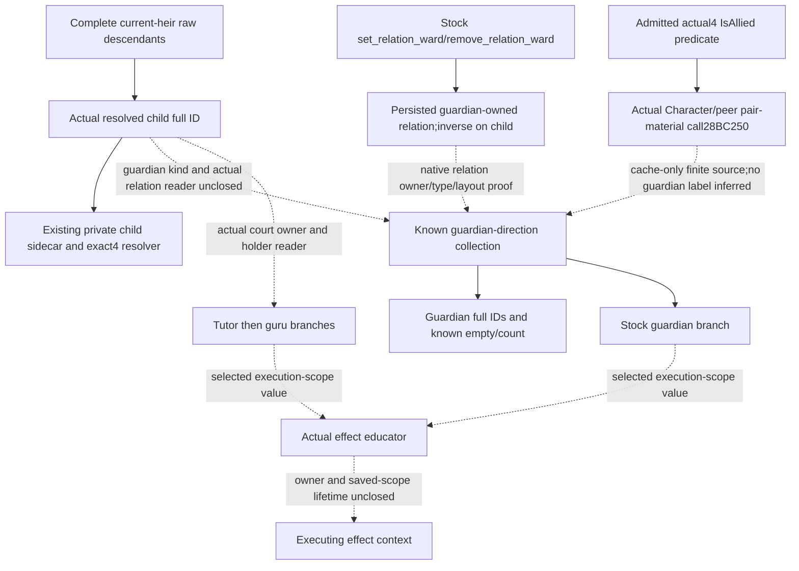
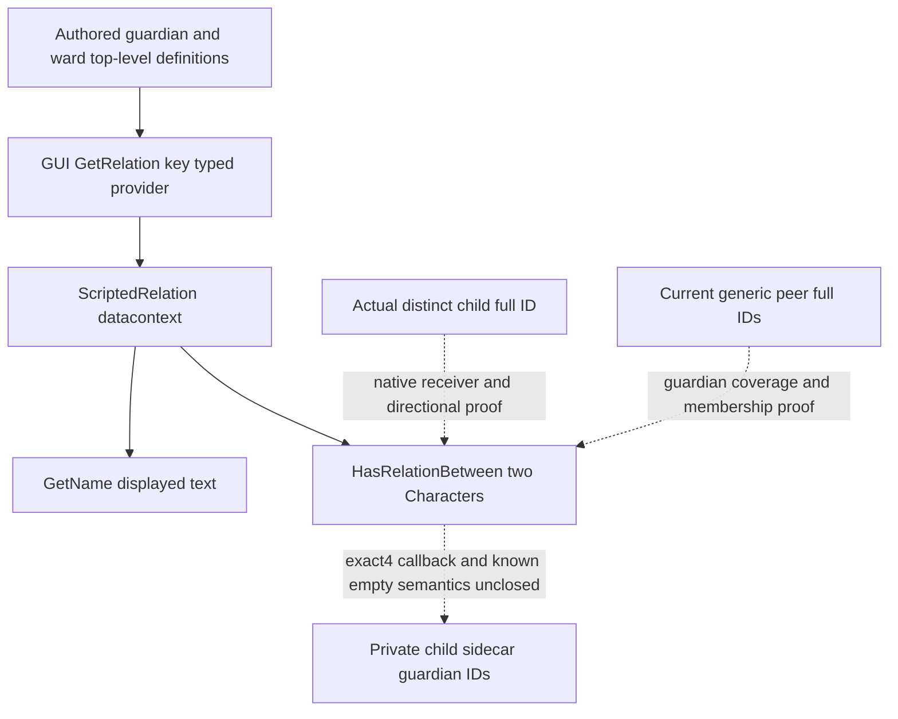

# Guardian relation and executing educator owner (1.20.0.4)

2026-10-09, G2 background source work. The source baseline is Root's current
integrated `5d185e1b007794bd8bbe5827e95168b7ae68cded`, supplied from `Z:/gb0`.
Root separately supplied R81's frozen SDK/native source
`088fed39e0ceda7b28c2b0ee2113db4ce61fa58a`; this source lane does not borrow
its live qualification. The old standalone store14c and private65-byte
identity candidate are not current production and are not adopted here.
Root alone owns Game/SDK/build/FIRST. A currently empty child roster does
not stop offline closure of the missing guardian and educator inputs.

## Native input tree before implementation

The existing current-heir query resolves each real child from the complete
raw descendant roster. Its private child sidecar already carries independent
age/sex, childhood traits, current focus and nine education-point trait
inputs. Those qualified interfaces are reused, not replayed. The missing
input is the actual child's guardian-direction relation, including a known
empty result and the full guardian target IDs. The played Robert or the
heir cannot stand in for that child.

The authored educator selector first takes a guardian relation from this
child; otherwise it selects a court tutor, then court guru from the child's
actual court owner. Its saved `scope:educator` is a selected execution-scope
value, distinct from the persisted guardian relation or candidate collection.
No new strategy or action is designed before these source inputs are closed.

## Distinct source lanes

The direct getter lane uses only held exact4 source and named caches. The
HasGuardian/CharacterWindow literal work is retained as unknown and is not
rescanned. The decoded generic interaction chain AE8/2298/271B is archived;
it is not recursively expanded as a substitute for a guardian getter.
An actual relation-specific call from the admitted IsAllied predicate offers
a different native source seam. Its magic and flags remain alliance
evidence until an actual guardian type/definition is proved.

The owner/lifetime lane closes authored persistent writes and removals,
the educator scope producer/consumer, and any existing named-scope observer
that can consume a proven owner. A current played ActiveEvent cannot be
assumed to be an arbitrary child's hidden executing education event.
Historical education memories cannot be called the child's current teacher.

The detailed source ledgers and each uniquely bounded next capture are
sealed under
`Z:/ck3_mod_rewrite_process_assets/g2-parallel-20261008/post-birth-guardian-direct44/`.
Only an actual closed getter or collection can be wired into the existing
`descendants.child_inputs` private sidecar. No permanent-null guardian or
educator field is published as a completed capability. Root owns the sole
new whole-native/registered-consumer FIRST after real source closure;
all new implementation qualification is currently NOTRUN.

## Actual cached Character pair provider

The admitted exact4 `IsAllied` body calls `0x28BC250` at `0x2911E8B`,
with the two actual Character pointers as RCX and RDX. Its subsequent
`0x41637452` check and flags belong to the observed alliance call; they
do not identify guardian direction or a guardian type.

The existing shared `new-028BC250-028BC300.bin` was consumed in two
nonoverlapping source passes: `[0x28BC250,0x28BC279)` (41 bytes, 10
instructions) and `[0x28BC279,0x28BC300)` (135 bytes, 41 instructions).
The first `.pdata` row describes a prefix, not the complete semantic
function: it falls through at279 and branches to2F4. The continuation
closes the three observed returns at2E3,2F3 and2FF. This corrects the
earlier complete-function wording without repeating its bytes or decode.

The combined source performs a lower-bound lookup over the original
Character's `+0x1B0` container. The container's `+0x20` data and signed
`+0x2C` count describe 16-byte rows. Each row's first uint32 is compared
with the peer Character's complete `+0x18` ID; a found row returns its
`+0x8` material pointer. Null container or absent peer returns the same
global qword at RVA `0x5D27B70`. The helper therefore supplies generic
pair material, including a fallback object. Neither a pair match nor
that fallback proves a guardian relationship. It is not a complete
guardian-direction collection and does not resolve the guardian kind.

Both passes read only the existing cache: 176 bytes total, zero new EXE
bytes, PE/hash reads, Game/SDK calls or tests. Receipts are
`native-getter/cached-pair-provider-actual01/` and
`native-getter/cached-pair-provider-continuation02/` under the packet root.
Their corrective interpretation is `PAIR-PROVIDER-INTERPRETATION.json`.

## Genuine named relation entry remains the construction dependency

The frozen stock expressions establish three separate native names:

| Exact name | Held actual4 literal RVA | Source expression and needed proof |
|---|---|---|
| `HasGuardian` | `0x4761EE0` | `gui/shared/lists.gui:1591`: Character predicate; its registered callback and Character receiver remain unclosed. |
| `GetRelationsOfType` | `0x451C558` | `gui/window_character.gui:2956`: CharacterWindow collection; forwarding to the intended child and complete element full IDs remain unclosed. |
| `GetRelation` | `0x4520880` | Same line's `GetRelation('guardian')`: guardian authored kind/definition lookup; its native discriminator and ABI remain unclosed. |

The exact names are standalone strings. The held `.rdata` VA64-reference
pass and named `.text` RIP-relative pass have no callback candidates for
them. These finite negative results are reused. Existing interaction
definition lookup and script-identifier lookup are different registries;
neither is renamed as a relation database.

Root authorized one necessary `.data` locator on2026-10-09. Its held
mapping is RVA88272896, raw offset88267264 and raw size8571392 bytes.
`ROOT-NAMED-DATA-LOCATOR-ARGV.json` selects only these three literal
VA64/RVA32 references in the same buffer and records at most80 adjacent
bytes on each side of a hit. The helper does not persist the whole buffer,
parse new PE metadata or hash the image. Potential neighboring text
addresses are locator evidence until an actual registration record and
receiver are proved. The first source commit212cb retained
`SOURCE_NOTRUN`; the actual Root result below supersedes that execution
state. A no-hit result requires a genuinely different authored relation
entry, rather than expanding generic validator or encoding scans.

The working source is based on integrated5d185. Root's later published
`be9bfd550f3cfbab041a16b39d0faf1239f47054` is a distinct mainline;
this new topic is independently portable and overwrites no production code.

## Assignment owner, educator scope and observable contract

The persistent authored relation has a concrete writer/remover in the
frozen stock `common/scripted_effects/00_education_effects.txt`:
`ward_depart_effect` replaces the old guardian where applicable at3294–3315,
then the no-travel path writes `scope:guardian = { set_relation_ward =
scope:ward }` at3343. `remove_guardian_effect` removes the same direction
at3475. `guardian.corresponding=ward` and the inverse direction are in
`common/scripted_relations/00_scripted_relations.txt:127–140`. Submission
or pending travel is not a readback of this relation afterstate.

The support effect at249–438 saves an execution-local educator in the
guardian, tutor and guru branches at260,270 and281, then consumes that
named binding at319–435. It persists child education points, not a teacher
ID. There is no explicit saved-scope clear or container release in the
authored block; destruction at its closing brace is unproved. The age16
`childhood_education.0006` event selects an educator independently at222–251.
Wrap-up's `childhood_education_guardian` memory at1981–1986 describes that
completed education; it does not identify the current guardian or a prior
point-effect educator. The exact native execution owner and scope-copy/
destructor remain a separate input dependency.

Current-source reuse is concrete: the child collector resolves the row's
own full ID at `ck3_12004_first_heir_child_inputs.hpp:224–231`; the private
query sidecar is collected in `bridge.cpp:9558–9573`, serialized by
`current_first_heir_relationship_v1.cpp:182–205`, and retained through
`current_first_heir_descendants_v1.py` and the existing MCP query. The
existing actual4 event-window bindings and `ReadEventScopeInventory`
can read saved scopes from a proven ActiveEvent owner. That owner is not
automatically the child's hidden9002/support-effect execution context.
The independent next educator seam is the exact `save_scope_as` registered
effect callback, then its actual owner and directly reached upsert/copy/
destructor. No guessed callback RVA or old1.20.0.3 ABI is supplied.

The minimum guardian observation will retain the actual child ID and
occurrence group, independent availability, complete guardian-direction
target full IDs/count, and observed known empty. A failure remains
unavailable; no guardian is a legitimate available empty result. It must
read the current relation without candidate-eligibility filters. A separate
optional effect-educator receipt needs the actual child root, support-effect
identity, proven executing owner, selected named Character token and its
occurrence/revision. A court holder or one guardian candidate is only a
role input and cannot be labelled as the random operator's selected educator.

The future unique Root FIRST must exercise the actual closed production
reader and whole registered consumer: full-ID matching and generation
decoy, legal complete empty, independent read failure, multiple actual
children with their own guardian targets, and relationship removal afterstate.
Selected effect educator needs a separate owner-qualified scenario and
cannot be faked with a permanent-null field. These are source contracts,
not passed fixtures. No build is requested merely to publish identity
metadata; existing age/sex/focus/trait qualification is not replayed.

Readiness remains `research`: generic pair provider and authored ownership
inputs are closed; typed guardian reader and executing educator owner are
still necessary construction dependencies. Tests and new native/consumer
FIRST are `NOTRUN`. There is zero guardian assignment, educator selection,
child education, birth, natural succession, live or G2 completion credit.

## Root locator result and the typed provider alternative

Root alone executed the exact three-name `.data` locator on2026-10-09
05:19:54.049028–05:19:54.084301 UTC. It is
`ACTUAL_NAMED_LOCATOR_GREEN`: one8571392-byte frozen-image source read,
0.003616600064560771 seconds for that read, zero hash/new PE reads,
and no persisted whole-section buffer. `HasGuardian`,
`GetRelationsOfType` and `GetRelation` each have zero VA64 and zero
RVA32 references in that pass. The result is
`native-getter/root-data-named-first01/GUARDIAN-NAMED-DATA-REFERENCES.json`.
It supplies no callback or relation truth. The earlier `.rdata` and
`.text` results are reused, and this three-name scan route stops here.

The next source owner comes from a real typed GUI provider/consumer
chain. It is not another encoding scan or generic pair-object expansion:

| Source | Actual typed flow |
|---|---|
| `gui/shared/portraits.gui:3087,3101` | Individual lover/friend icons set `datacontext="[GetRelation('lover')]"` or `GetRelation('friend')`. |
| Same file `:3450–3512` | Character-window icon instances override the icon template; the original kind-object datacontext remains its provider. There is no inferred `GetScriptedRelations` producer. |
| Same file `:3035,3052` | `ScriptedRelation.HasRelationBetween(GetPlayer,Character.Self)` consumes that typed kind object and two real Characters. |
| `gui/window_character.gui:5788` | The window template consumes `ScriptedRelation.HasRelationBetween(CharacterWindow.GetCharacter,Character.Self)`. |
| `gui/shared/portraits.gui:3073` | `ScriptedRelation.GetName` supplies displayed text, not a proved canonical key round trip. |
| `gui/window_character.gui:2956,2972,3007` | Actual `GetRelation('guardian')` arguments supply the authored guardian key. Ward uses the distinct `GetRelation('ward')` key at2731,2748,2783. |

This establishes a **loaded `GetRelation(key)` typed object provider →
`ScriptedRelation` receiver → `HasRelationBetween(owner,peer)`** source
entry. It does not establish the native registration callback address,
definition storage, this/argument ABI, direction, collection coverage or
absence behavior. The old standalone literal had no direct references;
the genuine typed provider/caller must now supply those facts. There is
no invented GetScriptedRelations collector or numerical relation kind.

`common/scripted_relations/_scripted_relations.info:4–15` documents
top-level key definitions. At19–26 it distinguishes owner/root from
`scope:target`, and generated `on_set_relation_x` from corresponding
addition; at34–35 it retains the initiating Character direction. The
guardian/ward corresponding keys are therefore separate directions.
The info's `relation_aliases` example at8 changes scripted relation
matching; it is not a bridge type alias or numerical-kind equivalence.
The held guardian/ward blocks author no aliases internally, without
claiming absence of aliases elsewhere in the database. Ordered ward
flags and documented flag APIs are not needed to identify guardian
presence, and are not expanded into a new flag census.

Current source has no bound `ScriptedRelation` type, registry or
`HasRelationBetween` callable. Marriage-interaction definition lookup,
HouseType, ScriptIdentifier, combat-side `PhaseRelationKind` and
land/army-owner relation rows are different domains. Software reuse is
limited to the already admitted actual-child/full-ID resolver and paused
private same-query collection/transport. The generic peer inventory can
be a candidate source only after coverage for guardians is proved; a
pair predicate by itself does not promise a complete collection.

The sole new source-FIRST contract is
`FIRST_SOURCE_NOTRUN_SCRIPTED_RELATION_GUARDIAN_PROVIDER`. Root needs one
real typed definition returned for canonical key `guardian`, its native
identity/key proof, and the registered HasRelationBetween target and
actual receiver direction. A missing callback RVA is explicitly absent
from the source manifest; no byte range is fabricated. Only a genuinely
located target permits a finite code capture. After that closure the
existing private child row can carry available relation presence/full
guardian IDs and legal empty independently from unrelated child inputs.
Future production-reader fixtures retain generation-aware full IDs,
guardian/ward asymmetric direction, multiple children, removal afterstate,
legal empty and independent unavailable input. They are not executed or
called passed, and no permanent-null guardian field is published.

The independent source packets are `alternative-authored-kind45/`
and `alternative-provider45/` under the same artifact root. Temporary
educator owner/AE8 work is not expanded in this alternative. Worker
build/test/EXE/Game/SDK operations remain zero. Readiness is `research`;
the Root locator is actual source evidence, not guardian, education,
birth, natural succession, live or G2 capability credit.
