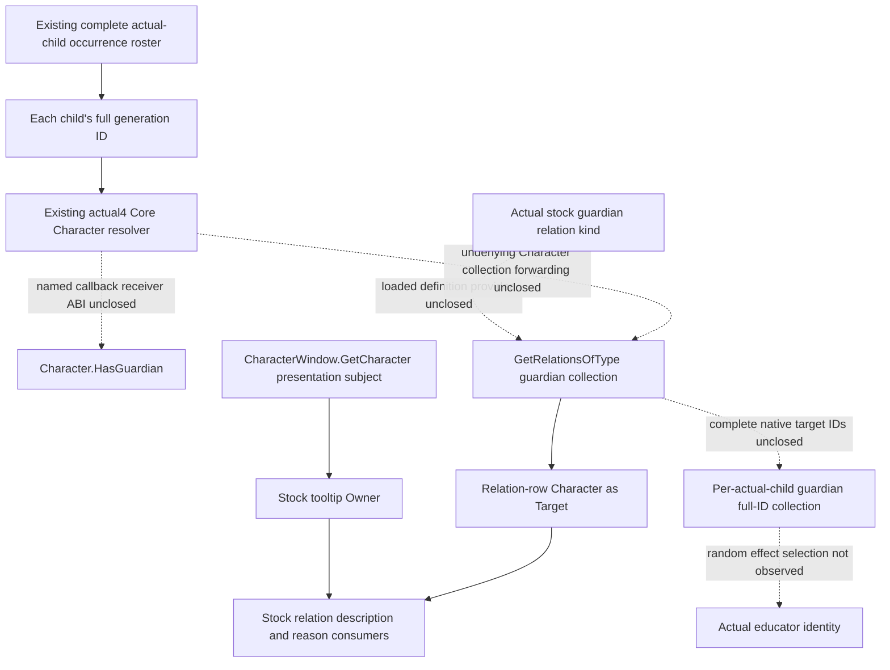
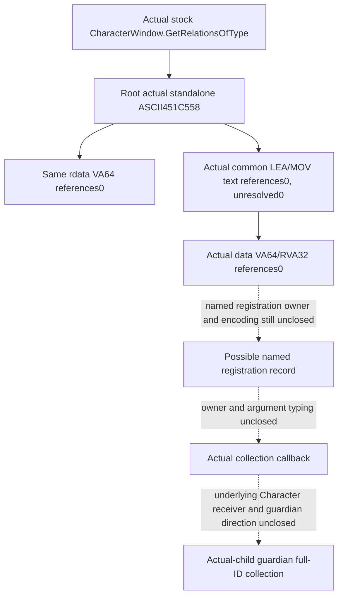
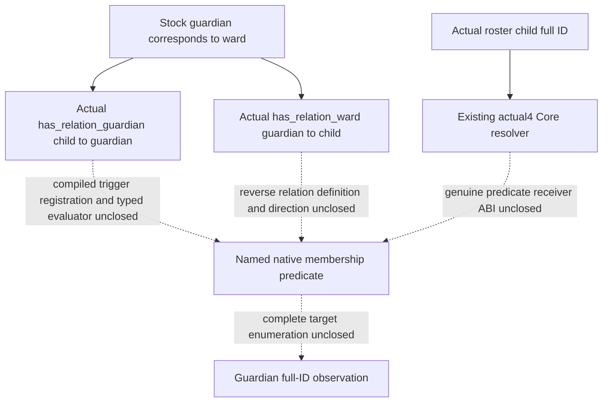
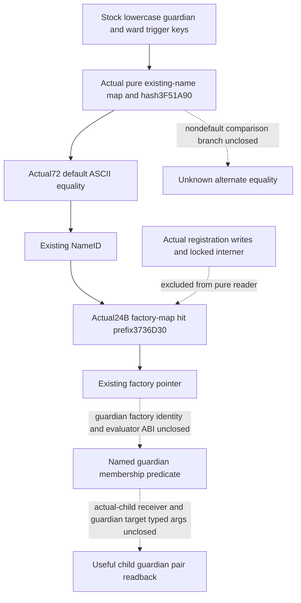
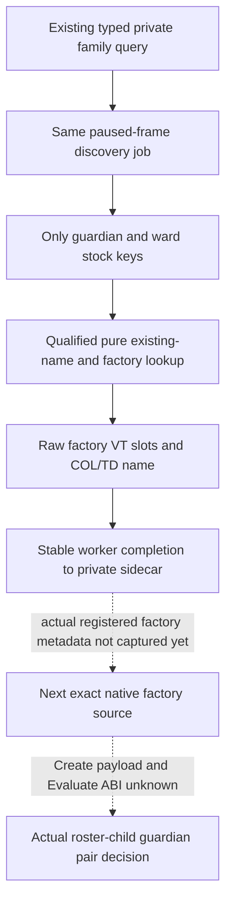

# Actual-child guardian relation: named Character binding (1.20.0.4)

2026-10-09?10 / W41. Guardian membership remains research; Native61's
private discovery seam is static-ready on offline fixtures only. Reuse
Root's CK3 1.20.0.4 / Steam
build25734779 freeze and executable SHA
`98702F88A547CDE2EAF29A85F93B85F68EE4CF8148336A4F7AFAEB75319DD518`.
Native54's private CharacterWindow candidate reader is a separate source
package, author `282f9da31b6760b260abe23bdc9cfe3805288112`, adopted by Root
as `ff5f919f`. Root qualified its five new whole packets and sole six-scene
consumer offline; see [the independent Native54 qualification](character-window-guardian-native-provider-12004.md).
A window subject cannot substitute for an actual roster child or establish
a guardian.

## Actual installed stock consumer and direction

The following source is the actual Steam installation under
`Z:/SteamLibrary/steamapps/common/Crusader Kings III/game/`. Only these
three named files were checked in this continuation. The older repository
reference copy has different line numbers and is not used as actual4 proof.

| Installed source | Established input or consumer |
| --- | --- |
| `gui/shared/lists.gui:1591` | `And(Not(Character.IsAdult),Not(Character.HasGuardian))` consumes a no-argument Boolean on the row Character. |
| `gui/window_character.gui:2956` | `CharacterWindow.GetRelationsOfType(GetRelation('guardian'))` supplies the guardian relation portrait collection. |
| `gui/window_character.gui:5794` | `GetScriptedRelationTooltip(ScriptedRelation,CharacterWindow.GetCharacter,Character)` passes window subject as Owner and relation-row Character as Target. |
| `data_binding/scripted_relation_macros.txt:3-4` | The macro forwards `Relation.GetDescription(Owner.Self,Target.Self)` and `Relation.GetReasonFor(Owner.Self,Target.Self)`. |

The same installed window source uses the wrapper for ward(:2731),
guardian(:2956), friend(:3101) and rival(:3214). Its return is consumed as
a data model, including `GetDataModelSize`/`DataModelFirst`(:3276).
These are GUI consumer semantics, not a native return typedef. The observed
owner/member pair is `CharacterWindow.GetRelationsOfType`; the stated
window source has no direct `Character.GetRelationsOfType` consumer.

No `GetGuardian` name occurs in the three installed files above. The stock
consumer is the named presence predicate and relation-kind collection,
not a demonstrated singular native getter. The tooltip arguments close
the presentation-side Owner/Target direction. They do not prove native
callback parameter order, definition layout or a callable collection ABI.

The already sealed stock role tree independently establishes the direction
needed by education: the child's `guardian` relation targets guardians;
the guardian's inverse `ward` relation targets children. See
[the educator source tree](guardian-educator-source-entry-12004.md) and
its `post-birth-guardian-educator42/stock-role-tree/` packet. The education
support effect randomly selects one guardian and saves it as educator,
then falls back to the child's court tutor and court guru. Observing all
guardians does not reveal that effect's selected random educator.

## Correction: late locators repeated the earlier source ledger

The [guardian relation and executing educator ledger](guardian-relation-and-educator-owner-12004.md#root-locator-result-and-the-typed-provider-alternative)
already records the actual4 standalone names `HasGuardian` at`0x4761EE0`,
`GetRelationsOfType` at`0x451C558` and `GetRelation` at`0x4520880`, their
negative `.rdata`/named `.text` results, and Root's05:19:54 UTC `.data`
VA64/RVA32 zero-reference result. The specific prior actual receipt is
`Z:/ck3_mod_rewrite_process_assets/g2-parallel-20261008/post-birth-guardian-direct44/native-getter/root-data-named-first01/GUARDIAN-NAMED-DATA-REFERENCES.json`;
its adjacent `ROOT-EXECUTION-RECEIPT.json` retains that original execution.

This continuation missed that ledger and incorrectly treated the late
61-63 acquisitions as a fresh named frontier. They repeated existing
source conclusions. Their actual cost is **3 frozen-image reads and
96837632 bytes**:61 read17124352,62 read71141888 and63 read8571392.
Their receipts below remain unchanged; they provide **zero additional
observation credit**. This is an additive provenance correction, not a
rewrite of earlier history or of Native54's separate, genuinely new
five-whole/six-scene offline qualification. All further scans of these
same literals/encodings/sections stop. Subsequent work must reuse the
held Character+1B0/IsAllied structure or a genuinely more specific input.

## Retained actual late locator results and their bounds

The previous HasGuardian/GetRelation/HasRelationBetween literal work and
its retained zero-reference result are reused. Their old locator is not
replayed. Existing generic event type/name registries are not guardian
relation-definition databases. The cached CharacterWindow body at
`[0x1070130,0x1070778)` contains direct calls that return Character-like
objects or full IDs, but none has a guardian semantic name. They are not
expanded to search for a convenient field.

Root repeated the `GetRelationsOfType` name locator at
2026-10-09T14:27:58.990843Z. One `.rdata` read obtained17124352 bytes in
0.0116496 seconds, with no hash, PE parse, `.text`/`.data`, process or Game
operation. The retained
`guardian-collection-named61/root-named01/GUARDIAN-COLLECTION-NAMED-RESULT.json`
records one standalone ASCII literal at RVA`0x451C558` and zero same-section
VA64 references. No whole-section buffer was persisted. This actual source
operation is complete and is not repeated.

The actual hit names the shared collection member, rather than a
guardian-specific callback. The seven selected generic-GUI `initial-map`
JSONs and four named-role packets contain no exact `GetRelationsOfType`,
`451C558` or decimal72467800 reference. This is a scoped cache miss, not a
claim about every cache. Existing generic type-ID/name resolvers do not
identify the owner/member registration.

Root subsequently executed the single-target source recipe
`Z:/ck3_mod_rewrite_process_assets/g2-background-20261009/guardian-character-controller-source/guardian-collection-textrefs62/ROOT-TEXTREFS-ARGV.json`.
At2026-10-09T14:33:33.516878Z the locator began, finishing14:33:34.626939Z.
It read71141888 frozen `.text` bytes once in0.0142385 seconds, targeting
only actual literal`0x451C558`. The result has **zero aligned references
and zero unresolved byte candidates**. The tested encoding is specifically
LEA/MOV register,[RIP+disp32] with optional REX; this is not proof that
every encoding or data-driven registration lacks a reference. No whole
text buffer was persisted or decoded; `.rdata`, `.data`, old three-name
captures, image hashes and Game/process operations were not repeated.
The actual receipt is
`guardian-collection-textrefs62/root-textrefs01/GUARDIAN-COLLECTION-TEXTREFS-RESULT.json`.

The source follow-up also checked the actual installed binding material.
Its `game/data_binding` contains20 text files, without subdirectories;
`GetRelationsOfType`, `CharacterWindow` and `HasGuardian` have no exact
match there. `00_script_value_bindings.txt:1-4` and `gui_macros.txt:1-4`
show authored macro/definition/replace_with expansion, not a native method
descriptor. The installed game manifest contains masks and the checksum
manifest lists directories. Neither supplies a function declaration.
Existing named-role packets prove constructor/destructor-to-RTTI/vtable
joins, not a method-name registration table. Adjacent filter strings do
not establish such a table.

Root then repeated the named `.data` source join: only VA64/RVA32 references to actual literal
`0x451C558` in the metadata-held `.data` span,8571392 bytes. The recipe is
`guardian-collection-datarefs63/ROOT-DATAREFS-ARGV.json`. It keeps at most
136 bytes around actual matches and cannot itself identify a callback or
guardian layout. Root executed it once at2026-10-09T14:41:47.219292Z:
8571392 `.data` bytes in0.0102008 seconds, **VA64 matches0 and RVA32
matches0**. The actual receipt is
`guardian-collection-datarefs63/root-datarefs01/GUARDIAN-COLLECTION-DATAREFS-RESULT.json`.
There was no repeated `.text`/`.rdata`, hash, PE parse, process or Game
operation and no full `.data` persistence.

This closes the selected single-name source/pattern branch: the literal
exists, but these direct RIP and data-pointer encodings supplied no method
registration record. It does not prove no callback or guardian collection
exists. No capture of the same name/sections/patterns is repeated. The next
independent source work returns to the more specific stock
`Character.HasGuardian` receiver and held native guardian relation-collection
structure evidence, retaining the actual roster child as receiver.

Only the resulting literal-connected arguments can select a later finite
registration/callback body. No callback address, owner ID, parameter order,
return layout or guardian field is inferred from the string alone.

## Actual stock membership-trigger entry

The installed `common/scripted_relations/00_scripted_relations.txt:127-140`
marks the guardian definition as referenced in code and declares
`guardian.corresponding = ward` and `ward.corresponding = guardian`.
Those authored keys and the correspondence are proved; the comment does
not supply a C++ class, native enum, fixed member or callable address.

The education consumers provide a more specific source entry than the
previous GUI method-name branch:

| Installed source | Actual operation and direction |
| --- | --- |
| `events/education_and_childhood/childhood_education_events.txt:470` | `has_relation_guardian = scope:guardian`; the event root is saved as ward at477, so this tests child/ward owner toward guardian target. The same expression occurs at609 and725. |
| `common/scripted_effects/00_education_effects.txt:3340` | `scope:guardian = { has_relation_ward = scope:ward }`; the reverse-direction membership test. At3343 the same guardian owner sets `relation_ward` toward that ward. |
| `common/scripted_effects/00_education_effects.txt:253-260` | `any_relation` and `random_relation` use `type = guardian`; the selected random relation is then saved as educator. Membership is not the selected educator. |

The next native target names are therefore **`has_relation_guardian` and
`has_relation_ward`**, retaining each actual roster child's full ID as the
first direction's receiver. No `is_guardian_of` name was found in the
bounded education sources examined. Existing exact4 trigger/RTTI metadata
checked in this pass supplies no compiled type, registration pointer or
evaluate-function RVA for the two proved names. This is a bounded cache
result, not a global absence claim. Without a real native pointer there
is no supported tiny executable span to request yet; no guessed address,
full-section name scan or generic predicate transplant was prepared.

## Actual registrar and registry storage source

The sibling relative-dread cache is historical `.3` evidence, as the
[law migration ledger](realm-law-active-query-12004-migration.md) records.
Its callbacks, globals and vtable slots are not transplanted. Matching
held `.pdata` extents selected `[5AAE90,5AAF28)` as a152-byte actual4
candidate; Root then captured34 instructions with complete decode at
**October9 23:57:06.853193 Asia/Shanghai**. Interpretation and the new
source work occurred on **October10**. The actual receipt stays in the
October9 controller packet:
`guardian-trigger-registration66/root-registration01/TRIGGER-REGISTRATION-CANDIDATE-RESULT.json`.

| Actual4 instruction/source | Established operation |
| --- | --- |
| `5AAE9A`, fallback`5AAEBF` | Load namepool global`5CBEDE8`; if null call`3F4F7E0`. |
| `5AAEA1..5AAED7` | Pass opaque literal`47F78F8`, length23 and flag0 to`3F4F280`; retain EAX as name ID. Its literal bytes were not read or identified as guardian. |
| `5AAEDE..5AAEEF` | Call`372B800`, load trigger registry`5C6A4B8`, allocate24 bytes through`4223B94`. |
| `5AAEF4..5AAF16` | Factory record`+0 = 47F9BE8` vtable,`+8 = 47F7D10` opaque descriptor,`+10 = nameID`. |
| `5AAF23` | Tail-call`372BD10`: RCX=registry, EDX=nameID, R8=factory record. |

Root captured actual`[372BD10,372BDF0)` atOctober10 00:06:01.007631:
224 bytes/59 instructions, complete decode. It locks registry`+70`,
selects the map at`+48`, hashes the four little-endian name-ID bytes using
FNV-1a32 seed`811C9DC5`/multiplier`1000193`, then calls`3736D30` at`372BDA0`
with map, output pair, hash, key pointer and factory-value pointer. The
returned slot's`+10` receives the factory pointer; registry`+78` is updated
through`B10CC0`. Slot`+10` and factory record`+10` are different fields.
This is insertion, not a read query. Its actual receipt is
`trigger-registry-insertion67/root-insert01/TRIGGER-REGISTRY-INSERT-RESULT.json`.

### Actual existing-name and factory-map read paths

Root captured both direct callees atOctober10 00:10:48:
`[3F4F280,3F4F7DF)` is1375 bytes/349 instructions;
`[3736D30,3736F99)` is617 bytes/180 instructions. Both decodes are complete.
The actual packet is
`guardian-factory-lookup-sources68/root-lookup01/FACTORY-LOOKUP-SOURCES-RESULT.json`,
with `NAME-ID-DETAIL.json` and `FACTORY-MAP-DETAIL.json`.

The actual factory map is a contiguous **24-byte Robin-Hood slot array**,
not a linked-node container. The map at registry`+48` holds table pointer
`+08` and signed32 mask`+14`. Slots contain stored hash`+00`, one-based
uint8 probe distance`+04`, uint32 name-ID key`+08` and factory pointer`+10`.
The initial index is sign-extended32-bit hash AND mask. While the current
probe is no greater than the slot's distance, the hit prefix compares the
key, advances24 bytes and increments the uint8 probe. The actual prefix
contains no wrap/modulo and no stored-hash equality test. A key hit returns
the slot with inserted=false. Resize, insertion, entry-count and
load-factor updates belong to mutation branches and are excluded from a
software reader.

The actual name interner`3F4F280` is **not read-only even on a hit**: it
changes the pool reader-lock word before finding an existing name and
releases it afterwards. A miss obtains the writer lock, allocates/copies
and inserts. The actual flag0 caller passes a16-byte view: pointer`+0`,
signed32 length`+8`, flagbyte`+C`. Both pre-insertion lookups call the exact
existing-name function`3F51A90`; success supplies slot`+28` name ID, while
a sentinel has distancebyte`+04 = FF`. Neither the locked interner nor
registry insertion belongs in the proposed plain-memory lookup. Event
ScriptIdentifier`3F8A*` and GenericValue type-name APIs are other domains.

Root captured`[3F51A90,3F51BED)` atOctober10 00:18:47.117729:
349 bytes/102 instructions, complete decode, with actual receipt
`existing-name-id-lookup69/root-name01/EXISTING-NAME-ID-RESULT.json`.
This helper writes only its caller-owned output slot; it does not acquire
the interner lock, allocate or insert. The actual read contract is:

| Existing-name map or slot | Actual layout/operation |
| --- | --- |
| Map=namepool`+08`; map`+08/+14/+18` | Table pointer/signed32 mask/uint8 maximum probe. |
| Hash | FNV-1a32 over input bytes, folding ASCII`A..Z` to lowercase before each step. This proves hashing, not equality semantics. |
| Slot stride/`+04` |48 bytes/one-based uint8 probe distance; initial index is sign-extended hash AND mask, advance48 with probe increment. |
| Slot key`+08` |32-byte native string; signed32 length at slot`+18`, capacity at slot`+20`. Capacity>=16 selects pointer`[slot+08]`; otherwise bytes are inline. |
| Slot`+28` | uint32 existing name ID. |
| Miss sentinel | Address`table + (mask + maxprobe + 1)*48`; outer interner tests its distancebyte for`FF`. |
| Equality call`3F51B83` | Equal lengths, then RCX=input bytes/RDX=stored bytes/R8=length into`423EE28`; zero means equal. Empty equal-length keys require no byte comparison. |

AtOctober10 00:25:44.948066 Root captured the exact6-byte comparator
prefix. Bytes`48 83 ec 28 83 3d` start a function prologue, **not an FF25
IAT thunk**; the held-import join is empty. This does not identify
`memcmp` or a case-insensitive CRT symbol. The actual receipt is
`name-comparison-thunk70/root-compare01/NAME-COMPARISON-THUNK-RESULT.json`.
Held actual `.pdata` supplies exact`[423EE28,423EE77)`/79 bytes.

The separately executed71 suffix recipe reused those6 bytes and read
only73 new bytes atOctober10 00:32:26.374095. The combined79-byte body has
20 instructions and complete decode. Its actual receipt is
`name-comparison-body71/root-body01/NAME-COMPARISON-BODY-RESULT.json`.
For non-null pointers and length<=INT_MAX, it dispatches to`423EDDC` when
`[5C5D2D8]==0`, otherwise to`423EE78` with R9=0. This establishes the
wrapper and its exact branch source, not either comparison algorithm or
a named CRT symbol. No generic CRT/locale recursion is performed. The
fixed lowercase stock keys remain the functional lookup inputs; arbitrary
name or locale support is not a guardian prerequisite.

All paths after66 are under
`Z:/ck3_mod_rewrite_process_assets/g2-background-20261010/guardian-character-controller-source/`.
The source-read ledger preserves the natural-day split:

| Actual capture | Asia/Shanghai source-read time | New reads/bytes |
| --- | --- | --- |
|66 registrar | Oct9 23:57:06.853193 |1/152; interpreted Oct10 |
|67 insertion | Oct10 00:06:01.007631 |1/224 |
|68 two direct callees | Oct10 00:10:48 |2/1992 |
|69 existing-name lookup | Oct10 00:18:47.117729 |1/349 |
|70 comparator prefix | Oct10 00:25:44.948066 |1/6 |
|71 comparator suffix, held prefix reused | Oct10 00:32:26.374095 |1/73 |

Thus66–70 cost6 actual reads/2723 new bytes; Oct10 captures67–70 alone
cost5 reads/2571 bytes. The later71 increment is1 read/73 bytes. These do
not repeat the stopped61–63 literal/encoding scans. Worker execution,
Game/SDK/process operations, hashes and guardian/live/G2 credit remain0.

A useful first fixture can verify a specified child/guardian pair after
the genuine ABI closes: availability remains separate from true/false,
with independent true-to-false readback. Complete guardian enumeration
and random educator selection remain separate inputs. A false pair never
means no guardian. The opaque registrar's vtable/descriptor cannot be
assigned to either guardian key.

The next finite input is existing-name lookup for the two stock-proved
keys followed by their exact factory-map hit. It must record the stored
name, ID, map key and factory record ID together; two keys sharing a
factory type are legal. The record's vtable and existing RTTI can select
the next exact factory source, while`+8` remains opaque. The missing
actual4 Create slot/ABI, parsed trigger receiver and Evaluate binding are
not supplied by historical relative-dread slots. If the guardian identity
requires the registered runtime instance, the concrete next dependency
is a later authorized same-paused-MCP finite capture of these two hits
and their actual type metadata. The local Game ban prevents it now.
No runtime lookup was performed; no factory-availability-only MCP field
or permanent-null guardian field is published.

### Fixed-key private reader source after actual72

Root captured the actual default tail`[423EDDC,423EE28)` once at
2026-10-10 00:39:24.380088 Asia/Shanghai:76 new bytes/29 instructions,
complete decode. The code ends at`423EE24` with three trailing`int3` bytes.
It loads unsigned bytes, folds only ASCII`A..Z` by`+20`, returns the folded
byte difference and stops at the first mismatch, NUL or exhausted count.
It performs no calls. This closes the default equality needed for the two
stock-proved ASCII keys without identifying or following locale routines.
The actual receipt is
`name-comparison-default72/root-default01/DEFAULT-NAME-COMPARISON-RESULT.json`
under the same October10 controller packet. Together66–72 cost8 actual
reads/2872 new bytes; Oct10 captures67–72 cost7 reads/2720 bytes.

The new private header
`ck3_autonomous_player/native_bridge/include/xar_bridge/ck3_12004_guardian_factory_lookup.hpp`
implements the actual48-byte existing-name and24-byte factory-map hit
paths with an injected plain-memory reader. It binds the inherited exact4
SHA descriptor, fixes its inputs to`has_relation_guardian` and
`has_relation_ward`, hashes the actual key/ID domains, copies the matched
stored name and returns the actual map/record IDs, factory vtable and
opaque descriptor. The comparison-mode global must select the proved
default branch; a different branch is reported separately rather than
assigned an unproved equality algorithm. A missing name, missing factory
and unreadable input are distinct results. Shared vtables or differing
raw record IDs are preserved as metadata, not treated as guardian kinds.

This header invokes no interner, registrar, factory constructor or
evaluator. It is not included by any existing production translation unit
and changes no query, public DTO, protocol, Runtime or serializer. Its
only source consumer is the new standalone fixture
`native_bridge/tests/ck3_12004_guardian_factory_lookup_test.cpp`.
The fixture uses explicitly laid-out sparse memory and independent fixed
hash/slot values to exercise the actual table traversal and comparison,
including two keys sharing a vtable, real probe-stop misses and separate
read failures. It has not been compiled or run; no static qualification
or native guardian predicate is claimed from source authorship.

After a future authorized paused capture, this helper can supply the
concrete key-to-factory identity needed to select a tiny actual vtable or
constructor source. No raw arbitrary memory/query protocol or standalone
factory-availability MCP field is added. The evaluator, parsed trigger
payload and child/guardian wrapper ABI remain necessary before publishing
useful pair membership. The actual roster child's full ID remains the
receiver; the current CharacterWindow subject is not substituted.

### Root standalone fixture qualification

Root executed the unique offline recipe once onOctober10 at
01:57:27.793882-01:57:28.591777 Asia/Shanghai, against immutable source
`84eda13df35b47a37a40e14608a4ef495530d011`. The actual result is **GREEN**:

| New stage | Seconds | Result |
| --- | --- | --- |
| Standalone fixture compilation |0.562929300009273 | GREEN |
| Standalone fixture link |0.13224509998690337 | GREEN |
| Unique sparse-layout fixture run |0.10192269994877279 | GREEN;`SOURCE_FIXTURE_PASS` present |

The actual receipt is
`Z:/g2-guardian-factory-reader73-build01/attempt01/ROOT-FIXED-GUARDIAN-LOOKUP-FIXTURE-RESULT.json`;
its `ROOT-ACTUAL-COMPILE-RECIPE.json` and `logs/` preserve the exact commands
and timings. Root reused the held MSVC environment. Production compiles,
archives, DLL links, MCP consumers, old FIRST replays, Game/SDK/process
reads and hashes were all0. No worker reran this result.

This qualifies the private table-layout/hash/default-comparison helper as
**static-ready** on the fixture-owned sparse memory. The earlier
source-notrun entry remains the authorship state before this actual run.
Registered guardian factories have not been observed in Game, the helper
is not integrated into a production query, and guardian pair readiness,
guardian collection readiness, live and new G2 credit remain false/0.
The next input is still the finite two-key registered factory metadata,
followed by the genuine factory/parsed-trigger/evaluator ABI.

## Required production input after native closure

For every existing admitted actual-child occurrence group, keep the
child's full ID and complete guardian-direction target full IDs. Legal
empty, independent read failure and stale-generation targets are separate
states. Bind the result to the same paused child query/frame. A first-heir,
player, window subject or candidate educator is never a replacement child.
Presence alone does not promise target collection completeness; a complete
collection alone does not identify the random educator selected by an effect.

Only a genuinely named native provider can justify the next private child
sidecar implementation. Reuse the existing Core resolver, serializer and
registered Service path once that provider is closed; do not add a
constant-null guardian field. This continuation changes documentation and
Root-only source recipes only. Worker EXE reads, hashes, imports, tests,
builds, Game/SDK/process operations and new live/G2 credit are all zero.

## Bounded private discovery job source, October10

The qualified fixed-key reader was first integrated as a source-only
production seam. Root later qualified that seam offline as Native61; the
actual result and corrected source basis are recorded below. This is the concrete dependency for selecting the actual guardian
factory's next native source; it does not implement membership. The only
inputs remain the two stock names `has_relation_guardian` and
`has_relation_ward`. There is no registry enumeration or caller-supplied
address/name. The exact-build SHA and proved default comparison branch
remain inherited from the reader.

`ck3_12004_guardian_factory_metadata.hpp` adds private metadata and
`ingame_ui_navigation_v1.cpp` adapts the already existing internal
`ReadProcessMemory(GetCurrentProcess(),...)` reader. This is a C++ adapter,
not a generic raw-memory MCP. For each found record it preserves the full
matched stored name, NameID, map ID, record ID, factory pointer, vtable and
opaque `+8` value. Four raw vtable entries are read independently and
receive an RVA only when the address is inside this exact image. Their
Create/Evaluate roles remain unknown.

The vtable's preceding COL pointer and six raw COL fields are retained.
The already qualified MSVC x64 signature/self-RVA form admits the type
descriptor and its `+16` decorated name, bounded to192 bytes with explicit
unreadable/truncated states. An unavailable COL, slot or type name does
not erase the successful name/factory lookup. Shared vtables, raw record
ID differences and non-primary COL offsets remain visible observations;
none is reinterpreted as a guardian relation kind.

`guardian_factory_discovery_job_v1.hpp` and `bridge.cpp` share one job and
completion writer between the actual family query and its new fixture.
The application-thread job compares actual snapshots before and after
the two fixed lookups against its paused stamp and expected frame. The
existing family query retains its own frame checks. Only after worker
completion and the final outer snapshot check does the completion writer
produce the explicitly requested Root private sidecar. A changed frame
cannot produce a captured discovery result. App-thread work only reads
and copies metadata; file output occurs on completion.

The existing typed private family transport accepts the optional
`guardian_factory_sidecar_path`. This is the minimal callable extension
needed to request that finite capture; it is not a new public MCP tool or
public family field. The ordinary family result, child inputs, relationship
serializer and public readiness stay unchanged. No interner, registration
writer, factory construction, evaluator, UI action or window opening is
called. The optional sidecar is useful source input even if both records
are missing or independently unreadable; these states remain distinct.

The new full-Bridge target
`xar_ck3_12004_guardian_factory_discovery_job_test` uses sparse synthetic
name/factory tables and synthetic VT/COL/TD metadata. It invokes the same
production job and completion writer for found, missing, unreadable and
frame-changed scenes. It produces private sidecars rather than public
command-result packets, and does not replay the already qualified
standalone reader fixture. At the original source stage the new target had not
been built or run. The later Native61 offline qualification below does not
include a Game capture.

Only `Bridge/src/bridge.cpp` and
`Bridge/src/ingame_ui_navigation_v1.cpp` acquire these private dependencies.
There is no Runtime/archive, protocol, public Snapshot/layout or
relationship serializer change. The exact two-owner build and unique new
fixture were reserved for Root execution; that offline run is now recorded
below. New production/live guardian
capability, pair readiness, full child readiness and G2 outcome credit
remain false/zero. A later authorized capture must provide real registered
factory metadata before choosing the next bounded factory/evaluator
body; current-window identity is not substituted for an actual roster child.

## Native61 actual offline qualification and source-scope correction

Root completed retry04 on **October10 03:08:32.620449 Asia/Shanghai**
(`2026-10-09T19:08:32.620449Z`), then sealed canonical61 at approximately
03:10:06. All three fresh compilations, both links and the unique discovery
fixture exited0. The fixture printed `SOURCE_FIXTURE_PASS` after checking
its four private sidecars: found, missing, unreadable and frame-changed.
These are **4 private fixture scenes/sidecars,0 public whole packets and0
registered/MCP consumers**. The existing Native60 public-query qualification
is inherited; its tests were not replayed.

| Actual retry04 stage | Seconds | Result |
| --- | --- | --- |
| Bridge `bridge.cpp` compile |18.488889800035395 | GREEN |
| Bridge `ingame_ui_navigation_v1.cpp` compile |4.566188200027682 | GREEN |
| New discovery fixture compile |4.697480899980292 | GREEN |
| DLL link |1.3657507000025362 | GREEN |
| Fixture link |1.3436820999486372 | GREEN |
| Unique native fixture FIRST |0.2704391999868676 | GREEN |

The three compiles ran concurrently with BelowNormal priority:64 requested,
3 actual jobs. Retry04 compiled both production owners and the fixture
fresh. It reused no object from failed Native61 attempts01?03 and performed
no Runtime compilation or archive operation. The final closure remains
**740 production owners: Bridge299/Runtime440/Protocol1;508 actual command
rows;738 retained parent owners**. Every retained physical source/object
pin remains inherited from canonical60.

The compiled and qualified source is the private coherent commit
`4d3ba1d2b8dd8d460a2be3bdd663c859244832b3`, materialized as a complete native
subtree at
`D:/codex-ck3-background-spill/gbs-runtime61-guardian-qualified60-source`.
Its Git parent is the qualified Native60 source
`30605664d00c845b4fa7a736d157903169a1e70b`. It applies only guardian author
`39ca664d47251036924b1bb0207c6779265530da`, the standalone guardian lookup
header prerequisite, and UTF-8 path fix author
`e0b6fc534511d55377d7f3cb45ec7a46be7efaa1`. The two small existing Python
transport changes are included. All common native headers retain306's
basis; the added headers are private guardian headers. Runtime440's
unchanged archive remains compiled at306.

The public integration commit
`e4db4db91788f5ab2f0d5573e512cf8f64a78e56` contains guardian plus a separate
actual12004 truce package. **That whole public native tree was not compiled
or qualified by Native61.** The private4d3 combination is a build source,
not a duplicate feature commit for Root to adopt. Root will adopt only the
UTF-8 fix and this qualification documentation after its tracked-edit
lease. Public adoption of that fix was pending when canonical61 was sealed.

All three RED attempts remain unchanged:

| Attempt | Actual outcome and correction |
| --- | --- |
|01 | Bridge compile C4996/STL4021 under C++20 `/WX` for `std::filesystem::u8path`; UI and fixture compiles GREEN; no links or fixture run. The fix preserves UTF-8 bytes through `std::u8string` and keeps `/WX`. |
|02 | Bridge compile GREEN, DLL link LNK2019 for `SerializeActualTruceExpiry12004`; fixture link/FIRST0. The initial explanation that the whole author CPP alone introduced truce was unproven. |
|03 | Rootf998 Bridge blob plus only the UTF-8 patch still produced the same DLL LNK2019. This disproved the whole-author-only explanation. |

Finite source comparison confirmed that Root
`f9986106afdecfc58b30772c985b3d3ec81f5550` already contained the truce call
at `bridge.cpp:7855`, its new provider at
`ck3_12004_actual_truce_expiry.cpp:104`, and changes to adapter bindings and
semantic override declarations. Canonical60 had no such new Runtime
provider. Adding only that serializer would not close the changed adapter
source basis. The correct minimal repair was to put guardian alone on
qualified306 and freshly compile all three affected inputs. Attempts02/03
are recorded as harness source-closure REDs, not failed guardian fixture
scenes. Their actual objects and logs remain evidence; none is substituted
into retry04.

The actual result and canonical evidence are:

- `D:/codex-ck3-background-spill/g2-native61-build01/attempt04/ROOT-NATIVE61-RESULT.json`, its `ACTUAL-BUILD-PLAN.json`, `ACTUAL-COMPILE-PLAN.json` and `logs/native-FIRST.json`.
- `Z:/ck3_mod_rewrite_process_assets/g2-background-20261007/upstream-build-migration/entry-live-fix61/ROOT-PARENT-RUNTIME-INCREMENTAL-DLL.json`, with `ROOT-GUARDIAN-PRIVATE-CAPTURE-QUALIFICATION.json` and `manifest.json`.
- `Z:/ck3_mod_rewrite_process_assets/g2-background-20261010/runtime61-guardian-private-capture-preparation/ROOT-SOURCE-SCOPE-CORRECTION.json` and `ROOT-QUALIFIED60-GUARDIAN-SOURCE-LEDGER.json`.

Across all attempts the actual cost is8 compiler invocations
(6 production/2 fixture),3 DLL link attempts,1 fixture link and1 native
fixture FIRST; the successful qualified inputs are2 production+1 fixture.
Root hashed the new DLL once and the new manifest once. No old hashes,
binary copies, Runtime archive operations, old FIRST replays or worker
builds/tests/hashes were performed.

Readiness is **static-ready for the private discovery job and writer**.
No Native61 Game capture, Native61 SDK qualification or live deployment is
included. Local CK3 authorization has been restored; Root owns any later
live execution. Real registered factory metadata, Create/parsed-trigger/
Evaluate ABI and actual roster-child guardian membership remain future
inputs. FullPerson/FullEntry, guardian pair/collection readiness, actor
credit and new G2 credit remain false/0.
