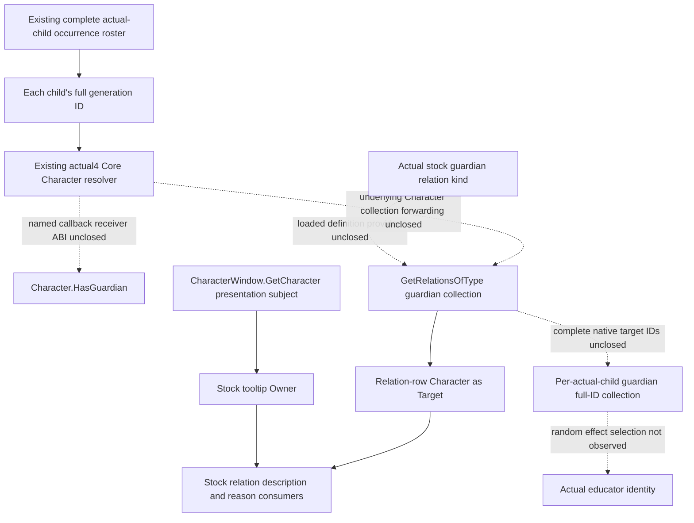
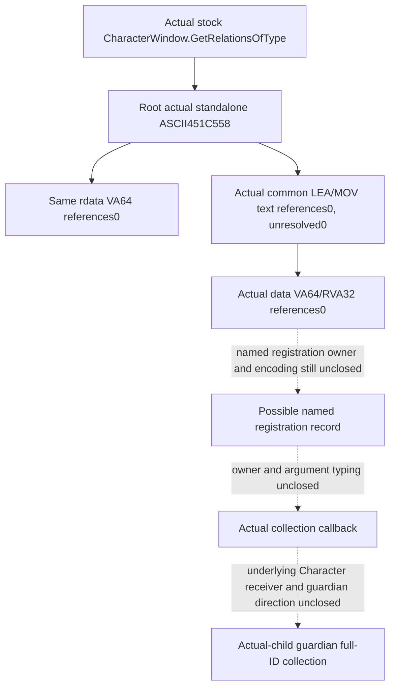
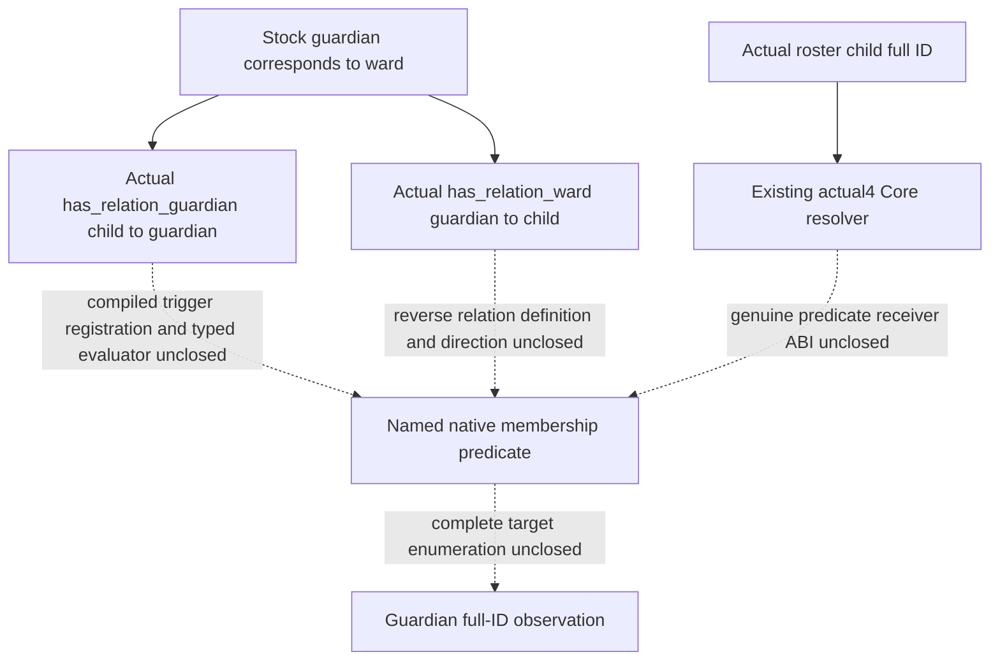

# Actual-child guardian relation: named Character binding (1.20.0.4)

2026-10-09 / W41. Research. Reuse Root's CK3 1.20.0.4 / Steam
build25734779 freeze and executable SHA
`98702F88A547CDE2EAF29A85F93B85F68EE4CF8148336A4F7AFAEB75319DD518`.
Native54's private CharacterWindow candidate reader is a separate source
package, author `282f9da31b6760b260abe23bdc9cfe3805288112`, adopted by Root
as `ff5f919f`. Root qualified its five new whole packets and sole six-scene
consumer offline; see [the independent Native54 qualification](character-window-guardian-native-provider-12004.md).
A window subject cannot substitute for an actual roster child or establish
a guardian.

## Actual installed stock consumer and direction

The following source is the actual Steam installation under
`Z:/SteamLibrary/steamapps/common/Crusader Kings III/game/`. Only these
three named files were checked in this continuation. The older repository
reference copy has different line numbers and is not used as actual4 proof.

| Installed source | Established input or consumer |
| --- | --- |
| `gui/shared/lists.gui:1591` | `And(Not(Character.IsAdult),Not(Character.HasGuardian))` consumes a no-argument Boolean on the row Character. |
| `gui/window_character.gui:2956` | `CharacterWindow.GetRelationsOfType(GetRelation('guardian'))` supplies the guardian relation portrait collection. |
| `gui/window_character.gui:5794` | `GetScriptedRelationTooltip(ScriptedRelation,CharacterWindow.GetCharacter,Character)` passes window subject as Owner and relation-row Character as Target. |
| `data_binding/scripted_relation_macros.txt:3-4` | The macro forwards `Relation.GetDescription(Owner.Self,Target.Self)` and `Relation.GetReasonFor(Owner.Self,Target.Self)`. |

The same installed window source uses the wrapper for ward(:2731),
guardian(:2956), friend(:3101) and rival(:3214). Its return is consumed as
a data model, including `GetDataModelSize`/`DataModelFirst`(:3276).
These are GUI consumer semantics, not a native return typedef. The observed
owner/member pair is `CharacterWindow.GetRelationsOfType`; the stated
window source has no direct `Character.GetRelationsOfType` consumer.

No `GetGuardian` name occurs in the three installed files above. The stock
consumer is the named presence predicate and relation-kind collection,
not a demonstrated singular native getter. The tooltip arguments close
the presentation-side Owner/Target direction. They do not prove native
callback parameter order, definition layout or a callable collection ABI.

The already sealed stock role tree independently establishes the direction
needed by education: the child's `guardian` relation targets guardians;
the guardian's inverse `ward` relation targets children. See
[the educator source tree](guardian-educator-source-entry-12004.md) and
its `post-birth-guardian-educator42/stock-role-tree/` packet. The education
support effect randomly selects one guardian and saves it as educator,
then falls back to the child's court tutor and court guru. Observing all
guardians does not reveal that effect's selected random educator.

## Correction: late locators repeated the earlier source ledger

The [guardian relation and executing educator ledger](guardian-relation-and-educator-owner-12004.md#root-locator-result-and-the-typed-provider-alternative)
already records the actual4 standalone names `HasGuardian` at`0x4761EE0`,
`GetRelationsOfType` at`0x451C558` and `GetRelation` at`0x4520880`, their
negative `.rdata`/named `.text` results, and Root's05:19:54 UTC `.data`
VA64/RVA32 zero-reference result. The specific prior actual receipt is
`Z:/ck3_mod_rewrite_process_assets/g2-parallel-20261008/post-birth-guardian-direct44/native-getter/root-data-named-first01/GUARDIAN-NAMED-DATA-REFERENCES.json`;
its adjacent `ROOT-EXECUTION-RECEIPT.json` retains that original execution.

This continuation missed that ledger and incorrectly treated the late
61-63 acquisitions as a fresh named frontier. They repeated existing
source conclusions. Their actual cost is **3 frozen-image reads and
96837632 bytes**:61 read17124352,62 read71141888 and63 read8571392.
Their receipts below remain unchanged; they provide **zero additional
observation credit**. This is an additive provenance correction, not a
rewrite of earlier history or of Native54's separate, genuinely new
five-whole/six-scene offline qualification. All further scans of these
same literals/encodings/sections stop. Subsequent work must reuse the
held Character+1B0/IsAllied structure or a genuinely more specific input.

## Retained actual late locator results and their bounds

The previous HasGuardian/GetRelation/HasRelationBetween literal work and
its retained zero-reference result are reused. Their old locator is not
replayed. Existing generic event type/name registries are not guardian
relation-definition databases. The cached CharacterWindow body at
`[0x1070130,0x1070778)` contains direct calls that return Character-like
objects or full IDs, but none has a guardian semantic name. They are not
expanded to search for a convenient field.

Root repeated the `GetRelationsOfType` name locator at
2026-10-09T14:27:58.990843Z. One `.rdata` read obtained17124352 bytes in
0.0116496 seconds, with no hash, PE parse, `.text`/`.data`, process or Game
operation. The retained
`guardian-collection-named61/root-named01/GUARDIAN-COLLECTION-NAMED-RESULT.json`
records one standalone ASCII literal at RVA`0x451C558` and zero same-section
VA64 references. No whole-section buffer was persisted. This actual source
operation is complete and is not repeated.

The actual hit names the shared collection member, rather than a
guardian-specific callback. The seven selected generic-GUI `initial-map`
JSONs and four named-role packets contain no exact `GetRelationsOfType`,
`451C558` or decimal72467800 reference. This is a scoped cache miss, not a
claim about every cache. Existing generic type-ID/name resolvers do not
identify the owner/member registration.

Root subsequently executed the single-target source recipe
`Z:/ck3_mod_rewrite_process_assets/g2-background-20261009/guardian-character-controller-source/guardian-collection-textrefs62/ROOT-TEXTREFS-ARGV.json`.
At2026-10-09T14:33:33.516878Z the locator began, finishing14:33:34.626939Z.
It read71141888 frozen `.text` bytes once in0.0142385 seconds, targeting
only actual literal`0x451C558`. The result has **zero aligned references
and zero unresolved byte candidates**. The tested encoding is specifically
LEA/MOV register,[RIP+disp32] with optional REX; this is not proof that
every encoding or data-driven registration lacks a reference. No whole
text buffer was persisted or decoded; `.rdata`, `.data`, old three-name
captures, image hashes and Game/process operations were not repeated.
The actual receipt is
`guardian-collection-textrefs62/root-textrefs01/GUARDIAN-COLLECTION-TEXTREFS-RESULT.json`.

The source follow-up also checked the actual installed binding material.
Its `game/data_binding` contains20 text files, without subdirectories;
`GetRelationsOfType`, `CharacterWindow` and `HasGuardian` have no exact
match there. `00_script_value_bindings.txt:1-4` and `gui_macros.txt:1-4`
show authored macro/definition/replace_with expansion, not a native method
descriptor. The installed game manifest contains masks and the checksum
manifest lists directories. Neither supplies a function declaration.
Existing named-role packets prove constructor/destructor-to-RTTI/vtable
joins, not a method-name registration table. Adjacent filter strings do
not establish such a table.

Root then repeated the named `.data` source join: only VA64/RVA32 references to actual literal
`0x451C558` in the metadata-held `.data` span,8571392 bytes. The recipe is
`guardian-collection-datarefs63/ROOT-DATAREFS-ARGV.json`. It keeps at most
136 bytes around actual matches and cannot itself identify a callback or
guardian layout. Root executed it once at2026-10-09T14:41:47.219292Z:
8571392 `.data` bytes in0.0102008 seconds, **VA64 matches0 and RVA32
matches0**. The actual receipt is
`guardian-collection-datarefs63/root-datarefs01/GUARDIAN-COLLECTION-DATAREFS-RESULT.json`.
There was no repeated `.text`/`.rdata`, hash, PE parse, process or Game
operation and no full `.data` persistence.

This closes the selected single-name source/pattern branch: the literal
exists, but these direct RIP and data-pointer encodings supplied no method
registration record. It does not prove no callback or guardian collection
exists. No capture of the same name/sections/patterns is repeated. The next
independent source work returns to the more specific stock
`Character.HasGuardian` receiver and held native guardian relation-collection
structure evidence, retaining the actual roster child as receiver.

Only the resulting literal-connected arguments can select a later finite
registration/callback body. No callback address, owner ID, parameter order,
return layout or guardian field is inferred from the string alone.

## Actual stock membership-trigger entry

The installed `common/scripted_relations/00_scripted_relations.txt:127-140`
marks the guardian definition as referenced in code and declares
`guardian.corresponding = ward` and `ward.corresponding = guardian`.
Those authored keys and the correspondence are proved; the comment does
not supply a C++ class, native enum, fixed member or callable address.

The education consumers provide a more specific source entry than the
previous GUI method-name branch:

| Installed source | Actual operation and direction |
| --- | --- |
| `events/education_and_childhood/childhood_education_events.txt:470` | `has_relation_guardian = scope:guardian`; the event root is saved as ward at477, so this tests child/ward owner toward guardian target. The same expression occurs at609 and725. |
| `common/scripted_effects/00_education_effects.txt:3340` | `scope:guardian = { has_relation_ward = scope:ward }`; the reverse-direction membership test. At3343 the same guardian owner sets `relation_ward` toward that ward. |
| `common/scripted_effects/00_education_effects.txt:253-260` | `any_relation` and `random_relation` use `type = guardian`; the selected random relation is then saved as educator. Membership is not the selected educator. |

The next native target names are therefore **`has_relation_guardian` and
`has_relation_ward`**, retaining each actual roster child's full ID as the
first direction's receiver. No `is_guardian_of` name was found in the
bounded education sources examined. Existing exact4 trigger/RTTI metadata
checked in this pass supplies no compiled type, registration pointer or
evaluate-function RVA for the two proved names. This is a bounded cache
result, not a global absence claim. Without a real native pointer there
is no supported tiny executable span to request yet; no guessed address,
full-section name scan or generic predicate transplant was prepared.

## Required production input after native closure

For every existing admitted actual-child occurrence group, keep the
child's full ID and complete guardian-direction target full IDs. Legal
empty, independent read failure and stale-generation targets are separate
states. Bind the result to the same paused child query/frame. A first-heir,
player, window subject or candidate educator is never a replacement child.
Presence alone does not promise target collection completeness; a complete
collection alone does not identify the random educator selected by an effect.

Only a genuinely named native provider can justify the next private child
sidecar implementation. Reuse the existing Core resolver, serializer and
registered Service path once that provider is closed; do not add a
constant-null guardian field. This continuation changes documentation and
Root-only source recipes only. Worker EXE reads, hashes, imports, tests,
builds, Game/SDK/process operations and new live/G2 credit are all zero.
