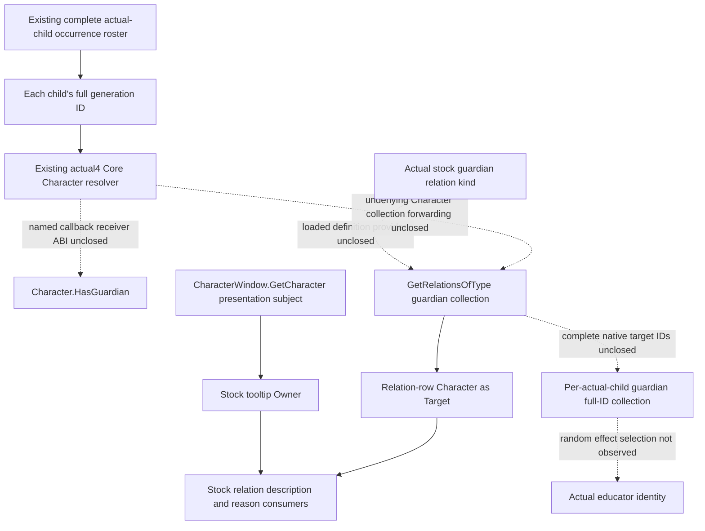
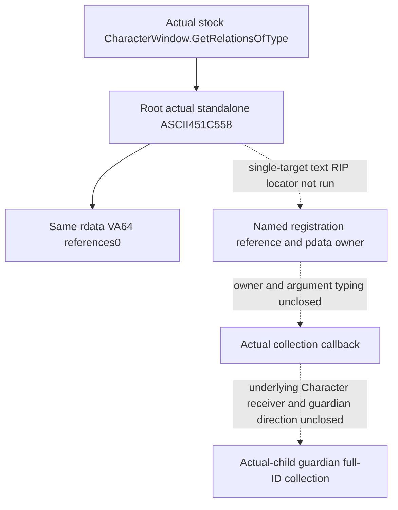

# Actual-child guardian relation: named Character binding (1.20.0.4)

2026-10-09 / W41. Research. Reuse Root's CK3 1.20.0.4 / Steam
build25734779 freeze and executable SHA
`98702F88A547CDE2EAF29A85F93B85F68EE4CF8148336A4F7AFAEB75319DD518`.
Native54's private CharacterWindow candidate reader is a separate source
package, author `282f9da31b6760b260abe23bdc9cfe3805288112`, adopted by Root
as `ff5f919f`. Root qualified its five new whole packets and sole six-scene
consumer offline; see [the independent Native54 qualification](character-window-guardian-native-provider-12004.md).
A window subject cannot substitute for an actual roster child or establish
a guardian.

## Actual installed stock consumer and direction

The following source is the actual Steam installation under
`Z:/SteamLibrary/steamapps/common/Crusader Kings III/game/`. Only these
three named files were checked in this continuation. The older repository
reference copy has different line numbers and is not used as actual4 proof.

| Installed source | Established input or consumer |
| --- | --- |
| `gui/shared/lists.gui:1591` | `And(Not(Character.IsAdult),Not(Character.HasGuardian))` consumes a no-argument Boolean on the row Character. |
| `gui/window_character.gui:2956` | `CharacterWindow.GetRelationsOfType(GetRelation('guardian'))` supplies the guardian relation portrait collection. |
| `gui/window_character.gui:5794` | `GetScriptedRelationTooltip(ScriptedRelation,CharacterWindow.GetCharacter,Character)` passes window subject as Owner and relation-row Character as Target. |
| `data_binding/scripted_relation_macros.txt:3-4` | The macro forwards `Relation.GetDescription(Owner.Self,Target.Self)` and `Relation.GetReasonFor(Owner.Self,Target.Self)`. |

The same installed window source uses the wrapper for ward(:2731),
guardian(:2956), friend(:3101) and rival(:3214). Its return is consumed as
a data model, including `GetDataModelSize`/`DataModelFirst`(:3276).
These are GUI consumer semantics, not a native return typedef. The observed
owner/member pair is `CharacterWindow.GetRelationsOfType`; the stated
window source has no direct `Character.GetRelationsOfType` consumer.

No `GetGuardian` name occurs in the three installed files above. The stock
consumer is the named presence predicate and relation-kind collection,
not a demonstrated singular native getter. The tooltip arguments close
the presentation-side Owner/Target direction. They do not prove native
callback parameter order, definition layout or a callable collection ABI.

The already sealed stock role tree independently establishes the direction
needed by education: the child's `guardian` relation targets guardians;
the guardian's inverse `ward` relation targets children. See
[the educator source tree](guardian-educator-source-entry-12004.md) and
its `post-birth-guardian-educator42/stock-role-tree/` packet. The education
support effect randomly selects one guardian and saves it as educator,
then falls back to the child's court tutor and court guru. Observing all
guardians does not reveal that effect's selected random educator.

## Finite native binding entry

The previous HasGuardian/GetRelation/HasRelationBetween literal work and
its retained zero-reference result are reused. Their old locator is not
replayed. Existing generic event type/name registries are not guardian
relation-definition databases. The cached CharacterWindow body at
`[0x1070130,0x1070778)` contains direct calls that return Character-like
objects or full IDs, but none has a guardian semantic name. They are not
expanded to search for a convenient field.

Root executed the sole `GetRelationsOfType` name locator at
2026-10-09T14:27:58.990843Z. One `.rdata` read obtained17124352 bytes in
0.0116496 seconds, with no hash, PE parse, `.text`/`.data`, process or Game
operation. The retained
`guardian-collection-named61/root-named01/GUARDIAN-COLLECTION-NAMED-RESULT.json`
records one standalone ASCII literal at RVA`0x451C558` and zero same-section
VA64 references. No whole-section buffer was persisted. This actual source
operation is complete and is not repeated.

The actual hit names the shared collection member, rather than a
guardian-specific callback. The seven selected generic-GUI `initial-map`
JSONs and four named-role packets contain no exact `GetRelationsOfType`,
`451C558` or decimal72467800 reference. This is a scoped cache miss, not a
claim about every cache. Existing generic type-ID/name resolvers do not
identify the owner/member registration.

The next Root-only source recipe is
`Z:/ck3_mod_rewrite_process_assets/g2-background-20261009/guardian-character-controller-source/guardian-collection-textrefs62/ROOT-TEXTREFS-ARGV.json`.
It targets only actual literal`0x451C558` in one frozen `.text` buffer,
finding common LEA/MOV RIP operands and checking their instruction boundary
from the held pdata owner. It retains the owner prefix and at most295 bytes
around each actual reference, including callback-like operands and direct
calls, then discards the full buffer. It performs no repeated `.rdata`
capture, whole-text decode, arbitrary registry traversal or unnamed
Character-helper expansion. This next recipe is **SOURCE_NOTRUN**.

Only the resulting literal-connected arguments can select a later finite
registration/callback body. No callback address, owner ID, parameter order,
return layout or guardian field is inferred from the string alone.

## Required production input after native closure

For every existing admitted actual-child occurrence group, keep the
child's full ID and complete guardian-direction target full IDs. Legal
empty, independent read failure and stale-generation targets are separate
states. Bind the result to the same paused child query/frame. A first-heir,
player, window subject or candidate educator is never a replacement child.
Presence alone does not promise target collection completeness; a complete
collection alone does not identify the random educator selected by an effect.

Only a genuinely named native provider can justify the next private child
sidecar implementation. Reuse the existing Core resolver, serializer and
registered Service path once that provider is closed; do not add a
constant-null guardian field. This continuation changes documentation and
Root-only source recipes only. Worker EXE reads, hashes, imports, tests,
builds, Game/SDK/process operations and new live/G2 credit are all zero.
