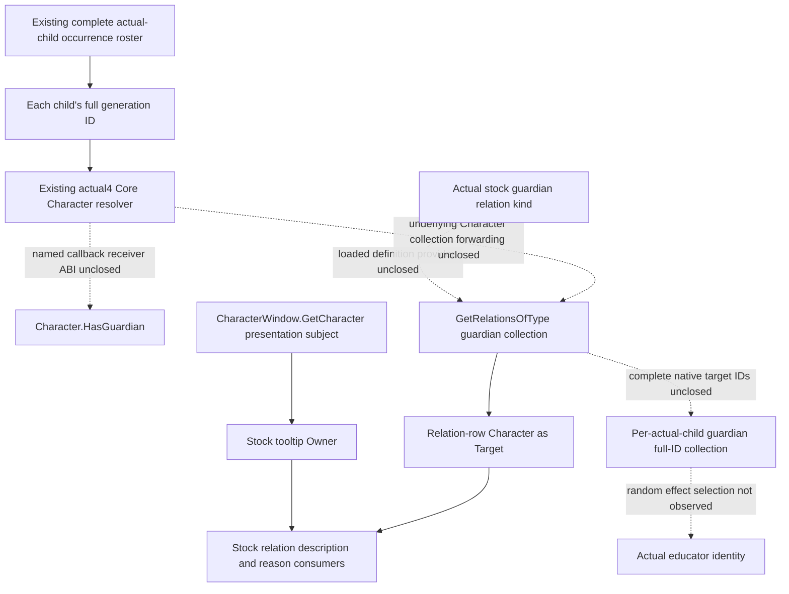

# Actual-child guardian relation: named Character binding (1.20.0.4)

2026-10-09 / W41. Research. Reuse Root's CK3 1.20.0.4 / Steam
build25734779 freeze and executable SHA
`98702F88A547CDE2EAF29A85F93B85F68EE4CF8148336A4F7AFAEB75319DD518`.
Native54's private CharacterWindow candidate reader is a separate source
package, author `282f9da31b6760b260abe23bdc9cfe3805288112`, adopted by Root
as `ff5f919f`. Its offline qualification is owned by Root. A window subject
cannot substitute for an actual roster child or establish a guardian.

## Actual installed stock consumer and direction

The following source is the actual Steam installation under
`Z:/SteamLibrary/steamapps/common/Crusader Kings III/game/`. Only these
three named files were checked in this continuation. The older repository
reference copy has different line numbers and is not used as actual4 proof.

| Installed source | Established input or consumer |
| --- | --- |
| `gui/shared/lists.gui:1591` | `And(Not(Character.IsAdult),Not(Character.HasGuardian))` consumes a no-argument Boolean on the row Character. |
| `gui/window_character.gui:2956` | `CharacterWindow.GetRelationsOfType(GetRelation('guardian'))` supplies the guardian relation portrait collection. |
| `gui/window_character.gui:5794` | `GetScriptedRelationTooltip(ScriptedRelation,CharacterWindow.GetCharacter,Character)` passes window subject as Owner and relation-row Character as Target. |
| `data_binding/scripted_relation_macros.txt:3-4` | The macro forwards `Relation.GetDescription(Owner.Self,Target.Self)` and `Relation.GetReasonFor(Owner.Self,Target.Self)`. |

No `GetGuardian` name occurs in these three installed files. The stock
consumer is the named presence predicate and relation-kind collection,
not a demonstrated singular native getter. The tooltip arguments close
the presentation-side Owner/Target direction. They do not prove native
callback parameter order, definition layout or a callable collection ABI.

The already sealed stock role tree independently establishes the direction
needed by education: the child's `guardian` relation targets guardians;
the guardian's inverse `ward` relation targets children. See
[the educator source tree](guardian-educator-source-entry-12004.md) and
its `post-birth-guardian-educator42/stock-role-tree/` packet. The education
support effect randomly selects one guardian and saves it as educator,
then falls back to the child's court tutor and court guru. Observing all
guardians does not reveal that effect's selected random educator.

## Finite native binding entry

The previous HasGuardian/GetRelation/HasRelationBetween literal work and
its retained zero-reference result are reused. Their old locator is not
replayed. Existing generic event type/name registries are not guardian
relation-definition databases. The cached CharacterWindow body at
`[0x1070130,0x1070778)` contains direct calls that return Character-like
objects or full IDs, but none has a guardian semantic name. They are not
expanded to search for a convenient field.

The next finite named source is the exact stock collection name
`GetRelationsOfType`. The selected generic-GUI named-role metadata and
existing child-education source packet provide its authored spelling but
no native callback association. A Root-only single-name locator may read
only the retained-metadata `.rdata` section, keep exact name positions and
same-buffer VA64 references with finite neighboring records, then stop.
It does not enumerate every UI registration or decode an unrelated helper.
Actual literal/reference evidence must select any later callback body.
The prepared source-only recipe is under
`Z:/ck3_mod_rewrite_process_assets/g2-background-20261009/guardian-character-controller-source/guardian-collection-named61/`.
No callback address or guardian layout is inferred before that result.

## Required production input after native closure

For every existing admitted actual-child occurrence group, keep the
child's full ID and complete guardian-direction target full IDs. Legal
empty, independent read failure and stale-generation targets are separate
states. Bind the result to the same paused child query/frame. A first-heir,
player, window subject or candidate educator is never a replacement child.
Presence alone does not promise target collection completeness; a complete
collection alone does not identify the random educator selected by an effect.

Only a genuinely named native provider can justify the next private child
sidecar implementation. Reuse the existing Core resolver, serializer and
registered Service path once that provider is closed; do not add a
constant-null guardian field. This continuation changes documentation and
Root-only source recipes only. Worker EXE reads, hashes, imports, tests,
builds, Game/SDK/process operations and new live/G2 credit are all zero.
