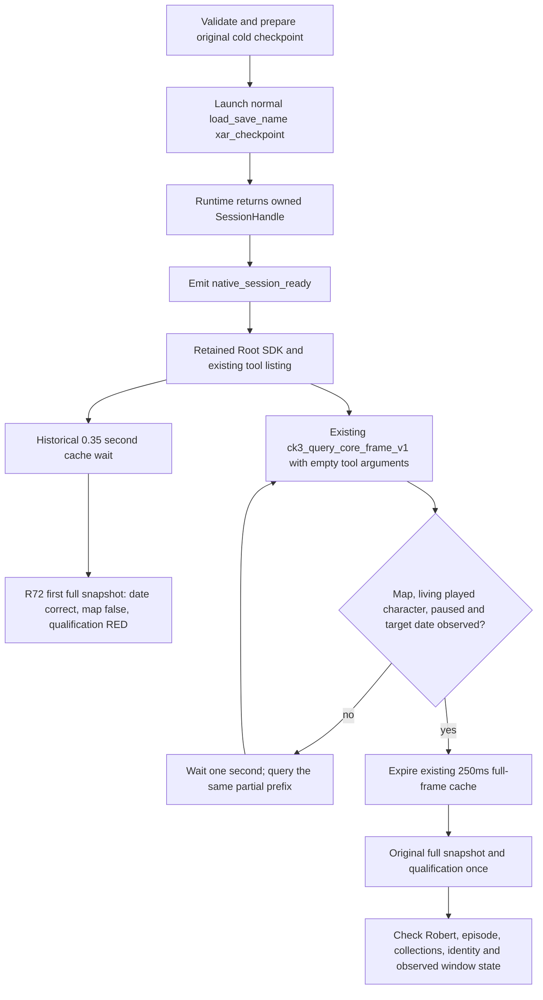

# H9638 cold restoration: process readiness and map readiness

R72 retained a real failed first restoration qualification. The SDK returned a non-error full snapshot at `2026-10-07T09:42:20.577010+00:00` with the correct H9638 date, `53288448`, and `paused=true`, but `map_ready=false`. The original episode and living Robert checks failed. The observed visible HWND `4411282` for PID `135372` was not minimized. That last fact does not identify who restored the window or establish a focus defect.

The bounded source finding is that the Root helper queued its first full qualification without waiting for a loaded map and player. This does not establish an ABI regression, a checkpoint fault, or whether the map became ready later. Root stopped the owned R72 job at `2026-10-07T09:45:00Z`. No further game or SDK operation was performed for this repair.

The original evidence remains unchanged:

- [R72 qualification](Z:/ck3_mod_rewrite_process_assets/g2-background-20261007/upstream-build-migration/managed-full-h9638-joint20restore01/operator/ROOT-FULL-ORIGINAL-PAUSED-SNAPSHOT.json). It records `RED`, one new query, no days advanced and no new checkpoint save.
- [R72 raw response](Z:/ck3_mod_rewrite_process_assets/g2-background-20261007/upstream-build-migration/managed-full-h9638-joint20restore01/operator/gameplay-responses/001-restored-h9638-paused-snapshot.json). `/request/tool` is `ck3_take_snapshot`; `/result/is_error` is `false`; `/result/structured_content/date_raw` is `53288448`; `/result/structured_content/map_ready` is `false`; public revision is `2` and native revision is `1`.

## Source18 loading sequence

The frozen source is `268df6710341d587e15b5fff401841fc0484dce5` at `C:/codex-ck3-background/migration4-entry-live-fix/g110-r18`. These are source observations, not another runtime qualification:

- `native_session.py:1001–1015` selects `load_save_name="xar_checkpoint"` for a cold checkpoint and calls the existing runtime launch. After obtaining the process and the requested minimization, `:1064–1075` emits `native_session_ready`. It does not wait for a map, actor or paused snapshot.
- `runtime.py:3066–3082` returns the launch `SessionHandle`, including the process and owned lifecycle metadata. That return does not qualify a game frame.
- The historical Root `gameplay_mcp_h9638_recovery.py:105–110` waits `0.35` seconds to expire the initial full-frame cache, then queues the full snapshot. Cache expiration does not prove cold loading is complete.
- `ck3_12004_adapter.cpp:230–247` can return a successful prefix snapshot while `prefix.map_ready` is false. A successful transport response therefore does not imply a loaded campaign.

## Existing cheap observation path

The registered `ck3_query_core_frame_v1` tool accepts `{}`. The source18 path is:

`mcp_server.py:1427` → `Service.query_core_frame_v1` at `service.py:689` → `NativeDriver.query_core_frame_v1` at `native_driver.py:2621` → `query-core-frame-v1`.

The Driver supplies standalone native `expected_revision=0` internally and applies the existing `normalize_core_frame_v1`. The caller supplies no revision tool argument. `bridge.cpp:13730–13768` dispatches the existing application-main mailbox. Its context defaults to `ReadCk3_12002TimelineCoreSnapshot` (`ck3_12004_core_frame_v1.hpp:30`); that software wrapper calls the adapter’s stored `read_core_snapshot` only (`ck3_12002_adapter.cpp:230–242,661–666`). The exact .4 binder stores `ck3_12004::ReadCoreSnapshot` (`ck3_12004_adapter.cpp:178`). It does not call the complete snapshot reader.

The result remains `status="partial"` and `complete_snapshot=false`. It exposes clock, map and full played-character identity/aliveness. It contains no original episode, resource families or full-snapshot revision. The wait does not claim that any living actor is Robert; the original single full qualification still verifies Robert `29829` and episode `native-29829-2bc2d599f7f9`.

## Prepared future entry

[wait_restored_ck3_core_12004.py](../../tools/wait_restored_ck3_core_12004.py) is a Root helper module, not a native capability or a game lifecycle change. It uses the held `ClientSession` and the existing registered core tool. It saves small whole core responses and uses a three-minute polling budget, checked after each existing query completes, with one-second intervals. It never opens a Driver state file, launches a client or game, or requests a full snapshot.

The external companion `gameplay_mcp_h9638_recovery_core_wait.py` calls that module before queuing the existing first snapshot. On a core wait timeout it retains the wait receipt and sends no full qualification. On readiness it retains the original cache-expiry wait and calls the original full qualification once. Its receipt counts core queries separately and records total queries accurately. The original R72 helper, request, response and RED qualification are preserved.

For the next authorized source21 restoration, the companion accounts for the accepted original 208 tools plus `ck3_query_construction_cash_outcome_private_v1` and `ck3_release_player_prisoner_private_v1`, giving 210. It preserves the original 20 private switches. The Sway completion tool was already in the 208-tool reference and adds no tool or switch here.

Root must use a fresh prepared packet when local CK3 activity is authorized again. The existing `restore_original_g2_h9638.py` prepare/bootstrap/launch route and its cold-checkpoint, rebind and managed lifecycle semantics remain unchanged. After its normal `native_session_ready`, Root starts the companion with the existing qualified full-venv Python and `--packet <fresh operator directory>`. The source companion and exact recipe are under `g2-background-round34-20261007/post-migration-operator-preparation`; the delivery receipt is under `upstream-build-migration/cold-session-map-readiness-r72`.

Status: source prepared only. Python syntax is checked without importing either helper. No offline fixture, full snapshot, SDK query, CK3 launch, window input, process inspection or later map-readiness success is claimed.
