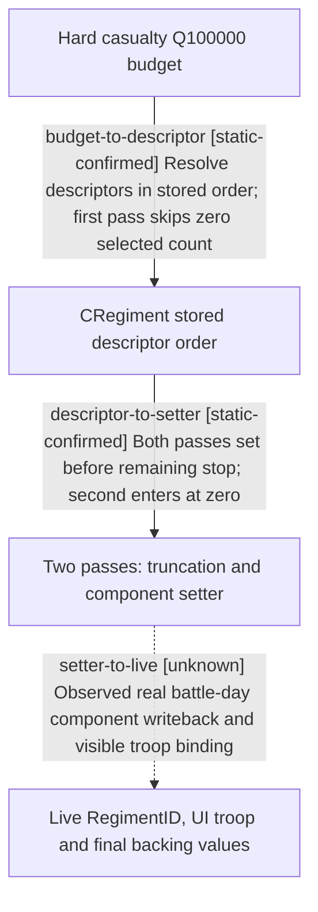

# Research plan: hard-component-allocation-first-setter-boundary

GENERATED from the supplied research plan; no native semantics are inferred.

Question: Does exact-build hard-casualty allocation check remaining before or after each component setter, and what order and rounding does it use?



| Edge | Declared status | Evidence IDs | Open question |
|---|---|---|---|
| budget-to-descriptor | static-confirmed | exact-exe-verifier, reviewed-disassembly-contract |  |
| descriptor-to-setter | static-confirmed | exact-exe-verifier, reviewed-disassembly-contract |  |
| setter-to-live | unknown |  | Do these special signed/zero-remainder states occur in natural battle ticks, and what are the exact setter-guard post-values? |

| Observation design | Value |
|---|---|
| mode | offline-only |
| actor_kind | engine |
| owner_scope | One CRegiment backing-component container within a combat entry in the exact stock EXE |
| identity_kind | none |
| identity_lifetime | Offline RVA and descriptor-layout proof only; no live RegimentID or backing-object identity has been bound |
| producer_trigger | daily-tick |
| producer | 0x23CDF70 main casualty routing or 0x23CD660 pursuit supplies signed Q100000 hard raw to 0x239C840 |
| caller | 0x23CDFD5 and both pursuit 0x23CDA59/0x23CDC77 call 0x239C840 with the resolved Regiment |
| consumer | 0x239C840 stored-order resolver and two passes call 0x23D3090 component setter, then 0x239BAD0 aggregate rebuild |
| cache_lifetime | The hard budget and component current are invocation-local; live descriptor order and generation validity require a fresh paused-tick read |
| expected_signal | Exact instruction/call/branch order plus signed Q100000 and integer truncation sites for first and second passes |
| zero_sample_meaning | This is offline-only and intentionally has zero runtime samples; that does not negate the static instruction chain or prove natural battle reachability |
| stop_condition | Inspect only bounded RVA 0x239C840..0x239CAD8 on the pinned EXE, run hash-bound verifier and focused mirror tests, then stop without CK3 execution |
| runtime_window_ref | None |

| Evidence ID | Declared layer | File | SHA-256 | Supports |
|---|---|---|---|---|
| exact-exe-verifier | exact-build | ../../ck3_autonomous_player/native_bridge/research/verify_hard_component_allocation_boundaries_static.py | cecf82600f9d6cb374ee57cbad503ecd388cc9215a9d1b53de6d91bf6560e891 | Hash-bound read-only verification of 27 instruction sites, 6 call edges and 9 branch targets in the original EXE |
| reviewed-disassembly-contract | source-contract | hard-component-allocation-first-setter-boundary-2026-09-27.md | 0b81e892b397aead449d7a0ba241d2f72f8d5cb5d478ed1624255c5dfeecde7e | Human-reviewed bounded instruction sequence, signed rounding, setter and branch-order interpretation with live boundary explicitly open |

Check result (file integrity and declarations only):

```json
{
  "schema": "xar.native-research-plan-check.v1",
  "result": "plan-consistent",
  "proof_layer": "record-structure-and-file-integrity",
  "semantic_correctness_verified": false,
  "live_execution_performed": false,
  "observation_plan_issues": [
    "offline-only plan does not define a live observation window"
  ],
  "declared_edges_by_status": {
    "counter-policy": 0,
    "inference": 0,
    "live-confirmed": 0,
    "static-confirmed": 2,
    "unknown": 1
  },
  "enumerated_native_edges": 3,
  "declared_cases_by_status": {
    "pending": 2,
    "observed": 0,
    "not-applicable": 0
  },
  "checked_evidence_files": 2,
  "limitations": [
    "Evidence layers and conclusions are author declarations; hashes bind bytes, not their truth.",
    "Counts cover this enumerated graph only, not all CK3 branches.",
    "A consistent observation plan is not authorization to run or manipulate CK3."
  ],
  "plan_sha256": "e3a533145e6d55300658ee28a50558e1919906b512126016e744e0795c652d17"
}
```
