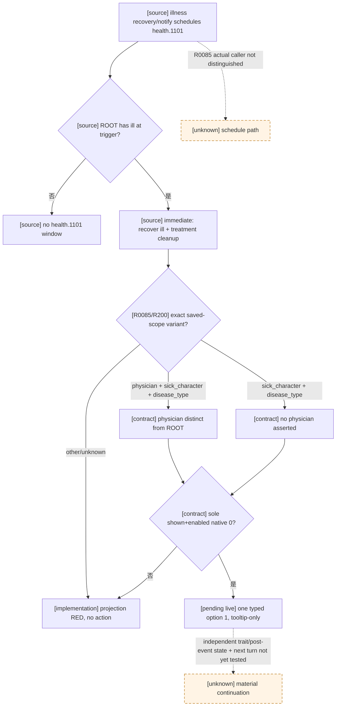

# `health.1101`：普通疾病恢复通知（R0085 自然 RED）

## Exact build 与原版调用树

- CK3 `1.19.0.6`，`binaries/ck3.exe` SHA-256 `2D00FF3101EF70B566F2FCBAE292F09263199C80E9DC8F139B82D7D96F83DB86`。
- `game/events/health_events.txt` SHA-256 `8CAB7F230E09A37C15F7C088383D40752D970918D44D86762FDD068EE168EFEB`，`:4250-4280` 定义本事件：trigger 要求 ROOT 有 `ill`；`immediate` 隐藏执行 `recover_from_disease_effect = { DISEASE = ill }` 和 `remove_disease_treatment_effect = yes`；唯一 option `health.1101.a` 只用 `show_as_tooltip` 展示 `remove_trait_force_tooltip = ill`，没有第二个决策或选项提交时的额外效果，也没有 authored `ai_chance`。
- `game/common/scripted_effects/20_health_effects.txt` SHA-256 `6D7DEF1245D899DE4DEBC42136815BC7F4D14F6A467A8320355507AD03528F12`：`:277-283` 的疾病恢复排程及 `:892-901` 的通知排程均可引用 `.1101`；只凭 R0085 帧不能断定实际走了哪一个调用者。`:694-718, :850-888` 的恢复 effect 保存 `disease_type=flag:ill`、在角色确有该 trait 时保存 `sick_character`，随后移除 `ill`；`:3580-3595` 在无其他可治疗疾病时清理治疗 modifier。未观测到的具体健康增益或通知接收者不从 option 图标推断。

## R0085 同帧与最小消费者

R0085 在普通标准封建首种子正式连续运行 turn `91`、date_raw `53334696` 自然物化 instance `17`，公共 paused native `170` / revision `171`，ROOT/`sick_character` 均为玩家 `36403`；`physician` 为另一 Character `50397184`，`disease_type` 是 raw type `3` / `flag`（opaque identity，不能从 `null` 猜其具体值）。唯一 rendered `0` / native `0` 为 shown+enabled，trait 指示仅报告 remove `ill` native `109`，effect preview 不完整。冻结 raw report SHA-256 `500EACF9BCDC43375EE2EDF27D0AF61E436EDBDB5DCE5652B5DC3825CEBFC14D`；冻结后置 driver 仅供观察，不可与 turn77 的安全存档拼接。原实现尚未提交动作，因专用 `character_scopes`、`scope_variants`、`unique_character_scope_excludes` 未获 direct consumer 准入而返回 `registered_contract_requires_extended_consumer`。

既有 registry 合同保留两种**精确** scope 库存：有 physician 的三 scope 帧（本次 R0085），和此前 R200 只含 `sick_character`/`disease_type` 的两 scope 帧。最小消费者仅准入本定义的既有 scope variant 与关系校验：玩家必须等于 ROOT 及 `sick_character`；三 scope 时 `physician` 必须是非玩家的另一 Character，两 scope 时绝不伪造 physician；`disease_type` 必须为 `flag`，但其 opaque 值仍未知。仍要求唯一合法 native `0`、snapshot option_count `1`，只提交 typed authored option `1`。不把它扩成任意单选事件点击。

修补后的专用消费者用冻结 R0085 window **只读重算**得到 `recommended`、authored `1` / native `0`、`failed_checks=[]`，但这不是实机提交。本树只解除该真实 B0 的 typed continuity。R0085 RED 必须保留；离线推荐或 ACK 不等于正式动作/独立后置。当前没有 native ABI、公共 MCP schema 或 open_kaishek 协议变更；是否完成恢复通知的生产闭环，只能由新版正式入口从有效配对 checkpoint 的下一次自然帧核验。
